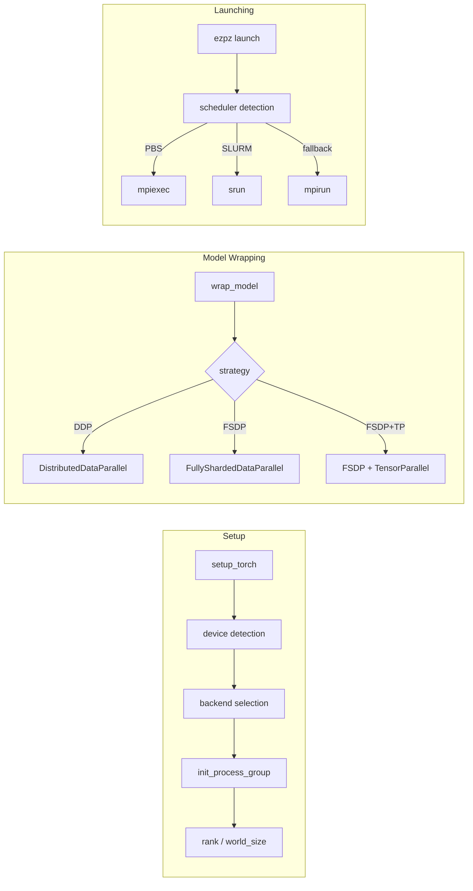
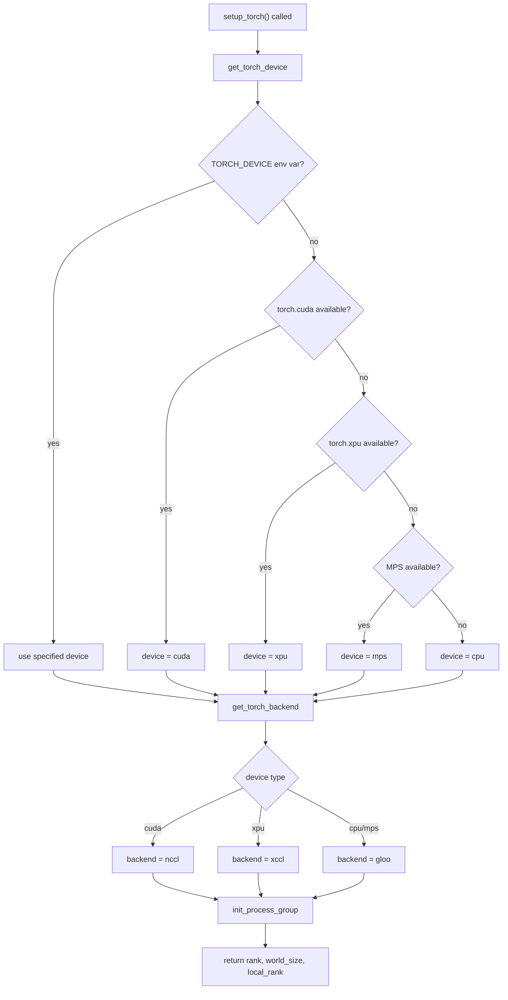
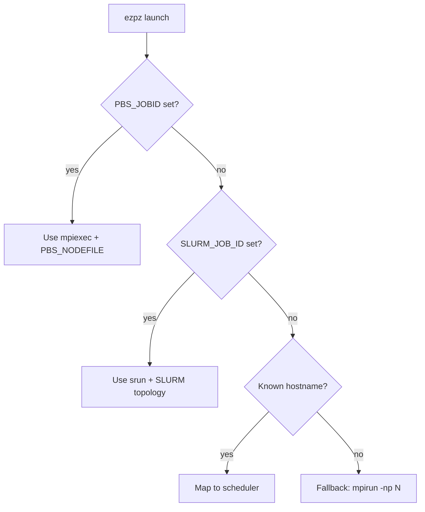
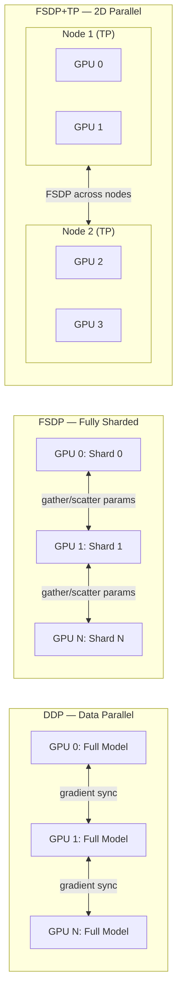

# 🏗️ Architecture

`ezpz` is designed as a thin, opinionated layer over PyTorch's distributed
primitives — handling device detection, process group initialization, and job
launching so you don't have to.

## High-Level Flow

## `setup_torch()` Decision Flow

## Launcher Decision Tree

## DDP vs FSDP vs FSDP+TP

### When to use each strategy

| Strategy | Use when | `wrap_model()` call |
|----------|----------|---------------------|
| **DDP** | Model fits in a single GPU's memory | `ezpz.wrap_model(model, use_fsdp=False)` |
| **FSDP** | Model is too large for one GPU, or you want to reduce memory per GPU | `ezpz.wrap_model(model)` (default) |
| **FSDP+TP** | Very large models where even FSDP isn't enough; combines sharding across nodes with tensor parallelism within nodes | `ezpz.wrap_model(model)` + `setup_torch(tensor_parallel_size=N)` |

For a hands-on walkthrough with complete examples, see the
[Distributed Training Guide](./guides/distributed-training.md).

FSDP is the default (`use_fsdp=True`). Pass `use_fsdp=False` for DDP when your model fits in a single GPU's memory.

## Module Map

| Module | Purpose |
|--------|---------|
| `distributed.py` | Core implementation — setup, wrap, cleanup |
| `dist.py` | Thin re-export shim for backward compatibility |
| `configs.py` | Dataclass configs, logging setup, path constants |
| `launch.py` | Job launcher logic |
| `history.py` | Metric tracking and visualization |
| `tracker.py` | Multi-backend experiment tracking (wandb, MLflow, CSV) |
| `doctor.py` | Runtime diagnostics (`ezpz doctor`) |
| `jobs.py` | PBS job metadata helpers |
| `pbs.py` / `slurm.py` | Scheduler-specific helpers |

## Under the Hood

??? info "How `setup_torch()` detects devices"

    [`setup_torch()`][ezpz.distributed.setup_torch] follows a fixed probe order:

    1. Calls `get_torch_device()` which checks the `TORCH_DEVICE` env var first,
       then probes `torch.cuda`, `torch.xpu`, and `torch.backends.mps` in order.
    2. `get_torch_backend()` maps the detected device to a communication backend
       (`cuda` → `nccl`, `xpu` → `xccl`, `cpu` → `gloo`).
    3. Uses MPI to discover rank, world_size, and master_addr, then falls back
       to torchrun-style env vars (`RANK`, `LOCAL_RANK`, `WORLD_SIZE`).
    4. Returns `(rank, world_size, local_rank)`.

??? info "How the launcher picks between schedulers"

    The launcher resolves the active scheduler at runtime:

    1. `get_scheduler()` checks for `PBS_JOBID` or `SLURM_JOB_ID` env vars.
    2. If neither is set, it falls back to hostname-based machine mapping
       (e.g. Aurora → PBS, Frontier → SLURM).
    3. Once the scheduler is known, `launch.py` constructs the appropriate
       launch command (`mpiexec`, `srun`, or `mpirun`) with the correct flags.

??? info "How `dist.py` shims to `distributed.py`"

    All implementation lives in `distributed.py`. The file `dist.py` is a
    backward-compatibility shim that re-exports every public symbol from
    `distributed.py`, so existing `from ezpz.dist import ...` code continues
    to work unchanged. New code should import from `ezpz` or
    `ezpz.distributed` directly.

## Extension Points

**New hardware support.**
Add device detection logic in `get_torch_device()` and a corresponding
backend mapping in `get_torch_backend()` inside `distributed.py`.

**New scheduler.**
Add env-var or hostname detection in `get_scheduler()` and the launch command
construction in `launch.py`.
