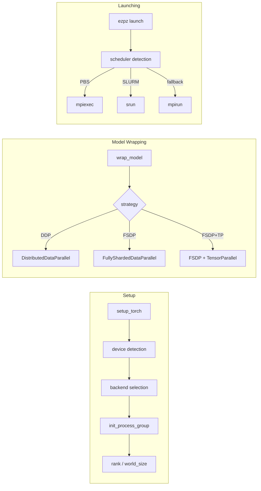

# 🏗️ Architecture

`ezpz` is designed as a thin, opinionated layer over PyTorch's distributed
primitives — handling device detection, process group initialization, and job
launching so you don't have to.

## High-Level Flow

## Module Map

| Module | Purpose |
|--------|---------|
| `distributed.py` | Core implementation — setup, wrap, cleanup |
| `dist.py` | Thin re-export shim for backward compatibility |
| `configs.py` | Dataclass configs, logging setup, path constants |
| `launch.py` | Job launcher logic |
| `history.py` | Metric tracking and visualization |
| `doctor.py` | Runtime diagnostics (`ezpz doctor`) |
| `jobs.py` | PBS job metadata helpers |
| `pbs.py` / `slurm.py` | Scheduler-specific helpers |

## Under the Hood

??? info "How `setup_torch()` detects devices"

    [`setup_torch()`][ezpz.distributed.setup_torch] follows a fixed probe order:

    1. Calls `get_torch_device()` which checks the `TORCH_DEVICE` env var first,
       then probes `torch.cuda`, `torch.xpu`, and `torch.backends.mps` in order.
    2. `get_torch_backend()` maps the detected device to a communication backend
       (`cuda` → `nccl`, `xpu` → `ccl`, `cpu` → `gloo`).
    3. Attempts MPI-based initialization via `_init_dist_via_mpi()` first, then
       falls back to torchrun-style env vars (`RANK`, `LOCAL_RANK`, `WORLD_SIZE`).
    4. Returns `(rank, world_size, local_rank)`.

??? info "How the launcher picks between schedulers"

    The launcher resolves the active scheduler at runtime:

    1. `get_scheduler()` checks for `PBS_JOBID` or `SLURM_JOB_ID` env vars.
    2. If neither is set, it falls back to hostname-based machine mapping
       (e.g. Aurora → PBS, Frontier → SLURM).
    3. Once the scheduler is known, `launch.py` constructs the appropriate
       launch command (`mpiexec`, `srun`, or `mpirun`) with the correct flags.

??? info "How `dist.py` shims to `distributed.py`"

    `dist.py` was refactored from ~2870 lines down to a thin re-export shim
    (~380 lines). The relationship is straightforward:

    - All real implementation lives in `distributed.py`.
    - `dist.py` imports and re-exports every symbol from `distributed.py`'s
      `__all__`.
    - It exists solely for backward compatibility so that existing code using
      `from ezpz.dist import ...` continues to work.

## Extension Points

**New hardware support.**
Add device detection logic in `get_torch_device()` and a corresponding
backend mapping in `get_torch_backend()` inside `distributed.py`.

**New scheduler.**
Add env-var or hostname detection in `get_scheduler()` and the launch command
construction in `launch.py`.
