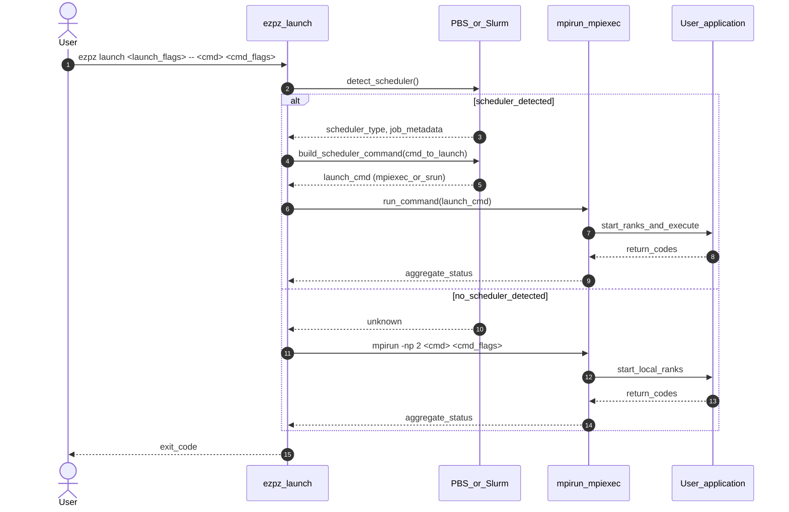
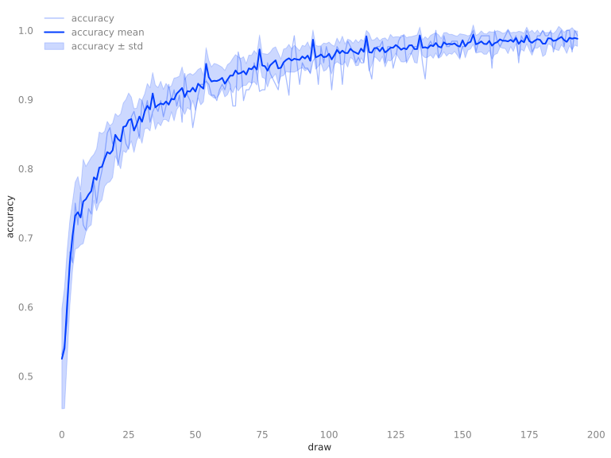
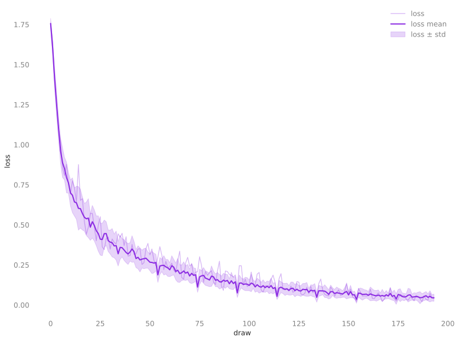
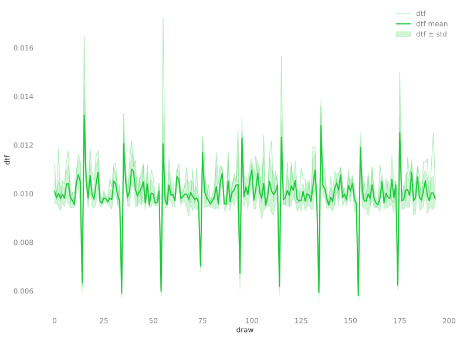
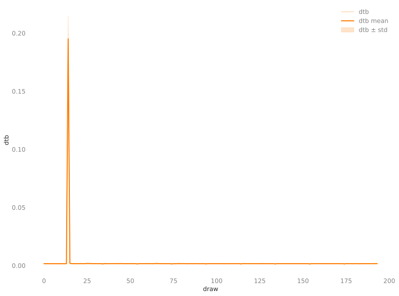

# 🚀 `ezpz launch`

Single entry point for distributed jobs.

`ezpz` detects PBS/Slurm automatically and falls back to `mpirun`, forwarding
useful environment variables so your script behaves the same on laptops and
clusters.

Add your own args to any command (`--config`, `--batch-size`, etc.) and `ezpz`
will propagate them through the detected launcher.

Use the provided:

```bash
ezpz launch <launch flags> -- <cmd> <cmd flags>
```

to automatically launch `<cmd>` across all available[^schedulers]
accelerators.

/// details | Sequence Diagram
    type: tip

Two primary control paths drive `ezpz launch`: a scheduler-aware path used when
running inside PBS/SLURM allocations, and a local fallback that shells out to
`mpirun` when no scheduler metadata is available.



///


/// details | Simple Example
    type: example

```bash
ezpz launch python3 -c 'import ezpz; print(ezpz.setup_torch())'
```

/// details | Output
    type: success

/// details | MacBook Pro
    type: example

```bash
#[01/08/26 @ 14:56:50][~/v/s/ezpz][dev][$✘!?] [4s]
; ezpz launch python3 -c 'import ezpz; print(ezpz.setup_torch())'
[2026-01-08 14:56:54,307030][I][ezpz/launch:515:run] No active scheduler detected; falling back to local mpirun: mpirun -np 2 python3 -c 'import ezpz; print(ezpz.setup_torch())'
Using [2 / 2] available "mps" devices !!
0
1
[2025-12-23-162222] Execution time: 4s sec
```

///

/// details | Aurora (2 Nodes)
    type: example

```bash
#[aurora_frameworks-2025.2.0](torchtitan-aurora_frameworks-2025.2.0)[1m9s]
#[01/08/26,14:56:42][x4418c6s1b0n0][/f/d/f/p/p/torchtitan][main][?]
; ezpz launch python3 -c 'import ezpz; print(ezpz.setup_torch())'


[2026-01-08 14:58:01,994729][I][numexpr/utils:148:_init_num_threads] Note: detected 208 virtual cores but NumExpr set to maximum of 64, check "NUMEXPR_MAX_THREADS" environment variable.
[2026-01-08 14:58:01,997067][I][numexpr/utils:151:_init_num_threads] Note: NumExpr detected 208 cores but "NUMEXPR_MAX_THREADS" not set, so enforcing safe limit of 16.
[2026-01-08 14:58:01,997545][I][numexpr/utils:164:_init_num_threads] NumExpr defaulting to 16 threads.
[2026-01-08 14:58:02,465850][I][ezpz/launch:396:launch] ----[🍋 ezpz.launch][started][2026-01-08-145802]----
[2026-01-08 14:58:04,765720][I][ezpz/launch:416:launch] Job ID: 8247203
[2026-01-08 14:58:04,766527][I][ezpz/launch:417:launch] nodelist: ['x4418c6s1b0n0', 'x4717c0s6b0n0']
[2026-01-08 14:58:04,766930][I][ezpz/launch:418:launch] hostfile: /var/spool/pbs/aux/8247203.aurora-pbs-0001.hostmgmt.cm.aurora.alcf.anl.gov
[2026-01-08 14:58:04,767616][I][ezpz/pbs:264:get_pbs_launch_cmd] ✅ Using [24/24] GPUs [2 hosts] x [12 GPU/host]
[2026-01-08 14:58:04,768399][I][ezpz/launch:367:build_executable] Building command to execute by piecing together:
[2026-01-08 14:58:04,768802][I][ezpz/launch:368:build_executable] (1.) launch_cmd: mpiexec --envall --np=24 --ppn=12 --hostfile=/var/spool/pbs/aux/8247203.aurora-pbs-0001.hostmgmt.cm.aurora.alcf.anl.gov --no-vni --cpu-bind=verbose,list:2-4:10-12:18-20:26-28:34-36:42-44:54-56:62-64:70-72:78-80:86-88:94-96
[2026-01-08 14:58:04,769517][I][ezpz/launch:369:build_executable] (2.) cmd_to_launch: python3 -c 'import ezpz; print(ezpz.setup_torch())'
[2026-01-08 14:58:04,770278][I][ezpz/launch:433:launch] Took: 3.01 seconds to build command.
[2026-01-08 14:58:04,770660][I][ezpz/launch:436:launch] Executing:
mpiexec
--envall
--np=24
--ppn=12
--hostfile=/var/spool/pbs/aux/8247203.aurora-pbs-0001.hostmgmt.cm.aurora.alcf.anl.gov
--no-vni
--cpu-bind=verbose,list:2-4:10-12:18-20:26-28:34-36:42-44:54-56:62-64:70-72:78-80:86-88:94-96
python3
-c
import ezpz; print(ezpz.setup_torch())
[2026-01-08 14:58:04,772125][I][ezpz/launch:220:get_aurora_filters] Filtering for Aurora-specific messages. To view list of filters, run with EZPZ_LOG_LEVEL=DEBUG
[2026-01-08 14:58:04,772651][I][ezpz/launch:443:launch] Execution started @ 2026-01-08-145804...
[2026-01-08 14:58:04,773070][I][ezpz/launch:138:run_command] Caught 24 filters
[2026-01-08 14:58:04,773429][I][ezpz/launch:139:run_command] Running command:
mpiexec --envall --np=24 --ppn=12 --hostfile=/var/spool/pbs/aux/8247203.aurora-pbs-0001.hostmgmt.cm.aurora.alcf.anl.gov --no-vni --cpu-bind=verbose,list:2-4:10-12:18-20:26-28:34-36:42-44:54-56:62-64:70-72:78-80:86-88:94-96 python3 -c 'import ezpz; print(ezpz.setup_torch())'
cpubind:list x4717c0s6b0n0 pid 118589 rank 12 0: mask 0x1c
cpubind:list x4717c0s6b0n0 pid 118590 rank 13 1: mask 0x1c00
cpubind:list x4717c0s6b0n0 pid 118591 rank 14 2: mask 0x1c0000
cpubind:list x4717c0s6b0n0 pid 118592 rank 15 3: mask 0x1c000000
cpubind:list x4717c0s6b0n0 pid 118593 rank 16 4: mask 0x1c00000000
cpubind:list x4717c0s6b0n0 pid 118594 rank 17 5: mask 0x1c0000000000
cpubind:list x4717c0s6b0n0 pid 118595 rank 18 6: mask 0x1c0000000000000
cpubind:list x4717c0s6b0n0 pid 118596 rank 19 7: mask 0x1c000000000000000
cpubind:list x4717c0s6b0n0 pid 118597 rank 20 8: mask 0x1c00000000000000000
cpubind:list x4717c0s6b0n0 pid 118598 rank 21 9: mask 0x1c0000000000000000000
cpubind:list x4717c0s6b0n0 pid 118599 rank 22 10: mask 0x1c000000000000000000000
cpubind:list x4717c0s6b0n0 pid 118600 rank 23 11: mask 0x1c00000000000000000000000
cpubind:list x4418c6s1b0n0 pid 66450 rank 0 0: mask 0x1c
cpubind:list x4418c6s1b0n0 pid 66451 rank 1 1: mask 0x1c00
cpubind:list x4418c6s1b0n0 pid 66452 rank 2 2: mask 0x1c0000
cpubind:list x4418c6s1b0n0 pid 66453 rank 3 3: mask 0x1c000000
cpubind:list x4418c6s1b0n0 pid 66454 rank 4 4: mask 0x1c00000000
cpubind:list x4418c6s1b0n0 pid 66455 rank 5 5: mask 0x1c0000000000
cpubind:list x4418c6s1b0n0 pid 66456 rank 6 6: mask 0x1c0000000000000
cpubind:list x4418c6s1b0n0 pid 66457 rank 7 7: mask 0x1c000000000000000
cpubind:list x4418c6s1b0n0 pid 66458 rank 8 8: mask 0x1c00000000000000000
cpubind:list x4418c6s1b0n0 pid 66459 rank 9 9: mask 0x1c0000000000000000000
cpubind:list x4418c6s1b0n0 pid 66460 rank 10 10: mask 0x1c000000000000000000000
cpubind:list x4418c6s1b0n0 pid 66461 rank 11 11: mask 0x1c00000000000000000000000
Using [24 / 24] available "xpu" devices !!
8
10
0
4
3
5
7
11
6
1
9
2
14
15
12
13
16
17
19
22
20
23
18
21
[2026-01-08 14:58:14,252433][I][ezpz/launch:447:launch] ----[🍋 ezpz.launch][stop][2026-01-08-145814]----
[2026-01-08 14:58:14,253726][I][ezpz/launch:448:launch] Execution finished with 0.
[2026-01-08 14:58:14,254184][I][ezpz/launch:449:launch] Executing finished in 9.48 seconds.
[2026-01-08 14:58:14,254555][I][ezpz/launch:450:launch] Took 9.48 seconds to run. Exiting.
took: 18s
```

///

///

///

- Automatic distributed initialization using
  [`ezpz.setup_torch()`](https://saforem2.github.io/ezpz/python/Code-Reference/dist/#ezpz.dist.setup_torch)
  with automatic {device, backend} selection

    ```python
    import ezpz
    _ = ezpz.setup_torch()

    device = ezpz.get_torch_device()
    # cuda, xpu, mps, cpu, ...
    ```

- Automatic single-process logging with rank-aware filtering for distributed
  runs:

    ```python
    logger = ezpz.get_logger(__name__)
    ```

- Metric tracking, aggregation, and recording via
  [`ezpz.History()`](https://saforem2.github.io/ezpz/python/Code-Reference/#ezpz.History):
    - Automatic distributed statistics (min, max, mean, stddev) across ranks[^distributed-history]
    - Weights & Biases integration
    - Persistent storage of metrics in `.h5` format
    - Plotting support:
        - /// details | Graphical plots (`svg`, `png`) via `matplotlib`
              type: example
          
          
          
          
          ///

        - /// details | Terminal-based ASCII plots via [`plotext`](https://github.com/piccolomo/plotext#guide)
              type: example
           

           
          ///

Use it to launch:

- Arbitrary command(s):

    ```bash
    ezpz launch hostname
    ```

- Arbitrary Python string:

    ```bash
    ezpz launch python3 -c 'import ezpz; ezpz.setup_torch()'
    ```

- One of the ready-to-go examples:

    ```bash
    ezpz launch python3 -m ezpz.test_dist --profile
    ezpz launch -n 8 -- python3 -m ezpz.examples.fsdp_tp --tp 4
    ```

- Your own distributed training script:

    ```bash
    ezpz launch -n 16 -ppn 8 -- python3 -m your_app.train --config configs/your_config.yaml
    ```

    to launch `your_app.train` across 16 processes, 8 per node.

[^schedulers]: By default, this will detect if we're running behind a job
    scheduler (e.g. PBS or Slurm).<br>
    If so, we automatically determine the specifics of the currently active
    job; explicitly, this will determine:

    1. The number of available nodes
    2. How many GPUs are present on each of these nodes
    3. How many GPUs we have _total_

    It will then use this information to automatically construct the
    appropriate {`mpiexec`, `srun`} command to launch, and finally, execute the
    launch cmd.

## 📝 Ready-to-go Examples

1. 📝 **Complete Examples**: `ezpz.examples.*`  
    A collection of ready-to-go distributed training examples that can
    be run at _**any scale**_, on **_any hardware_**:

    1. [`ezpz.examples.test_dist`](https://github.com/saforem2/ezpz/blob/main/src/ezpz/test_dist.py):
       [Train MLP with DDP on MNIST](https://saforem2.github.io/ezpz/examples/test-dist/)
    1. [`ezpz.examples.fsdp`](https://github.com/saforem2/ezpz/blob/main/src/ezpz/examples/fsdp.py):
       [Train CNN with FSDP on MNIST](https://saforem2.github.io/ezpz/examples/fsdp/)
    1. [`ezpz.examples.vit`](https://github.com/saforem2/ezpz/blob/main/src/ezpz/examples/vit.py):
       [Train ViT with FSDP on MNIST](https://saforem2.github.io/ezpz/examples/vit/)
    1. [`ezpz.examples.fsdp_tp`](https://github.com/saforem2/ezpz/blob/main/src/ezpz/examples/fsdp_tp.py):
       [Train Transformer with FSDP and TP on HF Datasets](https://saforem2.github.io/ezpz/examples/fsdp-tp/)
    1. [`ezpz.examples.diffusion`](https://github.com/saforem2/ezpz/blob/main/src/ezpz/examples/diffusion.py):
       [Train Diffusion LLM with FSDP on HF Datasets](https://saforem2.github.io/ezpz/examples/diffusion/)
    1. [`ezpz.examples.hf_trainer`](https://github.com/saforem2/ezpz/blob/main/src/ezpz/examples/hf_trainer.py):
       [Train LLM with FSDP and HF Trainer on HF Datasets](https://saforem2.github.io/ezpz/examples/hf-trainer/)

    1. /// details | `demo.py`
           type: example

       ```python
       # demo.py
       import ezpz

       # automatic device + backend setup for distributed PyTorch
       _ = ezpz.setup_torch()  # CUDA/NCCL, XPU/XCCL, {MPS, CPU}/GLOO, ...

       device = ezpz.get_torch_device() # {cuda, xpu, mps, cpu, ...}
       rank = ezpz.get_rank()
       world_size = ezpz.get_world_size()
       # ...etc

       if rank == 0:
           print(f"Hello from rank {rank} / {world_size} on {device}!")
       ```

       We can launch this script with:

       ```bash
       ezpz launch python3 demo.py
       ```

       /// details | Output(s)
           type: abstract

       /// details | MacBook Pro
           type: success

       ```bash
       # from MacBook Pro
       $ ezpz launch python3 demo.py
       [2026-01-08 07:22:31,989741][I][ezpz/launch:515:run] No active scheduler detected; falling back to local mpirun: mpirun -np 2 python3 /Users/samforeman/python/ezpz_demo.py
       Using [2 / 2] available "mps" devices !!
       Hello from rank 0 / 2 on mps!
       ```

       ///

       /// details | Aurora (2 nodes)
           type: success

       ```bash
       # from 2 nodes of Aurora:
       #[aurora_frameworks-2025.2.0](foremans-aurora_frameworks-2025.2.0)[C v7.5.0-gcc][43s]
       #[01/08/26,07:26:10][x4604c5s2b0n0][~]
       ; ezpz launch python3 demo.py

       [2026-01-08 07:26:19,723138][I][numexpr/utils:148:_init_num_threads] Note: detected 208 virtual cores but NumExpr set to maximum of 64, check "NUMEXPR_MAX_THREADS" environment variable.
       [2026-01-08 07:26:19,725453][I][numexpr/utils:151:_init_num_threads] Note: NumExpr detected 208 cores but "NUMEXPR_MAX_THREADS" not set, so enforcing safe limit of 16.
       [2026-01-08 07:26:19,725932][I][numexpr/utils:164:_init_num_threads] NumExpr defaulting to 16 threads.
       [2026-01-08 07:26:20,290222][I][ezpz/launch:396:launch] ----[🍋 ezpz.launch][started][2026-01-08-072620]----
       [2026-01-08 07:26:21,566797][I][ezpz/launch:416:launch] Job ID: 8246832
       [2026-01-08 07:26:21,567684][I][ezpz/launch:417:launch] nodelist: ['x4604c5s2b0n0', 'x4604c5s3b0n0']
       [2026-01-08 07:26:21,568082][I][ezpz/launch:418:launch] hostfile: /var/spool/pbs/aux/8246832.aurora-pbs-0001.hostmgmt.cm.aurora.alcf.anl.gov
       [2026-01-08 07:26:21,568770][I][ezpz/pbs:264:get_pbs_launch_cmd] ✅ Using [24/24] GPUs [2 hosts] x [12 GPU/host]
       [2026-01-08 07:26:21,569557][I][ezpz/launch:367:build_executable] Building command to execute by piecing together:
       [2026-01-08 07:26:21,569959][I][ezpz/launch:368:build_executable] (1.) launch_cmd: mpiexec --envall --np=24 --ppn=12 --hostfile=/var/spool/pbs/aux/8246832.aurora-pbs-0001.hostmgmt.cm.aurora.alcf.anl.gov --no-vni --cpu-bind=verbose,list:2-4:10-12:18-20:26-28:34-36:42-44:54-56:62-64:70-72:78-80:86-88:94-96
       [2026-01-08 07:26:21,570821][I][ezpz/launch:369:build_executable] (2.) cmd_to_launch: python3 demo.py
       [2026-01-08 07:26:21,571548][I][ezpz/launch:433:launch] Took: 2.11 seconds to build command.
       [2026-01-08 07:26:21,571918][I][ezpz/launch:436:launch] Executing:
       mpiexec
       --envall
       --np=24
       --ppn=12
       --hostfile=/var/spool/pbs/aux/8246832.aurora-pbs-0001.hostmgmt.cm.aurora.alcf.anl.gov
       --no-vni
       --cpu-bind=verbose,list:2-4:10-12:18-20:26-28:34-36:42-44:54-56:62-64:70-72:78-80:86-88:94-96
       python3
       demo.py
       [2026-01-08 07:26:21,573262][I][ezpz/launch:220:get_aurora_filters] Filtering for Aurora-specific messages. To view list of filters, run with EZPZ_LOG_LEVEL=DEBUG
       [2026-01-08 07:26:21,573781][I][ezpz/launch:443:launch] Execution started @ 2026-01-08-072621...
       [2026-01-08 07:26:21,574195][I][ezpz/launch:138:run_command] Caught 24 filters
       [2026-01-08 07:26:21,574532][I][ezpz/launch:139:run_command] Running command:
       mpiexec --envall --np=24 --ppn=12 --hostfile=/var/spool/pbs/aux/8246832.aurora-pbs-0001.hostmgmt.cm.aurora.alcf.anl.gov --no-vni --cpu-bind=verbose,list:2-4:10-12:18-20:26-28:34-36:42-44:54-56:62-64:70-72:78-80:86-88:94-96 python3 demo.py
       cpubind:list x4604c5s3b0n0 pid 131587 rank 12 0: mask 0x1c
       cpubind:list x4604c5s3b0n0 pid 131588 rank 13 1: mask 0x1c00
       cpubind:list x4604c5s3b0n0 pid 131589 rank 14 2: mask 0x1c0000
       cpubind:list x4604c5s3b0n0 pid 131590 rank 15 3: mask 0x1c000000
       cpubind:list x4604c5s3b0n0 pid 131591 rank 16 4: mask 0x1c00000000
       cpubind:list x4604c5s3b0n0 pid 131592 rank 17 5: mask 0x1c0000000000
       cpubind:list x4604c5s3b0n0 pid 131593 rank 18 6: mask 0x1c0000000000000
       cpubind:list x4604c5s3b0n0 pid 131594 rank 19 7: mask 0x1c000000000000000
       cpubind:list x4604c5s3b0n0 pid 131595 rank 20 8: mask 0x1c00000000000000000
       cpubind:list x4604c5s3b0n0 pid 131596 rank 21 9: mask 0x1c0000000000000000000
       cpubind:list x4604c5s3b0n0 pid 131597 rank 22 10: mask 0x1c000000000000000000000
       cpubind:list x4604c5s3b0n0 pid 131598 rank 23 11: mask 0x1c00000000000000000000000
       cpubind:list x4604c5s2b0n0 pid 121225 rank 0 0: mask 0x1c
       cpubind:list x4604c5s2b0n0 pid 121226 rank 1 1: mask 0x1c00
       cpubind:list x4604c5s2b0n0 pid 121227 rank 2 2: mask 0x1c0000
       cpubind:list x4604c5s2b0n0 pid 121228 rank 3 3: mask 0x1c000000
       cpubind:list x4604c5s2b0n0 pid 121229 rank 4 4: mask 0x1c00000000
       cpubind:list x4604c5s2b0n0 pid 121230 rank 5 5: mask 0x1c0000000000
       cpubind:list x4604c5s2b0n0 pid 121231 rank 6 6: mask 0x1c0000000000000
       cpubind:list x4604c5s2b0n0 pid 121232 rank 7 7: mask 0x1c000000000000000
       cpubind:list x4604c5s2b0n0 pid 121233 rank 8 8: mask 0x1c00000000000000000
       cpubind:list x4604c5s2b0n0 pid 121234 rank 9 9: mask 0x1c0000000000000000000
       cpubind:list x4604c5s2b0n0 pid 121235 rank 10 10: mask 0x1c000000000000000000000
       cpubind:list x4604c5s2b0n0 pid 121236 rank 11 11: mask 0x1c00000000000000000000000
       Using [24 / 24] available "xpu" devices !!
       Hello from rank 0 / 24 on xpu!
       [2026-01-08 07:26:33,060432][I][ezpz/launch:447:launch] ----[🍋 ezpz.launch][stop][2026-01-08-072633]----
       [2026-01-08 07:26:33,061512][I][ezpz/launch:448:launch] Execution finished with 0.
       [2026-01-08 07:26:33,062045][I][ezpz/launch:449:launch] Executing finished in 11.49 seconds.
       [2026-01-08 07:26:33,062531][I][ezpz/launch:450:launch] Took 11.49 seconds to run. Exiting.
       took: 22s
       ```

       ///

       ///

       ///

[^distributed-history]: The `ezpz.History` class automatically computes
    distributed statistics (min, max, mean, std. dev) across ranks for all
    recorded metrics.  
    **NOTE**: This is automatically disabled when
    `ezpz.get_world_size() >= 384` (e.g. >= {32, 96} {Aurora, Polaris} nodes)
    due to the additional overhead introduced (but can be manually enabled, if
    desired).
