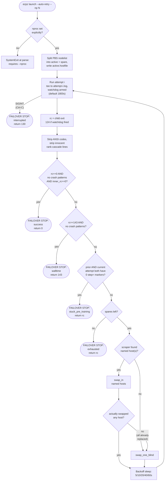

# 🚀 `ezpz launch`

Single entry point for launching distributed applications.

```bash
ezpz launch <cmd>
```

This will:

1. Automatically detect your PBS/Slurm job and 
2. Launch `<cmd>` across all available accelerators.

This is done by detecting if `ezpz launch` is being executed from inside a
PBS/Slurm job[^schedulers].

If so, it determines the specifics of the active job (number of nodes, and
number of GPUs _per_ node), and uses this information to build and execute the
appropriate launch command (e.g. `mpiexec`, `srun`).

When not running inside a PBS/Slurm job, `ezpz launch` falls back to `mpirun`
with sensible defaults.

Arguments can be passed through to the `mpiexec`/`srun` launcher by separating
them from the `<cmd>` with `--`[^launch-args], e.g.:

```bash
ezpz launch <launch-args> -- <cmd> <cmd-args>
```

[^launch-args]: When no `--` is present, all arguments are treated as part of
    the command to run.

For example, to run with 8 processes total, 4 processes per node, on 2 hosts,
we can:

```bash
ezpz launch -n 8 -ppn 4 -nh 2 -- python3 -m ezpz.examples.fsdp_tp
```

Assuming your current job can satisfy this (i.e. at least 4 accelerators per
node, and at least 2 nodes), this would launch `python3 -m
ezpz.examples.fsdp_tp` across 8 processes, 4 per node, on the first two hosts
allocated to your job.

- ??? abstract "`ezpz launch --help`"

        ```bash
        ezpz launch --help
        usage: ezpz launch [-h] [--print-source] [--filter FILTER [FILTER ...]]
                           [-n NPROC] [-ppn NPROC_PER_NODE] [-nh NHOSTS]
                           [--hostfile HOSTFILE] [--cpu-bind CPU_BIND] ...

        Launch a command on the current PBS/SLURM job.

        Additional `<launcher flags>` can be passed through directly
        to the launcher by including '--' as a separator before
        the command.

        Examples:

            ezpz launch <launcher flags> -- <command> <args>

            ezpz launch -n 8 -ppn 4 --verbose --tag-output -- python3 -m ezpz.examples.fsdp_tp

            ezpz launch --nproc 8 -x EZPZ_LOG_LEVEL=DEBUG -- python3 my_script.py --my-arg val

        positional arguments:
        command               Command (and arguments) to execute. Use '--' to separate options when needed.

        options:
        -h, --help            show this help message and exit
        --print-source        Print the location of the launch CLI source and exit.
        --filter FILTER [FILTER ...]
                                Deprecated: output filtering has been removed. This flag is ignored.
        -n NPROC, -np NPROC, --n NPROC, --np NPROC, --nproc NPROC, --world_size NPROC, --nprocs NPROC
                                Number of processes.
        -ppn NPROC_PER_NODE, --ppn NPROC_PER_NODE, --nproc_per_node NPROC_PER_NODE
                                Processes per node.
        -nh NHOSTS, --nh NHOSTS, --nhost NHOSTS, --nnode NHOSTS, --nnodes NHOSTS, --nhosts NHOSTS, --nhosts NHOSTS
                                Number of nodes to use.
        --hostfile HOSTFILE   Hostfile to use for launching.
        --cpu-bind CPU_BIND   CPU binding value to pass to the launcher.
                                Takes precedence over CPU_BIND when both are specified.
        --timeout IDLE_TIMEOUT_S
                                Idle-output watchdog timeout in seconds. Off by default.
        --retries RETRIES     Re-execute on non-zero exit, up to N times. Default: 0.
        --auto-retry          Unbounded bad-node failover loop. Mutually
                                exclusive with --retries. Requires explicit --nproc.
        --spare-nodes SPARE_NODES
                                Spare-node pool for --auto-retry. "auto" (default)
                                derives from total_pbs_nodes - $nproc; pass an int
                                for an explicit cap.
        --max-failover-retries MAX_FAILOVER_RETRIES
                                Optional upper bound on --auto-retry attempts.
                                Default: unbounded (see termination matrix).
        ```

## Idle-output watchdog (`--timeout`)

`--timeout SECONDS` arms a watchdog that monitors the launched
process's output. If no output appears (on **stdout or stderr** —
they are merged at the watchdog) for `SECONDS` consecutive seconds,
the watchdog sends `SIGTERM`, waits up to 10 seconds for a clean
shutdown, then sends `SIGKILL`. The exit code returned by
`ezpz launch` is `124` (matching GNU `timeout(1)` convention) so
shell wrappers can distinguish "killed for going silent" from
"command failed". Passing `--timeout 0` disables the watchdog (same
as omitting the flag).

```bash
# Abort if the training script goes silent for 10 minutes.
ezpz launch --timeout 600 -- python3 -m my_app.train
```

**Idle, not walltime.** The process can run indefinitely as long as
it keeps emitting at least one line per `SECONDS` on either stream.
This is the right semantics for catching *collective hangs* (e.g.
xccl on XPU silently deadlocking) where the process is alive but
every rank is blocked in the same collective and nothing reaches
either stream. For a hard walltime limit, use the scheduler's
existing mechanism (`#PBS -l walltime=...`).

**Python buffering.** The watchdog sets `PYTHONUNBUFFERED=1` in the
child environment so Python's default block-buffering (which kicks
in when stdout isn't a TTY) doesn't fool the watchdog into killing a
healthy job that's accumulating output in a 4-8 KB buffer. The
variable is benign for non-Python children: they ignore it.

**Scope caveat.** The watchdog only watches the process `ezpz launch`
spawns directly. If you `qsub` a job script that internally invokes
`python train.py`, the watchdog needs to live inside *that* script
(or call `ezpz launch` from inside it), not the outer `qsub`.

## Retry on non-zero exit (`--retries`)

`--retries N` re-executes the command up to `N` additional times
whenever the previous attempt returns a non-zero exit code, including
the watchdog's `124`. Exponential backoff is applied between attempts
(5s, 10s, 20s, 40s, then capped at 60s).

```bash
# Up to 3 retries with watchdog protection. Useful for flaky fabrics
# or transient EC2 spot interruptions.
ezpz launch --timeout 600 --retries 3 -- python3 -m my_app.train
```

A clean exit on any attempt short-circuits the loop and returns 0.
If every attempt fails, the final attempt's exit code is returned.
Combine with `--timeout` to convert silent hangs into retryable
failures.

## Auto-retry on bad-node failure (`--auto-retry`)

`--auto-retry` engages the failover loop. On every non-zero exit,
ezpz scrapes the log for known bad-node signatures (Aurora PALS
shepherd-9, gloo TCP peer-closed), swaps each named host out for a
spare from the rest of the PBS allocation, and re-runs the command.
Unlike `--retries N`, the loop is *unbounded* by default — it
continues until one of the conditions in the **termination matrix**
below fires.

```bash
# 522 nodes allocated by PBS; use 512 for training, reserve 10 as
# spares. Loop until success / walltime / spare exhaustion.
ezpz launch --auto-retry --np 512 -- python3 -m ezpz.examples.test
```

`--auto-retry` is **mutually exclusive** with `--retries`. They model
different things: `--retries N` is a bounded *process-level* retry
that re-launches the same command on the same nodes. `--auto-retry`
is an unbounded *node-level* failover that swaps bad hosts out
between attempts.

### Decision flow at a glance


```mermaid
flowchart TD
    Start(["ezpz launch --auto-retry --np N"]) --> Validate{"nproc set<br/>explicitly?"}
    Validate -->|no| ErrParse["SystemExit at parse:<br/>requires --nproc"]
    Validate -->|yes| Split["Split PBS nodelist<br/>into active + spare,<br/>write active.hostfile"]
    Split --> Attempt["Run attempt i<br/>tee to attempt-i.log,<br/>watchdog armed<br/>(default 1800s)"]
    Attempt -->|"SIGINT<br/>(Ctrl-C)"| Interrupted(["FAILOVER STOP:<br/>interrupted<br/>return 130"])
    Attempt --> GotRC["rc = child exit<br/>124 if watchdog fired"]
    GotRC --> Strip["Strip ANSI codes,<br/>strip innocent<br/>rank-cascade lines"]
    Strip --> CheckSuccess{"rc==0 AND<br/>no crash patterns<br/>AND inner_rc==0?"}
    CheckSuccess -->|yes| Success(["FAILOVER STOP:<br/>success<br/>return 0"])
    CheckSuccess -->|no| CheckWalltime{"rc==143 AND<br/>no crash patterns?"}
    CheckWalltime -->|yes| Walltime(["FAILOVER STOP:<br/>walltime<br/>return 143"])
    CheckWalltime -->|no| CheckStuck{"prior AND current<br/>attempt both have<br/>0 step= markers?"}
    CheckStuck -->|yes| Stuck(["FAILOVER STOP:<br/>stuck_pre_training<br/>return rc"])
    CheckStuck -->|no| CheckSpares{"spares left?"}
    CheckSpares -->|no| Exhausted(["FAILOVER STOP:<br/>exhausted<br/>return rc"])
    CheckSpares -->|yes| CheckScraper{"scraper found<br/>named host(s)?"}
    CheckScraper -->|yes| SwapIn["swap_in<br/>named hosts"]
    CheckScraper -->|no| SwapBlind["swap_one_blind"]
    SwapIn --> CheckSwapped{"actually swapped<br/>any host?"}
    CheckSwapped -->|"no<br/>(all already<br/>replaced)"| SwapBlind
    CheckSwapped -->|yes| Backoff
    SwapBlind --> Backoff["Backoff sleep:<br/>5/10/20/40/60s"]
    Backoff --> Attempt
```

### Required: explicit `--nproc`

`--auto-retry` needs to know how many ranks are training so it can
split the PBS allocation into active + spare. We **do not guess**
the active-host count — pass `--nproc N` (or `-n N` / `--np N`)
explicitly. The CLI errors out at parse time otherwise:

```text
$ ezpz launch --auto-retry -- python3 train.py
--auto-retry requires --nproc (-n/--np) to be set explicitly. ...
```

### Spare-node policy (`--spare-nodes`)

By default (`--spare-nodes auto`), the spare pool is
`total_pbs_nodes - $nproc/$ppn`. So if PBS gave you 522 nodes and
you ask for 512 training ranks on 12-GPU nodes, the spare pool is
`522 - 43 = 479` — though you'll usually want to reserve fewer in
practice (a node typically isn't worth using if 50 others failed
on it first).

Pass `--spare-nodes N` to cap the pool explicitly:

```bash
ezpz launch --auto-retry --np 512 --spare-nodes 10 -- ...
```

### Termination matrix

Every termination logs a single `FAILOVER STOP: <reason>` line so
post-mortem `grep` is reliable.

| # | Condition                                              | Result                |
|---|--------------------------------------------------------|-----------------------|
| 1 | exit 0 (clean inner trailer, no crash patterns)        | **SUCCESS** → return 0|
| 2 | exit 143 (walltime SIGTERM), no crash patterns         | **WALLTIME** → return rc|
| 3 | exit 143 *with* crash patterns in log                  | bad-node retry (real failure raced the walltime kill) |
| 4 | exit 124 (idle-output watchdog tripped)                | bad-node retry (silent hang → blind rotation) |
| 5 | any other non-zero, scraper found named host(s)        | **swap_in** named → retry |
| 6 | any other non-zero, scraper found nothing              | **swap_one_blind** → retry |
| 7 | two consecutive attempts with zero `step=` markers     | **STUCK_PRE_TRAINING** → return rc |
| 8 | bad-node verdict but no spares left                    | **EXHAUSTED** → return rc |
| 9 | SIGINT (Ctrl-C)                                        | **INTERRUPTED** → return 130 |

**Empty-`swap_in` fallback.** Row 5's `swap_in` skips any host that
isn't currently in the active set (the named host was already
replaced on a prior attempt, the scraper picked up stale lines from
an older log, etc.). If `swap_in` ends up swapping zero hosts, the
loop falls through to row 6's `swap_one_blind` so it still makes
forward progress instead of looping on the same bad set.

The `step=` marker guard (#7) replaces a numeric "max consecutive
blind rotations" cap. The intent is to catch broken configs / missing
datasets / pre-training-loop bugs before they burn the entire spare
pool — if two attempts in a row die before `History.update` prints
its first `step=N` line, no amount of node-swapping will help.

### Worked example — real Aurora `UR_RESULT_ERROR_OUT_OF_RESOURCES`

Here's an excerpt from a real Aurora torchtitan job that the
classifier handles correctly. The relevant signals from
`attempt-1.log`:

```
[2026-05-12 08:04:23][I][components/metrics:526:log] step:  1  loss: 12.94587  ...
[2026-05-12 08:04:30][I][components/metrics:526:log] step:  2  loss: 12.90856  ...
... (16 more clean training steps) ...
[2026-05-12 08:06:24][I][components/metrics:526:log] step: 18  loss: 10.27772  ...
[rank7]: RuntimeError: level_zero backend failed with error: 40 (UR_RESULT_ERROR_OUT_OF_RESOURCES)
x4610c4s3b0n0.hsn.cm.aurora.alcf.anl.gov: rank 7 exited with code 1
x4610c4s5b0n0.hsn.cm.aurora.alcf.anl.gov: rank 14 died from signal 15
[ezpz/launch] Execution finished with 143.
```

What the classifier does step by step:

1. `rc=143` from the shell (mpiexec teardown after the GPU OOM).
2. Strip ANSI codes from the log.
3. Strip innocent rank-cascade lines: `rank 14 died from signal 15`
   is a **downstream cascade** from the primary kill on
   `x4610c4s3b0n0`, not a bad-node indicator on `x4610c4s5b0n0`.
   This line is excluded *before* the crash-pattern match runs
   (job 8466848 postmortem — tagging cascade victims as bad nodes
   burns spares for nothing).
4. Run the crash-pattern grep on the stripped text:
   `UR_RESULT_ERROR_OUT_OF_RESOURCES` matches → there IS a real
   hardware failure in the log.
5. `rc==143 AND crash_patterns` → **bad-node retry path**, not
   `WALLTIME`. Without the strip we'd still get to bad-node retry
   (the cascade lines also contain `died from signal`), but we'd
   reach it via the *wrong* condition — and we'd be at risk of
   tagging `x4610c4s5b0n0` as a bad node when only
   `x4610c4s3b0n0` is the actual culprit.
6. Scraper picks up the hostname from the
   `x4610c4s3b0n0.hsn...: rank 7 exited with code 1` line (or, if
   the scraper missed it because it's not in the explicit pattern
   set, falls through to `swap_one_blind`).
7. `bad_nodes.txt` gets `x4610c4s3b0n0.hsn.cm.aurora.alcf.anl.gov`.
   `active.hostfile` is rewritten with that host replaced by the
   next spare.
8. Backoff 5 seconds, run `attempt-2.log`. The retry uses the
   updated active set; the bad GPU is no longer in the training
   pool.

This exact log shape is pinned as a regression test in both code
paths:
[`test_crash_patterns_real_ur_oom_with_cascade_regression`](https://github.com/saforem2/ezpz/blob/main/tests/test_launch_autoretry.py)
(Python) and
[`test_run_walltime_143_retries_on_real_aurora_ur_oom_with_cascade`](https://github.com/saforem2/ezpz/blob/main/tests/test_failover_lib.sh)
(bash).

### Reading the postmortem log

After a run finishes (success, walltime, or exhausted), the
`logs/failover-<jobid>/` directory is the postmortem entry point.
A few one-liners:

```bash
# What was the final verdict?
grep "FAILOVER STOP" logs/failover-*/attempt-*.log

# Which nodes were swapped out across all attempts?
cat logs/failover-*/bad_nodes.txt

# Which step did each attempt reach before dying?
for f in logs/failover-*/attempt-*.log; do
  echo "=== $f ==="
  grep -oE "step:[[:space:]]+[0-9]+" "$f" | tail -1
done

# Was the failure a real hardware death or just a walltime hit?
grep -E "OutOfMemoryError|UR_RESULT_ERROR|gloo.*Connection closed|shepherd died" \
  logs/failover-*/attempt-*.log
```

### Default idle-output watchdog

When `--auto-retry` is set, `--timeout` defaults to **1800 seconds**
(30 minutes) instead of being off. This matches the
`FAILOVER_IDLE_TIMEOUT` default in `src/ezpz/bin/failover.sh` and
prevents silent xccl hangs from burning the full PBS walltime
before the loop can intervene. Pass `--timeout 0` to disable, or
`--timeout N` to override.

### Optional cap (`--max-failover-retries`)

`--max-failover-retries N` is an additional belt-and-suspenders
cap. Default is unbounded — terminate only via the matrix above.
Useful for short jobs where you'd rather give up than retry 100
times.

### Files written

Per-job, in `$(pwd)/logs/failover-<jobid>/`:

- `active.hostfile` — the *current* active node set, mutated in
  place as nodes are swapped. Always reflects what the next attempt
  will run on.
- `bad_nodes.txt` — every host that's been swapped out (named
  swap_in *and* blind rotations). Append-only.
- `attempt-N.log` — combined stdout+stderr of attempt N.

> **Note on `active.hostfile` mutation.** The file is rewritten in
> place between attempts. If you `cat` it from a second shell
> mid-run, you'll see the *current* active set, not the original
> PBS allocation. The launcher reads it fresh at each attempt — no
> re-launch of `ezpz launch` itself is needed for the new contents
> to take effect, since the launcher subprocess re-resolves the
> hostfile path's contents per spawn. To inspect the *original*
> PBS allocation, look at `$PBS_NODEFILE` (unmodified) instead.

### Relationship to `src/ezpz/bin/failover.sh`

`failover.sh` is the bash equivalent for users who can't put
`ezpz launch` at the top of their job script — for example,
`qsub`'ing a wrapper that already invokes `python` directly. The
scrape source is identical (`ezpz.failover.scrape_bad_nodes`); the
retry/swap mechanics are independent re-implementations because the
classifier is much easier to test in Python. Prefer `--auto-retry`
when you can, fall back to sourcing the bash lib when you can't.

## Python interpreter resolution

When `ezpz launch` needs to invoke `python3` (e.g.
`ezpz launch python3 -m my.module`), it picks the interpreter in this
order:

1. **`$VIRTUAL_ENV/bin/python3`** if `$VIRTUAL_ENV` is set and exists
2. **`shutil.which("python3")`** — first python3 on `$PATH`
3. **`sys.executable`** as a last resort

Why not just `sys.executable`? It's frozen at interpreter startup. If
you ran [`ezpz yeet`](../yeet.md) to copy your env to `/tmp/`
and then `source /tmp/.venv/bin/activate`, `sys.executable` would still
point to the original Lustre path because the `ezpz` CLI script's
shebang is baked in at install time. Reading `$VIRTUAL_ENV` (set by
`activate`) lets the launcher follow the user's actual current venv.

## Examples

Use it to launch:

- Arbitrary command(s):

    ```bash
    ezpz launch hostname
    ```

- Arbitrary Python string:

    ```bash
    ezpz launch python3 -c 'import ezpz; ezpz.setup_torch()'
    ```

- One of the Distributed Training examples:

    ```bash
    ezpz launch python3 -m ezpz.examples.test --profile
    ezpz launch -n 8 -- python3 -m ezpz.examples.fsdp_tp --tp 4
    ```

- Your own distributed training script:

    ```bash
    ezpz launch -n 16 -ppn 8 -- python3 -m your_app.train --config configs/your_config.yaml
    ```

    to launch `your_app.train` across 16 processes, 8 per node.

[^schedulers]: By default, this will detect if we're running behind a job
    scheduler (e.g. PBS or Slurm).<br>
    If so, we automatically determine the specifics of the currently active
    job; explicitly, this will determine:

    1. The number of available nodes
    2. How many GPUs are present on each of these nodes
    3. How many GPUs we have _total_

    It will then use this information to automatically construct the
    appropriate {`mpiexec`, `srun`} command to launch, and finally, execute the
    launch cmd.


??? tip "Sequence Diagram"

    Two primary control paths drive `ezpz launch`: a scheduler-aware path used when
    running inside PBS/SLURM allocations, and a local fallback that shells out to
    `mpirun` when no scheduler metadata is available.

    ```mermaid
    sequenceDiagram
        autonumber
        actor User
        participant CLI as ezpz_launch
        participant Scheduler as PBS_or_Slurm
        participant MPI as mpirun_mpiexec
        participant App as User_application

        User->>CLI: ezpz launch <launch_flags> -- <cmd> <cmd_flags>
        CLI->>Scheduler: detect_scheduler()
        alt scheduler_detected
            Scheduler-->>CLI: scheduler_type, job_metadata
            CLI->>Scheduler: build_scheduler_command(cmd_to_launch)
            Scheduler-->>CLI: launch_cmd (mpiexec_or_srun)
            CLI->>MPI: run_command(launch_cmd)
            MPI->>App: start_ranks_and_execute
            App-->>MPI: return_codes
            MPI-->>CLI: aggregate_status
        else no_scheduler_detected
            Scheduler-->>CLI: unknown
            CLI->>MPI: mpirun -np 2 <cmd> <cmd_flags>
            MPI->>App: start_local_ranks
            App-->>MPI: return_codes
            MPI-->>CLI: aggregate_status
        end
        CLI-->>User: exit_code
    ```

## Distributed Training Examples

--8<-- "../includes/example-table.md"


  [ex-test]: ../../examples/test.md "Example"
  [api-test]: ../../python/Code-Reference/examples/test.md "API Reference"
  [gh-test]: https://github.com/saforem2/ezpz/blob/main/src/ezpz/examples/test.py "GitHub Source"
  [ex-fsdp]: ../../examples/fsdp.md "Example"
  [api-fsdp]: ../../python/Code-Reference/examples/fsdp.md "API Reference"
  [gh-fsdp]: https://github.com/saforem2/ezpz/blob/main/src/ezpz/examples/fsdp.py "GitHub Source"
  [ex-vit]: ../../examples/vit.md "Example"
  [api-vit]: ../../python/Code-Reference/examples/vit.md "API Reference"
  [gh-vit]: https://github.com/saforem2/ezpz/blob/main/src/ezpz/examples/vit.py "GitHub Source"
  [ex-fsdp-tp]: ../../examples/fsdp-tp.md "Example"
  [api-fsdp-tp]: ../../python/Code-Reference/examples/fsdp_tp.md "API Reference"
  [gh-fsdp-tp]: https://github.com/saforem2/ezpz/blob/main/src/ezpz/examples/fsdp_tp.py "GitHub Source"
  [ex-diffusion]: ../../examples/diffusion.md "Example"
  [api-diffusion]: ../../python/Code-Reference/examples/diffusion.md "API Reference"
  [gh-diffusion]: https://github.com/saforem2/ezpz/blob/main/src/ezpz/examples/diffusion.py "GitHub Source"
  [ex-hf-trainer]: ../../examples/hf-trainer/index.md "Example"
  [api-hf-trainer]: ../../python/Code-Reference/examples/hf_trainer.md "API Reference"
  [gh-hf-trainer]: https://github.com/saforem2/ezpz/blob/main/src/ezpz/examples/hf_trainer.py "GitHub Source"

[^distributed-history]: The `ezpz.History` class automatically computes
    distributed statistics (min, max, mean, std. dev) across ranks for all
    recorded metrics.  
    **NOTE**: This is automatically disabled when
    `ezpz.get_world_size() >= 384` (e.g. >= {32, 96} {Aurora, Polaris} nodes)
    due to the additional overhead introduced (but can be manually enabled, if
    desired).
