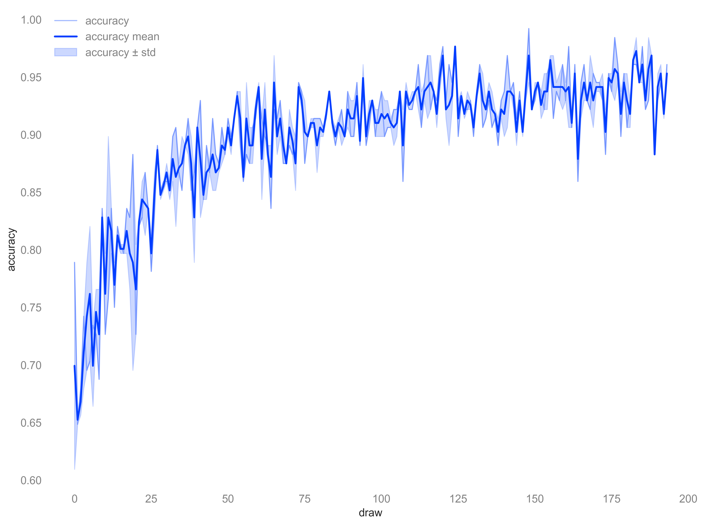
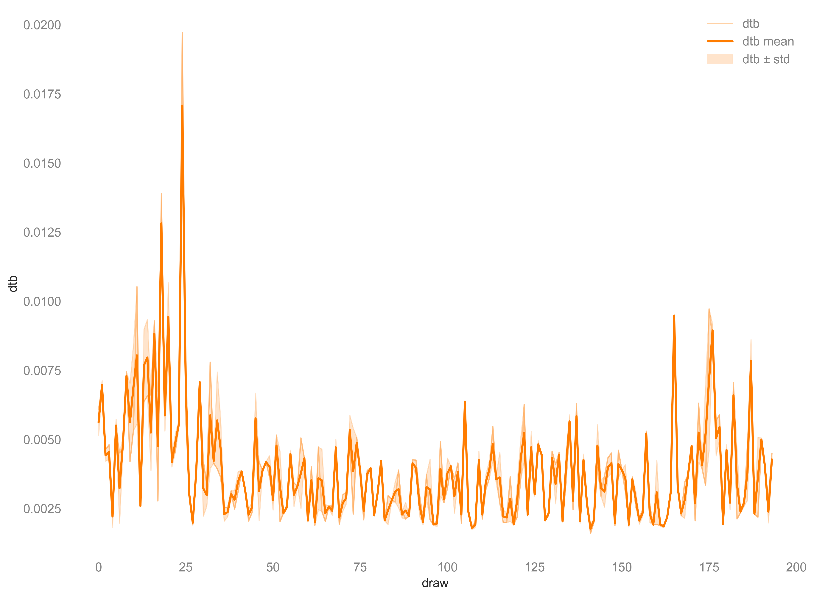
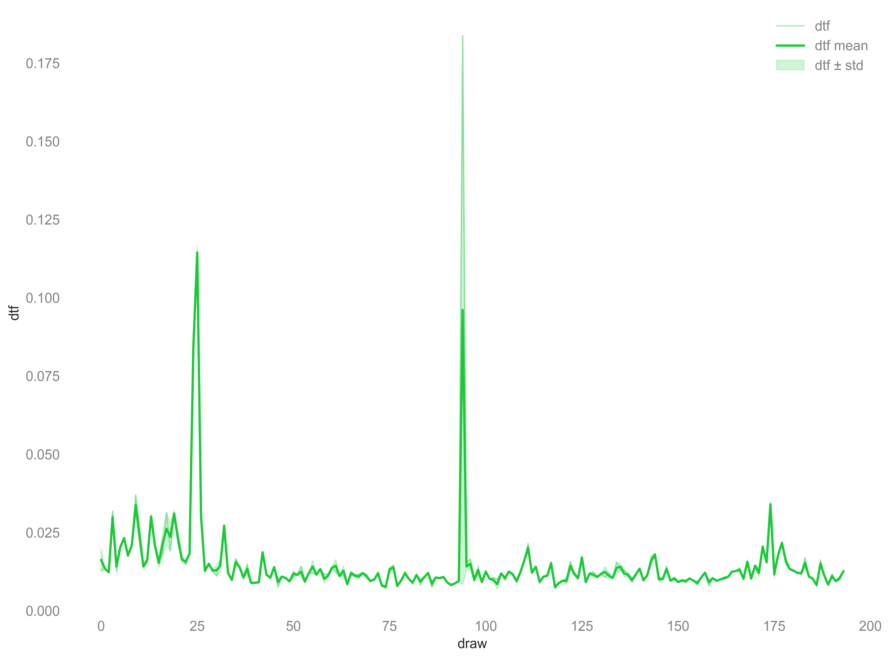
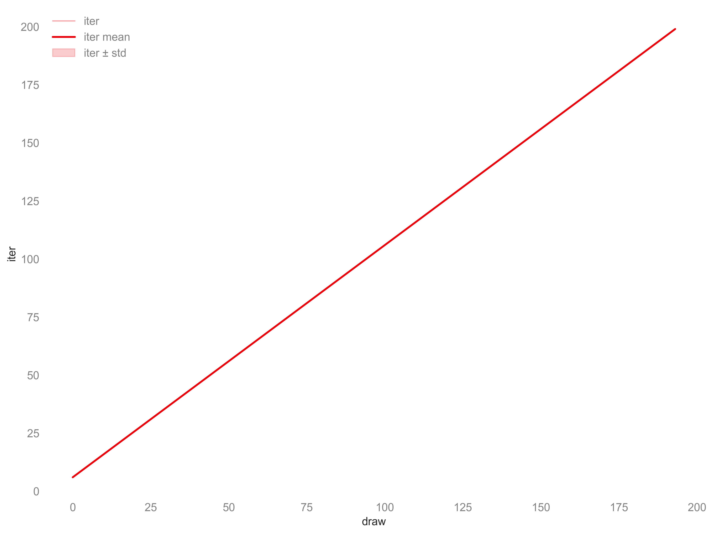
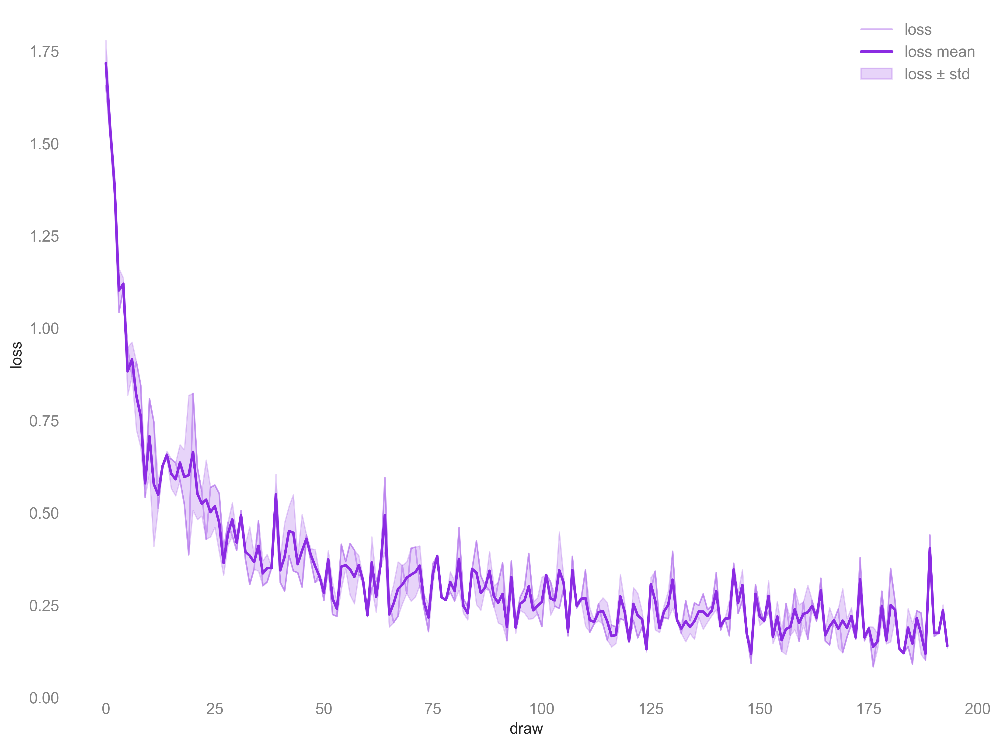

# History Report (20260114-185208)

_Generated at 2026-01-14T18:52:21.425580Z_

## Environment

### Paths

- **Working directory**: /Users/samforeman/vibes
- **Output directory**: /Users/samforeman/vibes/outputs/ezpz.test_dist/2026-01-14-125205
- **Dataset root**: /Users/samforeman/vibes/outputs/ezpz.test_dist/datasets/mnist
- **Hostname**: Sams-MacBook-Pro-2.local

### Python

- **Version**: 3.12.8
- **Implementation**: cpython
- **Executable**: /Users/samforeman/vibes/saforem2/ezpz/venvs/alcfwl052.alcf.anl.gov/ezpz/bin/python3

### Torch

- **Version**: 2.9.1
- **Device**: mps:0
- **Backend**: unknown

### Distributed

- **Rank**: 0
- **Local rank**: 0
- **World size**: 2

### Environment Variables

### Environment Variables

- **MASTER_ADDR**: Sams-MacBook-Pro-2.local
- **MASTER_PORT**: 49936
- **LOCAL_RANK**: 0
- **RANK**: 0
- **WORLD_SIZE**: 2

## Metric Overview

### accuracy

| Statistic |    Value |
|:-------- | -------:|
| Latest    | 0.960938 |
| Mean      | 0.953125 |
| Max       | 0.960938 |
| Min       | 0.945312 |
| Std       | 0.007812 |

### dtb

| Statistic |    Value |
|:-------- | -------:|
| Latest    | 0.004498 |
| Mean      | 0.004275 |
| Max       | 0.004498 |
| Min       | 0.004052 |
| Std       | 0.000223 |

### dtf

| Statistic |    Value |
|:-------- | -------:|
| Latest    | 0.012833 |
| Mean      | 0.012601 |
| Max       | 0.012833 |
| Min       | 0.012369 |
| Std       | 0.000232 |

### iter

| Statistic |      Value |
|:-------- | ---------:|
| Latest    | 199.000000 |
| Mean      | 199.000000 |
| Max       | 199.000000 |
| Min       | 199.000000 |
| Std       |   0.000000 |

### loss

| Statistic |    Value |
|:-------- | -------:|
| Latest    | 0.146272 |
| Mean      | 0.139530 |
| Max       | 0.146272 |
| Min       | 0.132789 |
| Std       | 0.006742 |

## accuracy

_Kind_: `matplotlib`  
_Generated_: 2026-01-14T18:52:22.581543Z

- **components**: max, mean, min, raw, std
- **points**: 194

## dtb

_Kind_: `matplotlib`  
_Generated_: 2026-01-14T18:52:22.993822Z

- **components**: max, mean, min, raw, std
- **points**: 194

## dtf

_Kind_: `matplotlib`  
_Generated_: 2026-01-14T18:52:23.337608Z

- **components**: max, mean, min, raw, std
- **points**: 194

## iter

_Kind_: `matplotlib`  
_Generated_: 2026-01-14T18:52:23.922535Z

- **components**: max, mean, min, raw, std
- **points**: 194

## loss

_Kind_: `matplotlib`  
_Generated_: 2026-01-14T18:52:24.285194Z

- **components**: max, mean, min, raw, std
- **points**: 194

## accuracy summary

_Kind_: `tplot`  
_Generated_: 2026-01-14T18:52:24.329254Z

<pre>     &#x250C;&#x2500;&#x2500;&#x2500;&#x2500;&#x2500;&#x2500;&#x2500;&#x2500;&#x2500;&#x2500;&#x2500;&#x2500;&#x2500;&#x2500;&#x2500;&#x2500;&#x2500;&#x2500;&#x2500;&#x2500;&#x2500;&#x2500;&#x2500;&#x2500;&#x2500;&#x2500;&#x2500;&#x2500;&#x2500;&#x2500;&#x2500;&#x2500;&#x2500;&#x2500;&#x2500;&#x2500;&#x2500;&#x2500;&#x2500;&#x2500;&#x2500;&#x2500;&#x2500;&#x2500;&#x2500;&#x2500;&#x2500;&#x2500;&#x2500;&#x2500;&#x2500;&#x2500;&#x2500;&#x2500;&#x2500;&#x2500;&#x2500;&#x2500;&#x2500;&#x2500;&#x2500;&#x2500;&#x2500;&#x2500;&#x2500;&#x2500;&#x2500;&#x2500;&#x2500;&#x2500;&#x2500;&#x2500;&#x2500;&#x2500;&#x2500;&#x2500;&#x2500;&#x2500;&#x2500;&#x2500;&#x2500;&#x2500;&#x2500;&#x2500;&#x2500;&#x2500;&#x2500;&#x2500;&#x2500;&#x2500;&#x2500;&#x2500;&#x2500;&#x2500;&#x2500;&#x2500;&#x2500;&#x2500;&#x2500;&#x2500;&#x2500;&#x2500;&#x2500;&#x2500;&#x2500;&#x2500;&#x2500;&#x2500;&#x2500;&#x2500;&#x2500;&#x2500;&#x2500;&#x2510; 0.992&#x2524; ++ accuracy/max                                                                      &#x259F;               &#x2597;          &#x2502;      &#x2502; -- accuracy/min                                                      &#x2596; &#x2597;            +&#x2588;      +&#x2596;       &#x2588;   ++&#x2596;+   &#x2502;      &#x2502; &#xB7;&#xB7; accuracy/mean                     +                           &#x2597;&#x258C; &#x2590;&#x258C;&#xB7;&#x2588;        &#x2597;&#x258C;  &#x2597;&#x259C;   &#xB7;+ &#x2590;&#x258C;  +    &#x2588;   &#xB7;&#x2590;&#x258C;&#x259F;   &#x2502;      &#x2502; &#x259E;&#x259E; accuracy                         ++                +         &#x259F;&#x2590;&#x258C; &#x259E;&#x2599;&#x2599;&#x259C;   &#x2597;&#x258C;   &#x2590;&#x259A;  &#x2590;&#x2590;  &#xB7;&#x259F;+&#x259F;&#x2590;&#x2599;&#x258C;&#x2597;&#x258C;&#x2597;  &#x2597;&#x258C;&#x258C;&#x2597;&#x2597;&#x259C;&#x2590;&#x258C;&#x2588; +&#x259E;&#x2502;      &#x2502;                                +  +++&#xB7;   &#x2597;          &#x2597;+&#xB7;       +&#x2597;&#x259C;&#x2590;&#x258C;+&#x258C;&#x2588;&#x259C;&#x2590;   &#x2590;&#x258C;+  &#x2590;&#x2590;&#x2597; &#x2590;&#x2590;+&#x2596;&#x2590;&#x2590;+&#x259B;&#x259F;&#x2588;&#x258C;&#x258C;&#x258C;&#x259B;&#x2584;+&#x2588;&#x258C;&#x258C;&#x2588;&#x2590; &#x259C;&#x258C;&#x2588;+&#x2597;&#x258C;&#x2502;      &#x2502;                              &#x2597;&#x258C;+ &#x2597;&#x258C;+&#xB7;&#xB7;   &#x258C;&#x258C;    &#x259F;  &#x2597;&#x258C;&#x2588;&#x2597;&#x258C;  &#x259F;  &#x2597;&#x258C;&#xB7;&#x259E;&#x2590;&#x258C;&#x2599;&#x259A;&#x258C;&#x2588;&#xB7;&#x2590;&#xB7;+ &#x259E;&#x258C;&#xB7;+ &#x259E;&#xB7;&#x259C;&#x259F;&#x258C;&#x2590;&#x2590;&#x2590;&#x259E;&#x2590;&#x259F;&#x258C;&#x2588;&#x2588;&#x2588;&#xB7;&#x258C;&#x258C;&#x259D;&#x2596;&#x258C;&#x2598;&#x258C;&#x2588;&#x2590; &#xB7;&#x258C;&#x2588;&#xB7;&#x2588;&#x258C;&#x2502; 0.928&#x2524;                       &#x2597;&#x258C;     &#x2590;&#x258C;+ &#x2590;&#x258C;&#xB7;&#xB7;&#x2584;&#x258C; +&#x258C;&#x258C;+   &#x2588; &#x2597;&#x2590;&#x258C;&#x2588;&#x2590;&#x258C;&#x259F;&#x2590;&#x2590;+&#x2597;&#x258C;&#x2599;&#x259A;&#x258C;&#x2590;&#x258C;&#x259C;&#xB7;&#x2598;&#x259D;&#xB7;&#x2590;&#x259E;&#x2584;&#x258C;&#x258C;&#x258C;&#x259F;&#xB7;&#x2597;&#x2598;-&#x2590;&#x2588;&#x258C;&#x259D;&#x259E;&#x259D;&#x258C;&#x2590;&#x258C;&#x2598;&#x259D;&#x2588;&#x2588;&#xB7;&#x259D;&#x258C; &#x2590;&#x258C;-&#x2590;&#x2588;&#x259E;  &#x259A;&#x259C;&#x2597;&#x2580;&#x258C;&#x2502;      &#x2502;                     &#x259F; &#x2590;&#x258C;&#x2597;&#x258C; &#x2597;&#x258C;&#x259E;&#x258C;&#xB7; &#x259E;&#x2590;&#xB7;&#x2590;&#x259D;&#x258C;++&#x258C;&#x258C;+&#x259E;&#x259C;&#x2597;&#x259C;&#xB7;&#x259B;&#x259F;&#x258C;&#x2588;&#x259E;&#x258C;&#x2588;&#x258C;&#x2590;&#xB7;&#x258C;&#xB7;&#x2588;  &#x2590;&#x258C;-&#xB7; --&#x2590;&#x258C;&#xB7;&#x259A;&#x258C;&#x2599;&#x2598;&#x2599;&#x2588;&#xB7;-&#xB7;&#x259C;&#x258C;  -  &#x2598; -&#x2588;&#x2588;--- &#x2590;&#x258C; &#x2590;&#x2588;&#x258C;   &#x2590;&#x2590;&#xB7; &#x2502;      &#x2502;                  &#x2597;&#x258C; &#x2588; &#x259E;&#x258C;&#x2590;&#x259A;&#x2597;&#x2588;&#x259C;&#xB7;&#x258C;&#xB7;&#x2597;&#x2598;&#x259D;&#x2596;&#x2590;&#xB7;&#x258C;+&#xB7;&#x258C;&#x258C;&#x2597;&#x2598;&#xB7;&#x2598; &#x2599;&#x2598;&#x259C;&#x259A;&#x2588;&#x258C;&#x2599;&#x2580;&#x258C;&#x259D;&#x259E;&#x2598;-&#x2588;   &#x2598; - --&#x259D;&#x258C; &#x259D;&#x258C;&#x259D; &#x259D;&#x2588;---&#xB7;&#x2598;       -&#x259D;&#x2588;  - &#x2590;&#x258C; &#x259D;&#x258C;&#x2598;   &#x2590;&#x259E;  &#x2502;      &#x2502;      +        &#x2597;+ &#x258C;&#x258C;+&#x2588;+&#x258C;&#x258C;&#x259F;&#x2590;&#x2590;&#x2588;-&#xB7;&#x259A;&#xB7;&#x2590;&#xB7;&#xB7;&#x259A;&#x2590;&#xB7;&#x258C;&#xB7;&#x259F;&#xB7;&#x258C;&#x258C;-&#xB7;- &#x259C;-&#xB7;-&#x259D;&#x258C;&#x259C; -----&#x2588;        - - -    &#x259C;-  --         &#x2588;    &#x2590;&#x258C; -     &#x2590;&#x258C;  &#x2502;      &#x2502;      +   &#x2597;&#x258C;   &#x2588;&#xB7; &#x258C;&#x2590;&#x2590;&#x2590;&#x2590;&#xB7;&#x2588;&#x2588;&#xB7;&#x2588;&#x259D; -&#x2590;&#x259F;&#x258C;-&#xB7;&#x2590;&#x2590;-&#x258C;&#x259E;&#x259D;&#xB7;&#x2588;---               &#x2588;                                &#x2588;    -&#x2598;        &#x2598;  &#x2502;      &#x2502;      +   &#x2590;&#x258C; &#x2597; &#x259B;&#x2596;&#xB7;&#x258C;&#x259D;&#x259F;&#x2590;&#x2590;&#xB7;&#x2588;&#x259C;&#xB7;&#x259D;-  &#x2590;&#x258C;&#x2598;--&#x2590;&#x2590; &#x259D;&#x2598;-&#xB7;&#x259D;- -               &#x2588;                                &#x2588;                 &#x2502; 0.865&#x2524;      +   &#x2590;&#x258C; &#x2588; &#x258C;&#x258C;&#x2584;&#x258C;&#xB7;&#x2588;&#x2590;&#x258C;&#xB7;&#x2588;---   &#x259D;&#x258C;  - &#x2588;   --                   &#x259C;                                &#x259C;                 &#x2502;      &#x2502;      +   &#x2590;&#x258C;+&#x2588; &#x258C;&#x259D;-&#xB7;-&#x259D; &#x2598;&#xB7;&#x2588;---       - &#x2588;    -                                                                      &#x2502;      &#x2502;     &#x2596;+&#x2596;  &#x259F;&#x258C;+&#x259B;&#x2596;&#x258C;- --  &#xB7;&#xB7;&#x259D;-         - &#x259C;                                                                           &#x2502;      &#x2502;    &#x2590;&#x258C;&#x2590;&#x258C; &#x2590;&#x259D;&#x258C;&#x2597;&#x2598;&#x2599;&#x2598;   -  -&#xB7;-                                                                                        &#x2502;      &#x2502;   +&#x2590;&#x258C;&#x2590;&#x2599;&#x258C;&#x2590;&#xB7;&#x2599;&#x2598;-&#x2588;&#xB7;   -  --                                                                                         &#x2502; 0.801&#x2524;  ++&#x2590;&#x258C;&#x2590;&#x2588;&#x259A;&#x2590;&#xB7;&#x2588;&#xB7; &#x2588;&#xB7;      --                                                                                         &#x2502;      &#x2502;  ++&#x2590;&#x258C;&#x2590;&#x2588;&#xB7;&#x2580;&#xB7;&#x2588;&#xB7; &#x2588;&#xB7;      --                                                                                         &#x2502;      &#x2502;&#x258C; ++&#x2590;&#x259A;&#x2590;&#x2588;&#xB7; -&#x2588;&#xB7; &#x259C;-       -                                                                                         &#x2502;      &#x2502;&#x258C; ++&#x2590;&#x2590;&#x2590;&#x2588;&#xB7; -&#x2588;&#xB7;                                                                                                    &#x2502;      &#x2502;&#x258C; +&#xB7;&#x2590;&#x2590;&#x2590;&#x2588;- -&#x2588;&#xB7;                                                                                                    &#x2502;      &#x2502;&#x258C; &#xB7;&#xB7;&#x2590;&#x2590;&#x258C;&#x259C;- -&#x2588;-                                                                                                    &#x2502; 0.737&#x2524;&#x258C;&#x259F;&#xB7;&#xB7;&#x2590;&#x2590;&#x258C;   -&#x2588;-                                                                                                    &#x2502;      &#x2502;&#x258C;&#x2588;&#xB7;&#x259E;&#x259F;&#x259D;&#x258C;   -&#x259C;-                                                                                                    &#x2502;      &#x2502;&#x258C;&#x259B;&#x2596;&#x258C;&#x2588;-    --                                                                                                     &#x2502;      &#x2502;&#x258C;&#x258C;&#x258C;&#x258C;&#x2588;-    --                                                                                                     &#x2502;      &#x2502;&#x258C;&#x258C;&#x259A;&#x2598;&#x2588;-     -                                                                                                     &#x2502;      &#x2502;&#x258C;&#x258C;--&#x259C;-                                                                                                           &#x2502; 0.673&#x2524;&#x2599;&#x2598;--                                                                                                             &#x2502;      &#x2502;&#x2588;&#xB7; -                                                                                                             &#x2502;      &#x2502;&#x2588;&#xB7;                                                                                                               &#x2502;      &#x2502;&#x259D;                                                                                                                &#x2502;      &#x2502;-                                                                                                                &#x2502;      &#x2502;-                                                                                                                &#x2502; 0.609&#x2524;-                                                                                                                &#x2502;      &#x2514;&#x252C;&#x2500;&#x2500;&#x2500;&#x2500;&#x2500;&#x2500;&#x2500;&#x2500;&#x2500;&#x2500;&#x2500;&#x2500;&#x2500;&#x2500;&#x2500;&#x2500;&#x2500;&#x2500;&#x2500;&#x2500;&#x2500;&#x2500;&#x2500;&#x2500;&#x2500;&#x2500;&#x2500;&#x252C;&#x2500;&#x2500;&#x2500;&#x2500;&#x2500;&#x2500;&#x2500;&#x2500;&#x2500;&#x2500;&#x2500;&#x2500;&#x2500;&#x2500;&#x2500;&#x2500;&#x2500;&#x2500;&#x2500;&#x2500;&#x2500;&#x2500;&#x2500;&#x2500;&#x2500;&#x2500;&#x2500;&#x252C;&#x2500;&#x2500;&#x2500;&#x2500;&#x2500;&#x2500;&#x2500;&#x2500;&#x2500;&#x2500;&#x2500;&#x2500;&#x2500;&#x2500;&#x2500;&#x2500;&#x2500;&#x2500;&#x2500;&#x2500;&#x2500;&#x2500;&#x2500;&#x2500;&#x2500;&#x2500;&#x2500;&#x252C;&#x2500;&#x2500;&#x2500;&#x2500;&#x2500;&#x2500;&#x2500;&#x2500;&#x2500;&#x2500;&#x2500;&#x2500;&#x2500;&#x2500;&#x2500;&#x2500;&#x2500;&#x2500;&#x2500;&#x2500;&#x2500;&#x2500;&#x2500;&#x2500;&#x2500;&#x2500;&#x2500;&#x252C;&#x2518;      1.0                        49.2                        97.5                        145.8                     194.0  </pre>

- **components**: max, min, mean, raw
- **points**: 194

## accuracy hist

_Kind_: `tplot-hist`  
_Generated_: 2026-01-14T18:52:24.343441Z

<pre>                       accuracy/mean hist                                           accuracy/max hist                        &#x250C;&#x2500;&#x2500;&#x2500;&#x2500;&#x2500;&#x2500;&#x2500;&#x2500;&#x2500;&#x2500;&#x2500;&#x2500;&#x2500;&#x2500;&#x2500;&#x2500;&#x2500;&#x2500;&#x2500;&#x2500;&#x2500;&#x2500;&#x2500;&#x2500;&#x2500;&#x2500;&#x2500;&#x2500;&#x2500;&#x2500;&#x2500;&#x2500;&#x2500;&#x2500;&#x2500;&#x2500;&#x2500;&#x2500;&#x2500;&#x2500;&#x2500;&#x2500;&#x2500;&#x2500;&#x2500;&#x2500;&#x2500;&#x2500;&#x2500;&#x2500;&#x2500;&#x2500;&#x2500;&#x2500;&#x2510;    &#x250C;&#x2500;&#x2500;&#x2500;&#x2500;&#x2500;&#x2500;&#x2500;&#x2500;&#x2500;&#x2500;&#x2500;&#x2500;&#x2500;&#x2500;&#x2500;&#x2500;&#x2500;&#x2500;&#x2500;&#x2500;&#x2500;&#x2500;&#x2500;&#x2500;&#x2500;&#x2500;&#x2500;&#x2500;&#x2500;&#x2500;&#x2500;&#x2500;&#x2500;&#x2500;&#x2500;&#x2500;&#x2500;&#x2500;&#x2500;&#x2500;&#x2500;&#x2500;&#x2500;&#x2500;&#x2500;&#x2500;&#x2500;&#x2500;&#x2500;&#x2500;&#x2500;&#x2500;&#x2500;&#x2500;&#x2510; 76.0&#x2524;                                           &#x2588;&#x2588;&#x2588;&#x2588;&#x2588;&#x2588;     &#x2502;70.0&#x2524;                                           &#x2588;&#x2588;&#x2588;&#x2588;&#x2588;&#x2588;     &#x2502;     &#x2502;                                           &#x2588;&#x2588;&#x2588;&#x2588;&#x2588;&#x2588;     &#x2502;    &#x2502;                                           &#x2588;&#x2588;&#x2588;&#x2588;&#x2588;&#x2588;     &#x2502; 63.3&#x2524;                                           &#x2588;&#x2588;&#x2588;&#x2588;&#x2588;&#x2588;     &#x2502;58.3&#x2524;                                           &#x2588;&#x2588;&#x2588;&#x2588;&#x2588;&#x2588;     &#x2502;     &#x2502;                                           &#x2588;&#x2588;&#x2588;&#x2588;&#x2588;&#x2588;     &#x2502;    &#x2502;                                           &#x2588;&#x2588;&#x2588;&#x2588;&#x2588;&#x2588;     &#x2502;     &#x2502;                                           &#x2588;&#x2588;&#x2588;&#x2588;&#x2588;&#x2588;     &#x2502;    &#x2502;                                      &#x2588;&#x2588;&#x2588;&#x2588;&#x2588;&#x2588;&#x2588;&#x2588;&#x2588;&#x2588;&#x2588;     &#x2502; 50.7&#x2524;                                           &#x2588;&#x2588;&#x2588;&#x2588;&#x2588;&#x2588;     &#x2502;46.7&#x2524;                                      &#x2588;&#x2588;&#x2588;&#x2588;&#x2588;&#x2588;&#x2588;&#x2588;&#x2588;&#x2588;&#x2588;     &#x2502;     &#x2502;                                      &#x2588;&#x2588;&#x2588;&#x2588;&#x2588;&#x2588;&#x2588;&#x2588;&#x2588;&#x2588;&#x2588;     &#x2502;    &#x2502;                                      &#x2588;&#x2588;&#x2588;&#x2588;&#x2588;&#x2588;&#x2588;&#x2588;&#x2588;&#x2588;&#x2588;     &#x2502; 38.0&#x2524;                                      &#x2588;&#x2588;&#x2588;&#x2588;&#x2588;&#x2588;&#x2588;&#x2588;&#x2588;&#x2588;&#x2588;     &#x2502;35.0&#x2524;                                      &#x2588;&#x2588;&#x2588;&#x2588;&#x2588;&#x2588;&#x2588;&#x2588;&#x2588;&#x2588;&#x2588;     &#x2502;     &#x2502;                                      &#x2588;&#x2588;&#x2588;&#x2588;&#x2588;&#x2588;&#x2588;&#x2588;&#x2588;&#x2588;&#x2588;     &#x2502;    &#x2502;                                      &#x2588;&#x2588;&#x2588;&#x2588;&#x2588;&#x2588;&#x2588;&#x2588;&#x2588;&#x2588;&#x2588;&#x2588;&#x2588;&#x2588;&#x2588;&#x2588;&#x2502; 25.3&#x2524;                                      &#x2588;&#x2588;&#x2588;&#x2588;&#x2588;&#x2588;&#x2588;&#x2588;&#x2588;&#x2588;&#x2588;&#x2588;&#x2588;&#x2588;&#x2588;&#x2588;&#x2502;23.3&#x2524;                                      &#x2588;&#x2588;&#x2588;&#x2588;&#x2588;&#x2588;&#x2588;&#x2588;&#x2588;&#x2588;&#x2588;&#x2588;&#x2588;&#x2588;&#x2588;&#x2588;&#x2502;     &#x2502;                                &#x2588;&#x2588;&#x2588;&#x2588;&#x2588;&#x2588;&#x2588;&#x2588;&#x2588;&#x2588;&#x2588;&#x2588;&#x2588;&#x2588;&#x2588;&#x2588;&#x2588;&#x2588;&#x2588;&#x2588;&#x2588;&#x2588;&#x2502;    &#x2502;                                &#x2588;&#x2588;&#x2588;&#x2588;&#x2588;&#x2588;&#x2588;&#x2588;&#x2588;&#x2588;&#x2588;&#x2588;&#x2588;&#x2588;&#x2588;&#x2588;&#x2588;&#x2588;&#x2588;&#x2588;&#x2588;&#x2588;&#x2502;     &#x2502;                                &#x2588;&#x2588;&#x2588;&#x2588;&#x2588;&#x2588;&#x2588;&#x2588;&#x2588;&#x2588;&#x2588;&#x2588;&#x2588;&#x2588;&#x2588;&#x2588;&#x2588;&#x2588;&#x2588;&#x2588;&#x2588;&#x2588;&#x2502;    &#x2502;                                &#x2588;&#x2588;&#x2588;&#x2588;&#x2588;&#x2588;&#x2588;&#x2588;&#x2588;&#x2588;&#x2588;&#x2588;&#x2588;&#x2588;&#x2588;&#x2588;&#x2588;&#x2588;&#x2588;&#x2588;&#x2588;&#x2588;&#x2502; 12.7&#x2524;                           &#x2588;&#x2588;&#x2588;&#x2588;&#x2588;&#x2588;&#x2588;&#x2588;&#x2588;&#x2588;&#x2588;&#x2588;&#x2588;&#x2588;&#x2588;&#x2588;&#x2588;&#x2588;&#x2588;&#x2588;&#x2588;&#x2588;&#x2588;&#x2588;&#x2588;&#x2588;&#x2588;&#x2502;11.7&#x2524;                           &#x2588;&#x2588;&#x2588;&#x2588;&#x2588;&#x2588;&#x2588;&#x2588;&#x2588;&#x2588;&#x2588;&#x2588;&#x2588;&#x2588;&#x2588;&#x2588;&#x2588;&#x2588;&#x2588;&#x2588;&#x2588;&#x2588;&#x2588;&#x2588;&#x2588;&#x2588;&#x2588;&#x2502;     &#x2502;     &#x2588;&#x2588;&#x2588;&#x2588;&#x2588;&#x2588;&#x2588;&#x2588;&#x2588;&#x2588;&#x2588;&#x2588;&#x2588;&#x2588;&#x2588;&#x2588;&#x2588;&#x2588;&#x2588;&#x2588;&#x2588;&#x2588;&#x2588;&#x2588;&#x2588;&#x2588;&#x2588;&#x2588;&#x2588;&#x2588;&#x2588;&#x2588;&#x2588;&#x2588;&#x2588;&#x2588;&#x2588;&#x2588;&#x2588;&#x2588;&#x2588;&#x2588;&#x2588;&#x2588;&#x2588;&#x2588;&#x2588;&#x2588;&#x2588;&#x2502;    &#x2502;                &#x2588;&#x2588;&#x2588;&#x2588;&#x2588;&#x2588;&#x2588;&#x2588;&#x2588;&#x2588;&#x2588;&#x2588;&#x2588;&#x2588;&#x2588;&#x2588;&#x2588;&#x2588;&#x2588;&#x2588;&#x2588;&#x2588;&#x2588;&#x2588;&#x2588;&#x2588;&#x2588;&#x2588;&#x2588;&#x2588;&#x2588;&#x2588;&#x2588;&#x2588;&#x2588;&#x2588;&#x2588;&#x2588;&#x2502;  0.0&#x2524;&#x2588;&#x2588;&#x2588;&#x2588;&#x2588;&#x2588;&#x2588;&#x2588;&#x2588;&#x2588;&#x2588;&#x2588;&#x2588;&#x2588;&#x2588;&#x2588;&#x2588;&#x2588;&#x2588;&#x2588;&#x2588;&#x2588;&#x2588;&#x2588;&#x2588;&#x2588;&#x2588;&#x2588;&#x2588;&#x2588;&#x2588;&#x2588;&#x2588;&#x2588;&#x2588;&#x2588;&#x2588;&#x2588;&#x2588;&#x2588;&#x2588;&#x2588;&#x2588;&#x2588;&#x2588;&#x2588;&#x2588;&#x2588;&#x2588;&#x2588;&#x2588;&#x2588;&#x2588;&#x2588;&#x2502; 0.0&#x2524;&#x2588;&#x2588;&#x2588;&#x2588;&#x2588;      &#x2588;&#x2588;&#x2588;&#x2588;&#x2588;&#x2588;&#x2588;&#x2588;&#x2588;&#x2588;&#x2588;&#x2588;&#x2588;&#x2588;&#x2588;&#x2588;&#x2588;&#x2588;&#x2588;&#x2588;&#x2588;&#x2588;&#x2588;&#x2588;&#x2588;&#x2588;&#x2588;&#x2588;&#x2588;&#x2588;&#x2588;&#x2588;&#x2588;&#x2588;&#x2588;&#x2588;&#x2588;&#x2588;&#x2588;&#x2588;&#x2588;&#x2588;&#x2588;&#x2502;     &#x2514;&#x252C;&#x2500;&#x2500;&#x2500;&#x2500;&#x2500;&#x2500;&#x2500;&#x2500;&#x2500;&#x2500;&#x2500;&#x2500;&#x252C;&#x2500;&#x2500;&#x2500;&#x2500;&#x2500;&#x2500;&#x2500;&#x2500;&#x2500;&#x2500;&#x2500;&#x2500;&#x2500;&#x252C;&#x2500;&#x2500;&#x2500;&#x2500;&#x2500;&#x2500;&#x2500;&#x2500;&#x2500;&#x2500;&#x2500;&#x2500;&#x252C;&#x2500;&#x2500;&#x2500;&#x2500;&#x2500;&#x2500;&#x2500;&#x2500;&#x2500;&#x2500;&#x2500;&#x2500;&#x252C;&#x2518;    &#x2514;&#x252C;&#x2500;&#x2500;&#x2500;&#x2500;&#x2500;&#x2500;&#x2500;&#x2500;&#x2500;&#x2500;&#x2500;&#x2500;&#x252C;&#x2500;&#x2500;&#x2500;&#x2500;&#x2500;&#x2500;&#x2500;&#x2500;&#x2500;&#x2500;&#x2500;&#x2500;&#x2500;&#x252C;&#x2500;&#x2500;&#x2500;&#x2500;&#x2500;&#x2500;&#x2500;&#x2500;&#x2500;&#x2500;&#x2500;&#x2500;&#x252C;&#x2500;&#x2500;&#x2500;&#x2500;&#x2500;&#x2500;&#x2500;&#x2500;&#x2500;&#x2500;&#x2500;&#x2500;&#x252C;&#x2518;    0.64         0.73          0.81         0.90        0.99    0.64         0.73          0.82         0.92        1.01                          accuracy/min hist                                           accuracy/std hist                        &#x250C;&#x2500;&#x2500;&#x2500;&#x2500;&#x2500;&#x2500;&#x2500;&#x2500;&#x2500;&#x2500;&#x2500;&#x2500;&#x2500;&#x2500;&#x2500;&#x2500;&#x2500;&#x2500;&#x2500;&#x2500;&#x2500;&#x2500;&#x2500;&#x2500;&#x2500;&#x2500;&#x2500;&#x2500;&#x2500;&#x2500;&#x2500;&#x2500;&#x2500;&#x2500;&#x2500;&#x2500;&#x2500;&#x2500;&#x2500;&#x2500;&#x2500;&#x2500;&#x2500;&#x2500;&#x2500;&#x2500;&#x2500;&#x2500;&#x2500;&#x2500;&#x2500;&#x2500;&#x2500;&#x2500;&#x2510;    &#x250C;&#x2500;&#x2500;&#x2500;&#x2500;&#x2500;&#x2500;&#x2500;&#x2500;&#x2500;&#x2500;&#x2500;&#x2500;&#x2500;&#x2500;&#x2500;&#x2500;&#x2500;&#x2500;&#x2500;&#x2500;&#x2500;&#x2500;&#x2500;&#x2500;&#x2500;&#x2500;&#x2500;&#x2500;&#x2500;&#x2500;&#x2500;&#x2500;&#x2500;&#x2500;&#x2500;&#x2500;&#x2500;&#x2500;&#x2500;&#x2500;&#x2500;&#x2500;&#x2500;&#x2500;&#x2500;&#x2500;&#x2500;&#x2500;&#x2500;&#x2500;&#x2500;&#x2500;&#x2500;&#x2500;&#x2510; 81.0&#x2524;                                           &#x2588;&#x2588;&#x2588;&#x2588;&#x2588;&#x2588;     &#x2502;93.0&#x2524;&#x2588;&#x2588;&#x2588;&#x2588;&#x2588;                                                 &#x2502;     &#x2502;                                           &#x2588;&#x2588;&#x2588;&#x2588;&#x2588;&#x2588;     &#x2502;    &#x2502;&#x2588;&#x2588;&#x2588;&#x2588;&#x2588;                                                 &#x2502; 67.5&#x2524;                                           &#x2588;&#x2588;&#x2588;&#x2588;&#x2588;&#x2588;     &#x2502;77.5&#x2524;&#x2588;&#x2588;&#x2588;&#x2588;&#x2588;                                                 &#x2502;     &#x2502;                                           &#x2588;&#x2588;&#x2588;&#x2588;&#x2588;&#x2588;     &#x2502;    &#x2502;&#x2588;&#x2588;&#x2588;&#x2588;&#x2588;                                                 &#x2502;     &#x2502;                                           &#x2588;&#x2588;&#x2588;&#x2588;&#x2588;&#x2588;     &#x2502;    &#x2502;&#x2588;&#x2588;&#x2588;&#x2588;&#x2588;                                                 &#x2502; 54.0&#x2524;                                           &#x2588;&#x2588;&#x2588;&#x2588;&#x2588;&#x2588;     &#x2502;62.0&#x2524;&#x2588;&#x2588;&#x2588;&#x2588;&#x2588;                                                 &#x2502;     &#x2502;                                      &#x2588;&#x2588;&#x2588;&#x2588;&#x2588;&#x2588;&#x2588;&#x2588;&#x2588;&#x2588;&#x2588;     &#x2502;    &#x2502;&#x2588;&#x2588;&#x2588;&#x2588;&#x2588;                                                 &#x2502; 40.5&#x2524;                                      &#x2588;&#x2588;&#x2588;&#x2588;&#x2588;&#x2588;&#x2588;&#x2588;&#x2588;&#x2588;&#x2588;     &#x2502;46.5&#x2524;&#x2588;&#x2588;&#x2588;&#x2588;&#x2588;                                                 &#x2502;     &#x2502;                                      &#x2588;&#x2588;&#x2588;&#x2588;&#x2588;&#x2588;&#x2588;&#x2588;&#x2588;&#x2588;&#x2588;     &#x2502;    &#x2502;&#x2588;&#x2588;&#x2588;&#x2588;&#x2588;&#x2588;&#x2588;&#x2588;&#x2588;&#x2588;&#x2588;                                           &#x2502;     &#x2502;                                      &#x2588;&#x2588;&#x2588;&#x2588;&#x2588;&#x2588;&#x2588;&#x2588;&#x2588;&#x2588;&#x2588;     &#x2502;    &#x2502;&#x2588;&#x2588;&#x2588;&#x2588;&#x2588;&#x2588;&#x2588;&#x2588;&#x2588;&#x2588;&#x2588;                                           &#x2502; 27.0&#x2524;                                      &#x2588;&#x2588;&#x2588;&#x2588;&#x2588;&#x2588;&#x2588;&#x2588;&#x2588;&#x2588;&#x2588;     &#x2502;31.0&#x2524;&#x2588;&#x2588;&#x2588;&#x2588;&#x2588;&#x2588;&#x2588;&#x2588;&#x2588;&#x2588;&#x2588;&#x2588;&#x2588;&#x2588;&#x2588;&#x2588;                                      &#x2502;     &#x2502;                                      &#x2588;&#x2588;&#x2588;&#x2588;&#x2588;&#x2588;&#x2588;&#x2588;&#x2588;&#x2588;&#x2588;     &#x2502;    &#x2502;&#x2588;&#x2588;&#x2588;&#x2588;&#x2588;&#x2588;&#x2588;&#x2588;&#x2588;&#x2588;&#x2588;&#x2588;&#x2588;&#x2588;&#x2588;&#x2588;                                      &#x2502; 13.5&#x2524;                                &#x2588;&#x2588;&#x2588;&#x2588;&#x2588;&#x2588;&#x2588;&#x2588;&#x2588;&#x2588;&#x2588;&#x2588;&#x2588;&#x2588;&#x2588;&#x2588;&#x2588;&#x2588;&#x2588;&#x2588;&#x2588;&#x2588;&#x2502;15.5&#x2524;&#x2588;&#x2588;&#x2588;&#x2588;&#x2588;&#x2588;&#x2588;&#x2588;&#x2588;&#x2588;&#x2588;&#x2588;&#x2588;&#x2588;&#x2588;&#x2588;                                      &#x2502;     &#x2502;                           &#x2588;&#x2588;&#x2588;&#x2588;&#x2588;&#x2588;&#x2588;&#x2588;&#x2588;&#x2588;&#x2588;&#x2588;&#x2588;&#x2588;&#x2588;&#x2588;&#x2588;&#x2588;&#x2588;&#x2588;&#x2588;&#x2588;&#x2588;&#x2588;&#x2588;&#x2588;&#x2588;&#x2502;    &#x2502;&#x2588;&#x2588;&#x2588;&#x2588;&#x2588;&#x2588;&#x2588;&#x2588;&#x2588;&#x2588;&#x2588;&#x2588;&#x2588;&#x2588;&#x2588;&#x2588;&#x2588;&#x2588;&#x2588;&#x2588;&#x2588;&#x2588;                                &#x2502;     &#x2502;     &#x2588;&#x2588;&#x2588;&#x2588;&#x2588;&#x2588;&#x2588;&#x2588;&#x2588;&#x2588;&#x2588;&#x2588;&#x2588;&#x2588;&#x2588;&#x2588;&#x2588;&#x2588;&#x2588;&#x2588;&#x2588;&#x2588;&#x2588;&#x2588;&#x2588;&#x2588;&#x2588;&#x2588;&#x2588;&#x2588;&#x2588;&#x2588;&#x2588;&#x2588;&#x2588;&#x2588;&#x2588;&#x2588;&#x2588;&#x2588;&#x2588;&#x2588;&#x2588;&#x2588;&#x2588;&#x2588;&#x2588;&#x2588;&#x2588;&#x2502;    &#x2502;&#x2588;&#x2588;&#x2588;&#x2588;&#x2588;&#x2588;&#x2588;&#x2588;&#x2588;&#x2588;&#x2588;&#x2588;&#x2588;&#x2588;&#x2588;&#x2588;&#x2588;&#x2588;&#x2588;&#x2588;&#x2588;&#x2588;&#x2588;&#x2588;&#x2588;&#x2588;&#x2588;                           &#x2502;  0.0&#x2524;&#x2588;&#x2588;&#x2588;&#x2588;&#x2588;&#x2588;&#x2588;&#x2588;&#x2588;&#x2588;&#x2588;&#x2588;&#x2588;&#x2588;&#x2588;&#x2588;&#x2588;&#x2588;&#x2588;&#x2588;&#x2588;&#x2588;&#x2588;&#x2588;&#x2588;&#x2588;&#x2588;&#x2588;&#x2588;&#x2588;&#x2588;&#x2588;&#x2588;&#x2588;&#x2588;&#x2588;&#x2588;&#x2588;&#x2588;&#x2588;&#x2588;&#x2588;&#x2588;&#x2588;&#x2588;&#x2588;&#x2588;&#x2588;&#x2588;&#x2588;&#x2588;&#x2588;&#x2588;&#x2588;&#x2502; 0.0&#x2524;&#x2588;&#x2588;&#x2588;&#x2588;&#x2588;&#x2588;&#x2588;&#x2588;&#x2588;&#x2588;&#x2588;&#x2588;&#x2588;&#x2588;&#x2588;&#x2588;&#x2588;&#x2588;&#x2588;&#x2588;&#x2588;&#x2588;&#x2588;&#x2588;&#x2588;&#x2588;&#x2588;&#x2588;&#x2588;&#x2588;&#x2588;&#x2588;&#x2588;&#x2588;&#x2588;&#x2588;&#x2588;&#x2588;&#x2588;&#x2588;&#x2588;&#x2588;&#x2588;      &#x2588;&#x2588;&#x2588;&#x2588;&#x2588;&#x2502;     &#x2514;&#x252C;&#x2500;&#x2500;&#x2500;&#x2500;&#x2500;&#x2500;&#x2500;&#x2500;&#x2500;&#x2500;&#x2500;&#x2500;&#x252C;&#x2500;&#x2500;&#x2500;&#x2500;&#x2500;&#x2500;&#x2500;&#x2500;&#x2500;&#x2500;&#x2500;&#x2500;&#x2500;&#x252C;&#x2500;&#x2500;&#x2500;&#x2500;&#x2500;&#x2500;&#x2500;&#x2500;&#x2500;&#x2500;&#x2500;&#x2500;&#x252C;&#x2500;&#x2500;&#x2500;&#x2500;&#x2500;&#x2500;&#x2500;&#x2500;&#x2500;&#x2500;&#x2500;&#x2500;&#x252C;&#x2518;    &#x2514;&#x252C;&#x2500;&#x2500;&#x2500;&#x2500;&#x2500;&#x2500;&#x2500;&#x2500;&#x2500;&#x2500;&#x2500;&#x2500;&#x252C;&#x2500;&#x2500;&#x2500;&#x2500;&#x2500;&#x2500;&#x2500;&#x2500;&#x2500;&#x2500;&#x2500;&#x2500;&#x2500;&#x252C;&#x2500;&#x2500;&#x2500;&#x2500;&#x2500;&#x2500;&#x2500;&#x2500;&#x2500;&#x2500;&#x2500;&#x2500;&#x252C;&#x2500;&#x2500;&#x2500;&#x2500;&#x2500;&#x2500;&#x2500;&#x2500;&#x2500;&#x2500;&#x2500;&#x2500;&#x252C;&#x2518;    0.59         0.69          0.79         0.89        0.99   -0.004        0.021         0.047        0.072      0.098  </pre>

- **components**: mean, max, min, std
- **points**: 194

## accuracy

_Kind_: `tplot`  
_Generated_: 2026-01-14T18:52:24.344455Z

<pre>                            accuracy                                                  accuracy/min                            &#x250C;&#x2500;&#x2500;&#x2500;&#x2500;&#x2500;&#x2500;&#x2500;&#x2500;&#x2500;&#x2500;&#x2500;&#x2500;&#x2500;&#x2500;&#x2500;&#x2500;&#x2500;&#x2500;&#x2500;&#x2500;&#x2500;&#x2500;&#x2500;&#x2500;&#x2500;&#x2500;&#x2500;&#x2500;&#x2500;&#x2500;&#x2500;&#x2500;&#x2500;&#x2500;&#x2500;&#x2500;&#x2500;&#x2500;&#x2500;&#x2500;&#x2500;&#x2500;&#x2500;&#x2500;&#x2500;&#x2500;&#x2500;&#x2500;&#x2500;&#x2500;&#x2500;&#x2500;&#x2500;&#x2510;     &#x250C;&#x2500;&#x2500;&#x2500;&#x2500;&#x2500;&#x2500;&#x2500;&#x2500;&#x2500;&#x2500;&#x2500;&#x2500;&#x2500;&#x2500;&#x2500;&#x2500;&#x2500;&#x2500;&#x2500;&#x2500;&#x2500;&#x2500;&#x2500;&#x2500;&#x2500;&#x2500;&#x2500;&#x2500;&#x2500;&#x2500;&#x2500;&#x2500;&#x2500;&#x2500;&#x2500;&#x2500;&#x2500;&#x2500;&#x2500;&#x2500;&#x2500;&#x2500;&#x2500;&#x2500;&#x2500;&#x2500;&#x2500;&#x2500;&#x2500;&#x2500;&#x2500;&#x2500;&#x2500;&#x2510; 0.992&#x2524;                                &#x2597;&#x2597;      &#x259F;   &#x2596;   &#x2596; &#x2597;  &#x2502;0.977&#x2524;                                --        -      - - &#x2502;      &#x2502;                              &#x259F;&#x259F;&#x259F;&#x2588; &#x2597;&#x258C; &#x259F; &#x2588; &#x258C;&#x259F;&#x2588;&#x258C;&#x2596;&#x2590;&#x2599;&#x259E;&#x2588;&#x258C;&#x259E;&#x2502;0.915&#x2524;           - -- --- ---------------------------------&#x2502; 0.935&#x2524;           &#x2596;  &#x259F; &#x259F; &#x2596;&#x2597;&#x258C; &#x2590; &#x258C;&#x2588;&#x2597;&#x258C;&#x2597;&#x2599;&#x2588;&#x259C;&#x259B;&#x2588;&#x2597;&#x259F;&#x2599; &#x259B;&#x2588;&#x259C;&#x2588;&#x2588;&#x2588;&#x2588;&#x259C;&#x2580;&#x259B;&#x2588;&#x258C;&#x259C;&#x2599;&#x258C;&#x2502;0.854&#x2524;       --------------- - -- --   -   - -    -  -   - &#x2502;      &#x2502;        &#x2597;&#x2596;&#x258C;&#x258C;&#x258C;&#x259F;&#x2588; &#x259B;&#x259F;&#x258C;&#x2590;&#x2599;&#x259B;&#x259B;&#x259F;&#x2599;&#x2588;&#x2588;&#x259A;&#x259E;&#x259B;&#x259C;&#x259D; &#x259D;&#x259B;&#x259C;&#x259B;&#x259F; &#x259C;&#x259D;&#x259D;&#x259D; &#x2588;&#x259D; &#x258C;&#x259C;&#x258C;&#x259D;&#x2588;&#x2598;&#x2502;0.793&#x2524;  -----------   --                                   &#x2502; 0.878&#x2524;     &#x2596; &#x259F;&#x2590;&#x2599;&#x2588;&#x2588;&#x2599;&#x2588;&#x2590;&#x259F; &#x2588;&#x259A;&#x2588;&#x259C;  &#x2598; &#x259D;&#x2598;  &#x258C;       &#x259D;      &#x2590;  &#x258C;   &#x259C; &#x2502;     &#x2502;  ---- -   -                                         &#x2502;      &#x2502;     &#x258C;&#x259F;&#x2588;&#x2580;&#x259C;&#x259C;&#x2588;&#x2598;  &#x2598; &#x2588;           &#x2598;              &#x259D;        &#x2502;0.732&#x2524; --- -                                               &#x2502; 0.820&#x2524;  &#x259F;&#x259F;&#x259F;&#x2599;&#x2588;&#x258C;   &#x259D;     &#x259D;                                   &#x2502;0.671&#x2524;---                                                  &#x2502;      &#x2502;  &#x2588;&#x2588;&#x2588;&#x2588;&#x2590;&#x258C;                                             &#x2502;0.609&#x2524;-                                                    &#x2502;      &#x2502;&#x258C; &#x2588;&#x2588; &#x2588;&#x259D;&#x258C;                                             &#x2502;     &#x2514;&#x252C;&#x2500;&#x2500;&#x2500;&#x2500;&#x2500;&#x2500;&#x2500;&#x2500;&#x2500;&#x2500;&#x2500;&#x2500;&#x252C;&#x2500;&#x2500;&#x2500;&#x2500;&#x2500;&#x2500;&#x2500;&#x2500;&#x2500;&#x2500;&#x2500;&#x2500;&#x252C;&#x2500;&#x2500;&#x2500;&#x2500;&#x2500;&#x2500;&#x2500;&#x2500;&#x2500;&#x2500;&#x2500;&#x2500;&#x252C;&#x2500;&#x2500;&#x2500;&#x2500;&#x2500;&#x2500;&#x2500;&#x2500;&#x2500;&#x2500;&#x2500;&#x2500;&#x252C;&#x2518; 0.763&#x2524;&#x258C; &#x2588;&#x259C; &#x2588;                                               &#x2502;     1.0         49.2         97.5         145.8      194.0       &#x2502;&#x2599;&#x2588;&#x2588;  &#x259C;                                               &#x2502;accuracy/min                  iter                           0.706&#x2524;&#x2588;&#x2588;&#x258C;                                                  &#x2502;                          accuracy/std                            &#x2502;&#x2588; &#x2598;                                                  &#x2502;     &#x250C;&#x2500;&#x2500;&#x2500;&#x2500;&#x2500;&#x2500;&#x2500;&#x2500;&#x2500;&#x2500;&#x2500;&#x2500;&#x2500;&#x2500;&#x2500;&#x2500;&#x2500;&#x2500;&#x2500;&#x2500;&#x2500;&#x2500;&#x2500;&#x2500;&#x2500;&#x2500;&#x2500;&#x2500;&#x2500;&#x2500;&#x2500;&#x2500;&#x2500;&#x2500;&#x2500;&#x2500;&#x2500;&#x2500;&#x2500;&#x2500;&#x2500;&#x2500;&#x2500;&#x2500;&#x2500;&#x2500;&#x2500;&#x2500;&#x2500;&#x2500;&#x2500;&#x2500;&#x2500;&#x2510; 0.648&#x2524;&#x259C;                                                    &#x2502;0.094&#x2524;*    *                                               &#x2502;      &#x2514;&#x252C;&#x2500;&#x2500;&#x2500;&#x2500;&#x2500;&#x2500;&#x2500;&#x2500;&#x2500;&#x2500;&#x2500;&#x2500;&#x252C;&#x2500;&#x2500;&#x2500;&#x2500;&#x2500;&#x2500;&#x2500;&#x2500;&#x2500;&#x2500;&#x2500;&#x2500;&#x252C;&#x2500;&#x2500;&#x2500;&#x2500;&#x2500;&#x2500;&#x2500;&#x2500;&#x2500;&#x2500;&#x2500;&#x2500;&#x252C;&#x2500;&#x2500;&#x2500;&#x2500;&#x2500;&#x2500;&#x2500;&#x2500;&#x2500;&#x2500;&#x2500;&#x2500;&#x252C;&#x2518;0.078&#x2524;*    *                                               &#x2502;      1.0         49.2         97.5         145.8      194.0 0.062&#x2524;*  * *                                               &#x2502; accuracy                      iter                          0.047&#x2524;** * *     *                                         &#x2502;                           accuracy/mean                          &#x2502;**** *   * *    *                *         *         &#x2502;      &#x250C;&#x2500;&#x2500;&#x2500;&#x2500;&#x2500;&#x2500;&#x2500;&#x2500;&#x2500;&#x2500;&#x2500;&#x2500;&#x2500;&#x2500;&#x2500;&#x2500;&#x2500;&#x2500;&#x2500;&#x2500;&#x2500;&#x2500;&#x2500;&#x2500;&#x2500;&#x2500;&#x2500;&#x2500;&#x2500;&#x2500;&#x2500;&#x2500;&#x2500;&#x2500;&#x2500;&#x2500;&#x2500;&#x2500;&#x2500;&#x2500;&#x2500;&#x2500;&#x2500;&#x2500;&#x2500;&#x2500;&#x2500;&#x2500;&#x2500;&#x2500;&#x2500;&#x2500;&#x2500;&#x2510;0.031&#x2524;**** **  ****  *******       * * *  * * * ** **** *  &#x2502; 0.977&#x2524;                                &#xB7;&#xB7;      &#xB7;        &#xB7; &#xB7; &#x2502;0.016&#x2524;*****************************************************&#x2502;      &#x2502;                  &#xB7;      &#xB7;     &#xB7;&#xB7;&#xB7;  &#xB7;   &#xB7;&#xB7;&#xB7; &#xB7;&#xB7; &#xB7;&#xB7;&#xB7;&#xB7;&#xB7;&#xB7;&#x2502;0.000&#x2524;*   * ***********  ******** *** **** ****** **** ****&#x2502; 0.923&#x2524;              &#xB7; &#xB7;&#xB7;&#xB7; &#xB7; &#xB7; &#xB7;&#xB7;&#xB7;  &#xB7;&#xB7;&#xB7;&#xB7;&#xB7;&#xB7;&#xB7;&#xB7;&#xB7;&#xB7;&#xB7;&#xB7;&#xB7;&#xB7;&#xB7;&#xB7;&#xB7;&#xB7;&#xB7;&#xB7;&#xB7;&#xB7;&#xB7;&#xB7;&#x2502;     &#x2514;&#x252C;&#x2500;&#x2500;&#x2500;&#x2500;&#x2500;&#x2500;&#x2500;&#x2500;&#x2500;&#x2500;&#x2500;&#x2500;&#x252C;&#x2500;&#x2500;&#x2500;&#x2500;&#x2500;&#x2500;&#x2500;&#x2500;&#x2500;&#x2500;&#x2500;&#x2500;&#x252C;&#x2500;&#x2500;&#x2500;&#x2500;&#x2500;&#x2500;&#x2500;&#x2500;&#x2500;&#x2500;&#x2500;&#x2500;&#x252C;&#x2500;&#x2500;&#x2500;&#x2500;&#x2500;&#x2500;&#x2500;&#x2500;&#x2500;&#x2500;&#x2500;&#x2500;&#x252C;&#x2518;      &#x2502;          &#xB7;&#xB7; &#xB7;&#xB7;&#xB7;&#xB7;&#xB7;&#xB7;&#xB7;&#xB7;&#xB7;&#xB7;&#xB7;&#xB7;&#xB7;&#xB7;&#xB7;&#xB7;&#xB7;  &#xB7; &#xB7;&#xB7; &#xB7;&#xB7;&#xB7;    &#xB7;  &#xB7;&#xB7;&#xB7; &#xB7;&#xB7;&#x2502;     1.0         49.2         97.5         145.8      194.0       &#x2502;       &#xB7; &#xB7;&#xB7;&#xB7;&#xB7;&#xB7;&#xB7;&#xB7;&#xB7;&#xB7;&#xB7;&#xB7; &#xB7;   &#xB7;   &#xB7;              &#xB7;      &#xB7; &#x2502;accuracy/std                  iter                           0.868&#x2524;       &#xB7;&#xB7;&#xB7;&#xB7;&#xB7;&#xB7;&#xB7; &#xB7; &#xB7;                                   &#x2502;                          accuracy/max                            &#x2502;  &#xB7;&#xB7;  &#xB7;&#xB7;&#xB7;  &#xB7;                                         &#x2502;     &#x250C;&#x2500;&#x2500;&#x2500;&#x2500;&#x2500;&#x2500;&#x2500;&#x2500;&#x2500;&#x2500;&#x2500;&#x2500;&#x2500;&#x2500;&#x2500;&#x2500;&#x2500;&#x2500;&#x2500;&#x2500;&#x2500;&#x2500;&#x2500;&#x2500;&#x2500;&#x2500;&#x2500;&#x2500;&#x2500;&#x2500;&#x2500;&#x2500;&#x2500;&#x2500;&#x2500;&#x2500;&#x2500;&#x2500;&#x2500;&#x2500;&#x2500;&#x2500;&#x2500;&#x2500;&#x2500;&#x2500;&#x2500;&#x2500;&#x2500;&#x2500;&#x2500;&#x2500;&#x2500;&#x2510; 0.814&#x2524;  &#xB7;&#xB7;&#xB7;&#xB7;&#xB7;&#xB7;                                             &#x2502;0.992&#x2524;                  +            +++    + + ++ + + +++ &#x2502;      &#x2502;  &#xB7;&#xB7;&#xB7;&#xB7; &#xB7;                                             &#x2502;0.936&#x2524;           +  +++++++ +++++++++++++++++++++++++++++++&#x2502; 0.760&#x2524; &#xB7;&#xB7;&#xB7;&#xB7;&#xB7;                                               &#x2502;0.880&#x2524;   + + ++++++++++++++++++++ +      + + +    +      + &#x2502;      &#x2502; &#xB7;&#xB7;                                                  &#x2502;0.824&#x2524;  ++ ++++  +   +                                     &#x2502;      &#x2502; &#xB7;&#xB7;                                                  &#x2502;     &#x2502;++++++ +                                             &#x2502; 0.706&#x2524;&#xB7;&#xB7;&#xB7;                                                  &#x2502;0.768&#x2524;+++                                                  &#x2502;      &#x2502;&#xB7;&#xB7;                                                   &#x2502;0.712&#x2524;++                                                   &#x2502; 0.652&#x2524;&#xB7;                                                    &#x2502;0.656&#x2524;++                                                   &#x2502;      &#x2514;&#x252C;&#x2500;&#x2500;&#x2500;&#x2500;&#x2500;&#x2500;&#x2500;&#x2500;&#x2500;&#x2500;&#x2500;&#x2500;&#x252C;&#x2500;&#x2500;&#x2500;&#x2500;&#x2500;&#x2500;&#x2500;&#x2500;&#x2500;&#x2500;&#x2500;&#x2500;&#x252C;&#x2500;&#x2500;&#x2500;&#x2500;&#x2500;&#x2500;&#x2500;&#x2500;&#x2500;&#x2500;&#x2500;&#x2500;&#x252C;&#x2500;&#x2500;&#x2500;&#x2500;&#x2500;&#x2500;&#x2500;&#x2500;&#x2500;&#x2500;&#x2500;&#x2500;&#x252C;&#x2518;     &#x2514;&#x252C;&#x2500;&#x2500;&#x2500;&#x2500;&#x2500;&#x2500;&#x2500;&#x2500;&#x2500;&#x2500;&#x2500;&#x2500;&#x252C;&#x2500;&#x2500;&#x2500;&#x2500;&#x2500;&#x2500;&#x2500;&#x2500;&#x2500;&#x2500;&#x2500;&#x2500;&#x252C;&#x2500;&#x2500;&#x2500;&#x2500;&#x2500;&#x2500;&#x2500;&#x2500;&#x2500;&#x2500;&#x2500;&#x2500;&#x252C;&#x2500;&#x2500;&#x2500;&#x2500;&#x2500;&#x2500;&#x2500;&#x2500;&#x2500;&#x2500;&#x2500;&#x2500;&#x252C;&#x2518;      1.0         49.2         97.5         145.8      194.0      1.0         49.2         97.5         145.8      194.0  accuracy/mean                 iter                          accuracy/max                  iter                           </pre>

- **components**: raw, mean, max, min, std
- **points**: 194

## dtb summary

_Kind_: `tplot`  
_Generated_: 2026-01-14T18:52:24.381855Z

<pre>      &#x250C;&#x2500;&#x2500;&#x2500;&#x2500;&#x2500;&#x2500;&#x2500;&#x2500;&#x2500;&#x2500;&#x2500;&#x2500;&#x2500;&#x2500;&#x2500;&#x2500;&#x2500;&#x2500;&#x2500;&#x2500;&#x2500;&#x2500;&#x2500;&#x2500;&#x2500;&#x2500;&#x2500;&#x2500;&#x2500;&#x2500;&#x2500;&#x2500;&#x2500;&#x2500;&#x2500;&#x2500;&#x2500;&#x2500;&#x2500;&#x2500;&#x2500;&#x2500;&#x2500;&#x2500;&#x2500;&#x2500;&#x2500;&#x2500;&#x2500;&#x2500;&#x2500;&#x2500;&#x2500;&#x2500;&#x2500;&#x2500;&#x2500;&#x2500;&#x2500;&#x2500;&#x2500;&#x2500;&#x2500;&#x2500;&#x2500;&#x2500;&#x2500;&#x2500;&#x2500;&#x2500;&#x2500;&#x2500;&#x2500;&#x2500;&#x2500;&#x2500;&#x2500;&#x2500;&#x2500;&#x2500;&#x2500;&#x2500;&#x2500;&#x2500;&#x2500;&#x2500;&#x2500;&#x2500;&#x2500;&#x2500;&#x2500;&#x2500;&#x2500;&#x2500;&#x2500;&#x2500;&#x2500;&#x2500;&#x2500;&#x2500;&#x2500;&#x2500;&#x2500;&#x2500;&#x2500;&#x2500;&#x2500;&#x2500;&#x2500;&#x2500;&#x2500;&#x2500;&#x2510; 0.0197&#x2524; ++ dtb/max  &#x2597;&#x258C;                                                                                                 &#x2502;       &#x2502; -- dtb/min  &#x2590;&#x258C;                                                                                                 &#x2502;       &#x2502; &#xB7;&#xB7; dtb/mean &#x2590;&#x258C;                                                                                                 &#x2502;       &#x2502; &#x259E;&#x259E; dtb      &#x2590;&#x258C;                                                                                                 &#x2502;       &#x2502;             &#x2590;&#x258C;                                                                                                 &#x2502;       &#x2502;             &#x2590;&#x258C;                                                                                                 &#x2502; 0.0167&#x2524;             &#x2590;&#x258C;                                                                                                 &#x2502;       &#x2502;             &#x2590;&#x258C;                                                                                                 &#x2502;       &#x2502;             &#x2590;&#x258C;                                                                                                 &#x2502;       &#x2502;             &#x2590;&#x258C;                                                                                                 &#x2502;       &#x2502;             &#x2590;&#x258C;                                                                                                 &#x2502;       &#x2502;          &#x2597;  &#x2590;&#x258C;                                                                                                 &#x2502; 0.0137&#x2524;          &#x2588;  &#x2590;&#x258C;                                                                                                 &#x2502;       &#x2502;          &#x2588;  &#x2590;&#x258C;                                                                                                 &#x2502;       &#x2502;          &#x2588;  &#x2590;&#x258C;                                                                                                 &#x2502;       &#x2502;          &#x2588;  &#x2590;&#x258C;                                                                                                 &#x2502;       &#x2502;          &#x2588;  &#x2590;&#x258C;                                                                                                 &#x2502; 0.0107&#x2524;          &#x2588; +&#x2590;&#x258C;                                                                                                 &#x2502;       &#x2502;      &#x259F;   &#x2588;++&#x2590;&#x258C;                                                                                                 &#x2502;       &#x2502;      &#x2588;   &#x2588;++&#x2590;&#x258C;                                                                                      &#x2596;          &#x2502;       &#x2502;      &#x2588; +&#x2596;&#x2588;+&#xB7;&#x2590;&#x258C;                                                                                &#x259F;    &#x2590;&#x258C;          &#x2502;       &#x2502;      &#x2588;+&#x2590;&#x258C;&#x2588;&#xB7;&#xB7;&#x2590;&#x258C;                                                                               &#xB7;&#x2588;    &#x2590;&#x259A;      +   &#x2502;       &#x2502;      &#x2588;+&#x2590;&#x258C;&#x2588;&#x2597;&#xB7;&#x2590;&#x258C;                                                                               &#xB7;&#x2588;    &#x2590;&#x2590;     ++   &#x2502; 0.0076&#x2524;     +&#x2588;&#xB7;&#x2590;&#x258C;&#x2588;&#x2588;&#xB7;&#x2590;&#x258C;   &#x2597;                                                                           &#xB7;&#x2588;    &#x2590;&#x2590;     +&#xB7;   &#x2502;       &#x2502; +  &#x259F;&#xB7;&#x2588;&#xB7;&#x2590;&#x258C;&#x2588;&#x2588;&#xB7;&#x2590;&#x258C;  &#x2596;&#x2588; +                                                                         &#xB7;&#x2588;    &#x2590;&#x259D;&#x2596;  + &#xB7;&#xB7;   &#x2502;       &#x2502;&#x2597;&#xB7;  &#x2588;&#xB7;&#x2588;&#xB7;&#x259F;&#x258C;&#x2588;&#x2588;&#xB7;&#x2590;&#x258C; &#x2590;&#x258C;&#x2588;++     +                                                                   &#xB7;&#x2588;   +&#x2590;&#xB7;&#x258C; &#x2597;&#x258C; &#x2597;&#x258C;   &#x2502;       &#x2502;&#x2588;&#xB7;  &#x2588;&#xB7;&#x2588;&#x259E;&#xB7;&#x258C;&#x258C;&#x259C;&#xB7;&#x2590;&#x258C; &#x2590;&#x258C;&#x2588;++    ++                                 &#x2597;         &#x2597;        &#x2596;              &#x2597;&#x259C;   &#x2597;&#x2590;&#xB7;&#x258C; &#x2590;&#x258C; &#x2590;&#x258C;   &#x2502;       &#x2502;&#x2590;&#xB7; &#xB7;&#x2588;&#xB7;&#x2588;&#x258C;&#xB7;&#x2590;&#x258C;&#x2590;&#xB7;&#x2590;&#x259A; &#x2590;&#x258C;&#x2588;+&#xB7;    +&#xB7;              +                  &#x2588;         &#x2588;       &#x2590;&#x258C;  +           &#x2590;&#x2590;  +&#x2588;&#x2590;&#xB7;&#x259A;&#x258C;&#x2590;&#x258C; &#x2590;&#x258C;   &#x2502;       &#x2502;&#x2590;&#xB7;&#xB7;&#x2596;&#x2588;&#x2597;&#x259C;&#x258C;-&#x2590;&#x258C;&#x2590;&#xB7;&#x258C;&#x2590; &#x259E;&#x258C;&#x2588;&#xB7;&#xB7;    &#xB7;&#xB7;  &#x2597;   &#x2597;     + &#xB7;+&#x2596;                &#x2588;    &#x259F;    &#x2588;+     &#x2597;&#x2588;&#x258C;  +       &#x259F;   &#x2590;&#x2590;  +&#x2588;&#x2590;-&#xB7;&#x258C;&#x2590;&#x258C; &#x2590;&#x258C;&#xB7;  &#x2502; 0.0046&#x2524;&#x259D;&#x259F;&#x2590;&#x258C;&#x2588;&#x259E;&#x2590;&#x258C;-&#x2590;&#x258C;&#x2590;&#x2590;&#xB7;&#x2590; &#x258C;&#x258C;&#x2588;&#xB7;&#xB7;    &#x2597;&#x258C;  &#x2588;+ &#xB7;&#x2588;  &#x2597;+ &#xB7; &#x259F;&#x2590;&#x258C;            &#x259F;   &#x2588;  ++&#x2588;+  +&#x2588;&#xB7;&#xB7;&#x2596; &#x2596;&#x2597;&#x2590;&#x2588;&#x258C;+ &#xB7;  +&#x2596;   &#x2588;   &#x2590;&#x2590; &#x2597;&#x258C;&#x2588;&#x2590;-&#xB7;&#x258C;&#x2590;&#x258C; &#x259E;&#x258C;&#x2597;&#x258C;+&#x2502;       &#x2502; &#x2590;&#x2590;&#x259D;&#x259D;&#x258C;&#x2590;&#x258C;-&#x2590;&#x258C; &#x2598; &#x2590; &#x258C;&#x259A;&#x259B;&#x2596;&#xB7;    &#x2590;&#x259A;&#x2597;&#xB7;&#x2588;+&#x2597;&#x258C;&#x258C;&#x258C;+&#x2588;+ &#x259F; &#x2588;&#x2590;&#x258C; &#xB7; &#x2596;    &#x2584;  +&#x2588; &#x2597;&#x2597;&#x2588; +&#xB7;&#x2590;&#x2590;+  +&#x2588;&#x2597;&#x2590;&#x2590;&#x2590;&#x259A;&#x259C;&#x2590;&#x2588;&#x258C;&#x2597; &#xB7; &#x259E;&#x2588;&#x258C;+  &#x2588; + &#x2590;&#x2590; &#x2590;&#x258C;&#x2588;&#x2590; &#xB7;&#x2599;&#x2588;&#x258C;+&#x258C;&#x258C;&#x2590;&#x259A;&#x259E;&#x2502;       &#x2502; &#x259D;&#x259F;&#xB7;  &#x2590;&#x258C; &#x2590;&#x258C;   &#x2590; &#x258C;&#x2590;&#x258C;&#x259D;&#x2596;  &#x259F;&#xB7;&#x2590;&#xB7;&#x2598;&#x259A;&#x2588;+&#x2590;&#x258C;&#x258C;&#x2599;&#x258C;&#x2588;&#xB7; &#x2588; &#x2588;&#x259E;&#x259A;&#x259E;&#x258C;&#x2590;&#x258C; &#x259F; &#x2590;&#x2590; &#x2597;+&#x2588;+&#x259B;&#x2588;&#x2588; &#x2597;&#x258C;&#x2590;&#x259D;&#x2596; &#x2596;&#xB7;&#x2588;&#x2588;&#x259E;&#x2590;&#x2590;&#xB7;&#x2590;&#x2590;&#x2588;&#x258C;&#x2588; &#x259F;&#xB7;&#x258C;&#x2588;&#x2590;&#xB7;&#x2597; &#x258C;&#x258C;+ &#x2590;&#x2590; &#x2590;&#x258C;&#x258C;&#x2588; &#xB7;&#x2588;&#x2588;&#x258C;+&#x258C;&#x258C;&#x2590;&#x2590;&#x258C;&#x2502;       &#x2502;  &#x2588;&#xB7;  &#x2590;&#x258C; &#x2590;&#x258C;   &#x259D;&#x259F;&#xB7;&#xB7;&#x2598; &#x259A; &#x2596;&#x258C;&#x259A;&#x2590;&#xB7; &#x259D;&#x2588;&#xB7;&#x258C;&#x259D;&#x2598;&#x2588;&#x258C;&#x2588;&#xB7;&#x2590;&#x2590;+&#x2588;&#x258C;&#x2590;&#x258C;&#x258C;&#x258C;&#x258C;+&#x259B;&#x2596;&#x2590;&#x259D;&#x2596;&#x2588;&#xB7;&#x2588;&#xB7;&#x258C;&#x2590;&#x2588; &#x2590;&#x258C;&#x258C; &#x258C;&#x2590;&#x258C;&#x2590;&#x2590;&#x259B;&#x258C;&#x2590;&#x2590;&#xB7;&#x2590;&#x259E;&#x2588;&#x258C;&#x2588; &#x2588;&#x259E; &#x2588;&#x259D;&#x2596;&#x2588;+&#x258C;&#x258C;&#xB7; &#x2590;&#xB7;&#x2599;&#x2598;&#x2590;&#x258C;&#x259D; &#xB7;&#x2588;&#x2588;&#x258C;&#xB7;&#x258C;&#x258C;&#x258C;&#x2590;&#x258C;&#x2502;       &#x2502;  &#x259C;-  &#x259D;&#x258C;  &#x2598;    &#x2588;&#xB7;-- &#x259D;&#x259F;&#x2588; &#x2590;&#x2590;-  &#x2590;&#xB7;&#x258C;--&#x2588;&#x2590;&#x2588;&#xB7;&#x259F;&#x2590;&#x259E;&#x2590;&#x258C;&#x2590;&#x258C;&#x2599;&#x2598;&#x2599;&#x2580;&#x258C;&#x258C;&#x2590;-&#x2599;&#x259C;&#xB7;&#x259B;&#x259E;-&#x2590;&#x2588;&#xB7;&#x2590;&#x2588;  &#x259A;&#x2590;&#x258C;&#x2590;&#x2590;&#x258C; &#x2590;&#x2590;-&#x2590;&#x258C;&#x2588;&#x2588; &#x258C;&#x258C;&#x2598; &#x2588; &#x259A;&#x259B;&#x2596;&#x258C;&#x259A;&#xB7; &#x258C;&#xB7;&#x2588;&#xB7;&#x2590;&#x258C;  &#xB7;&#x2588;&#x259D;&#x258C;&#xB7;&#x258C;&#x258C;&#x258C;&#xB7;&#x2598;&#x2502;       &#x2502;  &#xB7;-           &#x2588;&#xB7;-   &#xB7;&#x259D; &#x259D;&#x259E;-  &#x259D;&#x259E;   &#x259C;&#x2590;&#x258C;&#x259C; &#x2590;&#x258C; &#x2598;&#x259D;&#x258C;&#x259D; &#x259C;- &#x259D;&#x259F; &#x259C;&#x259D;&#x2596;&#x258C;  &#x2590;&#x258C;&#x259A;&#x2590;&#x259C;  &#x259D;&#x259F;&#x258C;&#x2590; &#x2598; &#x259D;&#x259E; &#x259D;&#x258C;&#x259D;&#x259C; &#x258C;&#x258C;  &#x2588; &#x259D;&#x258C;&#x259A;&#x2598;&#x2590;-&#xB7;&#x258C; &#x259D;-&#x259D;&#x258C;   &#x2588; &#x259A;&#x259E; &#x259D;&#x258C;- &#x2502; 0.0016&#x2524;  -            &#x259D;                    &#x2598;   &#x2598;              &#x259D;-   &#x2598; &#x2598;     &#x259D;&#x2598;           &#x259C;   &#x259D; -    &#x2580;&#x2580;         &#x259D;        &#x2502;       &#x2514;&#x252C;&#x2500;&#x2500;&#x2500;&#x2500;&#x2500;&#x2500;&#x2500;&#x2500;&#x2500;&#x2500;&#x2500;&#x2500;&#x2500;&#x2500;&#x2500;&#x2500;&#x2500;&#x2500;&#x2500;&#x2500;&#x2500;&#x2500;&#x2500;&#x2500;&#x2500;&#x2500;&#x2500;&#x252C;&#x2500;&#x2500;&#x2500;&#x2500;&#x2500;&#x2500;&#x2500;&#x2500;&#x2500;&#x2500;&#x2500;&#x2500;&#x2500;&#x2500;&#x2500;&#x2500;&#x2500;&#x2500;&#x2500;&#x2500;&#x2500;&#x2500;&#x2500;&#x2500;&#x2500;&#x2500;&#x2500;&#x252C;&#x2500;&#x2500;&#x2500;&#x2500;&#x2500;&#x2500;&#x2500;&#x2500;&#x2500;&#x2500;&#x2500;&#x2500;&#x2500;&#x2500;&#x2500;&#x2500;&#x2500;&#x2500;&#x2500;&#x2500;&#x2500;&#x2500;&#x2500;&#x2500;&#x2500;&#x2500;&#x252C;&#x2500;&#x2500;&#x2500;&#x2500;&#x2500;&#x2500;&#x2500;&#x2500;&#x2500;&#x2500;&#x2500;&#x2500;&#x2500;&#x2500;&#x2500;&#x2500;&#x2500;&#x2500;&#x2500;&#x2500;&#x2500;&#x2500;&#x2500;&#x2500;&#x2500;&#x2500;&#x2500;&#x252C;&#x2518;       1.0                        49.2                        97.5                       145.8                     194.0  </pre>

- **components**: max, min, mean, raw
- **points**: 194

## dtb hist

_Kind_: `tplot-hist`  
_Generated_: 2026-01-14T18:52:24.395005Z

<pre>                         dtb/mean hist                                               dtb/max hist                          &#x250C;&#x2500;&#x2500;&#x2500;&#x2500;&#x2500;&#x2500;&#x2500;&#x2500;&#x2500;&#x2500;&#x2500;&#x2500;&#x2500;&#x2500;&#x2500;&#x2500;&#x2500;&#x2500;&#x2500;&#x2500;&#x2500;&#x2500;&#x2500;&#x2500;&#x2500;&#x2500;&#x2500;&#x2500;&#x2500;&#x2500;&#x2500;&#x2500;&#x2500;&#x2500;&#x2500;&#x2500;&#x2500;&#x2500;&#x2500;&#x2500;&#x2500;&#x2500;&#x2500;&#x2500;&#x2500;&#x2500;&#x2500;&#x2500;&#x2500;&#x2500;&#x2500;&#x2500;&#x2500;&#x2500;&#x2500;&#x2500;&#x2510;  &#x250C;&#x2500;&#x2500;&#x2500;&#x2500;&#x2500;&#x2500;&#x2500;&#x2500;&#x2500;&#x2500;&#x2500;&#x2500;&#x2500;&#x2500;&#x2500;&#x2500;&#x2500;&#x2500;&#x2500;&#x2500;&#x2500;&#x2500;&#x2500;&#x2500;&#x2500;&#x2500;&#x2500;&#x2500;&#x2500;&#x2500;&#x2500;&#x2500;&#x2500;&#x2500;&#x2500;&#x2500;&#x2500;&#x2500;&#x2500;&#x2500;&#x2500;&#x2500;&#x2500;&#x2500;&#x2500;&#x2500;&#x2500;&#x2500;&#x2500;&#x2500;&#x2500;&#x2500;&#x2500;&#x2500;&#x2500;&#x2500;&#x2510; 90&#x2524;&#x2588;&#x2588;&#x2588;&#x2588;&#x2588;                                                   &#x2502;84&#x2524;&#x2588;&#x2588;&#x2588;&#x2588;&#x2588;                                                   &#x2502;   &#x2502;&#x2588;&#x2588;&#x2588;&#x2588;&#x2588;                                                   &#x2502;  &#x2502;&#x2588;&#x2588;&#x2588;&#x2588;&#x2588;                                                   &#x2502; 75&#x2524;&#x2588;&#x2588;&#x2588;&#x2588;&#x2588;                                                   &#x2502;70&#x2524;&#x2588;&#x2588;&#x2588;&#x2588;&#x2588; &#x2588;&#x2588;&#x2588;&#x2588;&#x2588;                                             &#x2502;   &#x2502;&#x2588;&#x2588;&#x2588;&#x2588;&#x2588;                                                   &#x2502;  &#x2502;&#x2588;&#x2588;&#x2588;&#x2588;&#x2588; &#x2588;&#x2588;&#x2588;&#x2588;&#x2588;                                             &#x2502;   &#x2502;&#x2588;&#x2588;&#x2588;&#x2588;&#x2588; &#x2588;&#x2588;&#x2588;&#x2588;&#x2588;                                             &#x2502;  &#x2502;&#x2588;&#x2588;&#x2588;&#x2588;&#x2588; &#x2588;&#x2588;&#x2588;&#x2588;&#x2588;                                             &#x2502; 60&#x2524;&#x2588;&#x2588;&#x2588;&#x2588;&#x2588; &#x2588;&#x2588;&#x2588;&#x2588;&#x2588;                                             &#x2502;56&#x2524;&#x2588;&#x2588;&#x2588;&#x2588;&#x2588; &#x2588;&#x2588;&#x2588;&#x2588;&#x2588;                                             &#x2502;   &#x2502;&#x2588;&#x2588;&#x2588;&#x2588;&#x2588; &#x2588;&#x2588;&#x2588;&#x2588;&#x2588;                                             &#x2502;  &#x2502;&#x2588;&#x2588;&#x2588;&#x2588;&#x2588; &#x2588;&#x2588;&#x2588;&#x2588;&#x2588;                                             &#x2502; 45&#x2524;&#x2588;&#x2588;&#x2588;&#x2588;&#x2588; &#x2588;&#x2588;&#x2588;&#x2588;&#x2588;                                             &#x2502;42&#x2524;&#x2588;&#x2588;&#x2588;&#x2588;&#x2588; &#x2588;&#x2588;&#x2588;&#x2588;&#x2588;                                             &#x2502;   &#x2502;&#x2588;&#x2588;&#x2588;&#x2588;&#x2588; &#x2588;&#x2588;&#x2588;&#x2588;&#x2588;                                             &#x2502;  &#x2502;&#x2588;&#x2588;&#x2588;&#x2588;&#x2588; &#x2588;&#x2588;&#x2588;&#x2588;&#x2588;                                             &#x2502; 30&#x2524;&#x2588;&#x2588;&#x2588;&#x2588;&#x2588; &#x2588;&#x2588;&#x2588;&#x2588;&#x2588;                                             &#x2502;28&#x2524;&#x2588;&#x2588;&#x2588;&#x2588;&#x2588; &#x2588;&#x2588;&#x2588;&#x2588;&#x2588;                                             &#x2502;   &#x2502;&#x2588;&#x2588;&#x2588;&#x2588;&#x2588; &#x2588;&#x2588;&#x2588;&#x2588;&#x2588;&#x2588;&#x2588;&#x2588;&#x2588;&#x2588;&#x2588;                                       &#x2502;  &#x2502;&#x2588;&#x2588;&#x2588;&#x2588;&#x2588; &#x2588;&#x2588;&#x2588;&#x2588;&#x2588;&#x2588;&#x2588;&#x2588;&#x2588;&#x2588;&#x2588;                                       &#x2502;   &#x2502;&#x2588;&#x2588;&#x2588;&#x2588;&#x2588; &#x2588;&#x2588;&#x2588;&#x2588;&#x2588;&#x2588;&#x2588;&#x2588;&#x2588;&#x2588;&#x2588;                                       &#x2502;  &#x2502;&#x2588;&#x2588;&#x2588;&#x2588;&#x2588; &#x2588;&#x2588;&#x2588;&#x2588;&#x2588;&#x2588;&#x2588;&#x2588;&#x2588;&#x2588;&#x2588;                                       &#x2502; 15&#x2524;&#x2588;&#x2588;&#x2588;&#x2588;&#x2588; &#x2588;&#x2588;&#x2588;&#x2588;&#x2588;&#x2588;&#x2588;&#x2588;&#x2588;&#x2588;&#x2588;                                       &#x2502;14&#x2524;&#x2588;&#x2588;&#x2588;&#x2588;&#x2588; &#x2588;&#x2588;&#x2588;&#x2588;&#x2588;&#x2588;&#x2588;&#x2588;&#x2588;&#x2588;&#x2588;                                       &#x2502;   &#x2502;&#x2588;&#x2588;&#x2588;&#x2588;&#x2588; &#x2588;&#x2588;&#x2588;&#x2588;&#x2588;&#x2588;&#x2588;&#x2588;&#x2588;&#x2588;&#x2588;&#x2588;&#x2588;&#x2588;&#x2588;&#x2588;&#x2588;&#x2588;&#x2588;&#x2588;&#x2588;&#x2588;                            &#x2502;  &#x2502;&#x2588;&#x2588;&#x2588;&#x2588;&#x2588; &#x2588;&#x2588;&#x2588;&#x2588;&#x2588;&#x2588;&#x2588;&#x2588;&#x2588;&#x2588;&#x2588;&#x2588;&#x2588;&#x2588;&#x2588;&#x2588;&#x2588;&#x2588;&#x2588;&#x2588;&#x2588;&#x2588;                            &#x2502;  0&#x2524;&#x2588;&#x2588;&#x2588;&#x2588;&#x2588; &#x2588;&#x2588;&#x2588;&#x2588;&#x2588;&#x2588;&#x2588;&#x2588;&#x2588;&#x2588;&#x2588;&#x2588;&#x2588;&#x2588;&#x2588;&#x2588;&#x2588;&#x2588;&#x2588;&#x2588;&#x2588;&#x2588;&#x2588;&#x2588;&#x2588;&#x2588;&#x2588;&#x2588;     &#x2588;&#x2588;&#x2588;&#x2588;&#x2588;&#x2588;      &#x2588;&#x2588;&#x2588;&#x2588;&#x2588;&#x2502; 0&#x2524;&#x2588;&#x2588;&#x2588;&#x2588;&#x2588; &#x2588;&#x2588;&#x2588;&#x2588;&#x2588;&#x2588;&#x2588;&#x2588;&#x2588;&#x2588;&#x2588;&#x2588;&#x2588;&#x2588;&#x2588;&#x2588;&#x2588;&#x2588;&#x2588;&#x2588;&#x2588;&#x2588;      &#x2588;&#x2588;&#x2588;&#x2588;&#x2588;            &#x2588;&#x2588;&#x2588;&#x2588;&#x2588;&#x2502;   &#x2514;&#x252C;&#x2500;&#x2500;&#x2500;&#x2500;&#x2500;&#x2500;&#x2500;&#x2500;&#x2500;&#x2500;&#x2500;&#x2500;&#x2500;&#x252C;&#x2500;&#x2500;&#x2500;&#x2500;&#x2500;&#x2500;&#x2500;&#x2500;&#x2500;&#x2500;&#x2500;&#x2500;&#x2500;&#x252C;&#x2500;&#x2500;&#x2500;&#x2500;&#x2500;&#x2500;&#x2500;&#x2500;&#x2500;&#x2500;&#x2500;&#x2500;&#x252C;&#x2500;&#x2500;&#x2500;&#x2500;&#x2500;&#x2500;&#x2500;&#x2500;&#x2500;&#x2500;&#x2500;&#x2500;&#x2500;&#x252C;&#x2518;  &#x2514;&#x252C;&#x2500;&#x2500;&#x2500;&#x2500;&#x2500;&#x2500;&#x2500;&#x2500;&#x2500;&#x2500;&#x2500;&#x2500;&#x2500;&#x252C;&#x2500;&#x2500;&#x2500;&#x2500;&#x2500;&#x2500;&#x2500;&#x2500;&#x2500;&#x2500;&#x2500;&#x2500;&#x2500;&#x252C;&#x2500;&#x2500;&#x2500;&#x2500;&#x2500;&#x2500;&#x2500;&#x2500;&#x2500;&#x2500;&#x2500;&#x2500;&#x252C;&#x2500;&#x2500;&#x2500;&#x2500;&#x2500;&#x2500;&#x2500;&#x2500;&#x2500;&#x2500;&#x2500;&#x2500;&#x2500;&#x252C;&#x2518;  0.0011       0.0053        0.0094       0.0136      0.0178  0.0011       0.0059        0.0108       0.0157      0.0205                            dtb/min hist                                                dtb/std hist                           &#x250C;&#x2500;&#x2500;&#x2500;&#x2500;&#x2500;&#x2500;&#x2500;&#x2500;&#x2500;&#x2500;&#x2500;&#x2500;&#x2500;&#x2500;&#x2500;&#x2500;&#x2500;&#x2500;&#x2500;&#x2500;&#x2500;&#x2500;&#x2500;&#x2500;&#x2500;&#x2500;&#x2500;&#x2500;&#x2500;&#x2500;&#x2500;&#x2500;&#x2500;&#x2500;&#x2500;&#x2500;&#x2500;&#x2500;&#x2500;&#x2500;&#x2500;&#x2500;&#x2500;&#x2500;&#x2500;&#x2500;&#x2500;&#x2500;&#x2500;&#x2500;&#x2500;&#x2500;&#x2500;&#x2500;&#x2510;     &#x250C;&#x2500;&#x2500;&#x2500;&#x2500;&#x2500;&#x2500;&#x2500;&#x2500;&#x2500;&#x2500;&#x2500;&#x2500;&#x2500;&#x2500;&#x2500;&#x2500;&#x2500;&#x2500;&#x2500;&#x2500;&#x2500;&#x2500;&#x2500;&#x2500;&#x2500;&#x2500;&#x2500;&#x2500;&#x2500;&#x2500;&#x2500;&#x2500;&#x2500;&#x2500;&#x2500;&#x2500;&#x2500;&#x2500;&#x2500;&#x2500;&#x2500;&#x2500;&#x2500;&#x2500;&#x2500;&#x2500;&#x2500;&#x2500;&#x2500;&#x2500;&#x2500;&#x2500;&#x2500;&#x2510; 93.0&#x2524;&#x2588;&#x2588;&#x2588;&#x2588;&#x2588;                                                 &#x2502;103.0&#x2524;&#x2588;&#x2588;&#x2588;&#x2588;&#x2588;                                                &#x2502;     &#x2502;&#x2588;&#x2588;&#x2588;&#x2588;&#x2588;                                                 &#x2502;     &#x2502;&#x2588;&#x2588;&#x2588;&#x2588;&#x2588;                                                &#x2502; 77.5&#x2524;&#x2588;&#x2588;&#x2588;&#x2588;&#x2588;                                                 &#x2502; 85.8&#x2524;&#x2588;&#x2588;&#x2588;&#x2588;&#x2588;                                                &#x2502;     &#x2502;&#x2588;&#x2588;&#x2588;&#x2588;&#x2588;                                                 &#x2502;     &#x2502;&#x2588;&#x2588;&#x2588;&#x2588;&#x2588;                                                &#x2502;     &#x2502;&#x2588;&#x2588;&#x2588;&#x2588;&#x2588;                                                 &#x2502;     &#x2502;&#x2588;&#x2588;&#x2588;&#x2588;&#x2588;                                                &#x2502; 62.0&#x2524;&#x2588;&#x2588;&#x2588;&#x2588;&#x2588;                                                 &#x2502; 68.7&#x2524;&#x2588;&#x2588;&#x2588;&#x2588;&#x2588;                                                &#x2502;     &#x2502;&#x2588;&#x2588;&#x2588;&#x2588;&#x2588;                                                 &#x2502;     &#x2502;&#x2588;&#x2588;&#x2588;&#x2588;&#x2588;                                                &#x2502; 46.5&#x2524;&#x2588;&#x2588;&#x2588;&#x2588;&#x2588;&#x2588;&#x2588;&#x2588;&#x2588;&#x2588;&#x2588;                                           &#x2502; 51.5&#x2524;&#x2588;&#x2588;&#x2588;&#x2588;&#x2588;                                                &#x2502;     &#x2502;&#x2588;&#x2588;&#x2588;&#x2588;&#x2588;&#x2588;&#x2588;&#x2588;&#x2588;&#x2588;&#x2588;                                           &#x2502;     &#x2502;&#x2588;&#x2588;&#x2588;&#x2588;&#x2588;                                                &#x2502;     &#x2502;&#x2588;&#x2588;&#x2588;&#x2588;&#x2588;&#x2588;&#x2588;&#x2588;&#x2588;&#x2588;&#x2588;                                           &#x2502;     &#x2502;&#x2588;&#x2588;&#x2588;&#x2588;&#x2588;&#x2588;&#x2588;&#x2588;&#x2588;&#x2588;&#x2588;                                          &#x2502; 31.0&#x2524;&#x2588;&#x2588;&#x2588;&#x2588;&#x2588;&#x2588;&#x2588;&#x2588;&#x2588;&#x2588;&#x2588;&#x2588;&#x2588;&#x2588;&#x2588;&#x2588;                                      &#x2502; 34.3&#x2524;&#x2588;&#x2588;&#x2588;&#x2588;&#x2588;&#x2588;&#x2588;&#x2588;&#x2588;&#x2588;&#x2588;                                          &#x2502;     &#x2502;&#x2588;&#x2588;&#x2588;&#x2588;&#x2588;&#x2588;&#x2588;&#x2588;&#x2588;&#x2588;&#x2588;&#x2588;&#x2588;&#x2588;&#x2588;&#x2588;                                      &#x2502;     &#x2502;&#x2588;&#x2588;&#x2588;&#x2588;&#x2588;&#x2588;&#x2588;&#x2588;&#x2588;&#x2588;&#x2588;                                          &#x2502; 15.5&#x2524;&#x2588;&#x2588;&#x2588;&#x2588;&#x2588;&#x2588;&#x2588;&#x2588;&#x2588;&#x2588;&#x2588;&#x2588;&#x2588;&#x2588;&#x2588;&#x2588;                                      &#x2502; 17.2&#x2524;&#x2588;&#x2588;&#x2588;&#x2588;&#x2588;&#x2588;&#x2588;&#x2588;&#x2588;&#x2588;&#x2588;                                          &#x2502;     &#x2502;&#x2588;&#x2588;&#x2588;&#x2588;&#x2588;&#x2588;&#x2588;&#x2588;&#x2588;&#x2588;&#x2588;&#x2588;&#x2588;&#x2588;&#x2588;&#x2588;                                      &#x2502;     &#x2502;&#x2588;&#x2588;&#x2588;&#x2588;&#x2588;&#x2588;&#x2588;&#x2588;&#x2588;&#x2588;&#x2588;&#x2588;&#x2588;&#x2588;&#x2588;&#x2588;     &#x2588;&#x2588;&#x2588;&#x2588;&#x2588;                           &#x2502;     &#x2502;&#x2588;&#x2588;&#x2588;&#x2588;&#x2588;&#x2588;&#x2588;&#x2588;&#x2588;&#x2588;&#x2588;&#x2588;&#x2588;&#x2588;&#x2588;&#x2588;&#x2588;&#x2588;&#x2588;&#x2588;&#x2588;&#x2588;&#x2588;&#x2588;&#x2588;&#x2588;&#x2588;                           &#x2502;     &#x2502;&#x2588;&#x2588;&#x2588;&#x2588;&#x2588;&#x2588;&#x2588;&#x2588;&#x2588;&#x2588;&#x2588;&#x2588;&#x2588;&#x2588;&#x2588;&#x2588;&#x2588;&#x2588;&#x2588;&#x2588;&#x2588;&#x2588;&#x2588;&#x2588;&#x2588;&#x2588; &#x2588;&#x2588;&#x2588;&#x2588;&#x2588;                     &#x2502;  0.0&#x2524;&#x2588;&#x2588;&#x2588;&#x2588;&#x2588;&#x2588;&#x2588;&#x2588;&#x2588;&#x2588;&#x2588;&#x2588;&#x2588;&#x2588;&#x2588;&#x2588;&#x2588;&#x2588;&#x2588;&#x2588;&#x2588;&#x2588;&#x2588;&#x2588;&#x2588;&#x2588;&#x2588;&#x2588;&#x2588;&#x2588;&#x2588;&#x2588;&#x2588;&#x2588;&#x2588;&#x2588;&#x2588;&#x2588;&#x2588;&#x2588;&#x2588;&#x2588;&#x2588;      &#x2588;&#x2588;&#x2588;&#x2588;&#x2588;&#x2502;  0.0&#x2524;&#x2588;&#x2588;&#x2588;&#x2588;&#x2588;&#x2588;&#x2588;&#x2588;&#x2588;&#x2588;&#x2588;&#x2588;&#x2588;&#x2588;&#x2588;&#x2588;&#x2588;&#x2588;&#x2588;&#x2588;&#x2588;&#x2588;&#x2588;&#x2588;&#x2588;&#x2588; &#x2588;&#x2588;&#x2588;&#x2588;&#x2588;&#x2588;&#x2588;&#x2588;&#x2588;&#x2588;&#x2588;&#x2588;&#x2588;&#x2588;&#x2588;      &#x2588;&#x2588;&#x2588;&#x2588;&#x2588;&#x2502;     &#x2514;&#x252C;&#x2500;&#x2500;&#x2500;&#x2500;&#x2500;&#x2500;&#x2500;&#x2500;&#x2500;&#x2500;&#x2500;&#x2500;&#x252C;&#x2500;&#x2500;&#x2500;&#x2500;&#x2500;&#x2500;&#x2500;&#x2500;&#x2500;&#x2500;&#x2500;&#x2500;&#x2500;&#x252C;&#x2500;&#x2500;&#x2500;&#x2500;&#x2500;&#x2500;&#x2500;&#x2500;&#x2500;&#x2500;&#x2500;&#x2500;&#x252C;&#x2500;&#x2500;&#x2500;&#x2500;&#x2500;&#x2500;&#x2500;&#x2500;&#x2500;&#x2500;&#x2500;&#x2500;&#x252C;&#x2518;     &#x2514;&#x252C;&#x2500;&#x2500;&#x2500;&#x2500;&#x2500;&#x2500;&#x2500;&#x2500;&#x2500;&#x2500;&#x2500;&#x2500;&#x252C;&#x2500;&#x2500;&#x2500;&#x2500;&#x2500;&#x2500;&#x2500;&#x2500;&#x2500;&#x2500;&#x2500;&#x2500;&#x252C;&#x2500;&#x2500;&#x2500;&#x2500;&#x2500;&#x2500;&#x2500;&#x2500;&#x2500;&#x2500;&#x2500;&#x2500;&#x252C;&#x2500;&#x2500;&#x2500;&#x2500;&#x2500;&#x2500;&#x2500;&#x2500;&#x2500;&#x2500;&#x2500;&#x2500;&#x252C;&#x2518;   0.0010       0.0045        0.0080       0.0115     0.0150    -0.00012     0.00060      0.00132      0.00204   0.00276  </pre>

- **components**: mean, max, min, std
- **points**: 194

## dtb

_Kind_: `tplot`  
_Generated_: 2026-01-14T18:52:24.396012Z

<pre>                                dtb                                                       dtb/min                              &#x250C;&#x2500;&#x2500;&#x2500;&#x2500;&#x2500;&#x2500;&#x2500;&#x2500;&#x2500;&#x2500;&#x2500;&#x2500;&#x2500;&#x2500;&#x2500;&#x2500;&#x2500;&#x2500;&#x2500;&#x2500;&#x2500;&#x2500;&#x2500;&#x2500;&#x2500;&#x2500;&#x2500;&#x2500;&#x2500;&#x2500;&#x2500;&#x2500;&#x2500;&#x2500;&#x2500;&#x2500;&#x2500;&#x2500;&#x2500;&#x2500;&#x2500;&#x2500;&#x2500;&#x2500;&#x2500;&#x2500;&#x2500;&#x2500;&#x2500;&#x2500;&#x2500;&#x2500;&#x2510;      &#x250C;&#x2500;&#x2500;&#x2500;&#x2500;&#x2500;&#x2500;&#x2500;&#x2500;&#x2500;&#x2500;&#x2500;&#x2500;&#x2500;&#x2500;&#x2500;&#x2500;&#x2500;&#x2500;&#x2500;&#x2500;&#x2500;&#x2500;&#x2500;&#x2500;&#x2500;&#x2500;&#x2500;&#x2500;&#x2500;&#x2500;&#x2500;&#x2500;&#x2500;&#x2500;&#x2500;&#x2500;&#x2500;&#x2500;&#x2500;&#x2500;&#x2500;&#x2500;&#x2500;&#x2500;&#x2500;&#x2500;&#x2500;&#x2500;&#x2500;&#x2500;&#x2500;&#x2500;&#x2510; 0.0197&#x2524;      &#x259F;                                             &#x2502;0.0144&#x2524;      -                                             &#x2502;       &#x2502;      &#x2588;                                             &#x2502;0.0123&#x2524;     --                                             &#x2502; 0.0167&#x2524;      &#x2588;                                             &#x2502;0.0101&#x2524;    ---                                             &#x2502;       &#x2502;      &#x2588;                                             &#x2502;0.0080&#x2524;    ---                                     -  -    &#x2502; 0.0137&#x2524;     &#x2596;&#x2588;                                             &#x2502;      &#x2502;- ----- -                   -              -- -- -  &#x2502;       &#x2502;    &#x2590;&#x258C;&#x2588;                                             &#x2502;0.0059&#x2524;---------   --    ---      --    -- -    - -------- &#x2502; 0.0107&#x2524;    &#x2590;&#x258C;&#x2588;                                             &#x2502;0.0037&#x2524; ---- -------- ---------------- ---------- ---------&#x2502;       &#x2502;  &#x2597;&#x258C;&#x2590;&#x258C;&#x2588;                                     &#x2596; &#x2597;     &#x2502;0.0016&#x2524; --    -- -------------------- --------------- -----&#x2502;       &#x2502;  &#x2590;&#x258C;&#x259F;&#x2599;&#x2588;                                     &#x258C; &#x2590;&#x258C;    &#x2502;      &#x2514;&#x252C;&#x2500;&#x2500;&#x2500;&#x2500;&#x2500;&#x2500;&#x2500;&#x2500;&#x2500;&#x2500;&#x2500;&#x2500;&#x252C;&#x2500;&#x2500;&#x2500;&#x2500;&#x2500;&#x2500;&#x2500;&#x2500;&#x2500;&#x2500;&#x2500;&#x2500;&#x252C;&#x2500;&#x2500;&#x2500;&#x2500;&#x2500;&#x2500;&#x2500;&#x2500;&#x2500;&#x2500;&#x2500;&#x252C;&#x2500;&#x2500;&#x2500;&#x2500;&#x2500;&#x2500;&#x2500;&#x2500;&#x2500;&#x2500;&#x2500;&#x2500;&#x252C;&#x2518; 0.0076&#x2524;&#x2597; &#x2588;&#x258C;&#x2588;&#x2588;&#x2588;&#x2597;&#x2590;                                   &#x258C; &#x2590;&#x258C;&#x2597; &#x2596; &#x2502;      1.0         49.2         97.5        145.8      194.0        &#x2502;&#x259C; &#x2588;&#x259B;&#x259C;&#x259C;&#x2588;&#x2590;&#x2590;                   &#x258C; &#x2596; &#x2590;   &#x259F;     &#x2596; &#x258C;&#x2597;&#x2588;&#x2599;&#x2590;&#x2590;&#x258C; &#x2502;dtb/min                        iter                          0.0046&#x2524;&#x259D;&#x2588;&#x259C;&#x258C;&#x2590;&#x2590;&#x2588;&#x2590;&#x259F;&#x2596; &#x2597;&#x259A;&#x259F;&#x2597;&#x259F;&#x2597;&#x258C;&#x2596;&#x2588; &#x2584;  &#x2584; &#x258C;&#x2584;&#x258C; &#x258C; &#x2590;&#x259F;&#x2584;&#x2596;&#x2588;&#x2596;&#x2596;&#x2596;&#x2596;&#x2590;&#x258C; &#x258C;&#x259F;&#x2588;&#x2590;&#x259F;&#x2590;&#x2588;&#x2584;&#x2502;                              dtb/std                              &#x2502; &#x258C; &#x258C;&#x2590; &#x259D;&#x259E;&#x259D;&#x259C;&#x2584;&#x2588;&#x259D;&#x259C;&#x2590;&#x259C;&#x2588;&#x2599;&#x2599;&#x2588;&#x2588;&#x2588;&#x2584;&#x2588;&#x2590;&#x258C;&#x2588;&#x259C;&#x258C;&#x2599;&#x259C;&#x259F;&#x259F;&#x2588;&#x2588;&#x2599;&#x2588;&#x2599;&#x2588;&#x2588;&#x259A;&#x2588;&#x258C; &#x2588;&#x259C;&#x2580;&#x2590;&#x2588;&#x2590;&#x2588;&#x258C;&#x2502;       &#x250C;&#x2500;&#x2500;&#x2500;&#x2500;&#x2500;&#x2500;&#x2500;&#x2500;&#x2500;&#x2500;&#x2500;&#x2500;&#x2500;&#x2500;&#x2500;&#x2500;&#x2500;&#x2500;&#x2500;&#x2500;&#x2500;&#x2500;&#x2500;&#x2500;&#x2500;&#x2500;&#x2500;&#x2500;&#x2500;&#x2500;&#x2500;&#x2500;&#x2500;&#x2500;&#x2500;&#x2500;&#x2500;&#x2500;&#x2500;&#x2500;&#x2500;&#x2500;&#x2500;&#x2500;&#x2500;&#x2500;&#x2500;&#x2500;&#x2500;&#x2500;&#x2500;&#x2510; 0.0016&#x2524;       &#x258C; &#x259D;&#x2580;&#x259D;  &#x2598; &#x259C;&#x2580;&#x259C;&#x259D;&#x259D;&#x2598;&#x2598;&#x2580; &#x259C;&#x2598; &#x259C;&#x2580; &#x2598;&#x2598;&#x2598;&#x2580;&#x259D;&#x259D;&#x259C;&#x2598;&#x259C;&#x259D;&#x2580;&#x259A;&#x259E;&#x259D;&#x259D; &#x259D;&#x258C;&#x2580;&#x2580; &#x2502;0.00265&#x2524;   *  *                                      *     &#x2502;       &#x2514;&#x252C;&#x2500;&#x2500;&#x2500;&#x2500;&#x2500;&#x2500;&#x2500;&#x2500;&#x2500;&#x2500;&#x2500;&#x2500;&#x252C;&#x2500;&#x2500;&#x2500;&#x2500;&#x2500;&#x2500;&#x2500;&#x2500;&#x2500;&#x2500;&#x2500;&#x2500;&#x252C;&#x2500;&#x2500;&#x2500;&#x2500;&#x2500;&#x2500;&#x2500;&#x2500;&#x2500;&#x2500;&#x2500;&#x252C;&#x2500;&#x2500;&#x2500;&#x2500;&#x2500;&#x2500;&#x2500;&#x2500;&#x2500;&#x2500;&#x2500;&#x2500;&#x252C;&#x2518;0.00221&#x2524;   *  *                                      *     &#x2502;       1.0         49.2         97.5        145.8      194.0 0.00176&#x2524;   ** * **                                   *     &#x2502; dtb                            iter                         0.00132&#x2524;  *** * **         *                         *   * &#x2502;                              dtb/mean                              &#x2502;  ***** **  ** *** *     *      *        *   * *** &#x2502;       &#x250C;&#x2500;&#x2500;&#x2500;&#x2500;&#x2500;&#x2500;&#x2500;&#x2500;&#x2500;&#x2500;&#x2500;&#x2500;&#x2500;&#x2500;&#x2500;&#x2500;&#x2500;&#x2500;&#x2500;&#x2500;&#x2500;&#x2500;&#x2500;&#x2500;&#x2500;&#x2500;&#x2500;&#x2500;&#x2500;&#x2500;&#x2500;&#x2500;&#x2500;&#x2500;&#x2500;&#x2500;&#x2500;&#x2500;&#x2500;&#x2500;&#x2500;&#x2500;&#x2500;&#x2500;&#x2500;&#x2500;&#x2500;&#x2500;&#x2500;&#x2500;&#x2500;&#x2500;&#x2510;0.00088&#x2524; ****** **  ** *** *  * ***  **** ** *   *  ****** &#x2502; 0.0171&#x2524;      &#xB7;                                             &#x2502;0.00044&#x2524;******* ****** ****** *********** ******** ********&#x2502;       &#x2502;      &#xB7;                                             &#x2502;0.00000&#x2524;* ** ******** ****  ********* ***** *********** ** &#x2502; 0.0145&#x2524;      &#xB7;                                             &#x2502;       &#x2514;&#x252C;&#x2500;&#x2500;&#x2500;&#x2500;&#x2500;&#x2500;&#x2500;&#x2500;&#x2500;&#x2500;&#x2500;&#x2500;&#x252C;&#x2500;&#x2500;&#x2500;&#x2500;&#x2500;&#x2500;&#x2500;&#x2500;&#x2500;&#x2500;&#x2500;&#x252C;&#x2500;&#x2500;&#x2500;&#x2500;&#x2500;&#x2500;&#x2500;&#x2500;&#x2500;&#x2500;&#x2500;&#x2500;&#x252C;&#x2500;&#x2500;&#x2500;&#x2500;&#x2500;&#x2500;&#x2500;&#x2500;&#x2500;&#x2500;&#x2500;&#x252C;&#x2518;       &#x2502;      &#xB7;                                             &#x2502;       1.0         49.2        97.5         145.8     194.0        &#x2502;     &#xB7;&#xB7;                                             &#x2502;dtb/std                        iter                          0.0120&#x2524;    &#xB7;&#xB7;&#xB7;                                             &#x2502;                              dtb/max                              &#x2502;    &#xB7;&#xB7;&#xB7;                                             &#x2502;      &#x250C;&#x2500;&#x2500;&#x2500;&#x2500;&#x2500;&#x2500;&#x2500;&#x2500;&#x2500;&#x2500;&#x2500;&#x2500;&#x2500;&#x2500;&#x2500;&#x2500;&#x2500;&#x2500;&#x2500;&#x2500;&#x2500;&#x2500;&#x2500;&#x2500;&#x2500;&#x2500;&#x2500;&#x2500;&#x2500;&#x2500;&#x2500;&#x2500;&#x2500;&#x2500;&#x2500;&#x2500;&#x2500;&#x2500;&#x2500;&#x2500;&#x2500;&#x2500;&#x2500;&#x2500;&#x2500;&#x2500;&#x2500;&#x2500;&#x2500;&#x2500;&#x2500;&#x2500;&#x2510; 0.0094&#x2524;    &#xB7;&#xB7;&#xB7;                                     &#xB7;  &#xB7;    &#x2502;0.0197&#x2524;      +                                             &#x2502;       &#x2502;   &#xB7;&#xB7;&#xB7;&#xB7;                                    &#xB7;&#xB7; &#xB7;&#xB7; &#xB7;  &#x2502;0.0167&#x2524;      +                                             &#x2502; 0.0069&#x2524;&#xB7; &#xB7;&#xB7;&#xB7;&#xB7;&#xB7;&#xB7;&#xB7;                                  &#xB7;&#xB7; &#xB7;&#xB7; &#xB7;  &#x2502;0.0138&#x2524;     ++                                             &#x2502;       &#x2502;&#xB7; &#xB7;&#xB7;&#xB7;&#xB7;&#xB7;&#xB7;&#xB7;&#xB7;  &#xB7;               &#xB7;       &#xB7;      &#xB7;&#xB7; &#xB7;&#xB7;&#xB7;&#xB7;  &#x2502;0.0108&#x2524;    +++                                             &#x2502;       &#x2502;&#xB7;&#xB7;&#xB7;&#xB7;&#xB7;&#xB7;&#xB7;&#xB7;&#xB7;&#xB7;  &#xB7;&#xB7;    &#xB7;&#xB7;&#xB7;      &#xB7;&#xB7; &#xB7; &#xB7;&#xB7; &#xB7;&#xB7; &#xB7;  &#xB7; &#xB7;&#xB7;&#xB7;&#xB7;&#xB7;&#xB7;&#xB7;&#xB7; &#x2502;      &#x2502;   ++++                                     + ++ +  &#x2502; 0.0043&#x2524; &#xB7;&#xB7;&#xB7;  &#xB7;&#xB7;&#xB7;&#xB7; &#xB7;&#xB7;&#xB7; &#xB7;&#xB7;&#xB7;&#xB7;&#xB7;&#xB7;&#xB7;  &#xB7; &#xB7;&#xB7;&#xB7;&#xB7;&#xB7; &#xB7;&#xB7;&#xB7;&#xB7;&#xB7;&#xB7;&#xB7;&#xB7;&#xB7;&#xB7; &#xB7;&#xB7;&#xB7;&#xB7;&#xB7;&#xB7;&#xB7;&#xB7;&#xB7;&#x2502;0.0078&#x2524;++++++++++  +      +        +   +   +      +++++++  &#x2502;       &#x2502; &#xB7;&#xB7;&#xB7;   &#xB7;&#xB7;&#xB7;&#xB7;&#xB7;&#xB7;&#xB7;&#xB7;&#xB7;&#xB7;&#xB7;&#xB7;&#xB7;&#xB7;&#xB7;&#xB7;&#xB7;&#xB7;&#xB7;&#xB7;&#xB7;&#xB7;&#xB7;&#xB7;&#xB7;&#xB7;&#xB7;&#xB7;&#xB7;&#xB7;&#xB7;&#xB7;&#xB7;&#xB7;&#xB7;&#xB7;&#xB7;&#xB7;&#xB7; &#xB7;&#xB7;&#xB7;&#xB7;&#xB7;&#x2502;0.0048&#x2524; +++  ++++++++++++++++++++++++++++++++++++++++++++++&#x2502; 0.0018&#x2524; &#xB7;     &#xB7;  &#xB7;&#xB7;    &#xB7; &#xB7;  &#xB7;&#xB7;&#xB7;&#xB7;&#xB7;&#xB7;&#xB7;&#xB7;&#xB7; &#xB7; &#xB7;&#xB7;&#xB7;&#xB7;&#xB7;&#xB7;&#xB7;&#xB7;&#xB7;&#xB7;&#xB7;   &#xB7;    &#x2502;0.0019&#x2524; + +   +  +++ + ++++++++++++++ + ++++++++++++  +++++&#x2502;       &#x2514;&#x252C;&#x2500;&#x2500;&#x2500;&#x2500;&#x2500;&#x2500;&#x2500;&#x2500;&#x2500;&#x2500;&#x2500;&#x2500;&#x252C;&#x2500;&#x2500;&#x2500;&#x2500;&#x2500;&#x2500;&#x2500;&#x2500;&#x2500;&#x2500;&#x2500;&#x2500;&#x252C;&#x2500;&#x2500;&#x2500;&#x2500;&#x2500;&#x2500;&#x2500;&#x2500;&#x2500;&#x2500;&#x2500;&#x252C;&#x2500;&#x2500;&#x2500;&#x2500;&#x2500;&#x2500;&#x2500;&#x2500;&#x2500;&#x2500;&#x2500;&#x2500;&#x252C;&#x2518;      &#x2514;&#x252C;&#x2500;&#x2500;&#x2500;&#x2500;&#x2500;&#x2500;&#x2500;&#x2500;&#x2500;&#x2500;&#x2500;&#x2500;&#x252C;&#x2500;&#x2500;&#x2500;&#x2500;&#x2500;&#x2500;&#x2500;&#x2500;&#x2500;&#x2500;&#x2500;&#x2500;&#x252C;&#x2500;&#x2500;&#x2500;&#x2500;&#x2500;&#x2500;&#x2500;&#x2500;&#x2500;&#x2500;&#x2500;&#x252C;&#x2500;&#x2500;&#x2500;&#x2500;&#x2500;&#x2500;&#x2500;&#x2500;&#x2500;&#x2500;&#x2500;&#x2500;&#x252C;&#x2518;       1.0         49.2         97.5        145.8      194.0       1.0         49.2         97.5        145.8      194.0  dtb/mean                       iter                         dtb/max                        iter                          </pre>

- **components**: raw, mean, max, min, std
- **points**: 194

## dtf summary

_Kind_: `tplot`  
_Generated_: 2026-01-14T18:52:24.425229Z

<pre>     &#x250C;&#x2500;&#x2500;&#x2500;&#x2500;&#x2500;&#x2500;&#x2500;&#x2500;&#x2500;&#x2500;&#x2500;&#x2500;&#x2500;&#x2500;&#x2500;&#x2500;&#x2500;&#x2500;&#x2500;&#x2500;&#x2500;&#x2500;&#x2500;&#x2500;&#x2500;&#x2500;&#x2500;&#x2500;&#x2500;&#x2500;&#x2500;&#x2500;&#x2500;&#x2500;&#x2500;&#x2500;&#x2500;&#x2500;&#x2500;&#x2500;&#x2500;&#x2500;&#x2500;&#x2500;&#x2500;&#x2500;&#x2500;&#x2500;&#x2500;&#x2500;&#x2500;&#x2500;&#x2500;&#x2500;&#x2500;&#x2500;&#x2500;&#x2500;&#x2500;&#x2500;&#x2500;&#x2500;&#x2500;&#x2500;&#x2500;&#x2500;&#x2500;&#x2500;&#x2500;&#x2500;&#x2500;&#x2500;&#x2500;&#x2500;&#x2500;&#x2500;&#x2500;&#x2500;&#x2500;&#x2500;&#x2500;&#x2500;&#x2500;&#x2500;&#x2500;&#x2500;&#x2500;&#x2500;&#x2500;&#x2500;&#x2500;&#x2500;&#x2500;&#x2500;&#x2500;&#x2500;&#x2500;&#x2500;&#x2500;&#x2500;&#x2500;&#x2500;&#x2500;&#x2500;&#x2500;&#x2500;&#x2500;&#x2500;&#x2500;&#x2500;&#x2500;&#x2500;&#x2500;&#x2510; 0.184&#x2524; ++ dtf/max                                           &#x2597;&#x258C;                                                         &#x2502;      &#x2502; -- dtf/min                                           &#x2590;&#x258C;                                                         &#x2502;      &#x2502; &#xB7;&#xB7; dtf/mean                                          &#x2590;&#x258C;                                                         &#x2502;      &#x2502; &#x259E;&#x259E; dtf                                               &#x2590;&#x258C;                                                         &#x2502;      &#x2502;                                                      &#x2590;&#x258C;                                                         &#x2502;      &#x2502;                                                      &#x2590;&#x258C;                                                         &#x2502; 0.154&#x2524;                                                      &#x2590;&#x258C;                                                         &#x2502;      &#x2502;                                                      &#x2590;&#x258C;                                                         &#x2502;      &#x2502;                                                      &#x2590;&#x258C;                                                         &#x2502;      &#x2502;                                                      &#x2590;&#x258C;                                                         &#x2502;      &#x2502;                                                      &#x2590;&#x258C;                                                         &#x2502;      &#x2502;                                                      &#x2590;&#x258C;                                                         &#x2502; 0.125&#x2524;                                                      &#x2590;&#x258C;                                                         &#x2502;      &#x2502;               +                                      &#x2590;&#x258C;                                                         &#x2502;      &#x2502;              &#x2597;&#xB7;                                      &#x2590;&#x258C;                                                         &#x2502;      &#x2502;              &#x2588;&#xB7;                                      &#x2590;&#x258C;                                                         &#x2502;      &#x2502;              &#x2588;&#xB7;                                      &#x2590;&#x258C;                                                         &#x2502; 0.095&#x2524;              &#x2588;&#xB7;                                      &#x2590;&#x258C;                                                         &#x2502;      &#x2502;              &#x2588;&#xB7;                                      &#x258C;&#x258C;                                                         &#x2502;      &#x2502;              &#x2588;&#xB7;                                      &#x258C;&#x258C;                                                         &#x2502;      &#x2502;             +&#x2588;&#xB7;                                      &#x258C;&#x258C;                                                         &#x2502;      &#x2502;             &#x2597;&#x259C;&#xB7;                                      &#x258C;&#x258C;                                                         &#x2502;      &#x2502;             &#x2590;&#x2590;&#xB7;                                      &#x258C;&#x258C;                                                         &#x2502; 0.066&#x2524;             &#x2590;&#x2590;&#xB7;                                      &#x258C;&#x258C;                                                         &#x2502;      &#x2502;             &#x2590;&#x2590;&#xB7;                                      &#x258C;&#x258C;                                                         &#x2502;      &#x2502;             &#x2590;&#x2590;&#xB7;                                      &#x258C;&#x258C;                                                         &#x2502;      &#x2502;             &#x2590;&#x2590;&#xB7;                                      &#x258C;&#x258C;                                                         &#x2502;      &#x2502;             &#x2590;&#x2590;&#xB7;                                      &#x258C;&#x258C;                                                         &#x2502;      &#x2502;             &#x2590;&#x2590;&#xB7;                                      &#x258C;&#x258C;                                                         &#x2502; 0.036&#x2524;     &#x2596;       &#x2590;&#x2590;&#xB7;                                      &#x258C;&#x258C;                                             +           &#x2502;      &#x2502; &#x2597;&#xB7; &#x2590;&#x259A;  &#xB7; &#x2596;&#xB7; &#x2590;&#x2590;&#xB7;                                      &#x258C;&#x258C;                                            +&#x259F;           &#x2502;      &#x2502; &#x2588;&#xB7; &#x2590;&#x259D;&#x2596;&#x259F;&#xB7;&#x2590;&#x2599;&#x258C;+&#x2590; &#x258C;  &#x2597;&#xB7;                                  &#x258C;&#x258C;                                            &#xB7;&#x2588;           &#x2502;      &#x2502;+&#x259B;&#x2596;&#x2597;&#x2590;&#xB7;&#x258C;&#x2588;&#xB7;&#x2590;&#x2588;&#x2590;&#xB7;&#x2590; &#x258C;  &#x2588;&#xB7;                                  &#x258C;&#x258C;        &#x2597;                                   &#x2597;&#x2588; &#x2596;         &#x2502;      &#x2502;&#xB7;&#x258C;&#x2599;&#x2580;&#x258C; &#x258C;&#x258C;&#x259A;&#x259F;&#x259D;&#x259D;&#x2596;&#x259E; &#x258C;&#xB7;+&#x2588;&#xB7;&#x2597; + &#x259F;       +  +        +         &#x258C;&#x258C;&#x2596;+      &#x259B;&#x2596;  &#xB7;  &#x2596; &#x2596;    +    &#x2597;&#x258C;            &#xB7; &#x2597;&#x259C;&#x2588;&#x2590;&#x259D;&#x2596; &#x2597;  &#x2596;   &#x2502;      &#x2502;&#x259E;&#x258C;&#x259C;   &#x259D;&#x2598; -  &#x259D;&#x2598; &#x259A;&#x259E;&#x259F;&#x259D;&#x2596;&#x258C;&#x2599;&#x258C; &#x259B;&#x2584;&#x258C;&#x2597;&#xB7;&#x2584;&#x259F;&#x2597;&#x2584;&#x259A;&#x2584;&#x259A;&#x2584;&#xB7;&#x2584;&#x2584;&#x2596;&#xB7;&#x2596;&#x2597;&#x259F;&#xB7;&#x2596; &#x2596;&#x2584;&#x2597;&#xB7;&#x2596; &#x258C;&#x259D;&#x258C;&#x2596;&#x2597;&#xB7;&#x2597;&#xB7;&#x2584;&#x2590; &#x259A;&#x258C;&#x2597;&#x258C; &#x2590;&#x259A;&#x259F;&#x258C;&#x2584;&#x2584;&#x2584;&#x2584;&#x259A;&#x2584;&#x2596;&#x259F;&#xB7;&#x258C;&#x259A;&#x259E;&#x2596; &#xB7;&#xB7;+&#x2597;&#xB7;&#xB7;&#x2597;&#x2584;&#x2584;&#x2599;&#x2599;&#x2580; &#x2580;&#x258C; &#x259D;&#x2584;&#x258C;&#x259A;&#x2590;&#x259A;&#xB7;&#x2596;&#x2597;&#x2502; 0.007&#x2524;                   &#x259D;&#x2598;&#x259D;&#x259D;&#x2580;&#x2598; &#x259D;&#x258C;&#x2580;  &#x2598;  -  &#x2580;  &#x259D;&#x2580;&#x259A;&#x258C;&#x259D;&#x259E;&#x259D;&#x2580;&#x259D;&#x259D;&#x258C;&#x2580;&#x259D;&#x259E;&#x2598;-&#x259D;&#x259D;&#x2598;&#x2580;&#x2598;&#x2580; &#x2598;  &#x259D;&#x2598;&#x259D;&#x259E;&#x2580;  &#x259D;   &#x259D;  &#x259D; &#x2580; -&#x2598;&#x259D;&#x2580;&#x2580;&#x2580;&#x259A;&#x2580;&#x259E;&#x2580;&#x2598;  &#x259D;&#x259D;         &#x2580;&#x259D;&#x259E;&#x259D;&#x2598;&#x2502;      &#x2514;&#x252C;&#x2500;&#x2500;&#x2500;&#x2500;&#x2500;&#x2500;&#x2500;&#x2500;&#x2500;&#x2500;&#x2500;&#x2500;&#x2500;&#x2500;&#x2500;&#x2500;&#x2500;&#x2500;&#x2500;&#x2500;&#x2500;&#x2500;&#x2500;&#x2500;&#x2500;&#x2500;&#x2500;&#x252C;&#x2500;&#x2500;&#x2500;&#x2500;&#x2500;&#x2500;&#x2500;&#x2500;&#x2500;&#x2500;&#x2500;&#x2500;&#x2500;&#x2500;&#x2500;&#x2500;&#x2500;&#x2500;&#x2500;&#x2500;&#x2500;&#x2500;&#x2500;&#x2500;&#x2500;&#x2500;&#x2500;&#x252C;&#x2500;&#x2500;&#x2500;&#x2500;&#x2500;&#x2500;&#x2500;&#x2500;&#x2500;&#x2500;&#x2500;&#x2500;&#x2500;&#x2500;&#x2500;&#x2500;&#x2500;&#x2500;&#x2500;&#x2500;&#x2500;&#x2500;&#x2500;&#x2500;&#x2500;&#x2500;&#x2500;&#x252C;&#x2500;&#x2500;&#x2500;&#x2500;&#x2500;&#x2500;&#x2500;&#x2500;&#x2500;&#x2500;&#x2500;&#x2500;&#x2500;&#x2500;&#x2500;&#x2500;&#x2500;&#x2500;&#x2500;&#x2500;&#x2500;&#x2500;&#x2500;&#x2500;&#x2500;&#x2500;&#x2500;&#x252C;&#x2518;      1.0                        49.2                        97.5                        145.8                     194.0  </pre>

- **components**: max, min, mean, raw
- **points**: 194

## dtf hist

_Kind_: `tplot-hist`  
_Generated_: 2026-01-14T18:52:24.437063Z

<pre>                          dtf/mean hist                                               dtf/max hist                            &#x250C;&#x2500;&#x2500;&#x2500;&#x2500;&#x2500;&#x2500;&#x2500;&#x2500;&#x2500;&#x2500;&#x2500;&#x2500;&#x2500;&#x2500;&#x2500;&#x2500;&#x2500;&#x2500;&#x2500;&#x2500;&#x2500;&#x2500;&#x2500;&#x2500;&#x2500;&#x2500;&#x2500;&#x2500;&#x2500;&#x2500;&#x2500;&#x2500;&#x2500;&#x2500;&#x2500;&#x2500;&#x2500;&#x2500;&#x2500;&#x2500;&#x2500;&#x2500;&#x2500;&#x2500;&#x2500;&#x2500;&#x2500;&#x2500;&#x2500;&#x2500;&#x2500;&#x2500;&#x2500;&#x2510;     &#x250C;&#x2500;&#x2500;&#x2500;&#x2500;&#x2500;&#x2500;&#x2500;&#x2500;&#x2500;&#x2500;&#x2500;&#x2500;&#x2500;&#x2500;&#x2500;&#x2500;&#x2500;&#x2500;&#x2500;&#x2500;&#x2500;&#x2500;&#x2500;&#x2500;&#x2500;&#x2500;&#x2500;&#x2500;&#x2500;&#x2500;&#x2500;&#x2500;&#x2500;&#x2500;&#x2500;&#x2500;&#x2500;&#x2500;&#x2500;&#x2500;&#x2500;&#x2500;&#x2500;&#x2500;&#x2500;&#x2500;&#x2500;&#x2500;&#x2500;&#x2500;&#x2500;&#x2500;&#x2500;&#x2510; 171.0&#x2524;&#x2588;&#x2588;&#x2588;&#x2588;&#x2588;                                                &#x2502;181.0&#x2524;&#x2588;&#x2588;&#x2588;&#x2588;&#x2588;                                                &#x2502;      &#x2502;&#x2588;&#x2588;&#x2588;&#x2588;&#x2588;                                                &#x2502;     &#x2502;&#x2588;&#x2588;&#x2588;&#x2588;&#x2588;                                                &#x2502; 142.5&#x2524;&#x2588;&#x2588;&#x2588;&#x2588;&#x2588;                                                &#x2502;150.8&#x2524;&#x2588;&#x2588;&#x2588;&#x2588;&#x2588;                                                &#x2502;      &#x2502;&#x2588;&#x2588;&#x2588;&#x2588;&#x2588;                                                &#x2502;     &#x2502;&#x2588;&#x2588;&#x2588;&#x2588;&#x2588;                                                &#x2502;      &#x2502;&#x2588;&#x2588;&#x2588;&#x2588;&#x2588;                                                &#x2502;     &#x2502;&#x2588;&#x2588;&#x2588;&#x2588;&#x2588;                                                &#x2502; 114.0&#x2524;&#x2588;&#x2588;&#x2588;&#x2588;&#x2588;                                                &#x2502;120.7&#x2524;&#x2588;&#x2588;&#x2588;&#x2588;&#x2588;                                                &#x2502;      &#x2502;&#x2588;&#x2588;&#x2588;&#x2588;&#x2588;                                                &#x2502;     &#x2502;&#x2588;&#x2588;&#x2588;&#x2588;&#x2588;                                                &#x2502;  85.5&#x2524;&#x2588;&#x2588;&#x2588;&#x2588;&#x2588;                                                &#x2502; 90.5&#x2524;&#x2588;&#x2588;&#x2588;&#x2588;&#x2588;                                                &#x2502;      &#x2502;&#x2588;&#x2588;&#x2588;&#x2588;&#x2588;                                                &#x2502;     &#x2502;&#x2588;&#x2588;&#x2588;&#x2588;&#x2588;                                                &#x2502;  57.0&#x2524;&#x2588;&#x2588;&#x2588;&#x2588;&#x2588;                                                &#x2502; 60.3&#x2524;&#x2588;&#x2588;&#x2588;&#x2588;&#x2588;                                                &#x2502;      &#x2502;&#x2588;&#x2588;&#x2588;&#x2588;&#x2588;                                                &#x2502;     &#x2502;&#x2588;&#x2588;&#x2588;&#x2588;&#x2588;                                                &#x2502;      &#x2502;&#x2588;&#x2588;&#x2588;&#x2588;&#x2588;                                                &#x2502;     &#x2502;&#x2588;&#x2588;&#x2588;&#x2588;&#x2588;                                                &#x2502;  28.5&#x2524;&#x2588;&#x2588;&#x2588;&#x2588;&#x2588;                                                &#x2502; 30.2&#x2524;&#x2588;&#x2588;&#x2588;&#x2588;&#x2588;                                                &#x2502;      &#x2502;&#x2588;&#x2588;&#x2588;&#x2588;&#x2588;&#x2588;&#x2588;&#x2588;&#x2588;&#x2588;&#x2588;                                          &#x2502;     &#x2502;&#x2588;&#x2588;&#x2588;&#x2588;&#x2588;&#x2588;&#x2588;&#x2588;&#x2588;&#x2588;&#x2588;                                          &#x2502;   0.0&#x2524;&#x2588;&#x2588;&#x2588;&#x2588;&#x2588;&#x2588;&#x2588;&#x2588;&#x2588;&#x2588;&#x2588;&#x2588;&#x2588;&#x2588;&#x2588;&#x2588;                     &#x2588;&#x2588;&#x2588;&#x2588;&#x2588;&#x2588;&#x2588;&#x2588;&#x2588;&#x2588;&#x2588;&#x2588;&#x2588;&#x2588;&#x2588;&#x2588;&#x2502;  0.0&#x2524;&#x2588;&#x2588;&#x2588;&#x2588;&#x2588;&#x2588;&#x2588;&#x2588;&#x2588;&#x2588;&#x2588;          &#x2588;&#x2588;&#x2588;&#x2588;&#x2588;      &#x2588;&#x2588;&#x2588;&#x2588;&#x2588;           &#x2588;&#x2588;&#x2588;&#x2588;&#x2588;&#x2502;      &#x2514;&#x252C;&#x2500;&#x2500;&#x2500;&#x2500;&#x2500;&#x2500;&#x2500;&#x2500;&#x2500;&#x2500;&#x2500;&#x2500;&#x252C;&#x2500;&#x2500;&#x2500;&#x2500;&#x2500;&#x2500;&#x2500;&#x2500;&#x2500;&#x2500;&#x2500;&#x2500;&#x252C;&#x2500;&#x2500;&#x2500;&#x2500;&#x2500;&#x2500;&#x2500;&#x2500;&#x2500;&#x2500;&#x2500;&#x2500;&#x252C;&#x2500;&#x2500;&#x2500;&#x2500;&#x2500;&#x2500;&#x2500;&#x2500;&#x2500;&#x2500;&#x2500;&#x2500;&#x252C;&#x2518;     &#x2514;&#x252C;&#x2500;&#x2500;&#x2500;&#x2500;&#x2500;&#x2500;&#x2500;&#x2500;&#x2500;&#x2500;&#x2500;&#x2500;&#x252C;&#x2500;&#x2500;&#x2500;&#x2500;&#x2500;&#x2500;&#x2500;&#x2500;&#x2500;&#x2500;&#x2500;&#x2500;&#x252C;&#x2500;&#x2500;&#x2500;&#x2500;&#x2500;&#x2500;&#x2500;&#x2500;&#x2500;&#x2500;&#x2500;&#x2500;&#x252C;&#x2500;&#x2500;&#x2500;&#x2500;&#x2500;&#x2500;&#x2500;&#x2500;&#x2500;&#x2500;&#x2500;&#x2500;&#x252C;&#x2518;     0.003        0.032        0.061        0.090      0.119     0.000        0.048        0.096        0.144      0.191                            dtf/min hist                                                dtf/std hist                            &#x250C;&#x2500;&#x2500;&#x2500;&#x2500;&#x2500;&#x2500;&#x2500;&#x2500;&#x2500;&#x2500;&#x2500;&#x2500;&#x2500;&#x2500;&#x2500;&#x2500;&#x2500;&#x2500;&#x2500;&#x2500;&#x2500;&#x2500;&#x2500;&#x2500;&#x2500;&#x2500;&#x2500;&#x2500;&#x2500;&#x2500;&#x2500;&#x2500;&#x2500;&#x2500;&#x2500;&#x2500;&#x2500;&#x2500;&#x2500;&#x2500;&#x2500;&#x2500;&#x2500;&#x2500;&#x2500;&#x2500;&#x2500;&#x2500;&#x2500;&#x2500;&#x2500;&#x2500;&#x2500;&#x2510;     &#x250C;&#x2500;&#x2500;&#x2500;&#x2500;&#x2500;&#x2500;&#x2500;&#x2500;&#x2500;&#x2500;&#x2500;&#x2500;&#x2500;&#x2500;&#x2500;&#x2500;&#x2500;&#x2500;&#x2500;&#x2500;&#x2500;&#x2500;&#x2500;&#x2500;&#x2500;&#x2500;&#x2500;&#x2500;&#x2500;&#x2500;&#x2500;&#x2500;&#x2500;&#x2500;&#x2500;&#x2500;&#x2500;&#x2500;&#x2500;&#x2500;&#x2500;&#x2500;&#x2500;&#x2500;&#x2500;&#x2500;&#x2500;&#x2500;&#x2500;&#x2500;&#x2500;&#x2500;&#x2500;&#x2510; 169.0&#x2524;&#x2588;&#x2588;&#x2588;&#x2588;&#x2588;                                                &#x2502;193.0&#x2524;&#x2588;&#x2588;&#x2588;&#x2588;&#x2588;                                                &#x2502;      &#x2502;&#x2588;&#x2588;&#x2588;&#x2588;&#x2588;                                                &#x2502;     &#x2502;&#x2588;&#x2588;&#x2588;&#x2588;&#x2588;                                                &#x2502; 140.8&#x2524;&#x2588;&#x2588;&#x2588;&#x2588;&#x2588;                                                &#x2502;160.8&#x2524;&#x2588;&#x2588;&#x2588;&#x2588;&#x2588;                                                &#x2502;      &#x2502;&#x2588;&#x2588;&#x2588;&#x2588;&#x2588;                                                &#x2502;     &#x2502;&#x2588;&#x2588;&#x2588;&#x2588;&#x2588;                                                &#x2502;      &#x2502;&#x2588;&#x2588;&#x2588;&#x2588;&#x2588;                                                &#x2502;     &#x2502;&#x2588;&#x2588;&#x2588;&#x2588;&#x2588;                                                &#x2502; 112.7&#x2524;&#x2588;&#x2588;&#x2588;&#x2588;&#x2588;                                                &#x2502;128.7&#x2524;&#x2588;&#x2588;&#x2588;&#x2588;&#x2588;                                                &#x2502;      &#x2502;&#x2588;&#x2588;&#x2588;&#x2588;&#x2588;                                                &#x2502;     &#x2502;&#x2588;&#x2588;&#x2588;&#x2588;&#x2588;                                                &#x2502;  84.5&#x2524;&#x2588;&#x2588;&#x2588;&#x2588;&#x2588;                                                &#x2502; 96.5&#x2524;&#x2588;&#x2588;&#x2588;&#x2588;&#x2588;                                                &#x2502;      &#x2502;&#x2588;&#x2588;&#x2588;&#x2588;&#x2588;                                                &#x2502;     &#x2502;&#x2588;&#x2588;&#x2588;&#x2588;&#x2588;                                                &#x2502;      &#x2502;&#x2588;&#x2588;&#x2588;&#x2588;&#x2588;                                                &#x2502;     &#x2502;&#x2588;&#x2588;&#x2588;&#x2588;&#x2588;                                                &#x2502;  56.3&#x2524;&#x2588;&#x2588;&#x2588;&#x2588;&#x2588;                                                &#x2502; 64.3&#x2524;&#x2588;&#x2588;&#x2588;&#x2588;&#x2588;                                                &#x2502;      &#x2502;&#x2588;&#x2588;&#x2588;&#x2588;&#x2588;                                                &#x2502;     &#x2502;&#x2588;&#x2588;&#x2588;&#x2588;&#x2588;                                                &#x2502;  28.2&#x2524;&#x2588;&#x2588;&#x2588;&#x2588;&#x2588;                                                &#x2502; 32.2&#x2524;&#x2588;&#x2588;&#x2588;&#x2588;&#x2588;                                                &#x2502;      &#x2502;&#x2588;&#x2588;&#x2588;&#x2588;&#x2588;&#x2588;&#x2588;&#x2588;&#x2588;&#x2588;&#x2588;                                          &#x2502;     &#x2502;&#x2588;&#x2588;&#x2588;&#x2588;&#x2588;                                                &#x2502;      &#x2502;&#x2588;&#x2588;&#x2588;&#x2588;&#x2588;&#x2588;&#x2588;&#x2588;&#x2588;&#x2588;&#x2588;&#x2588;&#x2588;&#x2588;&#x2588;&#x2588;                                     &#x2502;     &#x2502;&#x2588;&#x2588;&#x2588;&#x2588;&#x2588;                                                &#x2502;   0.0&#x2524;&#x2588;&#x2588;&#x2588;&#x2588;&#x2588;&#x2588;&#x2588;&#x2588;&#x2588;&#x2588;&#x2588;&#x2588;&#x2588;&#x2588;&#x2588;&#x2588;                &#x2588;&#x2588;&#x2588;&#x2588;&#x2588;           &#x2588;&#x2588;&#x2588;&#x2588;&#x2588;&#x2502;  0.0&#x2524;&#x2588;&#x2588;&#x2588;&#x2588;&#x2588;                                           &#x2588;&#x2588;&#x2588;&#x2588;&#x2588;&#x2502;      &#x2514;&#x252C;&#x2500;&#x2500;&#x2500;&#x2500;&#x2500;&#x2500;&#x2500;&#x2500;&#x2500;&#x2500;&#x2500;&#x2500;&#x252C;&#x2500;&#x2500;&#x2500;&#x2500;&#x2500;&#x2500;&#x2500;&#x2500;&#x2500;&#x2500;&#x2500;&#x2500;&#x252C;&#x2500;&#x2500;&#x2500;&#x2500;&#x2500;&#x2500;&#x2500;&#x2500;&#x2500;&#x2500;&#x2500;&#x2500;&#x252C;&#x2500;&#x2500;&#x2500;&#x2500;&#x2500;&#x2500;&#x2500;&#x2500;&#x2500;&#x2500;&#x2500;&#x2500;&#x252C;&#x2518;     &#x2514;&#x252C;&#x2500;&#x2500;&#x2500;&#x2500;&#x2500;&#x2500;&#x2500;&#x2500;&#x2500;&#x2500;&#x2500;&#x2500;&#x252C;&#x2500;&#x2500;&#x2500;&#x2500;&#x2500;&#x2500;&#x2500;&#x2500;&#x2500;&#x2500;&#x2500;&#x2500;&#x252C;&#x2500;&#x2500;&#x2500;&#x2500;&#x2500;&#x2500;&#x2500;&#x2500;&#x2500;&#x2500;&#x2500;&#x2500;&#x252C;&#x2500;&#x2500;&#x2500;&#x2500;&#x2500;&#x2500;&#x2500;&#x2500;&#x2500;&#x2500;&#x2500;&#x2500;&#x252C;&#x2518;     0.002        0.031        0.059        0.088      0.117    -0.004        0.020        0.044        0.068      0.092  </pre>

- **components**: mean, max, min, std
- **points**: 194

## dtf

_Kind_: `tplot`  
_Generated_: 2026-01-14T18:52:24.437827Z

<pre>                               dtf                                                       dtf/min                              &#x250C;&#x2500;&#x2500;&#x2500;&#x2500;&#x2500;&#x2500;&#x2500;&#x2500;&#x2500;&#x2500;&#x2500;&#x2500;&#x2500;&#x2500;&#x2500;&#x2500;&#x2500;&#x2500;&#x2500;&#x2500;&#x2500;&#x2500;&#x2500;&#x2500;&#x2500;&#x2500;&#x2500;&#x2500;&#x2500;&#x2500;&#x2500;&#x2500;&#x2500;&#x2500;&#x2500;&#x2500;&#x2500;&#x2500;&#x2500;&#x2500;&#x2500;&#x2500;&#x2500;&#x2500;&#x2500;&#x2500;&#x2500;&#x2500;&#x2500;&#x2500;&#x2500;&#x2500;&#x2500;&#x2510;     &#x250C;&#x2500;&#x2500;&#x2500;&#x2500;&#x2500;&#x2500;&#x2500;&#x2500;&#x2500;&#x2500;&#x2500;&#x2500;&#x2500;&#x2500;&#x2500;&#x2500;&#x2500;&#x2500;&#x2500;&#x2500;&#x2500;&#x2500;&#x2500;&#x2500;&#x2500;&#x2500;&#x2500;&#x2500;&#x2500;&#x2500;&#x2500;&#x2500;&#x2500;&#x2500;&#x2500;&#x2500;&#x2500;&#x2500;&#x2500;&#x2500;&#x2500;&#x2500;&#x2500;&#x2500;&#x2500;&#x2500;&#x2500;&#x2500;&#x2500;&#x2500;&#x2500;&#x2500;&#x2500;&#x2510; 0.184&#x2524;                         &#x2590;                           &#x2502;0.112&#x2524;       -                                             &#x2502;      &#x2502;                         &#x2590;                           &#x2502;0.095&#x2524;      --                                             &#x2502; 0.154&#x2524;                         &#x2590;                           &#x2502;0.077&#x2524;      --                                             &#x2502;      &#x2502;                         &#x2590;                           &#x2502;0.059&#x2524;      --                                             &#x2502; 0.125&#x2524;                         &#x2590;                           &#x2502;     &#x2502;      --                                             &#x2502;      &#x2502;       &#x2596;                 &#x2590;                           &#x2502;0.042&#x2524;  -  ---                                       -     &#x2502; 0.095&#x2524;      &#x2590;&#x258C;                 &#x2590;                           &#x2502;0.024&#x2524; --------- -                  - - -    -     ----    &#x2502;      &#x2502;      &#x2590;&#x258C;                 &#x2590;                           &#x2502;0.007&#x2524;-- --  ----------------------------------------------&#x2502;      &#x2502;      &#x2590;&#x258C;                 &#x2590;                           &#x2502;     &#x2514;&#x252C;&#x2500;&#x2500;&#x2500;&#x2500;&#x2500;&#x2500;&#x2500;&#x2500;&#x2500;&#x2500;&#x2500;&#x2500;&#x252C;&#x2500;&#x2500;&#x2500;&#x2500;&#x2500;&#x2500;&#x2500;&#x2500;&#x2500;&#x2500;&#x2500;&#x2500;&#x252C;&#x2500;&#x2500;&#x2500;&#x2500;&#x2500;&#x2500;&#x2500;&#x2500;&#x2500;&#x2500;&#x2500;&#x2500;&#x252C;&#x2500;&#x2500;&#x2500;&#x2500;&#x2500;&#x2500;&#x2500;&#x2500;&#x2500;&#x2500;&#x2500;&#x2500;&#x252C;&#x2518; 0.066&#x2524;      &#x2590;&#x258C;                 &#x2590;                           &#x2502;     1.0         49.2         97.5         145.8      194.0       &#x2502;      &#x2590;&#x258C;                 &#x2590;                           &#x2502;dtf/min                       iter                           0.036&#x2524; &#x2596;&#x259F; &#x2597; &#x2590;&#x258C;                 &#x2590;                     &#x2597;     &#x2502;                             dtf/std                              &#x2502;&#x2590;&#x2599;&#x2588;&#x2590;&#x259F;&#x2588;&#x2590;&#x258C;&#x2590;  &#x2597;             &#x2590;    &#x2596;        &#x2596;       &#x2588;&#x2584; &#x2596;  &#x2502;     &#x250C;&#x2500;&#x2500;&#x2500;&#x2500;&#x2500;&#x2500;&#x2500;&#x2500;&#x2500;&#x2500;&#x2500;&#x2500;&#x2500;&#x2500;&#x2500;&#x2500;&#x2500;&#x2500;&#x2500;&#x2500;&#x2500;&#x2500;&#x2500;&#x2500;&#x2500;&#x2500;&#x2500;&#x2500;&#x2500;&#x2500;&#x2500;&#x2500;&#x2500;&#x2500;&#x2500;&#x2500;&#x2500;&#x2500;&#x2500;&#x2500;&#x2500;&#x2500;&#x2500;&#x2500;&#x2500;&#x2500;&#x2500;&#x2500;&#x2500;&#x2500;&#x2500;&#x2500;&#x2500;&#x2510; 0.007&#x2524;&#x2580;&#x2598; &#x2580;&#x2598; &#x2598;&#x259D;&#x2580;&#x259B;&#x2588;&#x259B;&#x259A;&#x2588;&#x259C;&#x2580;&#x2580;&#x259C;&#x2580;&#x2588;&#x259E;&#x259E;&#x259F;&#x259C;&#x2599;&#x259F;&#x2580;&#x2588;&#x259F;&#x259C;&#x2580;&#x259E;&#x2599;&#x2580;&#x259C;&#x2580;&#x2580;&#x2580;&#x259C;&#x2590;&#x259A;&#x2584;&#x259E;&#x2584;&#x259B;&#x259C;&#x2580;&#x2580;&#x259D;&#x2580;&#x259A;&#x259C;&#x259E;&#x2502;0.088&#x2524;                         *                           &#x2502;      &#x2514;&#x252C;&#x2500;&#x2500;&#x2500;&#x2500;&#x2500;&#x2500;&#x2500;&#x2500;&#x2500;&#x2500;&#x2500;&#x2500;&#x252C;&#x2500;&#x2500;&#x2500;&#x2500;&#x2500;&#x2500;&#x2500;&#x2500;&#x2500;&#x2500;&#x2500;&#x2500;&#x252C;&#x2500;&#x2500;&#x2500;&#x2500;&#x2500;&#x2500;&#x2500;&#x2500;&#x2500;&#x2500;&#x2500;&#x2500;&#x252C;&#x2500;&#x2500;&#x2500;&#x2500;&#x2500;&#x2500;&#x2500;&#x2500;&#x2500;&#x2500;&#x2500;&#x2500;&#x252C;&#x2518;0.073&#x2524;                         *                           &#x2502;      1.0         49.2         97.5         145.8      194.0 0.058&#x2524;                         *                           &#x2502; dtf                           iter                          0.044&#x2524;                         *                           &#x2502;                             dtf/mean                             &#x2502;                         *                           &#x2502;      &#x250C;&#x2500;&#x2500;&#x2500;&#x2500;&#x2500;&#x2500;&#x2500;&#x2500;&#x2500;&#x2500;&#x2500;&#x2500;&#x2500;&#x2500;&#x2500;&#x2500;&#x2500;&#x2500;&#x2500;&#x2500;&#x2500;&#x2500;&#x2500;&#x2500;&#x2500;&#x2500;&#x2500;&#x2500;&#x2500;&#x2500;&#x2500;&#x2500;&#x2500;&#x2500;&#x2500;&#x2500;&#x2500;&#x2500;&#x2500;&#x2500;&#x2500;&#x2500;&#x2500;&#x2500;&#x2500;&#x2500;&#x2500;&#x2500;&#x2500;&#x2500;&#x2500;&#x2500;&#x2500;&#x2510;0.029&#x2524;                         *                           &#x2502; 0.114&#x2524;       &#xB7;                                             &#x2502;0.015&#x2524;                         *                           &#x2502;      &#x2502;      &#xB7;&#xB7;                                             &#x2502;0.000&#x2524;*****************************************************&#x2502; 0.097&#x2524;      &#xB7;&#xB7;                 &#xB7;                           &#x2502;     &#x2514;&#x252C;&#x2500;&#x2500;&#x2500;&#x2500;&#x2500;&#x2500;&#x2500;&#x2500;&#x2500;&#x2500;&#x2500;&#x2500;&#x252C;&#x2500;&#x2500;&#x2500;&#x2500;&#x2500;&#x2500;&#x2500;&#x2500;&#x2500;&#x2500;&#x2500;&#x2500;&#x252C;&#x2500;&#x2500;&#x2500;&#x2500;&#x2500;&#x2500;&#x2500;&#x2500;&#x2500;&#x2500;&#x2500;&#x2500;&#x252C;&#x2500;&#x2500;&#x2500;&#x2500;&#x2500;&#x2500;&#x2500;&#x2500;&#x2500;&#x2500;&#x2500;&#x2500;&#x252C;&#x2518;      &#x2502;      &#xB7;&#xB7;                 &#xB7;                           &#x2502;     1.0         49.2         97.5         145.8      194.0       &#x2502;      &#xB7;&#xB7;                 &#xB7;                           &#x2502;dtf/std                       iter                           0.079&#x2524;      &#xB7;&#xB7;                 &#xB7;                           &#x2502;                             dtf/max                              &#x2502;      &#xB7;&#xB7;                 &#xB7;                           &#x2502;     &#x250C;&#x2500;&#x2500;&#x2500;&#x2500;&#x2500;&#x2500;&#x2500;&#x2500;&#x2500;&#x2500;&#x2500;&#x2500;&#x2500;&#x2500;&#x2500;&#x2500;&#x2500;&#x2500;&#x2500;&#x2500;&#x2500;&#x2500;&#x2500;&#x2500;&#x2500;&#x2500;&#x2500;&#x2500;&#x2500;&#x2500;&#x2500;&#x2500;&#x2500;&#x2500;&#x2500;&#x2500;&#x2500;&#x2500;&#x2500;&#x2500;&#x2500;&#x2500;&#x2500;&#x2500;&#x2500;&#x2500;&#x2500;&#x2500;&#x2500;&#x2500;&#x2500;&#x2500;&#x2500;&#x2510; 0.061&#x2524;      &#xB7;&#xB7;                 &#xB7;                           &#x2502;0.184&#x2524;                         +                           &#x2502;      &#x2502;      &#xB7;&#xB7;                 &#xB7;                           &#x2502;0.154&#x2524;                         +                           &#x2502; 0.043&#x2524;      &#xB7;&#xB7;                 &#xB7;                           &#x2502;0.125&#x2524;                         +                           &#x2502;      &#x2502;      &#xB7;&#xB7;                 &#xB7;                           &#x2502;0.096&#x2524;       +                 +                           &#x2502;      &#x2502; &#xB7;&#xB7; &#xB7;&#xB7;&#xB7;&#xB7; &#xB7;               &#xB7;                     &#xB7;     &#x2502;     &#x2502;      ++                 +                           &#x2502; 0.025&#x2524; &#xB7;&#xB7;&#xB7;&#xB7;&#xB7;&#xB7;&#xB7;&#xB7;&#xB7;               &#xB7;    &#xB7;               &#xB7;&#xB7;&#xB7;    &#x2502;0.067&#x2524;      ++                 +                           &#x2502;      &#x2502;&#xB7;&#xB7;&#xB7;&#xB7;&#xB7; &#xB7;&#xB7;&#xB7;&#xB7;&#xB7;&#xB7;&#xB7;&#xB7;&#xB7;&#xB7;&#xB7;&#xB7;&#xB7;&#xB7;&#xB7;&#xB7;&#xB7;&#xB7; &#xB7;&#xB7;&#xB7;&#xB7;&#xB7;&#xB7; &#xB7;&#xB7;&#xB7;&#xB7;&#xB7;&#xB7;&#xB7;&#xB7;&#xB7; &#xB7; &#xB7;&#xB7;&#xB7;&#xB7;&#xB7;&#xB7;&#xB7; &#xB7;&#x2502;0.037&#x2524; +++++++ +               +    +               +++    &#x2502; 0.008&#x2524;         &#xB7;&#xB7;&#xB7;&#xB7;&#xB7;&#xB7; &#xB7;&#xB7;&#xB7;&#xB7;&#xB7;&#xB7;&#xB7;&#xB7;&#xB7;&#xB7;&#xB7;&#xB7;&#xB7;&#xB7; &#xB7;&#xB7;&#xB7;&#xB7;&#xB7;&#xB7;&#xB7;&#xB7;&#xB7;&#xB7;&#xB7;&#xB7;&#xB7;&#xB7;&#xB7;&#xB7;   &#xB7;&#xB7;&#xB7;&#x2502;0.008&#x2524;+++++ +++++++++++++++++++++++++++++++++++++++++++++++&#x2502;      &#x2514;&#x252C;&#x2500;&#x2500;&#x2500;&#x2500;&#x2500;&#x2500;&#x2500;&#x2500;&#x2500;&#x2500;&#x2500;&#x2500;&#x252C;&#x2500;&#x2500;&#x2500;&#x2500;&#x2500;&#x2500;&#x2500;&#x2500;&#x2500;&#x2500;&#x2500;&#x2500;&#x252C;&#x2500;&#x2500;&#x2500;&#x2500;&#x2500;&#x2500;&#x2500;&#x2500;&#x2500;&#x2500;&#x2500;&#x2500;&#x252C;&#x2500;&#x2500;&#x2500;&#x2500;&#x2500;&#x2500;&#x2500;&#x2500;&#x2500;&#x2500;&#x2500;&#x2500;&#x252C;&#x2518;     &#x2514;&#x252C;&#x2500;&#x2500;&#x2500;&#x2500;&#x2500;&#x2500;&#x2500;&#x2500;&#x2500;&#x2500;&#x2500;&#x2500;&#x252C;&#x2500;&#x2500;&#x2500;&#x2500;&#x2500;&#x2500;&#x2500;&#x2500;&#x2500;&#x2500;&#x2500;&#x2500;&#x252C;&#x2500;&#x2500;&#x2500;&#x2500;&#x2500;&#x2500;&#x2500;&#x2500;&#x2500;&#x2500;&#x2500;&#x2500;&#x252C;&#x2500;&#x2500;&#x2500;&#x2500;&#x2500;&#x2500;&#x2500;&#x2500;&#x2500;&#x2500;&#x2500;&#x2500;&#x252C;&#x2518;      1.0         49.2         97.5         145.8      194.0      1.0         49.2         97.5         145.8      194.0  dtf/mean                      iter                          dtf/max                       iter                           </pre>

- **components**: raw, mean, max, min, std
- **points**: 194

## loss summary

_Kind_: `tplot`  
_Generated_: 2026-01-14T18:52:24.469839Z

<pre>    &#x250C;&#x2500;&#x2500;&#x2500;&#x2500;&#x2500;&#x2500;&#x2500;&#x2500;&#x2500;&#x2500;&#x2500;&#x2500;&#x2500;&#x2500;&#x2500;&#x2500;&#x2500;&#x2500;&#x2500;&#x2500;&#x2500;&#x2500;&#x2500;&#x2500;&#x2500;&#x2500;&#x2500;&#x2500;&#x2500;&#x2500;&#x2500;&#x2500;&#x2500;&#x2500;&#x2500;&#x2500;&#x2500;&#x2500;&#x2500;&#x2500;&#x2500;&#x2500;&#x2500;&#x2500;&#x2500;&#x2500;&#x2500;&#x2500;&#x2500;&#x2500;&#x2500;&#x2500;&#x2500;&#x2500;&#x2500;&#x2500;&#x2500;&#x2500;&#x2500;&#x2500;&#x2500;&#x2500;&#x2500;&#x2500;&#x2500;&#x2500;&#x2500;&#x2500;&#x2500;&#x2500;&#x2500;&#x2500;&#x2500;&#x2500;&#x2500;&#x2500;&#x2500;&#x2500;&#x2500;&#x2500;&#x2500;&#x2500;&#x2500;&#x2500;&#x2500;&#x2500;&#x2500;&#x2500;&#x2500;&#x2500;&#x2500;&#x2500;&#x2500;&#x2500;&#x2500;&#x2500;&#x2500;&#x2500;&#x2500;&#x2500;&#x2500;&#x2500;&#x2500;&#x2500;&#x2500;&#x2500;&#x2500;&#x2500;&#x2500;&#x2500;&#x2500;&#x2500;&#x2500;&#x2500;&#x2510; 1.78&#x2524; ++ loss/max                                                                                                      &#x2502;     &#x2502; -- loss/min                                                                                                      &#x2502;     &#x2502; &#xB7;&#xB7; loss/mean                                                                                                     &#x2502;     &#x2502; &#x259E;&#x259E; loss                                                                                                          &#x2502;     &#x2502;&#x258C;+                                                                                                                &#x2502;     &#x2502;&#x259A;&#xB7;                                                                                                                &#x2502; 1.50&#x2524;&#x2590;&#xB7;                                                                                                                &#x2502;     &#x2502;&#x2590;&#xB7;                                                                                                                &#x2502;     &#x2502;&#x2590;&#xB7;                                                                                                                &#x2502;     &#x2502; &#x258C;                                                                                                                &#x2502;     &#x2502; &#x258C;                                                                                                                &#x2502;     &#x2502; &#x258C;                                                                                                                &#x2502; 1.21&#x2524; &#x259A;                                                                                                                &#x2502;     &#x2502; &#x2590;+                                                                                                               &#x2502;     &#x2502; &#x2590;&#x259F;                                                                                                               &#x2502;     &#x2502; &#x259D;&#x2588;                                                                                                               &#x2502;     &#x2502;  &#x2590;                                                                                                               &#x2502; 0.93&#x2524;  &#x259D;&#x2596;+                                                                                                             &#x2502;     &#x2502;  -&#x2599;&#x258C;                                                                                                             &#x2502;     &#x2502;  -&#x259D;&#x259A;+                                                                                                            &#x2502;     &#x2502;   -&#x2590;+&#x2596;    &#x2597;&#x258C;                                                                                                     &#x2502;     &#x2502;    &#x2590;&#x2590;&#x259A;    &#x2590;&#x258C;                                                                                                     &#x2502;     &#x2502;    &#x2590;&#x2590;&#x2590;    &#x2590;&#x258C;                                                                                                     &#x2502; 0.65&#x2524;     &#x2588;&#x2590; &#x2584;&#x2596;+&#x2590;&#x258C;+                                                                                                    &#x2502;     &#x2502;     &#x2588;&#x2590;&#x259E;&#xB7;&#x2590;&#xB7;&#x2590;&#x2590;+         +             +                                                                            &#x2502;     &#x2502;     &#x2588;&#x2590;&#x258C; &#xB7;&#x258C;&#x258C;&#x259D;&#x2596;&#x259E;&#x2584;      +&#xB7; +           &#x259F;                                                                            &#x2502;     &#x2502;     &#x259D;&#x259D;&#x258C;  &#x259A;&#x258C;-&#x2588;&#xB7;&#x2590; +&#x2596;   &#xB7;&#xB7; ++          &#x2588;                                                                            &#x2502;     &#x2502;      -   &#x2590;&#x258C;-&#x2588; &#x2590;&#x2597;&#x2590;&#x258C;+&#x259F; &#x2597;&#x258C;+&#xB7;+          &#x2588;         &#x2597;             +                                                    &#x2502;     &#x2502;      -   &#x2590;&#x258C; &#x259C;-&#x2590;&#x258C;&#x2588;&#x2590;+&#x2588; &#x2590;&#x258C;&#xB7;&#xB7;&#x2597;&#x258C;+   &#x2596;&#x2596;  +&#x2588;   +&#x2596;    &#x2588;  &#x2596;         ++                                                &#x2597;&#x258C;  &#x2502; 0.37&#x2524;           &#x2598;   -&#x2598;&#x259D;&#x259D;&#x2596;&#x2588;+&#x2590;&#x258C;&#x259E;&#x2596;&#x2590;&#x259A;&#xB7; &#xB7;&#x2590;&#x259C;&#x2590;&#xB7;+&#xB7;&#x2588; +&#x2597;&#x2580;&#x258C; &#x2584;  &#x2588; &#x2590;&#x258C; +&#x2597;&#x2597; &#x2597;&#x258C;  ++&#x2597;&#x258C;            &#x259F;       &#x2597;                &#x2597;        &#x2590;&#x258C;  &#x2502;     &#x2502;                -  &#x2599;&#x259C;&#xB7;&#x259E;&#x259A;&#x258C;&#x259D;&#x2588;&#x259D;&#x2584;&#x2599;&#x258C;&#x2590;-&#x259D;&#x2584;&#xB7;&#x2597;&#x259C; &#x2597;&#x2588;&#xB7;&#x258C;&#x2590;&#x259D;&#x2596;&#xB7;&#x2588; &#x259E;&#x259A;+&#xB7;&#x2588;&#x2588; &#x2590;&#x258C; &#x2597;&#x2596;&#xB7;&#x2590;&#x258C;&#x259F;    +   &#x2597;&#x258C; &#x2588;     &#x259F; &#x2588;&#xB7; + +    + &#x2597;    &#x2588;   &#x2597;&#x258C;   &#x2590;&#x258C;  &#x2502;     &#x2502;                   &#x259D; &#x2580;  &#x2598; &#x259D;  &#x259C;&#x258C;&#x258C;--&#x259D;&#x2584;&#x2598;&#x2590;+&#x2590;&#x259C;-&#x2590;&#x2590; &#x259A;&#x2584;&#x259B;&#x2596;&#x258C;&#xB7;&#x2580;&#x2588;&#x2590;&#x259B;&#x2596;&#x259E;&#x258C;+&#x258C;&#x258C;&#x259F;&#x2590;&#x258C;&#x2588; ++ &#xB7;+&#xB7; &#x259E;&#x258C; &#x2588; ++&#x2597;&#x2597;&#x259C; &#x258C;&#x258C;&#x2596;&#x259F;+&#xB7;++&#x2597;&#x258C;+&#x2597;&#x2588;  + &#x2588;  &#x259F;&#x2590;&#x258C;   &#x2590;&#x258C;  &#x2502;     &#x2502;                              &#x259A;&#x258C;   &#x259C;--&#x259A;&#x2590;   &#x2588;   &#x2598;&#x259D;&#x2598;- &#x259D;&#x2590;&#x258C;&#x2588;-&#x259D;&#x2596;&#x258C;&#x259D;&#x2580;&#x259F;&#x259D;&#x2598;&#x258C;&#x259F;&#xB7; &#xB7;&#xB7;&#xB7;&#xB7;&#x258C;&#x258C;&#x2597;&#x2588;&#x2597;&#x259A;&#x259E;&#x2580;&#x259E;&#x2590;&#xB7;&#x258C;&#x259C;&#x258C;&#x258C;&#x259A;&#x2597;&#xB7;&#x259F;&#x2590;&#x2599;&#x258C;&#x2588;&#x2588;+&#x2597;&#x258C;&#xB7;&#x258C;&#x258C; &#x259B;&#x259F;&#x2590; +&#x2597;&#x259F;&#x258C;&#xB7;&#x2596;&#x2502;     &#x2502;                                      -&#x2598;   &#x259C;         &#x2590;&#x258C;&#x259D;  &#x259D;&#x2598;  &#x2588; -&#x259A;&#x2598;&#x2599;&#x2580;&#x2580;&#x2599;&#x258C;&#x259F;&#x258C;&#x259D;&#x2598;&#x2598;&#x259C;&#xB7;&#x2598;--&#x259D;&#x259E;&#x258C; &#x259A;&#x258C;-&#x2580;&#x2584;&#x258C;&#x259C;&#x2588;&#x2588; &#x259C;&#x2597;&#x2598;&#x258C;&#x259F;&#x258C;&#x258C;&#x2596;&#x258C;&#x2588;&#x2590;+&#xB7;&#x258C;&#x2588;&#x258C;&#x2590;&#x258C;&#x2502;     &#x2502;                                                      &#x2598;       &#x259D;    &#x259D;--&#x259D;&#x259D;&#x259D;&#x258C;    -       &#x2590;&#x258C;  &#x259D;&#x258C; &#x259D;&#x259D;  &#x259C;-&#x259A;&#x2598;&#x2598;&#x259D;&#x2588;&#xB7;&#x259D;&#x259D;&#x2584;&#x2596;&#x258C;&#x2588;&#x259D;&#x2598;&#x259D;&#x2502; 0.08&#x2524;                                                                                      &#x259D;&#x258C;               &#x259C;    &#x259D;&#x258C;&#x259D;   &#x2502;     &#x2514;&#x252C;&#x2500;&#x2500;&#x2500;&#x2500;&#x2500;&#x2500;&#x2500;&#x2500;&#x2500;&#x2500;&#x2500;&#x2500;&#x2500;&#x2500;&#x2500;&#x2500;&#x2500;&#x2500;&#x2500;&#x2500;&#x2500;&#x2500;&#x2500;&#x2500;&#x2500;&#x2500;&#x2500;&#x252C;&#x2500;&#x2500;&#x2500;&#x2500;&#x2500;&#x2500;&#x2500;&#x2500;&#x2500;&#x2500;&#x2500;&#x2500;&#x2500;&#x2500;&#x2500;&#x2500;&#x2500;&#x2500;&#x2500;&#x2500;&#x2500;&#x2500;&#x2500;&#x2500;&#x2500;&#x2500;&#x2500;&#x2500;&#x252C;&#x2500;&#x2500;&#x2500;&#x2500;&#x2500;&#x2500;&#x2500;&#x2500;&#x2500;&#x2500;&#x2500;&#x2500;&#x2500;&#x2500;&#x2500;&#x2500;&#x2500;&#x2500;&#x2500;&#x2500;&#x2500;&#x2500;&#x2500;&#x2500;&#x2500;&#x2500;&#x2500;&#x252C;&#x2500;&#x2500;&#x2500;&#x2500;&#x2500;&#x2500;&#x2500;&#x2500;&#x2500;&#x2500;&#x2500;&#x2500;&#x2500;&#x2500;&#x2500;&#x2500;&#x2500;&#x2500;&#x2500;&#x2500;&#x2500;&#x2500;&#x2500;&#x2500;&#x2500;&#x2500;&#x2500;&#x252C;&#x2518;     1.0                        49.2                         97.5                        145.8                     194.0  </pre>

- **components**: max, min, mean, raw
- **points**: 194

## loss hist

_Kind_: `tplot-hist`  
_Generated_: 2026-01-14T18:52:24.482582Z

<pre>                         loss/mean hist                                               loss/max hist                           &#x250C;&#x2500;&#x2500;&#x2500;&#x2500;&#x2500;&#x2500;&#x2500;&#x2500;&#x2500;&#x2500;&#x2500;&#x2500;&#x2500;&#x2500;&#x2500;&#x2500;&#x2500;&#x2500;&#x2500;&#x2500;&#x2500;&#x2500;&#x2500;&#x2500;&#x2500;&#x2500;&#x2500;&#x2500;&#x2500;&#x2500;&#x2500;&#x2500;&#x2500;&#x2500;&#x2500;&#x2500;&#x2500;&#x2500;&#x2500;&#x2500;&#x2500;&#x2500;&#x2500;&#x2500;&#x2500;&#x2500;&#x2500;&#x2500;&#x2500;&#x2500;&#x2500;&#x2500;&#x2500;&#x2510;    &#x250C;&#x2500;&#x2500;&#x2500;&#x2500;&#x2500;&#x2500;&#x2500;&#x2500;&#x2500;&#x2500;&#x2500;&#x2500;&#x2500;&#x2500;&#x2500;&#x2500;&#x2500;&#x2500;&#x2500;&#x2500;&#x2500;&#x2500;&#x2500;&#x2500;&#x2500;&#x2500;&#x2500;&#x2500;&#x2500;&#x2500;&#x2500;&#x2500;&#x2500;&#x2500;&#x2500;&#x2500;&#x2500;&#x2500;&#x2500;&#x2500;&#x2500;&#x2500;&#x2500;&#x2500;&#x2500;&#x2500;&#x2500;&#x2500;&#x2500;&#x2500;&#x2500;&#x2500;&#x2500;&#x2500;&#x2510; 101.0&#x2524;&#x2588;&#x2588;&#x2588;&#x2588;&#x2588;                                                &#x2502;82.0&#x2524;&#x2588;&#x2588;&#x2588;&#x2588;&#x2588;                                                 &#x2502;      &#x2502;&#x2588;&#x2588;&#x2588;&#x2588;&#x2588;                                                &#x2502;    &#x2502;&#x2588;&#x2588;&#x2588;&#x2588;&#x2588;                                                 &#x2502;  84.2&#x2524;&#x2588;&#x2588;&#x2588;&#x2588;&#x2588;                                                &#x2502;68.3&#x2524;&#x2588;&#x2588;&#x2588;&#x2588;&#x2588;&#x2588;&#x2588;&#x2588;&#x2588;&#x2588;&#x2588;                                           &#x2502;      &#x2502;&#x2588;&#x2588;&#x2588;&#x2588;&#x2588;                                                &#x2502;    &#x2502;&#x2588;&#x2588;&#x2588;&#x2588;&#x2588;&#x2588;&#x2588;&#x2588;&#x2588;&#x2588;&#x2588;                                           &#x2502;      &#x2502;&#x2588;&#x2588;&#x2588;&#x2588;&#x2588;                                                &#x2502;    &#x2502;&#x2588;&#x2588;&#x2588;&#x2588;&#x2588;&#x2588;&#x2588;&#x2588;&#x2588;&#x2588;&#x2588;                                           &#x2502;  67.3&#x2524;&#x2588;&#x2588;&#x2588;&#x2588;&#x2588;                                                &#x2502;54.7&#x2524;&#x2588;&#x2588;&#x2588;&#x2588;&#x2588;&#x2588;&#x2588;&#x2588;&#x2588;&#x2588;&#x2588;                                           &#x2502;      &#x2502;&#x2588;&#x2588;&#x2588;&#x2588;&#x2588;&#x2588;&#x2588;&#x2588;&#x2588;&#x2588;&#x2588;                                          &#x2502;    &#x2502;&#x2588;&#x2588;&#x2588;&#x2588;&#x2588;&#x2588;&#x2588;&#x2588;&#x2588;&#x2588;&#x2588;                                           &#x2502;  50.5&#x2524;&#x2588;&#x2588;&#x2588;&#x2588;&#x2588;&#x2588;&#x2588;&#x2588;&#x2588;&#x2588;&#x2588;                                          &#x2502;41.0&#x2524;&#x2588;&#x2588;&#x2588;&#x2588;&#x2588;&#x2588;&#x2588;&#x2588;&#x2588;&#x2588;&#x2588;                                           &#x2502;      &#x2502;&#x2588;&#x2588;&#x2588;&#x2588;&#x2588;&#x2588;&#x2588;&#x2588;&#x2588;&#x2588;&#x2588;                                          &#x2502;    &#x2502;&#x2588;&#x2588;&#x2588;&#x2588;&#x2588;&#x2588;&#x2588;&#x2588;&#x2588;&#x2588;&#x2588;                                           &#x2502;  33.7&#x2524;&#x2588;&#x2588;&#x2588;&#x2588;&#x2588;&#x2588;&#x2588;&#x2588;&#x2588;&#x2588;&#x2588;                                          &#x2502;27.3&#x2524;&#x2588;&#x2588;&#x2588;&#x2588;&#x2588;&#x2588;&#x2588;&#x2588;&#x2588;&#x2588;&#x2588;                                           &#x2502;      &#x2502;&#x2588;&#x2588;&#x2588;&#x2588;&#x2588;&#x2588;&#x2588;&#x2588;&#x2588;&#x2588;&#x2588;                                          &#x2502;    &#x2502;&#x2588;&#x2588;&#x2588;&#x2588;&#x2588;&#x2588;&#x2588;&#x2588;&#x2588;&#x2588;&#x2588;                                           &#x2502;      &#x2502;&#x2588;&#x2588;&#x2588;&#x2588;&#x2588;&#x2588;&#x2588;&#x2588;&#x2588;&#x2588;&#x2588;                                          &#x2502;    &#x2502;&#x2588;&#x2588;&#x2588;&#x2588;&#x2588;&#x2588;&#x2588;&#x2588;&#x2588;&#x2588;&#x2588;&#x2588;&#x2588;&#x2588;&#x2588;&#x2588;                                      &#x2502;  16.8&#x2524;&#x2588;&#x2588;&#x2588;&#x2588;&#x2588;&#x2588;&#x2588;&#x2588;&#x2588;&#x2588;&#x2588;&#x2588;&#x2588;&#x2588;&#x2588;&#x2588;                                     &#x2502;13.7&#x2524;&#x2588;&#x2588;&#x2588;&#x2588;&#x2588;&#x2588;&#x2588;&#x2588;&#x2588;&#x2588;&#x2588;&#x2588;&#x2588;&#x2588;&#x2588;&#x2588;&#x2588;&#x2588;&#x2588;&#x2588;&#x2588;&#x2588;                                &#x2502;      &#x2502;&#x2588;&#x2588;&#x2588;&#x2588;&#x2588;&#x2588;&#x2588;&#x2588;&#x2588;&#x2588;&#x2588;&#x2588;&#x2588;&#x2588;&#x2588;&#x2588;&#x2588;&#x2588;&#x2588;&#x2588;&#x2588;&#x2588;&#x2588;&#x2588;&#x2588;&#x2588;                           &#x2502;    &#x2502;&#x2588;&#x2588;&#x2588;&#x2588;&#x2588;&#x2588;&#x2588;&#x2588;&#x2588;&#x2588;&#x2588;&#x2588;&#x2588;&#x2588;&#x2588;&#x2588;&#x2588;&#x2588;&#x2588;&#x2588;&#x2588;&#x2588;&#x2588;&#x2588;&#x2588;&#x2588;&#x2588;                           &#x2502;   0.0&#x2524;&#x2588;&#x2588;&#x2588;&#x2588;&#x2588;&#x2588;&#x2588;&#x2588;&#x2588;&#x2588;&#x2588;&#x2588;&#x2588;&#x2588;&#x2588;&#x2588;&#x2588;&#x2588;&#x2588;&#x2588;&#x2588;&#x2588;&#x2588;&#x2588;&#x2588;&#x2588;      &#x2588;&#x2588;&#x2588;&#x2588;&#x2588;&#x2588;&#x2588;&#x2588;&#x2588;&#x2588;&#x2588;&#x2588;&#x2588;&#x2588;&#x2588;&#x2588;&#x2588;&#x2588;&#x2588;&#x2588;&#x2588;&#x2502; 0.0&#x2524;&#x2588;&#x2588;&#x2588;&#x2588;&#x2588;&#x2588;&#x2588;&#x2588;&#x2588;&#x2588;&#x2588;&#x2588;&#x2588;&#x2588;&#x2588;&#x2588;&#x2588;&#x2588;&#x2588;&#x2588;&#x2588;&#x2588;&#x2588;&#x2588;&#x2588;&#x2588;&#x2588;&#x2588;&#x2588;&#x2588;&#x2588;&#x2588;&#x2588;&#x2588;&#x2588;&#x2588;&#x2588;&#x2588;&#x2588;&#x2588;&#x2588;&#x2588;&#x2588;&#x2588;&#x2588;&#x2588;&#x2588;&#x2588;&#x2588;&#x2588;&#x2588;&#x2588;&#x2588;&#x2588;&#x2502;      &#x2514;&#x252C;&#x2500;&#x2500;&#x2500;&#x2500;&#x2500;&#x2500;&#x2500;&#x2500;&#x2500;&#x2500;&#x2500;&#x2500;&#x252C;&#x2500;&#x2500;&#x2500;&#x2500;&#x2500;&#x2500;&#x2500;&#x2500;&#x2500;&#x2500;&#x2500;&#x2500;&#x252C;&#x2500;&#x2500;&#x2500;&#x2500;&#x2500;&#x2500;&#x2500;&#x2500;&#x2500;&#x2500;&#x2500;&#x2500;&#x252C;&#x2500;&#x2500;&#x2500;&#x2500;&#x2500;&#x2500;&#x2500;&#x2500;&#x2500;&#x2500;&#x2500;&#x2500;&#x252C;&#x2518;    &#x2514;&#x252C;&#x2500;&#x2500;&#x2500;&#x2500;&#x2500;&#x2500;&#x2500;&#x2500;&#x2500;&#x2500;&#x2500;&#x2500;&#x252C;&#x2500;&#x2500;&#x2500;&#x2500;&#x2500;&#x2500;&#x2500;&#x2500;&#x2500;&#x2500;&#x2500;&#x2500;&#x2500;&#x252C;&#x2500;&#x2500;&#x2500;&#x2500;&#x2500;&#x2500;&#x2500;&#x2500;&#x2500;&#x2500;&#x2500;&#x2500;&#x252C;&#x2500;&#x2500;&#x2500;&#x2500;&#x2500;&#x2500;&#x2500;&#x2500;&#x2500;&#x2500;&#x2500;&#x2500;&#x252C;&#x2518;     0.05         0.48         0.92         1.35        1.79    0.05         0.50          0.95         1.40        1.85                            loss/min hist                                               loss/std hist                           &#x250C;&#x2500;&#x2500;&#x2500;&#x2500;&#x2500;&#x2500;&#x2500;&#x2500;&#x2500;&#x2500;&#x2500;&#x2500;&#x2500;&#x2500;&#x2500;&#x2500;&#x2500;&#x2500;&#x2500;&#x2500;&#x2500;&#x2500;&#x2500;&#x2500;&#x2500;&#x2500;&#x2500;&#x2500;&#x2500;&#x2500;&#x2500;&#x2500;&#x2500;&#x2500;&#x2500;&#x2500;&#x2500;&#x2500;&#x2500;&#x2500;&#x2500;&#x2500;&#x2500;&#x2500;&#x2500;&#x2500;&#x2500;&#x2500;&#x2500;&#x2500;&#x2500;&#x2500;&#x2500;&#x2510;    &#x250C;&#x2500;&#x2500;&#x2500;&#x2500;&#x2500;&#x2500;&#x2500;&#x2500;&#x2500;&#x2500;&#x2500;&#x2500;&#x2500;&#x2500;&#x2500;&#x2500;&#x2500;&#x2500;&#x2500;&#x2500;&#x2500;&#x2500;&#x2500;&#x2500;&#x2500;&#x2500;&#x2500;&#x2500;&#x2500;&#x2500;&#x2500;&#x2500;&#x2500;&#x2500;&#x2500;&#x2500;&#x2500;&#x2500;&#x2500;&#x2500;&#x2500;&#x2500;&#x2500;&#x2500;&#x2500;&#x2500;&#x2500;&#x2500;&#x2500;&#x2500;&#x2500;&#x2500;&#x2500;&#x2500;&#x2510; 100.0&#x2524;&#x2588;&#x2588;&#x2588;&#x2588;&#x2588;                                                &#x2502;70.0&#x2524;&#x2588;&#x2588;&#x2588;&#x2588;&#x2588;                                                 &#x2502;      &#x2502;&#x2588;&#x2588;&#x2588;&#x2588;&#x2588;                                                &#x2502;    &#x2502;&#x2588;&#x2588;&#x2588;&#x2588;&#x2588;                                                 &#x2502;  83.3&#x2524;&#x2588;&#x2588;&#x2588;&#x2588;&#x2588;                                                &#x2502;58.3&#x2524;&#x2588;&#x2588;&#x2588;&#x2588;&#x2588;                                                 &#x2502;      &#x2502;&#x2588;&#x2588;&#x2588;&#x2588;&#x2588;                                                &#x2502;    &#x2502;&#x2588;&#x2588;&#x2588;&#x2588;&#x2588;                                                 &#x2502;      &#x2502;&#x2588;&#x2588;&#x2588;&#x2588;&#x2588;                                                &#x2502;    &#x2502;&#x2588;&#x2588;&#x2588;&#x2588;&#x2588;&#x2588;&#x2588;&#x2588;&#x2588;&#x2588;&#x2588;                                           &#x2502;  66.7&#x2524;&#x2588;&#x2588;&#x2588;&#x2588;&#x2588;                                                &#x2502;46.7&#x2524;&#x2588;&#x2588;&#x2588;&#x2588;&#x2588;&#x2588;&#x2588;&#x2588;&#x2588;&#x2588;&#x2588;                                           &#x2502;      &#x2502;&#x2588;&#x2588;&#x2588;&#x2588;&#x2588;&#x2588;&#x2588;&#x2588;&#x2588;&#x2588;&#x2588;                                          &#x2502;    &#x2502;&#x2588;&#x2588;&#x2588;&#x2588;&#x2588;&#x2588;&#x2588;&#x2588;&#x2588;&#x2588;&#x2588;                                           &#x2502;  50.0&#x2524;&#x2588;&#x2588;&#x2588;&#x2588;&#x2588;&#x2588;&#x2588;&#x2588;&#x2588;&#x2588;&#x2588;                                          &#x2502;35.0&#x2524;&#x2588;&#x2588;&#x2588;&#x2588;&#x2588;&#x2588;&#x2588;&#x2588;&#x2588;&#x2588;&#x2588;&#x2588;&#x2588;&#x2588;&#x2588;&#x2588;                                      &#x2502;      &#x2502;&#x2588;&#x2588;&#x2588;&#x2588;&#x2588;&#x2588;&#x2588;&#x2588;&#x2588;&#x2588;&#x2588;                                          &#x2502;    &#x2502;&#x2588;&#x2588;&#x2588;&#x2588;&#x2588;&#x2588;&#x2588;&#x2588;&#x2588;&#x2588;&#x2588;&#x2588;&#x2588;&#x2588;&#x2588;&#x2588;                                      &#x2502;      &#x2502;&#x2588;&#x2588;&#x2588;&#x2588;&#x2588;&#x2588;&#x2588;&#x2588;&#x2588;&#x2588;&#x2588;                                          &#x2502;    &#x2502;&#x2588;&#x2588;&#x2588;&#x2588;&#x2588;&#x2588;&#x2588;&#x2588;&#x2588;&#x2588;&#x2588;&#x2588;&#x2588;&#x2588;&#x2588;&#x2588;                                      &#x2502;  33.3&#x2524;&#x2588;&#x2588;&#x2588;&#x2588;&#x2588;&#x2588;&#x2588;&#x2588;&#x2588;&#x2588;&#x2588;                                          &#x2502;23.3&#x2524;&#x2588;&#x2588;&#x2588;&#x2588;&#x2588;&#x2588;&#x2588;&#x2588;&#x2588;&#x2588;&#x2588;&#x2588;&#x2588;&#x2588;&#x2588;&#x2588;&#x2588;&#x2588;&#x2588;&#x2588;&#x2588;&#x2588;                                &#x2502;      &#x2502;&#x2588;&#x2588;&#x2588;&#x2588;&#x2588;&#x2588;&#x2588;&#x2588;&#x2588;&#x2588;&#x2588;                                          &#x2502;    &#x2502;&#x2588;&#x2588;&#x2588;&#x2588;&#x2588;&#x2588;&#x2588;&#x2588;&#x2588;&#x2588;&#x2588;&#x2588;&#x2588;&#x2588;&#x2588;&#x2588;&#x2588;&#x2588;&#x2588;&#x2588;&#x2588;&#x2588;                                &#x2502;  16.7&#x2524;&#x2588;&#x2588;&#x2588;&#x2588;&#x2588;&#x2588;&#x2588;&#x2588;&#x2588;&#x2588;&#x2588;&#x2588;&#x2588;&#x2588;&#x2588;&#x2588;                                     &#x2502;11.7&#x2524;&#x2588;&#x2588;&#x2588;&#x2588;&#x2588;&#x2588;&#x2588;&#x2588;&#x2588;&#x2588;&#x2588;&#x2588;&#x2588;&#x2588;&#x2588;&#x2588;&#x2588;&#x2588;&#x2588;&#x2588;&#x2588;&#x2588;                                &#x2502;      &#x2502;&#x2588;&#x2588;&#x2588;&#x2588;&#x2588;&#x2588;&#x2588;&#x2588;&#x2588;&#x2588;&#x2588;&#x2588;&#x2588;&#x2588;&#x2588;&#x2588;                                     &#x2502;    &#x2502;&#x2588;&#x2588;&#x2588;&#x2588;&#x2588;&#x2588;&#x2588;&#x2588;&#x2588;&#x2588;&#x2588;&#x2588;&#x2588;&#x2588;&#x2588;&#x2588;&#x2588;&#x2588;&#x2588;&#x2588;&#x2588;&#x2588;&#x2588;&#x2588;&#x2588;&#x2588;&#x2588;                           &#x2502;      &#x2502;&#x2588;&#x2588;&#x2588;&#x2588;&#x2588;&#x2588;&#x2588;&#x2588;&#x2588;&#x2588;&#x2588;&#x2588;&#x2588;&#x2588;&#x2588;&#x2588;&#x2588;&#x2588;&#x2588;&#x2588;&#x2588;                                &#x2502;    &#x2502;&#x2588;&#x2588;&#x2588;&#x2588;&#x2588;&#x2588;&#x2588;&#x2588;&#x2588;&#x2588;&#x2588;&#x2588;&#x2588;&#x2588;&#x2588;&#x2588;&#x2588;&#x2588;&#x2588;&#x2588;&#x2588;&#x2588;&#x2588;&#x2588;&#x2588;&#x2588;&#x2588;                           &#x2502;   0.0&#x2524;&#x2588;&#x2588;&#x2588;&#x2588;&#x2588;&#x2588;&#x2588;&#x2588;&#x2588;&#x2588;&#x2588;&#x2588;&#x2588;&#x2588;&#x2588;&#x2588;&#x2588;&#x2588;&#x2588;&#x2588;&#x2588;&#x2588;&#x2588;&#x2588;&#x2588;&#x2588;      &#x2588;&#x2588;&#x2588;&#x2588;&#x2588;     &#x2588;&#x2588;&#x2588;&#x2588;&#x2588;&#x2588;&#x2588;&#x2588;&#x2588;&#x2588;&#x2588;&#x2502; 0.0&#x2524;&#x2588;&#x2588;&#x2588;&#x2588;&#x2588;&#x2588;&#x2588;&#x2588;&#x2588;&#x2588;&#x2588;&#x2588;&#x2588;&#x2588;&#x2588;&#x2588;&#x2588;&#x2588;&#x2588;&#x2588;&#x2588;&#x2588;&#x2588;&#x2588;&#x2588;&#x2588;&#x2588;           &#x2588;&#x2588;&#x2588;&#x2588;&#x2588;      &#x2588;&#x2588;&#x2588;&#x2588;&#x2588;&#x2502;      &#x2514;&#x252C;&#x2500;&#x2500;&#x2500;&#x2500;&#x2500;&#x2500;&#x2500;&#x2500;&#x2500;&#x2500;&#x2500;&#x2500;&#x252C;&#x2500;&#x2500;&#x2500;&#x2500;&#x2500;&#x2500;&#x2500;&#x2500;&#x2500;&#x2500;&#x2500;&#x2500;&#x252C;&#x2500;&#x2500;&#x2500;&#x2500;&#x2500;&#x2500;&#x2500;&#x2500;&#x2500;&#x2500;&#x2500;&#x2500;&#x252C;&#x2500;&#x2500;&#x2500;&#x2500;&#x2500;&#x2500;&#x2500;&#x2500;&#x2500;&#x2500;&#x2500;&#x2500;&#x252C;&#x2518;    &#x2514;&#x252C;&#x2500;&#x2500;&#x2500;&#x2500;&#x2500;&#x2500;&#x2500;&#x2500;&#x2500;&#x2500;&#x2500;&#x2500;&#x252C;&#x2500;&#x2500;&#x2500;&#x2500;&#x2500;&#x2500;&#x2500;&#x2500;&#x2500;&#x2500;&#x2500;&#x2500;&#x2500;&#x252C;&#x2500;&#x2500;&#x2500;&#x2500;&#x2500;&#x2500;&#x2500;&#x2500;&#x2500;&#x2500;&#x2500;&#x2500;&#x252C;&#x2500;&#x2500;&#x2500;&#x2500;&#x2500;&#x2500;&#x2500;&#x2500;&#x2500;&#x2500;&#x2500;&#x2500;&#x252C;&#x2518;     0.01         0.44         0.87         1.30        1.73   -0.009        0.049         0.108        0.167      0.225  </pre>

- **components**: mean, max, min, std
- **points**: 194

## loss

_Kind_: `tplot`  
_Generated_: 2026-01-14T18:52:24.483415Z

<pre>                              loss                                                      loss/min                             &#x250C;&#x2500;&#x2500;&#x2500;&#x2500;&#x2500;&#x2500;&#x2500;&#x2500;&#x2500;&#x2500;&#x2500;&#x2500;&#x2500;&#x2500;&#x2500;&#x2500;&#x2500;&#x2500;&#x2500;&#x2500;&#x2500;&#x2500;&#x2500;&#x2500;&#x2500;&#x2500;&#x2500;&#x2500;&#x2500;&#x2500;&#x2500;&#x2500;&#x2500;&#x2500;&#x2500;&#x2500;&#x2500;&#x2500;&#x2500;&#x2500;&#x2500;&#x2500;&#x2500;&#x2500;&#x2500;&#x2500;&#x2500;&#x2500;&#x2500;&#x2500;&#x2500;&#x2500;&#x2500;&#x2500;&#x2510;    &#x250C;&#x2500;&#x2500;&#x2500;&#x2500;&#x2500;&#x2500;&#x2500;&#x2500;&#x2500;&#x2500;&#x2500;&#x2500;&#x2500;&#x2500;&#x2500;&#x2500;&#x2500;&#x2500;&#x2500;&#x2500;&#x2500;&#x2500;&#x2500;&#x2500;&#x2500;&#x2500;&#x2500;&#x2500;&#x2500;&#x2500;&#x2500;&#x2500;&#x2500;&#x2500;&#x2500;&#x2500;&#x2500;&#x2500;&#x2500;&#x2500;&#x2500;&#x2500;&#x2500;&#x2500;&#x2500;&#x2500;&#x2500;&#x2500;&#x2500;&#x2500;&#x2500;&#x2500;&#x2500;&#x2500;&#x2510; 1.66&#x2524;&#x258C;                                                     &#x2502;1.66&#x2524;-                                                     &#x2502;     &#x2502;&#x2590;                                                     &#x2502;1.39&#x2524;--                                                    &#x2502; 1.39&#x2524;&#x2590;                                                     &#x2502;1.13&#x2524; -                                                    &#x2502;     &#x2502;&#x2590;                                                     &#x2502;0.87&#x2524; -                                                    &#x2502; 1.13&#x2524;&#x2590;&#x2596;                                                    &#x2502;    &#x2502; -- -                                                 &#x2502;     &#x2502;&#x259D;&#x258C;                                                    &#x2502;0.61&#x2524;  -------- -                                          &#x2502; 0.87&#x2524; &#x2590;&#x2596;                                                   &#x2502;0.35&#x2524;   - - ------------------------------------ ------- --&#x2502;     &#x2502; &#x259D;&#x258C;&#x2596; &#x2590;                                                &#x2502;0.08&#x2524;                  - -    --- -- ----------------------&#x2502;     &#x2502;  &#x2588;&#x258C;&#x2596;&#x2590;                                                &#x2502;    &#x2514;&#x252C;&#x2500;&#x2500;&#x2500;&#x2500;&#x2500;&#x2500;&#x2500;&#x2500;&#x2500;&#x2500;&#x2500;&#x2500;&#x252C;&#x2500;&#x2500;&#x2500;&#x2500;&#x2500;&#x2500;&#x2500;&#x2500;&#x2500;&#x2500;&#x2500;&#x2500;&#x2500;&#x252C;&#x2500;&#x2500;&#x2500;&#x2500;&#x2500;&#x2500;&#x2500;&#x2500;&#x2500;&#x2500;&#x2500;&#x2500;&#x252C;&#x2500;&#x2500;&#x2500;&#x2500;&#x2500;&#x2500;&#x2500;&#x2500;&#x2500;&#x2500;&#x2500;&#x2500;&#x252C;&#x2518; 0.61&#x2524;  &#x259C;&#x2588;&#x259D;&#x259F;&#x2599;&#x2596;         &#x2590;                                    &#x2502;    1.0         49.2          97.5         145.8      194.0      &#x2502;   &#x259D; &#x2588;&#x259C;&#x2599;&#x2588;&#x2590;&#x2597;&#x258C; &#x2596; &#x2584; &#x2590; &#x2597;  &#x2597;&#x2597;                            &#x2597; &#x2502;loss/min                      iter                           0.35&#x2524;     &#x259D; &#x259D;&#x259D;&#x259B;&#x259F;&#x2588;&#x259F;&#x259A;&#x2588;&#x2598;&#x2599;&#x259F;&#x2597;&#x259B;&#x2584;&#x258C;&#x2588;&#x259E;&#x2584;&#x2599;&#x2599;&#x258C;&#x2584;&#x259F;&#x2597;   &#x2597;&#x2596;&#x258C;  &#x2584;&#x258C;&#x2597;  &#x2596;&#x2597; &#x2597;&#x258C;&#x2597;&#x258C; &#x2588; &#x2502;                            loss/std                             &#x2502;              &#x259C; &#x2590; &#x259C;&#x2598;&#x259C;&#x259D;&#x2580;&#x2598;&#x259D;&#x2588;&#x259B;&#x259C;&#x259D;&#x2588;&#x2580;&#x259F;&#x2584;&#x2584;&#x259F;&#x2599;&#x2599;&#x259B;&#x2580;&#x2588;&#x2588;&#x259B;&#x2599;&#x2588;&#x2588;&#x2588;&#x2590;&#x2590;&#x2599;&#x2588;&#x258C;&#x2590;&#x2588;&#x2596;&#x2502;     &#x250C;&#x2500;&#x2500;&#x2500;&#x2500;&#x2500;&#x2500;&#x2500;&#x2500;&#x2500;&#x2500;&#x2500;&#x2500;&#x2500;&#x2500;&#x2500;&#x2500;&#x2500;&#x2500;&#x2500;&#x2500;&#x2500;&#x2500;&#x2500;&#x2500;&#x2500;&#x2500;&#x2500;&#x2500;&#x2500;&#x2500;&#x2500;&#x2500;&#x2500;&#x2500;&#x2500;&#x2500;&#x2500;&#x2500;&#x2500;&#x2500;&#x2500;&#x2500;&#x2500;&#x2500;&#x2500;&#x2500;&#x2500;&#x2500;&#x2500;&#x2500;&#x2500;&#x2500;&#x2500;&#x2510; 0.08&#x2524;                         &#x259D;   &#x259D;  &#x2598;&#x259D;&#x2580;    &#x259D;&#x259D;&#x258C; &#x2580;&#x2580;&#x259D;&#x2598;&#x2580;&#x2580;&#x259B;&#x259D;&#x259C;&#x259B;&#x259D;&#x2502;0.216&#x2524;     *                                               &#x2502;     &#x2514;&#x252C;&#x2500;&#x2500;&#x2500;&#x2500;&#x2500;&#x2500;&#x2500;&#x2500;&#x2500;&#x2500;&#x2500;&#x2500;&#x252C;&#x2500;&#x2500;&#x2500;&#x2500;&#x2500;&#x2500;&#x2500;&#x2500;&#x2500;&#x2500;&#x2500;&#x2500;&#x2500;&#x252C;&#x2500;&#x2500;&#x2500;&#x2500;&#x2500;&#x2500;&#x2500;&#x2500;&#x2500;&#x2500;&#x2500;&#x2500;&#x252C;&#x2500;&#x2500;&#x2500;&#x2500;&#x2500;&#x2500;&#x2500;&#x2500;&#x2500;&#x2500;&#x2500;&#x2500;&#x252C;&#x2518;0.180&#x2524;     *                                               &#x2502;     1.0         49.2          97.5         145.8      194.0 0.144&#x2524;   * *                                               &#x2502; loss                          iter                          0.108&#x2524;   * *                                               &#x2502;                             loss/mean                            &#x2502;  ** *** * **    *    ** ** *     *           * *    &#x2502;     &#x250C;&#x2500;&#x2500;&#x2500;&#x2500;&#x2500;&#x2500;&#x2500;&#x2500;&#x2500;&#x2500;&#x2500;&#x2500;&#x2500;&#x2500;&#x2500;&#x2500;&#x2500;&#x2500;&#x2500;&#x2500;&#x2500;&#x2500;&#x2500;&#x2500;&#x2500;&#x2500;&#x2500;&#x2500;&#x2500;&#x2500;&#x2500;&#x2500;&#x2500;&#x2500;&#x2500;&#x2500;&#x2500;&#x2500;&#x2500;&#x2500;&#x2500;&#x2500;&#x2500;&#x2500;&#x2500;&#x2500;&#x2500;&#x2500;&#x2500;&#x2500;&#x2500;&#x2500;&#x2500;&#x2500;&#x2510;0.072&#x2524;**** *** * **  *****  ******* **********  ** **** *  &#x2502; 1.72&#x2524;&#xB7;                                                     &#x2502;0.036&#x2524;***** ********************************************** &#x2502;     &#x2502;&#xB7;                                                     &#x2502;0.000&#x2524;    *   * * ** ***  ** * * * ** ******* **  ****** **&#x2502; 1.45&#x2524;&#xB7;                                                     &#x2502;     &#x2514;&#x252C;&#x2500;&#x2500;&#x2500;&#x2500;&#x2500;&#x2500;&#x2500;&#x2500;&#x2500;&#x2500;&#x2500;&#x2500;&#x252C;&#x2500;&#x2500;&#x2500;&#x2500;&#x2500;&#x2500;&#x2500;&#x2500;&#x2500;&#x2500;&#x2500;&#x2500;&#x252C;&#x2500;&#x2500;&#x2500;&#x2500;&#x2500;&#x2500;&#x2500;&#x2500;&#x2500;&#x2500;&#x2500;&#x2500;&#x252C;&#x2500;&#x2500;&#x2500;&#x2500;&#x2500;&#x2500;&#x2500;&#x2500;&#x2500;&#x2500;&#x2500;&#x2500;&#x252C;&#x2518;     &#x2502; &#xB7;                                                    &#x2502;     1.0         49.2         97.5         145.8      194.0      &#x2502; &#xB7;                                                    &#x2502;loss/std                      iter                           1.18&#x2524; &#xB7;                                                    &#x2502;                            loss/max                             &#x2502; &#xB7;                                                    &#x2502;    &#x250C;&#x2500;&#x2500;&#x2500;&#x2500;&#x2500;&#x2500;&#x2500;&#x2500;&#x2500;&#x2500;&#x2500;&#x2500;&#x2500;&#x2500;&#x2500;&#x2500;&#x2500;&#x2500;&#x2500;&#x2500;&#x2500;&#x2500;&#x2500;&#x2500;&#x2500;&#x2500;&#x2500;&#x2500;&#x2500;&#x2500;&#x2500;&#x2500;&#x2500;&#x2500;&#x2500;&#x2500;&#x2500;&#x2500;&#x2500;&#x2500;&#x2500;&#x2500;&#x2500;&#x2500;&#x2500;&#x2500;&#x2500;&#x2500;&#x2500;&#x2500;&#x2500;&#x2500;&#x2500;&#x2500;&#x2510; 0.92&#x2524; &#xB7;&#xB7;                                                   &#x2502;1.78&#x2524;+                                                     &#x2502;     &#x2502;  &#xB7;                                                   &#x2502;1.50&#x2524;+                                                     &#x2502; 0.65&#x2524;  &#xB7;&#xB7;&#xB7;&#xB7;                                                &#x2502;1.23&#x2524; +                                                    &#x2502;     &#x2502;  &#xB7;&#xB7;&#xB7;&#xB7;&#xB7;    &#xB7;                                          &#x2502;0.95&#x2524; ++                                                   &#x2502;     &#x2502;       &#xB7;&#xB7;&#xB7;&#xB7;&#xB7;&#xB7;&#xB7;    &#xB7;                                   &#x2502;    &#x2502; +++ +                                                &#x2502; 0.39&#x2524;       &#xB7; &#xB7;&#xB7;&#xB7;&#xB7;&#xB7;&#xB7;&#xB7;&#xB7;&#xB7;&#xB7;&#xB7;&#xB7;&#xB7;&#xB7;&#xB7;&#xB7; &#xB7;&#xB7;&#xB7;&#xB7;    &#xB7; &#xB7;   &#xB7;    &#xB7;  &#xB7;   &#xB7; &#x2502;0.67&#x2524;  +++++++++++     +                                   &#x2502;     &#x2502;              &#xB7;&#xB7;&#xB7;&#xB7;&#xB7; &#xB7;&#xB7;&#xB7;&#xB7;&#xB7;&#xB7;&#xB7;&#xB7;&#xB7;&#xB7;&#xB7;&#xB7;&#xB7;&#xB7;&#xB7;&#xB7;&#xB7;&#xB7;&#xB7;&#xB7;&#xB7;&#xB7;&#xB7;&#xB7;&#xB7;&#xB7;&#xB7;&#xB7;&#xB7;&#xB7;&#xB7;&#xB7;&#xB7;&#xB7;&#x2502;0.40&#x2524;       +++++++++++++++++++++++++++++++++++++++++++++++&#x2502; 0.12&#x2524;                                &#xB7;&#xB7;&#xB7;     &#xB7;&#xB7;&#xB7;&#xB7; &#xB7; &#xB7;&#xB7;&#xB7;&#xB7;&#xB7;&#xB7;&#xB7;&#x2502;0.12&#x2524;                +        ++  + +++++++++++++ +++++++++&#x2502;     &#x2514;&#x252C;&#x2500;&#x2500;&#x2500;&#x2500;&#x2500;&#x2500;&#x2500;&#x2500;&#x2500;&#x2500;&#x2500;&#x2500;&#x252C;&#x2500;&#x2500;&#x2500;&#x2500;&#x2500;&#x2500;&#x2500;&#x2500;&#x2500;&#x2500;&#x2500;&#x2500;&#x2500;&#x252C;&#x2500;&#x2500;&#x2500;&#x2500;&#x2500;&#x2500;&#x2500;&#x2500;&#x2500;&#x2500;&#x2500;&#x2500;&#x252C;&#x2500;&#x2500;&#x2500;&#x2500;&#x2500;&#x2500;&#x2500;&#x2500;&#x2500;&#x2500;&#x2500;&#x2500;&#x252C;&#x2518;    &#x2514;&#x252C;&#x2500;&#x2500;&#x2500;&#x2500;&#x2500;&#x2500;&#x2500;&#x2500;&#x2500;&#x2500;&#x2500;&#x2500;&#x252C;&#x2500;&#x2500;&#x2500;&#x2500;&#x2500;&#x2500;&#x2500;&#x2500;&#x2500;&#x2500;&#x2500;&#x2500;&#x2500;&#x252C;&#x2500;&#x2500;&#x2500;&#x2500;&#x2500;&#x2500;&#x2500;&#x2500;&#x2500;&#x2500;&#x2500;&#x2500;&#x252C;&#x2500;&#x2500;&#x2500;&#x2500;&#x2500;&#x2500;&#x2500;&#x2500;&#x2500;&#x2500;&#x2500;&#x2500;&#x252C;&#x2518;     1.0         49.2          97.5         145.8      194.0     1.0         49.2          97.5         145.8      194.0  loss/mean                     iter                          loss/max                      iter                           </pre>

- **components**: raw, mean, max, min, std
- **points**: 194

