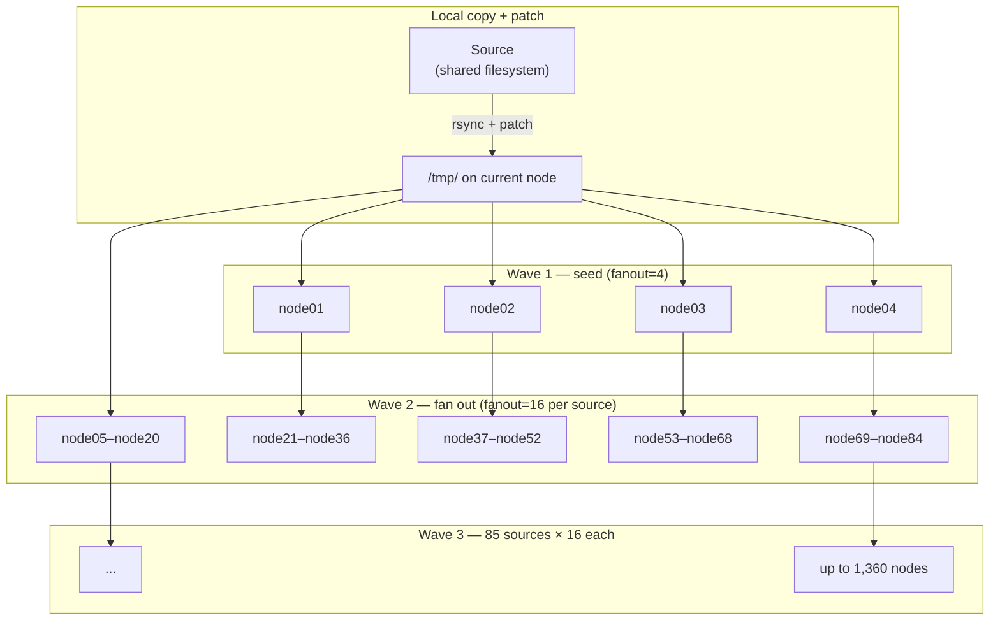

# Distributing Python Environments

On large HPC clusters, Python environments on shared filesystems
create I/O contention and slow startup times. `ezpz yeet-env` solves
this by rsyncing your environment to node-local `/tmp/` storage on
every worker node in your job.

## Quick Start

```bash
# Inside an interactive job allocation:
ezpz yeet-env
```

That's it. By default, `yeet-env`:

1. Detects the active Python environment (`sys.prefix`)
2. Discovers all nodes from the job's hostfile (PBS/SLURM)
3. Distributes the environment to `/tmp/<env-name>/` on every node
4. Patches the activate scripts so they work from the new location

```
  Source: /path/to/project/.venv (3.2 GB)
  Target: /tmp/.venv/ on 4 node(s)
    local:  node01 (rsync to /tmp/.venv/)
    remote: node02, node03, node04
  Syncing (4 nodes, fanout=16)...
    ✓ node01 (local) — 12.3s
    ✓ node02 — 11.8s
    ✓ node03 — 12.1s
    ✓ node04 — 11.9s
  Done in 24.2s

  To use this environment:
    deactivate 2>/dev/null
    source /tmp/.venv/bin/activate

  Then launch your training (from a shared filesystem path):
    cd /path/to/your/project
    ezpz launch python3 -m your_app.train

  Note: /tmp is node-local. Make sure your working directory
  is on a shared filesystem (e.g. Lustre) before launching,
  so all ranks can access data and outputs.
```

After the transfer, activate the local copy and launch:

```bash
deactivate 2>/dev/null           # leave the current env
source /tmp/.venv/bin/activate   # activate the local copy
cd /path/to/your/project         # shared filesystem for data/outputs
ezpz launch python3 -m your_app.train
```

## CLI Options

```
ezpz yeet-env [--src PATH] [--dst PATH] [--hostfile PATH] [--dry-run]
```

| Flag | Default | Description |
|------|---------|-------------|
| `--src` | Active venv/conda env | Source environment path |
| `--dst` | `/tmp/<env-name>/` | Destination on each node |
| `--hostfile` | Auto-detect from scheduler | Hostfile for node list |
| `--dry-run` | — | Preview without transferring |

## How It Works

### Overview


### Step 1: Local copy + patch

First, `yeet-env` rsyncs the source environment to `/tmp/<env>/` on
the current node and patches the venv paths **once**:

- `sed` replaces hardcoded `VIRTUAL_ENV` paths in activate scripts
- Re-links `python3` symlinks to the system Python
- Updates `pyvenv.cfg`

This patched copy in `/tmp/` becomes the source for all subsequent
rsyncs — no per-node patching needed.

### Step 2: Tree-based fan-out

Instead of syncing from one source to all N nodes (which saturates
the source node's network), `yeet-env` distributes the
already-patched `/tmp/` copy in waves. Nodes that finish become
sources for the next wave.

The first wave uses a smaller seed fanout (4) since there's only
one source node. Once those 4 seeds complete, there are now 5
sources (original + 4 seeds), and subsequent waves fan out at 16
per source:



| Nodes | Waves | Sources after each wave |
|-------|-------|------------------------|
| 1–4 | 1 | 1 → 5 |
| 5–84 | 2 | 5 → 85 |
| 85–1,444 | 3 | 85 → 1,445 |
| 1,445–24,165 | 4 | 1,445 → 24,165 |

All waves rsync from `/tmp/` (node-local storage), not the shared
filesystem. Path patching happens only once on the local copy —
all distributed copies arrive already patched.

### Node discovery

`yeet-env` uses the same node discovery as `ezpz launch`:

1. Checks `PBS_NODEFILE` or `SLURM_NODELIST` env vars
2. Falls back to scheduler-specific queries (qstat, scontrol)
3. Deduplicates hostnames (PBS nodefiles repeat per-GPU)

### Path patching

Venv activate scripts and Python symlinks contain hardcoded absolute
paths. `yeet-env` patches these **once** on the local `/tmp/` copy
(step 1) before any distribution:

- `sed` replaces the old `VIRTUAL_ENV` path in activate scripts
- Re-links `python3` symlinks to the system Python
- Updates `pyvenv.cfg` to point to the correct base Python

Since patching happens before fan-out, all distributed copies
arrive already patched — no per-node SSH needed.

### Incremental syncs

Because `yeet-env` uses `rsync -a`, subsequent runs are fast — only
changed files are transferred. This makes it practical to re-run
after installing new packages.

## Examples

### Default: sync the active env

```bash
# Inside an interactive job on Polaris:
ezpz yeet-env
```

### Sync a specific environment

```bash
ezpz yeet-env --src /path/to/my-conda-env
```

### Custom destination

```bash
ezpz yeet-env --dst /local/scratch/myenv
```

### Preview without syncing

```bash
ezpz yeet-env --dry-run
```

### Complete workflow

```bash
# 1. Get an interactive allocation
qsub -A <project> -q debug -l select=2 -l walltime=01:00:00 -I

# 2. Distribute the environment
ezpz yeet-env

# 3. Activate the local copy
deactivate 2>/dev/null
source /tmp/<env-name>/bin/activate

# 4. Launch from a shared filesystem path
cd /path/to/your/project
ezpz launch python3 -m your_app.train
```

## See Also

- [`ezpz launch`](./launch/index.md) — launch distributed training
- [`ezpz.utils.yeet_env`](../python/Code-Reference/utils/yeet_env.md) — Python API reference
- [Shell Environment](../notes/shell-environment.md) — legacy shell setup utilities
