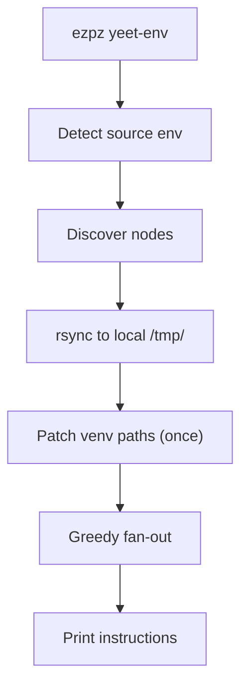
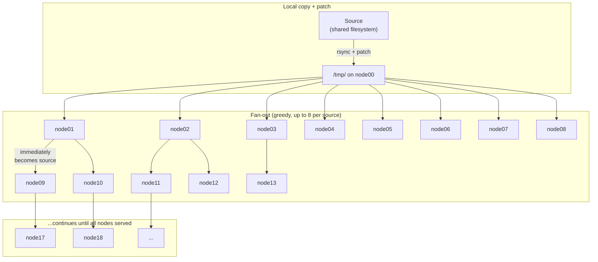

# Distributing Python Environments

On large HPC clusters, Python environments on shared filesystems
create I/O contention and slow startup times. `ezpz yeet-env` solves
this by rsyncing your environment to node-local `/tmp/` storage on
every worker node in your job.

## Quick Start

```bash
# Inside an interactive job allocation:
ezpz yeet-env
```

That's it. By default, `yeet-env`:

1. Detects the active Python environment (`sys.prefix`)
2. Discovers all nodes from the job's hostfile (PBS/SLURM)
3. Distributes the environment to `/tmp/<env-name>/` on every node
4. Patches the activate scripts so they work from the new location

```
  Source: /path/to/project/.venv (3.2 GB)
  Target: /tmp/.venv/ on 4 node(s)
    local:  node01 (rsync to /tmp/.venv/)
    remote: node02, node03, node04
  Syncing (4 nodes)...
    ✓ node01 (local) — 12.3s
    ✓ node02 — 11.8s
    ✓ node03 — 12.1s
    ✓ node04 — 11.9s
  Done in 24.2s

  To use this environment:
    deactivate 2>/dev/null
    source /tmp/.venv/bin/activate

  Then launch your training (from a shared filesystem path):
    cd /path/to/your/project
    ezpz launch python3 -m your_app.train

  Note: /tmp is node-local. Make sure your working directory
  is on a shared filesystem (e.g. Lustre) before launching,
  so all ranks can access data and outputs.
```

After the transfer, activate the local copy and launch:

```bash
deactivate 2>/dev/null           # leave the current env
source /tmp/.venv/bin/activate   # activate the local copy
cd /path/to/your/project         # shared filesystem for data/outputs
ezpz launch python3 -m your_app.train
```

## CLI Options

```
ezpz yeet-env [--src PATH] [--dst PATH] [--hostfile PATH] [--dry-run]
```

| Flag | Default | Description |
|------|---------|-------------|
| `--src` | Active venv/conda env | Source environment path |
| `--dst` | `/tmp/<env-name>/` | Destination on each node |
| `--hostfile` | Auto-detect from scheduler | Hostfile for node list |
| `--dry-run` | — | Preview without transferring |

## How It Works

### Overview



### Step 1: Local copy + patch

First, `yeet-env` rsyncs the source environment to `/tmp/<env>/` on
the current node and patches the venv paths **once**:

- Replaces hardcoded `VIRTUAL_ENV` paths in activate scripts
- Re-links `python3` symlinks to the system Python
- Updates `pyvenv.cfg`

This patched copy in `/tmp/` becomes the source for all subsequent
rsyncs — no per-node patching needed.

### Step 2: Greedy fan-out

Instead of syncing from one source to all N nodes (which saturates
the source node's NIC), `yeet-env` uses a **greedy streaming
fan-out**: each node that finishes immediately becomes a source for
others, without waiting for any "wave" to complete.

A single thread pool manages all rsyncs. Each source node is capped
at `MAX_PER_SOURCE=8` concurrent outbound rsyncs to avoid
overwhelming any single NIC. As soon as any rsync completes:

1. That node is registered as a new source
2. New rsyncs are submitted using whichever source has the
   fewest active transfers (load balancing)

The tree grows organically — no synchronized rounds:



The key difference from a wave-based approach: if node01 finishes
in 15 seconds but node08 takes 30 seconds, node01 immediately
starts serving new targets — it doesn't wait for node08.

??? info "Scaling behavior"

    The greedy fan-out gives approximately O(log N) wall-clock time:

    - After the local copy, the first 8 rsyncs start from node00
    - As each completes (~15–20s), it starts serving others
    - With 8 initial targets completing, there are 9 sources
    - Those 9 sources can each serve 8 more = 72 concurrent rsyncs
    - After ~2 "generations", 500+ nodes are reachable

    For a 512-node job with a 5 GB venv:

    | Phase | Approx time | Sources |
    |-------|-------------|---------|
    | Local copy (Lustre → `/tmp/`) | ~60s | 1 |
    | First 8 targets complete | ~20s | 9 |
    | Next ~72 targets complete | ~20s | 81 |
    | Remaining ~431 targets | ~20s | 500+ |
    | **Total** | **~2 min** | — |

    Single-source approach for comparison: 512 × 5 GB from one NIC
    at 200 Gbps = **~100s** theoretical minimum, worse in practice
    due to TCP congestion with 512 concurrent connections.

??? info "ASCII diagram: greedy fan-out"

    ```
                       ezpz yeet-env

    Step 0: Local copy + patch
    ══════════════════════════

    Lustre ──rsync──▶ /tmp/.venv (node00)
                          │
                      [patch paths]
                          │
    Step 1: Fan-out (greedy, max 8 per source)
    ═══════════════════════════════════════════
                          │
          ┌───┬───┬───┬───┼───┬───┬───┬───┐
          ▼   ▼   ▼   ▼   ▼   ▼   ▼   ▼   │
         n01 n02 n03 n04 n05 n06 n07 n08   │
          │   │                             │
          │   └─── (n02 finishes, starts serving) ──▶ n09, n10, ...
          │
          └─── (n01 finishes, starts serving) ──▶ n11, n12, ...

    No waiting for "waves" — each node starts serving
    the moment its rsync completes.

    Key:
      • Each source limited to 8 concurrent outbound rsyncs
      • New sources pick up work immediately (no wave barriers)
      • Load-balanced: new targets assigned to least-busy source
      • All rsyncs from /tmp/ (fast node-local storage)
      • Path patching happens ONCE (step 0), not per-node
    ```

??? info "Detail: how source selection works"

    The thread pool picks the source with the fewest active
    outbound rsyncs. This naturally load-balances across the tree:

    ```
    Sources:          Active rsyncs:
    node00            ████████ (8/8 — at cap, skip)
    node01            ████·· (4/8 — available)      ← picked
    node02            ██████ (6/8 — available)
    node03            ████████ (8/8 — at cap, skip)
    ```

    When node01 is selected, one of its remaining slots is used.
    If all sources are at capacity, the pool waits for any rsync
    to complete before submitting more work.

### Node discovery

`yeet-env` uses the same node discovery as `ezpz launch`:

1. Checks `PBS_NODEFILE` or `SLURM_NODELIST` env vars
2. Falls back to scheduler-specific queries (qstat, scontrol)
3. Deduplicates hostnames (PBS nodefiles repeat per-GPU)

### Path patching

Venv activate scripts and Python symlinks contain hardcoded absolute
paths. `yeet-env` patches these **once** on the local `/tmp/` copy
(step 1) before any distribution:

- Replaces the old `VIRTUAL_ENV` path in activate scripts
- Re-links `python3` symlinks to the system Python
- Updates `pyvenv.cfg` to point to the correct base Python

Since patching happens before fan-out, all distributed copies
arrive already patched — no per-node SSH needed.

### Incremental syncs

Because `yeet-env` uses `rsync -a`, subsequent runs are fast — only
changed files are transferred. This makes it practical to re-run
after installing new packages.

## Examples

### Default: sync the active env

```bash
# Inside an interactive job on Polaris:
ezpz yeet-env
```

### Sync a specific environment

```bash
ezpz yeet-env --src /path/to/my-conda-env
```

### Custom destination

```bash
ezpz yeet-env --dst /local/scratch/myenv
```

### Preview without syncing

```bash
ezpz yeet-env --dry-run
```

### Real-world example: 72 nodes on Sunspot

??? example "9.1 GB venv → 73 nodes in ~3 minutes"

    ```bash
    $ ezpz yeet-env
      Source: /lus/tegu/.../torchtitan/.venv (9.1G)
      Target: /tmp/.venv/ on 73 node(s)
        local:  x1921c1s2b0n0 (rsync to /tmp/.venv/)
        remote: x1921c1s2b0n0-hsn0, x1921c2s7b0n0-hsn0, ... (72 nodes)
      Syncing (73 nodes)...
        ✓ x1921c1s2b0n0 (local) — 99.0s
        ✓ x1921c1s2b0n0-hsn0 — 0.8s
        ✓ x1921c4s1b0n0-hsn0 — 22.5s
        ✓ x1921c4s5b0n0-hsn0 — 23.0s
        ✓ x1921c3s7b0n0-hsn0 — 23.0s
        ✓ x1921c3s6b0n0-hsn0 — 23.2s
        ✓ x1921c4s2b0n0-hsn0 — 23.7s
        ✓ x1921c4s0b0n0-hsn0 — 24.0s
        ✓ x1921c3s0b0n0-hsn0 — 24.9s
        ...
        ✓ x1922c2s7b0n0-hsn0 — 47.7s
      Done in 171.2s
    ```

    **Timing breakdown:**

    | Phase | Time | Notes |
    |-------|------|-------|
    | Local copy (Lustre → `/tmp/`) | 99s | One-time, includes path patching |
    | Fan-out to 72 remote nodes | ~72s | Greedy, nodes become sources as they finish |
    | **Total** | **~171s** | 9.1 GB to 73 nodes |

    The first 8 nodes complete in ~23s, then immediately start
    serving as sources for the remaining 64 nodes. No node waits
    for others to finish — the tree grows as fast as individual
    rsyncs complete.

### Complete workflow

```bash
# 1. Get an interactive allocation
qsub -A <project> -q debug -l select=2 -l walltime=01:00:00 -I

# 2. Distribute the environment
ezpz yeet-env

# 3. Activate the local copy
deactivate 2>/dev/null
source /tmp/<env-name>/bin/activate

# 4. Launch from a shared filesystem path
cd /path/to/your/project
ezpz launch python3 -m your_app.train
```

## See Also

- [`ezpz launch`](./launch/index.md) — launch distributed training
- [`ezpz.utils.yeet_env`](../python/Code-Reference/utils/yeet_env.md) — Python API reference
- [Shell Environment](../notes/shell-environment.md) — legacy shell setup utilities
