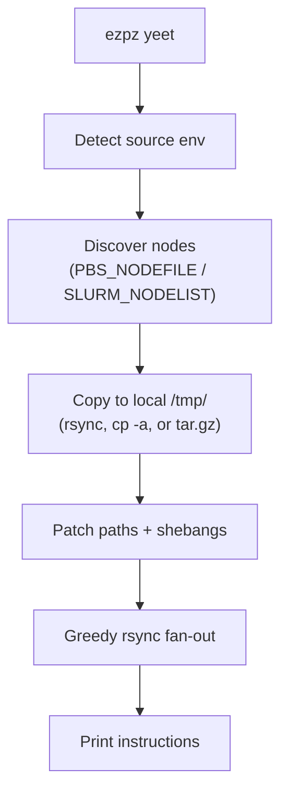
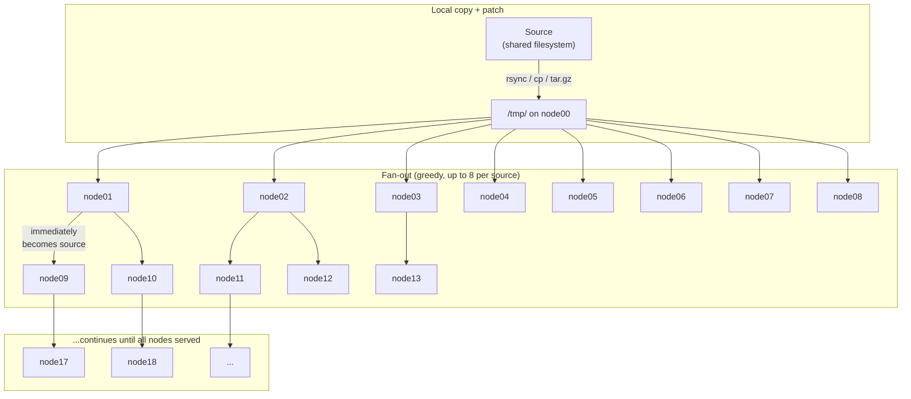
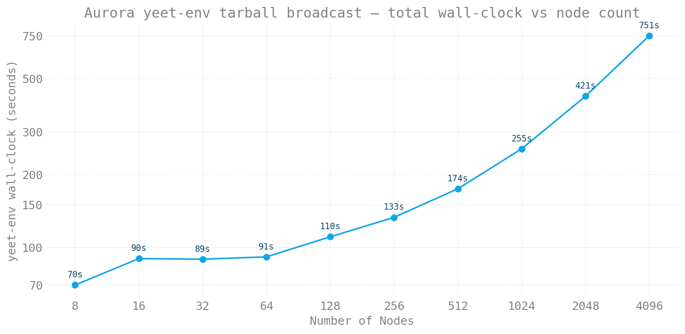
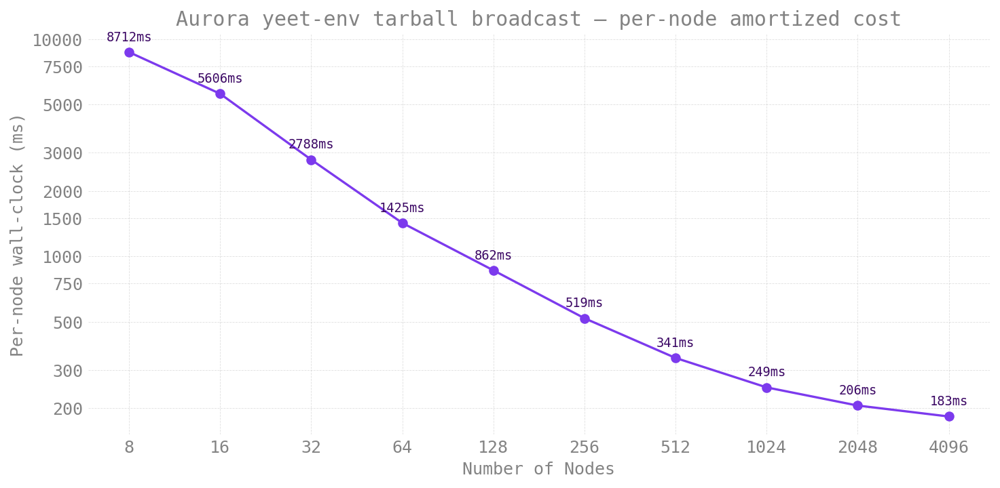

# Distributing Files to Worker Nodes

On large HPC clusters, files on shared filesystems create I/O
contention and slow startup times. `ezpz yeet` copies any directory
or tarball to node-local `/tmp/` storage on every worker node in your
job — Python environments, model checkpoints, datasets, configs,
anything that benefits from being node-local before a large run.

!!! note "Renamed from `ezpz yeet-env`"

    `ezpz yeet-env` still works as a deprecated alias and dispatches
    to the same logic. Update your scripts to `ezpz yeet` when
    convenient.

## Quick Start

```bash
# Inside an interactive job allocation:
ezpz yeet                            # no args → syncs the active venv
ezpz yeet .venv.tar.gz               # positional shorthand for --src
ezpz yeet --src /path/to/dataset     # any directory or tarball
```

By default (no args), `yeet`:

1. Detects the active Python environment (`sys.prefix`)
2. Discovers all nodes from the job's hostfile (PBS/SLURM)
3. Copies the environment to `/tmp/<env-name>/` on the current node
4. Patches activate scripts, shebangs, and symlinks for the new location
5. Distributes the patched copy to all remote nodes via greedy rsync fan-out

For non-venv sources (datasets, models, generic directories), step 4
is skipped and the footer prints a generic "Synced to {dst} on N
node(s)" message instead of the venv activation guidance.

```
  Source: /path/to/project/.venv (3.2 GB)
  Target: /tmp/.venv/ on 4 node(s)
    local:  node01 (rsync to /tmp/.venv/)
    remote: node02, node03, node04
  Syncing (4 nodes)...

    ✓ node01 (local, rsync) — 12.3s
    ✓ node02 — 11.8s
    ✓ node03 — 12.1s
    ✓ node04 — 11.9s
  Done in 24.2s

  To use this environment:
    deactivate 2>/dev/null
    source /tmp/.venv/bin/activate

  Then launch your training (from a shared filesystem path):
    cd /path/to/your/project
    ezpz launch python3 -m your_app.train

  Note: /tmp is node-local. Make sure your working directory
  is on a shared filesystem (e.g. Lustre) before launching,
  so all ranks can access data and outputs.
```

After the transfer, activate the local copy and launch:

```bash
deactivate 2>/dev/null           # leave the current env
source /tmp/.venv/bin/activate   # activate the local copy
cd /path/to/your/project         # shared filesystem for data/outputs
ezpz launch python3 -m your_app.train
```

## CLI Options

```
ezpz yeet [SRC] [--src PATH] [--dst PATH] [--hostfile PATH]
              [--copy | --compress] [--dry-run]
```

| Arg / Flag | Default | Description |
|------|---------|-------------|
| `SRC` (positional) | — | Source path. Shorthand for `--src`. Mutually exclusive with `--src` |
| `--src` | Active venv/conda env | Source path. May also be a `.tar.gz`/`.tgz` file — see [tarball source](#tarball-source) |
| `--dst` | `/tmp/<basename>/` | Destination on each node (e.g. `/tmp/.venv/` for a venv named `.venv`) |
| `--hostfile` | Auto-detect from scheduler | Hostfile for node list |
| `--copy` | — | Use `cp -a` for the local copy (faster on Lustre) |
| `--compress` | — | tar.gz → copy → extract (least Lustre metadata I/O) |
| `--dry-run` | — | Preview without transferring |

!!! tip "Choosing a local copy method"

    The default `rsync` is best for **incremental updates** (after
    `pip install`, etc.) but slow for initial copies on Lustre because
    it stats every file individually. For the first transfer, use one
    of the faster methods:

    | Method | Best for | How it works |
    |--------|----------|--------------|
    | `--copy` | Fast initial copy | `cp -a` — sequential dir walk, no checksums |
    | `--compress` | Slowest Lustre / largest envs | tar.gz → copy 1 file → extract locally |
    | *(default)* | Incremental updates | `rsync -rlD` — only transfers changed files |

    ```bash
    # First time: compress for minimal Lustre I/O
    ezpz yeet --compress

    # Or: cp for simpler fast copy
    ezpz yeet --copy

    # After pip install: rsync only sends diffs
    ezpz yeet
    ```

    All three methods only affect the **local** Lustre → `/tmp/` copy.
    Remote node distribution always uses rsync.

### Tarball source

If you already have a `.tar.gz` of your environment (e.g. one you
built earlier with [`ezpz tar-env`](./tar-env.md), or one shipped
with a project), you can pass it directly:

```bash
ezpz yeet --src /lus/.../my-env.tar.gz
```

This is similar to `--compress` but **skips the create step** —
the tarball is copied to `/tmp/` and extracted there:

1. `cp /lus/.../my-env.tar.gz /tmp/my-env.tar.gz`
2. `tar -xzf /tmp/my-env.tar.gz --strip-components=1 -C /tmp/my-env/`
3. Patch shebangs/activate scripts (auto-detects original venv path
   from `bin/activate`)
4. Delete the tarball
5. Fan-out `/tmp/my-env/` to all worker nodes via rsync

Both `.tar.gz` and `.tgz` extensions are recognized. The destination
defaults to `/tmp/<basename-without-suffix>/`.

### Generic (non-venv) sources

`yeet` works on any directory, not just Python environments. Pass a
positional path or use `--src` to yeet datasets, model checkpoints,
configs — anything that benefits from being node-local:

```bash
# Distribute a pre-downloaded HF model checkpoint to /tmp/ on every node
ezpz yeet ~/models/Llama-3.1-8B

# Or a dataset shard
ezpz yeet --src /lus/datasets/imagenet-shard-0
```

When the source isn't a venv (no `bin/activate`) and isn't a conda env
(no `conda-meta/`), the venv path-patching step is skipped and the
trailing guidance is replaced with a generic "Synced to {dst}/ on N
node(s)" footer.

## How It Works

### Overview



### Step 1: Local copy + patch

First, `yeet` copies the source environment to `/tmp/<env>/` on
the current node using rsync (default), `cp -a` (`--copy`), or
tar.gz (`--compress`). If the local copy fails, distribution is
aborted immediately — no broken environment gets distributed.

After copying, the venv is patched **once** in place:

- Replaces hardcoded `VIRTUAL_ENV` paths in activate scripts
  (`bin/activate`, `bin/activate.csh`, `bin/activate.fish`)
- Re-links `python3` symlinks to the system Python
- Updates `pyvenv.cfg`
- **Rewrites shebangs** in all entry-point scripts (`ezpz`, `pip`,
  `torchrun`, etc.) — pip bakes absolute paths into these at install
  time, so they'd still point to the original Lustre location without
  this step

This patched copy in `/tmp/` becomes the source for all subsequent
rsyncs — no per-node patching or SSH needed.

### Step 2: Greedy fan-out

Instead of syncing from one source to all N nodes (which saturates
the source node's NIC), `yeet` uses a **greedy streaming
fan-out**: each node that finishes immediately becomes a source for
others, without waiting for any "wave" to complete.

A single thread pool manages all rsyncs. Each source node is capped
at `MAX_PER_SOURCE=8` concurrent outbound rsyncs to avoid
overwhelming any single NIC. As soon as any rsync completes:

1. That node is registered as a new source
2. New rsyncs are submitted using whichever source has the
   fewest active transfers (load balancing)

The tree grows organically — no synchronized rounds:



The key difference from a wave-based approach: if node01 finishes
in 15 seconds but node08 takes 30 seconds, node01 immediately
starts serving new targets — it doesn't wait for node08.

??? info "Scaling behavior"

    The greedy fan-out gives approximately O(log N) wall-clock time:

    - After the local copy, the first 8 rsyncs start from node00
    - As each completes (~15–20s), it starts serving others
    - With 8 initial targets completing, there are 9 sources
    - Those 9 sources can each serve 8 more = 72 concurrent rsyncs
    - After ~2 "generations", 500+ nodes are reachable

    For a 512-node job with a 5 GB venv:

    | Phase | Approx time | Sources |
    |-------|-------------|---------|
    | Local copy (Lustre → `/tmp/`) | ~60s | 1 |
    | First 8 targets complete | ~20s | 9 |
    | Next ~72 targets complete | ~20s | 81 |
    | Remaining ~431 targets | ~20s | 500+ |
    | **Total** | **~2 min** | — |

    Single-source approach for comparison: 512 × 5 GB from one NIC
    at 200 Gbps = **~100s** theoretical minimum, worse in practice
    due to TCP congestion with 512 concurrent connections.

??? info "ASCII diagram: greedy fan-out"

    ```
                       ezpz yeet

    Step 0: Local copy + patch
    ══════════════════════════

    Lustre ──rsync/cp/tar──▶ /tmp/.venv (node00)
                                │
                            [patch paths + shebangs]
                                │
    Step 1: Fan-out (greedy, max 8 per source)
    ═══════════════════════════════════════════
                                │
          ┌───┬───┬───┬───┬───┬┴──┬───┬───┐
          ▼   ▼   ▼   ▼   ▼   ▼   ▼   ▼
         n01 n02 n03 n04 n05 n06 n07 n08
          │   │
          │   └─── (n02 finishes, starts serving) ──▶ n09, n10, ...
          │
          └─── (n01 finishes, starts serving) ──▶ n11, n12, ...

    No waiting for "waves" — each node starts serving
    the moment its rsync completes.

    Key:
      • Each source limited to 8 concurrent outbound rsyncs
      • New sources pick up work immediately (no wave barriers)
      • Load-balanced: new targets assigned to least-busy source
      • All rsyncs from /tmp/ (fast node-local storage)
      • Path patching happens ONCE (step 0), not per-node
    ```

??? info "Detail: how source selection works"

    The thread pool picks the source with the fewest active
    outbound rsyncs. This naturally load-balances across the tree:

    ```
    Sources:          Active rsyncs:
    node00            ████████ (8/8 — at cap, skip)
    node01            ████·· (4/8 — available)      ← picked
    node02            ██████ (6/8 — available)
    node03            ████████ (8/8 — at cap, skip)
    ```

    When node01 is selected, one of its remaining slots is used.
    If all sources are at capacity, the pool waits for any rsync
    to complete before submitting more work.

### Node discovery

`yeet` discovers nodes directly from scheduler environment
variables, without importing heavy Python packages (torch, numpy,
etc.) — so the CLI starts in seconds even on slow filesystems.

The discovery order is:

1. **`--hostfile` flag** if explicitly passed
2. **`PBS_NODEFILE`** / **`HOSTFILE`** environment variables
3. **PBS aux lookup via `PBS_JOBID`** — checks `/var/spool/pbs/aux/<jobid>`
4. **PBS `qstat` fallback** — when env vars aren't set (e.g. after
   `ssh`-ing to a compute node), runs `qstat -fn1wru $USER` to find
   the running job whose nodelist contains this hostname, then looks
   up its aux file by jobid
5. **SLURM** — expands `SLURM_NODELIST` via `scontrol show hostnames`
6. **Localhost fallback** — single-node mode with a warning

After loading the hostfile, hostnames are deduplicated (PBS nodefiles
repeat once per-GPU) and FQDN suffixes are stripped.

### HSN (high-speed network) auto-detection

On Aurora, the PBS hostfile contains bare hostnames (`x4717c0s2b0n0`),
but the Slingshot HSN interface is reachable via the `-hsn0` suffix
at much higher bandwidth than the management network. `yeet`
probes whether `<hostname>-hsn0` resolves and prefers it for all
remote rsyncs if so. On Sunspot the hostfile already contains `-hsn0`
suffixes, so this is a no-op.

### Path patching

Venv activate scripts, Python symlinks, and **entry-point script
shebangs** contain hardcoded absolute paths. `yeet` patches
these **once** on the local `/tmp/` copy before any distribution:

- Replaces the old `VIRTUAL_ENV` path in activate scripts
- Re-links `python3` symlinks to the system Python
- Updates `pyvenv.cfg` to point to the correct base Python
- Rewrites shebangs in all `bin/` scripts (e.g. `#!/old/path/.venv/bin/python3`
  → `#!/tmp/.venv/bin/python3`)

Since patching happens before fan-out, all distributed copies
arrive already patched — no per-node SSH needed.

### Incremental syncs

The default rsync mode uses `-rlD` (recursive, symlinks, devices —
skipping expensive timestamp/permission sync). Subsequent runs only
transfer changed files, making it practical to re-run after
installing new packages.

### Error handling

- **Failed local copy**: distribution is aborted immediately — no
  broken environment gets sent to remote nodes
- **rsync exit 24** (vanished files): treated as success. This
  happens when concurrent rsyncs read from the same `/tmp/` source
  while temporary files (e.g. triton plugin builds) come and go.
- **TTY-aware progress**: spinner and `\r` carriage returns are
  suppressed when stdout is not a terminal (e.g. redirected to a
  file), preventing garbled output in logs.

## Examples

### Default: sync the active env

```bash
# Inside an interactive job on Polaris:
ezpz yeet
```

### Sync a specific environment

```bash
ezpz yeet --src /path/to/my-conda-env
```

### Custom destination

```bash
ezpz yeet --dst /local/scratch/myenv
```

### Preview without syncing

```bash
ezpz yeet --dry-run
```

### Real-world example: 64 nodes on Sunspot

??? example "8.3 GB venv → 65 nodes in ~2 minutes"

    ```bash
    $ ezpz yeet
      Source: /lus/tegu/.../torchtitan-213/.venv (8.3G)
      Target: /tmp/.venv/ on 65 node(s)
        local:  x1921c0s2b0n0 (rsync to /tmp/.venv/)
        remote: x1921c0s2b0n0-hsn0, x1921c0s3b0n0-hsn0, x1921c0s4b0n0-hsn0, ... (64 nodes)
      Syncing (65 nodes)...

        ✓ x1921c0s2b0n0 (local, rsync) — 49.6s
        ✓ x1921c0s2b0n0-hsn0 — 0.8s
        ✓ x1921c0s6b0n0-hsn0 — 19.6s
        ✓ x1921c1s5b0n0-hsn0 — 20.1s
        ✓ x1921c1s7b0n0-hsn0 — 20.2s
        ...
        ✓ x1921c7s6b0n0-hsn0 — 21.2s
      Done in 91.2s
    ```

    **Timing breakdown:**

    | Phase | Time | Notes |
    |-------|------|-------|
    | Local copy (Lustre → `/tmp/`) | 50s | One-time, includes path patching |
    | Fan-out to 64 remote nodes | ~42s | Greedy, nodes become sources as they finish |
    | **Total** | **~91s** | 8.3 GB to 65 nodes |

    The first 8 nodes complete in ~20s, then immediately start
    serving as sources for the remaining nodes. No node waits
    for others to finish — the tree grows as fast as individual
    rsyncs complete.

### Scaling: Aurora, 8 → 4096 nodes

Full 10-point sweep using the tarball broadcast mode
(`ezpz yeet --src .venv.tar.gz`) on Aurora, measured 2026-04-30 to
2026-05-01. The benchmark harness lives in
[`saforem2/torchtitan@ezpz`](https://github.com/saforem2/torchtitan/tree/ezpz/torchtitan/experiments/ezpz/docs/scaling/yeet_env)
along with the raw CSV and the plotting script.

| Nodes | yeet wall-clock (s) | Per-node (ms) |
|------:|--------------------:|--------------:|
| 8 | 69.7 | 8,712 |
| 16 | 89.7 | 5,606 |
| 32 | 89.2 | 2,788 |
| 64 | 91.2 | 1,425 |
| 128 | 110.4 | 862 |
| 256 | 132.9 | 519 |
| 512 | 174.5 | 341 |
| 1024 | 255.4 | 249 |
| 2048 | 421.4 | 206 |
| 4096 | 750.6 | 183 |





**Two regimes show up in the data:**

- **8–64 nodes is extract-bound.** Total wall-clock is roughly flat
  at 70–91 s; per-node cost falls 8.7 s → 1.4 s as more nodes share
  the fixed-cost local extraction.
- **≥128 nodes is broadcast-bound.** Total wall-clock grows
  super-linearly. Each 2× in nodes adds ~1.5–1.8× wall-clock
  (256→512: 1.31×, 512→1024: 1.46×, 1024→2048: 1.65×, 2048→4096:
  1.78×) — the broadcast tree depth and per-leaf bandwidth
  contention both grow with scale.

**Per-node amortized cost** drops monotonically from 8.7 s/node at
N=8 to 0.18 s/node at N=4096 — a **48× efficiency gain** over the
sweep. Even at the full-Aurora 4096-node scale, the pre-launch
overhead is under 13 minutes.

!!! info "Why tarball broadcast scales so much better than per-file rsync"

    The pre-tarball `yeet` mode (per-file rsync) was projected to
    take 1–2 hours at 256+ nodes — the per-file metadata cost
    dominates over Lustre. Switching to a single compressed tarball
    (`--compress` or pre-built `--src foo.tar.gz`) reduces the
    Lustre side to one sequential read regardless of node count, so
    the broadcast itself is the only thing that scales with N.

### Complete workflow

```bash
# 1. Get an interactive allocation
qsub -A <project> -q debug -l select=2 -l walltime=01:00:00 -I

# 2. Distribute the environment
ezpz yeet

# 3. Activate the local copy
deactivate 2>/dev/null
source /tmp/<env-name>/bin/activate

# 4. Launch from a shared filesystem path
cd /path/to/your/project
ezpz launch python3 -m your_app.train
```

## See Also

- [`ezpz launch`](./launch/index.md) — launch distributed training
  (respects `$VIRTUAL_ENV` so it Just Works after yeet + activate)
- [`ezpz.utils.yeet_env`](../python/Code-Reference/utils/yeet_env.md) — Python API reference
- [Shell Environment](../notes/shell-environment.md) — `ezpz_setup_*`
  helper functions (including `ezpz_setup_xpu` for Intel GPUs)
