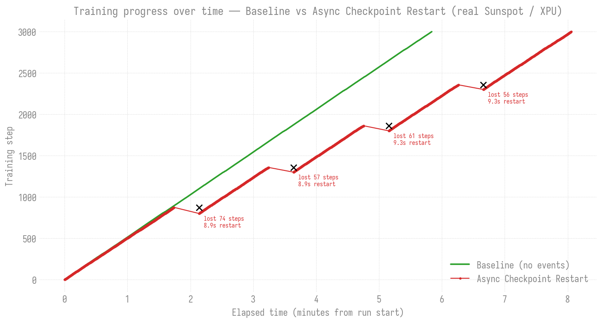
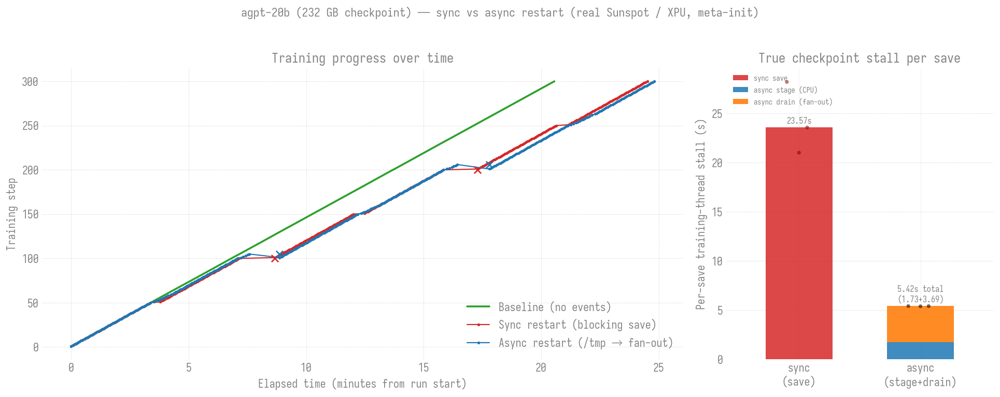

# Checkpoint & Restart Under Failure

How `ezpz.examples.fsdp_tp` behaves when training is interrupted: how it
saves distributed checkpoints, resumes automatically, and how much a
restart-from-checkpoint actually costs — with **real measurements from
Sunspot** (Intel PVC / XPU), not modeled estimates.

!!! info "Key API"
    - [`ezpz.examples._checkpoint`](../python/Code-Reference/examples/fsdp_tp.md) — DCP save/load helpers
    - `fsdp_tp` flags: `--ckpt-dir`, `--save-interval`, `--train-iters`, `--no-resume`, `--async-ckpt`, `--ckpt-stage-dir`, `--meta-init`
    - Metrics: `train/restart_seconds`, `train/ckpt_save_seconds`, `train/ckpt_stage_seconds`, `train/ckpt_drain_seconds`

## How it works

`fsdp_tp` uses PyTorch **Distributed Checkpoint (DCP)** — each rank writes
its own shard in parallel (no gather-to-rank-0 that would OOM at scale), so
it works identically under FSDP-only, HSDP, and 2D FSDP+TP.

- **Save** every `--save-interval` steps into `--ckpt-dir/step-<N>/`. A
  `.complete` marker is written **last**, so a checkpoint interrupted
  mid-save (e.g. by the failure you're recovering from) is skipped.
- **Resume** is automatic on startup: the newest complete checkpoint is
  loaded and training continues from its step — no flag needed (pass
  `--no-resume` to force a fresh run).

Because resume is automatic, it composes directly with
[`ezpz launch --auto-retry`](../cli/launch/index.md): a relaunch simply
resumes.

```bash
ezpz launch --auto-retry --np <N> -- \
  python3 -m ezpz.examples.fsdp_tp --model debug \
    --ckpt-dir ./ckpts --save-interval 100 --train-iters 3000
```

!!! warning "This page measures restart, not failover"

    The two are easy to conflate, and the command above makes it
    easier: `--auto-retry` composes with resume, but the numbers below
    were **not** produced with it.

    | | what fails | what recovers | measured where |
    | --- | --- | --- | --- |
    | **Checkpoint restart** (this page) | the training process | a relaunch on the **same** nodes, resuming from the last checkpoint | here — real Sunspot runs |
    | **`--auto-retry`** ([fault injection](fault-injection.md)) | a **node** — or any retryable failure it cannot attribute to one | a named bad host is retired; otherwise a spare is rotated in blindly. Either way the job relaunches **elsewhere** | locally; on-node validation still outstanding |

    Both survive a `pkill -9` and keep training, which is exactly why
    they look alike from outside. The difference is whether the *node
    set changes*. The experiment below uses a plain relaunch loop on a
    fixed node set, so nothing here exercises node-swapping.

    One asymmetry worth knowing: the plain relaunch loop always
    retries, but **`--auto-retry` needs a spare to retry at all**.
    Every retryable verdict is gated on `has_spares`
    (`launch_autoretry.py:490-502`); with none left the run ends as
    `EXHAUSTED` rather than relaunching. If `--np` claims the whole
    allocation there is no spare, so ask the scheduler for more nodes
    than you train on — that is what `--nhosts` is for.

### Asynchronous checkpointing

By default a save is **synchronous** — the training loop blocks while every
rank writes its shards to the durable `--ckpt-dir`. At large model sizes that
stall recurs every `--save-interval` steps. Pass `--async-ckpt` to overlap the
write with training:

```bash
python3 -m ezpz.examples.fsdp_tp ... \
    --ckpt-dir /shared/ckpts --async-ckpt \
    --ckpt-stage-dir /tmp/ezpz-ckpt --save-interval 100
```

`--async-ckpt` uses `dcp.async_save`: the state dict is staged to CPU memory
**synchronously** (so it's safe to keep training the instant the call
returns; tracked as `train/ckpt_stage_seconds`), then written to fast
**node-local** `--ckpt-stage-dir` (default `/tmp/ezpz-ckpt-<jobid>`) by a
background thread, and finally **fanned out** to the durable `--ckpt-dir` on
shared FS. The fan-out copy runs on a background worker (`start_fanout`), and
`try_finalize_if_ready` — called each step — stamps the durable `.complete`
marker (barrier, main thread) as soon as **all** ranks' copies finish, so the
expensive shared-FS write overlaps training rather than blocking it.

!!! warning "Watch `stage + drain`, not just the stage"
    The true per-save stall is `ckpt_stage_seconds + ckpt_drain_seconds`, not
    the cheap stage alone — the first cut of the [agpt-2b
    measurements](#at-realistic-scale-agpt-2b-a-23-gb-checkpoint) missed a 5 s
    blocking fan-out by reading `ckpt_stage_seconds` in isolation. With the
    fan-out backgrounded the drain residual is small (~0.7 s), but always
    compare `stage + drain` against the sync save. One residual tradeoff: for
    the ~1 copy-duration between a save and its marker, a crash falls back one
    extra interval; shrink `--save-interval` to bound it.

!!! warning "Node-local staging is not durable"
    `--ckpt-stage-dir` (e.g. `/tmp`) is node-local and **not resumable on its
    own** — its shards are scattered per node and it carries no completion
    marker. Only the fanned-out `--ckpt-dir` copy on shared FS survives a node
    failure, and resume always reads from there. That's why `--async-ckpt`
    *requires* `--ckpt-dir`; `/tmp` is a staging tier, not the checkpoint.

## The experiment

To measure restart cost we ran two 3000-step jobs on **2 Sunspot nodes (24
XPU ranks, `tp=2`)**, checkpointing every 100 steps:

1. **Baseline** — no failures.
2. **Checkpoint Restart** — a background loop `SIGKILL`s the training ranks
   across all nodes every ~90 s (a real `pkill -9`; PALS then tears down the
   training `mpiexec`, each attempt exiting rc=137). A relaunch loop restarts
   on the same nodes and `fsdp_tp` auto-resumes from the last checkpoint.

The kill is `pbsdsh` with no node index, so it lands on **every** node at
once, and the relaunch is a plain `while` loop in the job script — not
`--auto-retry`. That is deliberate: with every node hit there is no
healthy/bad distinction to fail over between, and with no spare nodes in
the allocation there is nowhere to fail over *to*. The scripts say so in
their header comments, and it is worth repeating here because the
recovery looks identical from the outside.


## Results

| | Baseline | Checkpoint Restart |
|---|---:|---:|
| Steps | 3000 | 3000 |
| Wall-clock | **5.81 min** | **8.04 min** |
| Failures | 0 | 4 (real SIGKILL) |
| Recovery overhead | — | **+2.23 min (≈38%)** |

Per failure (kill → PALS teardown → relaunch → DCP resume):

| # | resume @ step | lost steps | `restart_seconds` |
|---|---:|---:|---:|
| 1 | 801 | 71 | 10.40 |
| 2 | 1301 | 57 | 10.66 |
| 3 | 1801 | 57 | 10.79 |
| 4 | 2301 | 59 | 11.10 |

**What the numbers mean:**

- **Restart cost ≈ 10.4–11.1 s**, strikingly consistent. `train/restart_seconds`
  is timed from process entry (before `setup_torch`), so it captures the full
  cold path: process launch + distributed init + model build + `dcp.load` +
  first productive step.
- **Lost steps ≈ 57–71**, bounded by the 100-step checkpoint interval — you
  only ever redo work since the last checkpoint. Shrink `--save-interval` to
  reduce lost work (at the cost of more frequent save I/O).
- **≈ 33 s total per failure** (~11 s restart + ~22 s recomputing lost steps),
  which is the +2.23 min overhead across 4 failures.

### Async checkpointing under the same failures

Re-running the identical experiment with `--async-ckpt` (stage to `/tmp`, fan
out to shared FS) on the same 2 nodes / 24 XPU ranks:



| # | resume @ step | lost steps | `restart_seconds` |
|---|---:|---:|---:|
| 1 | 801 | 74 | 8.94 |
| 2 | 1301 | 57 | 8.94 |
| 3 | 1801 | 61 | 9.31 |
| 4 | 2301 | 56 | 9.30 |

- **Per-step stage stall: `train/ckpt_stage_seconds` ≈ 28 ms** (median) — the
  CPU stage barely touches the training thread. At this model's tiny checkpoint
  the *drain* (fan-out to shared FS) is also negligible, so async looks like a
  clean win here. **But that's an artifact of scale** — at 23 GB the drain
  becomes the dominant cost and flips the result (see the [agpt-2b
  section](#at-realistic-scale-agpt-2b-a-23-gb-checkpoint)). Don't generalize
  the debug-model stage number to real checkpoints.
- **Restart cost ≈ 8.9–9.3 s** — the resume path is the same as sync (init +
  `dcp.load`), so restart time is comparable (here marginally lower, within
  run-to-run noise).
- Recovery still works identically: every kill resumed from the last durable
  (fanned-out) checkpoint, never from the node-local `/tmp` staging copy.

### At realistic scale: agpt-2b, a 23 GB checkpoint

The debug-model numbers above make the *mechanism* clear, but the async win is
a rounding error there (28 ms stall). The whole point of async checkpointing is
large checkpoints, so we re-ran the experiment with **agpt-2b** (~2B params,
256K vocab) — a **23 GB sharded checkpoint** — on 2 Sunspot nodes / 24 XPU
ranks, `tp=2`: baseline + sync restart + async restart, **2000 steps, save
every 100, 3 real SIGKILLs at steps 500/1000/1500**.

Getting an *honest* async win took three iterations, and the two dead ends are
instructive.

#### Dead end 1 — async was *slower*, and the obvious metric hid it

The first cut looked like a landslide for async: the logged
`ckpt_stage_seconds` (0.30 s) was ~12× smaller than the sync
`ckpt_save_seconds` (3.5 s). But async's **wall-clock was higher**, even though
*every logged metric* favored it. The paradox was the tell — the cost was real
but **untimed**. An async save has two halves: the *stage* (copy state to host,
kick off the background write) is cheap, but the *drain* — the fan-out of the
full 23 GB from node-local `/tmp` to shared FS — was a **blocking foreground
copy** at the next step start, landing between `train/dt` windows, so no metric
captured it. Adding `train/ckpt_drain_seconds` exposed a **5.18 s** blocking
drain: `/tmp` staging *added* I/O without moving the slow write off the critical
path, making async ~1.5× slower per save than plain sync. Lesson:
`ckpt_stage_seconds` alone is not the async cost; compare `stage + drain`.

#### Dead end 2 — backgrounding the copy, but finalizing too late

The drain copy is pure per-rank file I/O with **no collectives**, so it is safe
on a background thread; only the completion barrier + `.complete` marker must
stay on the main thread. So `start_fanout()` submits the copy to a background
worker and returns immediately. But the first version stamped the marker only at
the *next save boundary* — one full interval later. That fixed the stall (copy
now hidden) but broke durability: a checkpoint's shards landed on shared FS
~1 copy-time after the save, yet weren't marked *resumable* until +100 steps.
An arbitrarily-timed crash could then fall back **~2 intervals**, and the
marker-gated failure injector (it waits for `.complete` before killing) fired
~1 interval late, so async recomputed extra steps and still trailed on
wall-clock — a real regression masquerading as the earlier artifact.

#### The fix — finalize as soon as the copy is done

`try_finalize_if_ready()` runs every step: a cheap **MPI probe** (on MPI's own
communicator, *not* the xccl training group — so it cannot cross-match the
gradient all-reduce and deadlock) checks whether **all** ranks' background
copies have finished, and stamps the durable marker the instant they have —
~1 copy-time after the save, not a full interval. Async durability now matches
sync except during the brief copy window.


| per-save training-thread stall | sync | async (backgrounded) |
|---|---:|---:|
| stage | — | `ckpt_stage_seconds` 0.31 s |
| drain residual (barrier + marker) | — | `ckpt_drain_seconds` **0.73 s** |
| blocking write | `ckpt_save_seconds` 3.75 s | — |
| **true total** | **≈3.75 s** | **≈1.05 s** |

| | Baseline | Sync restart | Async restart |
|---|---:|---:|---:|
| Steps | 2000 | 2000 | 2000 |
| Wall-clock | 16.94 min | 20.94 min | **20.75 min** |
| Lost steps / kill | — | 2–4 | 6–11 |

- **Async per-save stall is ~3.6× *less* than sync** (1.05 s vs 3.75 s); the
  23 GB copy is fully hidden and only the cross-rank barrier + marker remain.
  Validated on 24 ranks with **no cross-thread collective deadlock** — the
  barriers stay on the main thread in lockstep.
- **Async now finishes first on wall-clock** (20.75 vs 20.94 min). Over ~19
  failure-free saves per phase it sheds ~2.7 s of stall each (~50 s total),
  which more than covers the handful of extra steps it recomputes. This is the
  regime async is *for*: many saves between rare failures.
- **Lost steps are now matched** (sync 2–4, async 6–11) — both resume from the
  **identical** durable checkpoints (501/1001/1501). Async's small residual is
  the genuine ~1-copy-window durability cost, not the earlier marker-lag
  artifact.
- **Restart cost ≈ 40–44 s** (both), dominated by the 23 GB `dcp.load` + init.

!!! note "Residual durability tradeoff (bounded)"
    Async is still not *free* on durability: for the ~1 copy-duration between a
    save and its marker, the newest resumable checkpoint is the previous one, so
    a crash in that narrow window falls back one extra interval. This is
    inherent to any overlapped write and far smaller than the earlier
    full-interval lag. Recovery is never broken — the previous complete
    checkpoint is always durable — and shrinking `--save-interval` bounds the
    worst case.

### Scaling up: agpt-20b, a 232 GB checkpoint (needs `--meta-init`)

agpt-20b (~20B params) initially **OOM'd at model build**: the example moved the
full dense model onto one GPU before FSDP sharded it, capping model size at what
fits whole on a single device (~2–8B) regardless of node count. `--meta-init`
(default `auto`, on for models ≳6B) fixes this — the model is built on the
`meta` device, sharded, then only each rank's shard is materialized
(torchtitan's pattern). Peak memory drops from OOM (>64 GB/tile) to **~14 GB/
tile**, and the same checkpoint-restart experiment then runs unchanged:



| per-save training-thread stall | sync | async (backgrounded) |
|---|---:|---:|
| stage | — | `ckpt_stage_seconds` 1.73 s |
| drain residual | — | `ckpt_drain_seconds` 3.69 s |
| blocking write | `ckpt_save_seconds` **23.57 s** | — |
| **true total** | **≈23.6 s** | **≈5.4 s** |

- **The async win scales with checkpoint size.** At 232 GB a synchronous save
  freezes the training loop for **~24 s** every checkpoint; backgrounded async
  cuts that to ~5.4 s — **4.4× less**, an ~18 s/save saving (vs ~2.7 s at 2b).
  The bigger the checkpoint, the more the fan-out is worth hiding.
- **Restart cost ≈ 55–63 s** (both), dominated by the 232 GB `dcp.load`.
- Meta-init composes with everything: TP + FSDP2 sharding, DCP save/resume
  (verified restoring from a 232 GB checkpoint), and the backgrounded fan-out —
  all at 20B on 4 Sunspot nodes with no OOM. Small models (agpt-2b and below)
  stay on the exact dense-init path (`auto` keeps them bit-for-bit).

## Measuring it yourself

`fsdp_tp` logs a `RESUMED from step=N` line on resume and a
`train/restart_seconds` metric on the first post-resume step (into the
metrics JSONL and W&B). The driver script + a reusable plotter live in the
repo under `experiments/checkpoint-restart/`:

```bash
qsub experiments/checkpoint-restart/restart_experiment.pbs   # 2 nodes
python3 experiments/checkpoint-restart/plot_restart.py \
    expt_<jobid>/baseline/*/metrics-0.jsonl \
    expt_<jobid>/restart/*/*/metrics-0.jsonl \
    --out restart_plot.png --report restart_report.md
```

The agpt-2b sync-vs-async comparison above is the same driver run at scale with
a step-driven kill injector; its combined plotter takes all three phases:

```bash
python3 experiments/checkpoint-restart/plot_2b_comparison.py \
    --baseline expt_<jobid>/baseline/*/*/metrics-0.jsonl \
    --sync     expt_<jobid>/sync/*/*/metrics-0.jsonl \
    --async    expt_<jobid>/async/*/*/metrics-0.jsonl \
    --out agpt2b_restart.png --report agpt2b_restart_report.md
```

## Scope

This shows the two behaviors ezpz provides natively: a **baseline** and
**checkpoint restart** (fail → lose steps to the last checkpoint → resume).
Frameworks that recover *without* losing steps or *without* a process
restart — e.g. pause/resume or in-place elastic recovery (TorchFT-style) —
are separate systems not integrated into ezpz and are out of scope here.

Numbers above are from Sunspot: debug-model runs (job `12471687`, 2 nodes); the
agpt-2b iterations — blocking drain (`12471769`), backgrounded but finalized
late (`12471771`), and the final fair finalize-when-ready run (`12471773`, 2000
steps / save every 100, 2 nodes) the 2b plot reflects; and the agpt-20b run
(job `12471783`, 4 nodes, `--meta-init`) the 232 GB plot reflects. Absolute
`restart_seconds` grows with model size and node count (larger `dcp.load`,
longer init) — the debug→agpt-2b→agpt-20b jump (≈10 s → ≈40 s → ≈60 s) shows
exactly that; the *mechanism* is parallelism-agnostic since DCP is sharded.
