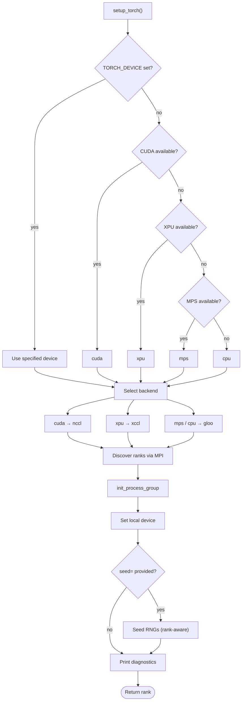
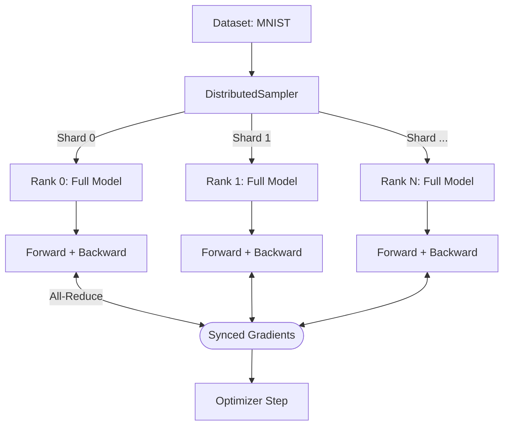
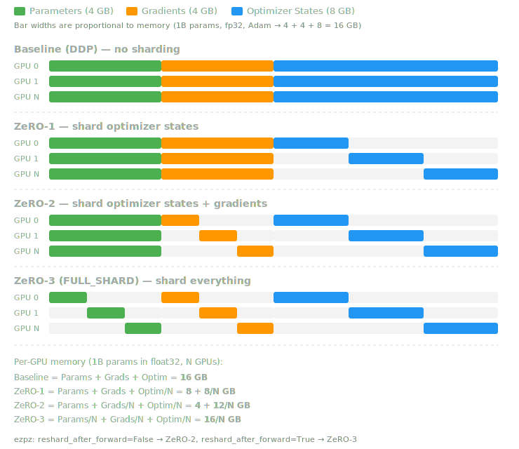
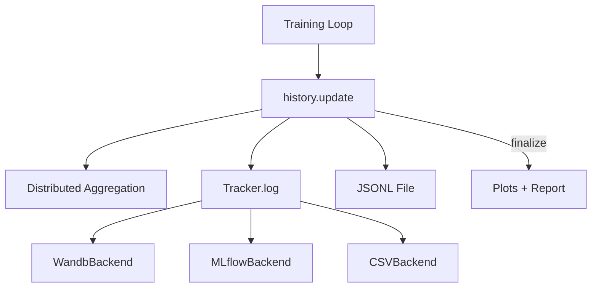
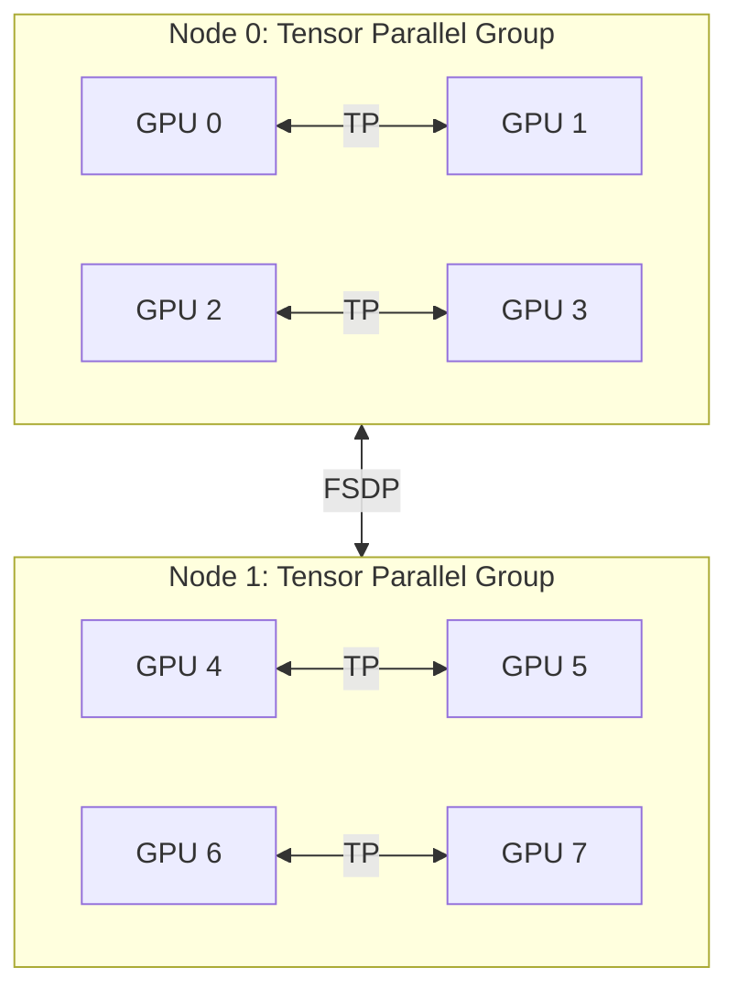

# Distributed Training with ezpz

This guide takes you from zero to production-quality distributed training on
HPC systems. You will write four progressively complex scripts, each building
on the last, and learn how to launch, track, and submit jobs across any
hardware ezpz supports.


!!! info "Prerequisites"

    - Python 3.10+ and PyTorch 2.x
    - Basic familiarity with neural network training (forward, backward, optimizer step)
    - An HPC account (optional for the first two examples — they run on a laptop)

!!! tip "How this guide relates to other docs"

    - **[Quickstart](../quickstart.md)** — installation cheat sheet and API one-liners
    - **[Recipes](../recipes.md)** — copy-paste snippets for common tasks
    - **[Examples](../examples/index.md)** — per-script reference documentation
    - **This guide** — narrative tutorial that ties everything together end-to-end

---

## How ezpz Works

ezpz handles three concerns so you don't have to:

1. **Device detection** — probes what accelerator is available (NVIDIA CUDA,
   Intel XPU, Apple MPS, or CPU) and selects the right communication backend
2. **Distributed initialization** — discovers ranks via MPI, calls
   `torch.distributed.init_process_group`, and assigns each process to its
   local device
3. **Model wrapping** — wraps your model with DDP or FSDP in a single call

### The `setup_torch()` Flow

When you call `ezpz.setup_torch()`, the following happens automatically:



### What ezpz Detects on Each System

=== "Aurora (ALCF)"

    | Property | Value |
    |----------|-------|
    | Device | `xpu` (Intel Data Center Max) |
    | Backend | `xccl` |
    | Scheduler | PBS |
    | GPUs/node | 12 (6 tiles x 2) |

=== "Polaris (ALCF)"

    | Property | Value |
    |----------|-------|
    | Device | `cuda` (NVIDIA A100) |
    | Backend | `nccl` |
    | Scheduler | PBS |
    | GPUs/node | 4 |

=== "Frontier (OLCF)"

    | Property | Value |
    |----------|-------|
    | Device | `cuda` (AMD MI250X) |
    | Backend | `nccl` |
    | Scheduler | SLURM |
    | GPUs/node | 8 (4 GCDs x 2) |

=== "Perlmutter (NERSC)"

    | Property | Value |
    |----------|-------|
    | Device | `cuda` (NVIDIA A100) |
    | Backend | `nccl` |
    | Scheduler | SLURM |
    | GPUs/node | 4 |

=== "Local (laptop / workstation)"

    | Property | Value |
    |----------|-------|
    | Device | `mps` (Apple Silicon) or `cuda` or `cpu` |
    | Backend | `gloo` (MPS/CPU) or `nccl` (CUDA) |
    | Scheduler | None |
    | GPUs/node | 1-2 (typically) |

### Scheduler Detection

ezpz figures out which job scheduler is running by checking environment
variables (like `PBS_JOBID` or `SLURM_JOB_ID`), then falls back to probing
for commands (`qsub`, `sbatch`), and finally to hostname patterns. You never
need to specify the scheduler manually — it just works.

---

## Example 1: Hello Distributed World

This first script does nothing more than initialize the distributed
environment, print a message from each rank, and shut down. If this works,
your setup is correct.

### The Script

```python title="hello_dist.py"
"""Verify that ezpz can initialize distributed training."""
import ezpz

# Initialize distributed — returns this process's global rank
rank = ezpz.setup_torch()

# Query the environment
device = ezpz.get_torch_device()
world_size = ezpz.get_world_size()
local_rank = ezpz.get_local_rank()

print(
    f"Hello from rank {rank}/{world_size} "
    f"(local_rank={local_rank}) on {device}"
)

# Synchronize all ranks before exiting
ezpz.barrier()
if rank == 0:
    print(f"\nAll {world_size} rank(s) synchronized — setup is working!")

ezpz.cleanup()
```

### Running Locally

Single process (no distributed):

```bash
python3 hello_dist.py
```

Two processes on localhost:

```bash
ezpz launch -np 2 -- python3 hello_dist.py
```

Expected output (2 processes):

```
Hello from rank 0/2 (local_rank=0) on cuda:0
Hello from rank 1/2 (local_rank=1) on cuda:1

All 2 rank(s) synchronized — setup is working!
```

### Running on a Cluster

First, get an interactive allocation:

=== "Aurora (PBS)"

    ```bash
    qsub -A <project> -q debug -l select=1 -l walltime=00:30:00 -I
    ```

=== "Polaris (PBS)"

    ```bash
    qsub -A <project> -q debug -l select=1 -l walltime=00:30:00 -I
    ```

=== "Frontier (SLURM)"

    ```bash
    salloc -A <project> -p batch -N 1 -t 00:30:00
    ```

=== "Perlmutter (SLURM)"

    ```bash
    salloc -A <project> -q interactive -N 1 -t 00:30:00
    ```

Then launch across all GPUs on the node:

```bash
ezpz launch -- python3 hello_dist.py
```

ezpz automatically discovers the node's GPU count and launches one process
per GPU. No `-np` needed — it reads the allocation.

!!! tip "Check your environment first"

    If something goes wrong, run `ezpz doctor` to diagnose common issues
    (missing MPI, wrong PyTorch build, scheduler misconfiguration).

---

## Example 2: DDP Training (MNIST)

**Distributed Data Parallel (DDP)** is the simplest form of data parallelism.
Every GPU holds a complete copy of the model. The dataset is split across
GPUs, each computes gradients on its shard, and gradients are averaged via
all-reduce so every copy stays in sync.



### The Training Script

```python title="ddp_mnist.py"
"""DDP training on MNIST with ezpz."""
import torch
import torch.nn as nn
import torch.nn.functional as F
from torch.utils.data import DataLoader
from torch.utils.data.distributed import DistributedSampler
from torchvision import datasets, transforms

import ezpz

logger = ezpz.get_logger(__name__)

# ── Model ────────────────────────────────────────────────────────────────────


class Net(nn.Module):
    """Simple CNN for MNIST classification."""

    def __init__(self):
        super().__init__()
        self.conv1 = nn.Conv2d(1, 32, 3, 1)
        self.conv2 = nn.Conv2d(32, 64, 3, 1)
        self.fc1 = nn.Linear(9216, 128)
        self.fc2 = nn.Linear(128, 10)

    def forward(self, x):
        x = F.relu(self.conv1(x))
        x = F.max_pool2d(F.relu(self.conv2(x)), 2)
        x = torch.flatten(x, 1)
        x = F.relu(self.fc1(x))
        return self.fc2(x)


# ── Setup ────────────────────────────────────────────────────────────────────

rank = ezpz.setup_torch(seed=42)
device = ezpz.get_torch_device()
world_size = ezpz.get_world_size()

# ── Data ─────────────────────────────────────────────────────────────────────

transform = transforms.Compose([
    transforms.ToTensor(),
    transforms.Normalize((0.1307,), (0.3081,)),
])
dataset = datasets.MNIST("./data", train=True, download=(rank == 0), transform=transform)

# Wait for rank 0 to finish downloading before others try to read
ezpz.barrier()

sampler = DistributedSampler(dataset, num_replicas=world_size, rank=rank)
loader = DataLoader(dataset, batch_size=64, sampler=sampler, num_workers=2)

# ── Model + Optimizer ────────────────────────────────────────────────────────

model = Net().to(device)
model = ezpz.wrap_model(model, use_fsdp=False)  # DDP wrapping
optimizer = torch.optim.Adam(model.parameters(), lr=1e-3)

# ── Metric Tracking ──────────────────────────────────────────────────────────

history = ezpz.History()

# ── Training Loop ────────────────────────────────────────────────────────────

num_epochs = 3
for epoch in range(num_epochs):
    sampler.set_epoch(epoch)  # shuffle differently each epoch
    model.train()
    for batch_idx, (data, target) in enumerate(loader):
        data, target = data.to(device), target.to(device)
        optimizer.zero_grad()
        output = model(data)
        loss = F.cross_entropy(output, target)
        loss.backward()
        optimizer.step()

        # Track metrics with prefixed keys
        pred = output.argmax(dim=1, keepdim=True)
        correct = pred.eq(target.view_as(pred)).sum().item()
        accuracy = correct / len(target)
        train_iter = epoch * len(loader) + batch_idx
        summary = history.update(
            {
                "train/iter": train_iter,
                "train/loss": loss.item(),
                "train/accuracy": accuracy,
            },
            step=train_iter,
        )
        logger.info(summary)

# ── Finalize ─────────────────────────────────────────────────────────────────

if rank == 0:
    history.finalize(outdir="./outputs")

ezpz.cleanup()
```

### Code Walkthrough

**Setup** — `ezpz.setup_torch(seed=42)` initializes the distributed process
group. When `seed=` is provided, it seeds Python, NumPy, and PyTorch RNGs
for reproducibility. The seed is automatically varied per rank
(`seed * (rank+1) * (local_rank+1)`) so each GPU gets a different random
stream. If `seed=` is omitted, no seeding is performed.

**Data loading** — `DistributedSampler` splits the dataset so each rank
processes a unique subset. Call `sampler.set_epoch(epoch)` at the start of
each epoch to reshuffle.

**Model wrapping** — `ezpz.wrap_model(model, use_fsdp=False)` wraps the
model in `torch.nn.parallel.DistributedDataParallel`. Behind the scenes this
registers gradient hooks that all-reduce after every `backward()`.

**Metric tracking** — `ezpz.History` accumulates scalars per step. Using
prefixed keys like `"train/loss"` groups metrics so each group gets its
own plot with an independent x-axis. The `logger.info(summary)` call prints
a one-line summary each step. At the end, `history.finalize()` saves
datasets, generates plots, and logs to any configured backends (see
[Tracking Experiments](#tracking-experiments)).

### Running It

=== "Single Node (4 GPUs)"

    ```bash
    ezpz launch -np 4 -- python3 ddp_mnist.py
    ```

=== "Multi-Node (2 nodes, 8 GPUs)"

    ```bash
    ezpz launch -np 8 -ppn 4 -- python3 ddp_mnist.py
    ```

=== "Local (CPU, 2 processes)"

    ```bash
    ezpz launch -np 2 -- python3 ddp_mnist.py
    ```

---

## Example 3: FSDP Training

### When to Use FSDP

DDP keeps a full copy of the model, gradients, and optimizer state on every
GPU. For a 1B-parameter model in float32, that is ~16 GB of state **per
GPU** — just for the model, before any activations.

**Fully Sharded Data Parallel (FSDP)** shards the model parameters,
gradients, and optimizer state across GPUs. Each GPU holds only a fraction,
and parameters are gathered on the fly during forward and backward passes.



### The One-Line Change

Switching from DDP to FSDP is a one-line change:

```diff
- model = ezpz.wrap_model(model, use_fsdp=False)  # DDP
+ model = ezpz.wrap_model(model)                   # FSDP (default)
```

In fact, `use_fsdp=True` is the default — you were explicitly opting out in
the DDP example.

### The FSDP Training Script

The script below is the DDP example with FSDP-specific changes highlighted:

```python title="fsdp_mnist.py" hl_lines="5 6 7"
"""FSDP training on MNIST with ezpz."""
import torch
import torch.nn as nn
import torch.nn.functional as F
from torch.utils.data import DataLoader
from torch.utils.data.distributed import DistributedSampler
from torchvision import datasets, transforms

import ezpz


class Net(nn.Module):
    """Simple CNN for MNIST classification."""

    def __init__(self):
        super().__init__()
        self.conv1 = nn.Conv2d(1, 32, 3, 1)
        self.conv2 = nn.Conv2d(32, 64, 3, 1)
        self.fc1 = nn.Linear(9216, 128)
        self.fc2 = nn.Linear(128, 10)

    def forward(self, x):
        x = F.relu(self.conv1(x))
        x = F.max_pool2d(F.relu(self.conv2(x)), 2)
        x = torch.flatten(x, 1)
        x = F.relu(self.fc1(x))
        return self.fc2(x)


rank = ezpz.setup_torch(seed=42)
device = ezpz.get_torch_device()
world_size = ezpz.get_world_size()

transform = transforms.Compose([
    transforms.ToTensor(),
    transforms.Normalize((0.1307,), (0.3081,)),
])
dataset = datasets.MNIST("./data", train=True, download=(rank == 0), transform=transform)
ezpz.barrier()

sampler = DistributedSampler(dataset, num_replicas=world_size, rank=rank)
loader = DataLoader(dataset, batch_size=64, sampler=sampler, num_workers=2)

model = Net().to(device)
model = ezpz.wrap_model(            # (1)!
    model,
    dtype="bfloat16",                # (2)!
    reshard_after_forward=True,      # (3)!
)
optimizer = torch.optim.Adam(model.parameters(), lr=1e-3)

history = ezpz.History()

num_epochs = 3
for epoch in range(num_epochs):
    sampler.set_epoch(epoch)
    model.train()
    for data, target in loader:
        data, target = data.to(device), target.to(device)
        optimizer.zero_grad()
        output = model(data)
        loss = F.cross_entropy(output, target)
        loss.backward()
        optimizer.step()

        pred = output.argmax(dim=1, keepdim=True)
        correct = pred.eq(target.view_as(pred)).sum().item()
        history.update({"loss": loss.item(), "accuracy": correct / len(target)})

    if rank == 0:
        avg_loss = sum(history["loss"][-len(loader):]) / len(loader)
        print(f"Epoch {epoch + 1}/{num_epochs} — loss: {avg_loss:.4f}")

ezpz.cleanup()
```

1. `use_fsdp=True` is the default — no need to specify it
2. Mixed precision: parameters are cast to bfloat16 during forward/backward for speed
3. Controls sharding strategy (see table below)

### FSDP Sharding Strategies

The `reshard_after_forward` argument controls how aggressively parameters are
sharded:

| `reshard_after_forward` | ZeRO Stage | Behavior | Memory | Speed |
|---|---|---|---|---|
| `True` (default) | ZeRO-3 / FULL_SHARD | Reshard params after forward AND backward | Lowest | Slightly slower |
| `False` | ZeRO-2 / SHARD_GRAD_OP | Only reshard after backward | Higher | Faster |
| `int` (e.g. `4`) | HYBRID_SHARD | Shard within groups of N GPUs | Middle | Best for multi-node |

For multi-node training, hybrid sharding (`reshard_after_forward=<gpus_per_node>`)
is often the sweet spot — it shards within a node (fast NVLink) and
replicates across nodes (slower network).

### System-Specific Notes

=== "Aurora"

    FSDP works with the `xccl` backend on Intel XPU devices. Use `dtype="bfloat16"` —
    natively supported on Intel Data Center Max GPUs.

    With 12 XPUs per node, hybrid sharding with `reshard_after_forward=12` is a
    good starting point for multi-node jobs.

=== "Polaris"

    FSDP works with `nccl` on NVIDIA A100s. Both `bfloat16` and `float16` are
    supported; `bfloat16` is recommended for training stability.

    With 4 GPUs per node, hybrid sharding with `reshard_after_forward=4` is
    useful for multi-node.

=== "Frontier"

    FSDP works with `nccl` on AMD MI250X GCDs. Use `dtype="bfloat16"`.

    With 8 GCDs per node, `reshard_after_forward=8` for hybrid sharding.

---

## Tracking Experiments

ezpz provides a two-layer tracking system:

- **`History`** — the high-level API you use in training scripts. It accumulates
  scalars, computes distributed statistics (mean/min/max across ranks), writes
  JSONL logs, and generates plots.
- **`Tracker`** — the backend multiplexer that `History` uses under the hood.
  It fans out every `log()` call to one or more backends simultaneously.



### Enabling Backends

Pass the `backends` argument to `History` to select which tracking services
receive your metrics:

```python
# Single backend
history = ezpz.History(backends="wandb")

# Multiple backends — all receive every metric
history = ezpz.History(backends="wandb,mlflow,csv")
```

You can also set this globally via environment variable:

```bash
export EZPZ_TRACKER_BACKENDS="wandb,mlflow,csv"
```

### Weights & Biases

```bash
# One-time login
wandb login

# Set your project name
export WANDB_PROJECT="my-training-run"
```

Then pass `backends="wandb"` (or include `"wandb"` in a comma-separated list).
ezpz automatically disables W&B on non-rank-0 processes to avoid duplicate runs.

### MLflow with AmSC (Argonne MLflow Service)

The MLflow backend supports the Argonne Machine Learning Science Campaign
(AmSC) MLflow instance out of the box.

**Quick setup:**

1. Create a credentials file at `~/.amsc.env`:

    ```bash title="~/.amsc.env"
    MLFLOW_TRACKING_URI=https://<your-amsc-endpoint>/
    AMSC_API_KEY=<your-api-key>
    MLFLOW_TRACKING_INSECURE_TLS=true
    ```

2. Enable the MLflow backend:

    ```python
    history = ezpz.History(
        backends="mlflow",              # or "wandb,mlflow,csv"
        project_name="my-experiment",   # → MLflow experiment name
    )
    ```

3. That's it. ezpz will:
    - Load credentials from `~/.amsc.env` automatically
    - Authenticate via `X-API-Key` header
    - Create an experiment and run
    - Print a link to the MLflow UI on stderr

=== "ALCF (Aurora / Polaris)"

    Credentials and endpoint URL are provided by the AmSC team. Store them in
    `~/.amsc.env` as shown above. The environment file is loaded automatically
    on every run.

=== "OLCF / NERSC"

    Use your facility's MLflow instance or a self-hosted one. Set
    `MLFLOW_TRACKING_URI` and `MLFLOW_TRACKING_TOKEN` (Bearer auth) in your
    environment or `~/.amsc.env`.

=== "Local"

    Run a local MLflow server:

    ```bash
    pip install mlflow
    mlflow server --port 5000
    export MLFLOW_TRACKING_URI=http://localhost:5000
    ```

### CSV Backend (Offline)

For environments without network access, the CSV backend writes metrics to
local files:

```python
history = ezpz.History(backends="csv")
# Writes to: ./outputs/history/<run_id>/metrics.csv
```

### Adding Tracking to Your Training Script

Here is the FSDP script from the previous section with multi-backend tracking
added:

```python hl_lines="3 4 5 6 7"
# ... (model, data, optimizer setup as before) ...

history = ezpz.History(
    backends="wandb,mlflow,csv",      # log to all three
    project_name="fsdp-mnist",
    config={"epochs": 3, "batch_size": 64, "lr": 1e-3},
)

for epoch in range(num_epochs):
    sampler.set_epoch(epoch)
    model.train()
    for data, target in loader:
        data, target = data.to(device), target.to(device)
        optimizer.zero_grad()
        output = model(data)
        loss = F.cross_entropy(output, target)
        loss.backward()
        optimizer.step()

        pred = output.argmax(dim=1, keepdim=True)
        correct = pred.eq(target.view_as(pred)).sum().item()
        history.update({"loss": loss.item(), "accuracy": correct / len(target)})

ezpz.cleanup()
```

The `config` dict is logged as hyperparameters to all backends (W&B config,
MLflow params, CSV `config.json`). Each backend handles failures
independently — if MLflow is unreachable, training continues and metrics
still flow to W&B and CSV.

---

## Example 4: Fine-Tuning with HuggingFace

ezpz integrates with the HuggingFace ecosystem in two ways:

| Approach | When to use |
|---|---|
| **ezpz launch + HF Trainer** | Standard fine-tuning, minimal custom code |
| **ezpz setup + custom loop** | Custom training logic, non-standard architectures |

### Using HF Trainer with ezpz

The simplest integration: ezpz handles distributed setup and launching, the
HF Trainer handles everything else.

```python title="hf_finetune.py"
"""Fine-tune a causal LM with HuggingFace Trainer + ezpz."""
import ezpz
from datasets import load_dataset
from transformers import (
    AutoModelForCausalLM,
    AutoTokenizer,
    TrainingArguments,
    Trainer,
    DataCollatorForLanguageModeling,
)

# ── Distributed setup ────────────────────────────────────────────────────────
rank = ezpz.setup_torch(seed=42)
device_type = ezpz.get_torch_device_type()   # "cuda", "xpu", etc.
world_size = ezpz.get_world_size()

# ── Model + Tokenizer ────────────────────────────────────────────────────────
model_name = "gpt2"
tokenizer = AutoTokenizer.from_pretrained(model_name)
tokenizer.pad_token = tokenizer.eos_token
model = AutoModelForCausalLM.from_pretrained(model_name)

# ── Dataset ──────────────────────────────────────────────────────────────────
dataset = load_dataset("wikitext", "wikitext-2-raw-v1", split="train")

def tokenize(examples):
    return tokenizer(
        examples["text"],
        truncation=True,
        max_length=256,
        padding="max_length",
    )

tokenized = dataset.map(tokenize, batched=True, remove_columns=["text"])

# ── Training ─────────────────────────────────────────────────────────────────
training_args = TrainingArguments(
    output_dir="./hf-output",
    num_train_epochs=1,
    per_device_train_batch_size=4,
    gradient_accumulation_steps=4,
    learning_rate=5e-5,
    bf16=True,
    logging_steps=10,
    save_strategy="epoch",
    fsdp="full_shard auto_wrap",              # HF Trainer's built-in FSDP
    fsdp_config={"min_num_params": 1_000},
    report_to="none",                          # we use ezpz tracking instead
)

trainer = Trainer(
    model=model,
    args=training_args,
    train_dataset=tokenized,
    data_collator=DataCollatorForLanguageModeling(tokenizer, mlm=False),
)

trainer.train()

# ── Cleanup ──────────────────────────────────────────────────────────────────
ezpz.cleanup()
if rank == 0:
    print("Fine-tuning complete!")
```

### Running It

=== "Quick Test (GPT-2, 1 node)"

    ```bash
    ezpz launch -np 4 -- python3 hf_finetune.py
    ```

    Small model, fast iteration for development and testing.

=== "Larger Model (multi-node)"

    Change `model_name` to a larger model and scale up:

    ```bash
    ezpz launch -np 16 -ppn 4 -- python3 hf_finetune.py
    ```

### Custom Training Loop

For full control over the training loop (custom loss functions, gradient
manipulation, non-standard architectures), use `ezpz.setup_torch()` for
distributed init and write your own loop. See the
[`ezpz.examples.hf`](../examples/hf.md) example for a complete implementation.

---

## Going to Production with `ezpz submit`

Throughout this guide you have been using `ezpz launch` inside interactive
allocations. For production runs, you want to **submit batch jobs** to the
scheduler queue. `ezpz submit` generates job scripts and submits them.


### Submitting a Command

The simplest form: pass your training command after `--`, just like
`ezpz launch`:

=== "PBS (Aurora / Polaris)"

    ```bash
    ezpz submit \
        -A <project> \
        -N 2 \
        -q debug \
        -t 01:00:00 \
        -- python3 fsdp_mnist.py
    ```

=== "SLURM (Frontier / Perlmutter)"

    ```bash
    ezpz submit \
        -A <project> \
        -N 2 \
        -q batch \
        -t 01:00:00 \
        -- python3 fsdp_mnist.py
    ```

ezpz auto-generates a complete job script, wraps your command with
`ezpz launch`, and submits it to the scheduler.

### Dry Run: Preview Before Submitting

Always preview the generated script first:

```bash
ezpz submit -N 2 -q debug -t 01:00:00 --dry-run -- python3 fsdp_mnist.py
```

This prints the generated script without submitting it. Here is what the
generated scripts look like:

=== "Generated PBS Script"

    ```bash
    #!/bin/bash --login
    #PBS -l select=2
    #PBS -l walltime=01:00:00
    #PBS -l filesystems=home
    #PBS -A <project>
    #PBS -q debug
    #PBS -N fsdp_mnist

    cd /path/to/your/working/directory

    # ── Environment setup ──
    source <(curl -fsSL https://bit.ly/ezpz-utils) && ezpz_setup_env

    # ── Run ──
    ezpz launch -- python3 fsdp_mnist.py
    ```

=== "Generated SLURM Script"

    ```bash
    #!/bin/bash --login
    #SBATCH --nodes=2
    #SBATCH --time=01:00:00
    #SBATCH --account=<project>
    #SBATCH --partition=debug
    #SBATCH --job-name=fsdp_mnist

    cd /path/to/your/working/directory

    # ── Environment setup ──
    source <(curl -fsSL https://bit.ly/ezpz-utils) && ezpz_setup_env

    # ── Run ──
    ezpz launch -- python3 fsdp_mnist.py
    ```

### Submitting an Existing Script

If you have your own job script, submit it directly:

```bash
ezpz submit job.sh --nodes 4 --time 02:00:00
```

Resource directives in the script are preserved; CLI flags override them.

### Custom Environment Setup

By default, `ezpz submit` uses a curl-based bootstrap to activate your
environment. You can customize this:

```bash
# Source a specific setup script
ezpz submit --env /path/to/setup.sh -- python3 train.py

# Or set it globally
export EZPZ_SETUP_ENV=/path/to/setup.sh
```

### Complete Production Workflow

Putting it all together — from development to submission:

```bash
# 1. Develop and test locally
ezpz launch -np 2 -- python3 fsdp_mnist.py

# 2. Test in an interactive job on one node
qsub -A myproject -q debug -l select=1 -l walltime=00:30:00 -I
ezpz launch -- python3 fsdp_mnist.py

# 3. Preview the multi-node job script
ezpz submit -A myproject -N 4 -q prod -t 02:00:00 \
    --dry-run -- python3 fsdp_mnist.py

# 4. Submit for real
ezpz submit -A myproject -N 4 -q prod -t 02:00:00 \
    -- python3 fsdp_mnist.py
# → Submitted job 12345.polaris-pbs-01.hsn.cm.polaris.alcf.anl.gov
```

---

## Advanced Topics

### Tensor Parallelism (FSDP + TP)

For very large models, you can combine FSDP (data parallelism across nodes)
with tensor parallelism (model parallelism within a node). ezpz calls this
**2D parallelism**.



Enable it by passing `tensor_parallel_size` to `setup_torch()`:

```python
rank = ezpz.setup_torch(tensor_parallel_size=4)
model = build_your_model()
model = ezpz.wrap_model(model)  # FSDP wrapping (automatic with TP mesh)
```

This sets up a 2D device mesh: TP groups within nodes (using fast
interconnects like NVLink) and FSDP across nodes. See
[`ezpz.examples.fsdp_tp`](../examples/fsdp-tp.md) for a complete example.

### `torch.compile` Integration

`torch.compile` works with both DDP and FSDP-wrapped models:

```python
model = ezpz.wrap_model(model)
model = torch.compile(model)  # compile after wrapping
```

### Debugging Tips

**Force CPU mode** for debugging without GPUs:

```bash
TORCH_DEVICE=cpu TORCH_BACKEND=gloo ezpz launch -np 2 -- python3 train.py
```

**Log from all ranks** (by default, only rank 0 logs at INFO level):

```bash
LOG_FROM_ALL_RANKS=1 ezpz launch -- python3 train.py
```

**Run diagnostics:**

```bash
ezpz doctor
```

This checks MPI availability, PyTorch build, scheduler detection, and device
access.

**Common errors and fixes:**

| Error | Cause | Fix |
|---|---|---|
| `RuntimeError: NCCL error` | GPU communication failure | Check that all GPUs are visible (`nvidia-smi`), try a smaller world size |
| `No module named 'mpi4py'` | MPI not installed | `pip install mpi4py` or load the MPI module (`module load cray-mpich`) |
| `Connection timed out` | Master address unreachable | Check hostfile, try increasing timeout: `TORCH_DDP_TIMEOUT=7200` |
| `FSDP not supported on mps` | Apple MPS doesn't support FSDP | ezpz falls back to DDP automatically; or use `use_fsdp=False` explicitly |

---

## Quick Reference

### API Summary

| Function | Purpose |
|---|---|
| `ezpz.setup_torch(seed=..., tensor_parallel_size=...)` | Initialize distributed, return rank |
| `ezpz.cleanup()` | Destroy process group |
| `ezpz.get_torch_device()` | Get the device for this rank (e.g. `cuda:0`) |
| `ezpz.get_torch_device_type()` | Get device type string (`"cuda"`, `"xpu"`, `"mps"`, `"cpu"`) |
| `ezpz.get_rank()` | Global rank |
| `ezpz.get_local_rank()` | Rank within current node |
| `ezpz.get_world_size()` | Total number of processes |
| `ezpz.wrap_model(model, use_fsdp=..., dtype=..., reshard_after_forward=...)` | Wrap with DDP or FSDP |
| `ezpz.barrier()` | Synchronize all ranks |
| `ezpz.seed_everything(seed)` | Seed Python, NumPy, PyTorch RNGs |
| `ezpz.History(backends=..., config=...)` | Metric tracking with multi-backend support |

### Key Environment Variables

| Variable | Purpose | Default |
|---|---|---|
| `TORCH_DEVICE` | Force a specific device type | Auto-detected |
| `TORCH_BACKEND` | Force a specific communication backend | Auto-detected |
| `EZPZ_TRACKER_BACKENDS` / `EZPZ_TRACKERS` | Default tracker backends | `"wandb"` |
| `MLFLOW_TRACKING_URI` | MLflow server URL | None |
| `AMSC_API_KEY` | Argonne MLflow API key | None |
| `WANDB_PROJECT` | W&B project name | None |
| `TORCH_DDP_TIMEOUT` | `init_process_group` timeout (seconds) | `3600` |
| `LOG_FROM_ALL_RANKS` | Enable logging from all ranks | `0` |

### Parallelism Strategy Decision Table

| Scenario | Strategy | ezpz Call |
|---|---|---|
| Model fits on one GPU | DDP | `wrap_model(model, use_fsdp=False)` |
| Model is large / memory-constrained | FSDP | `wrap_model(model)` |
| Multi-node, want to reduce cross-node traffic | Hybrid FSDP | `wrap_model(model, reshard_after_forward=<gpus_per_node>)` |
| Model too large even for FSDP | FSDP + TP | `setup_torch(tensor_parallel_size=N)` + `wrap_model(model)` |

### Further Reading

- [Quickstart](../quickstart.md) — installation and API cheat sheet
- [Recipes](../recipes.md) — copy-paste patterns for common tasks
- [Experiment Tracking](../history.md) — History API, backends, and configuration
- [Configuration](../configuration.md) — `TrainConfig` and `ZeroConfig` fields
- [Architecture](../architecture.md) — module design and internals
- [Troubleshooting](../troubleshooting.md) — common issues and fixes
- [CLI Reference](../cli/index.md) — full command-line documentation
