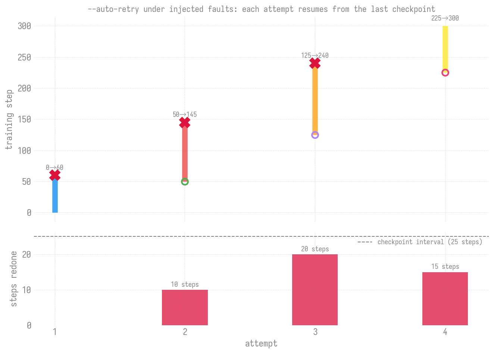

# Fault injection: testing `--auto-retry` without breaking a node

[`--auto-retry`](../cli/launch/index.md) exists for the failures you
cannot schedule: a shepherd killed on one node, a gloo peer that stops
answering, an XPU that runs out of resources mid-step. Those are hard to
arrange on purpose and harder to arrange *repeatedly*, which is why the
failover loop went a long time with 161 tests that all replaced the
subprocess with a fake.

This page covers the harness that removes that excuse: a trainer that
checkpoints, resumes, and dies on cue, driven through the real loop.
Every failure signature it emits is copied from a real captured log.

For what recovery *costs* at real scale, see
[Checkpoint restart](checkpoint-restart.md) — 2 Sunspot nodes, a 23 GB
checkpoint, 10.4–11.1 s per restart. This page is about the loop's
decisions; that one is about the I/O.

The two are worth keeping apart, because both survive a `pkill -9` and
carry on training, so they look alike from outside:

| | what fails | what recovers |
| --- | --- | --- |
| Checkpoint restart | the training **process** | relaunch on the **same** nodes, resuming from the last checkpoint |
| `--auto-retry` (here) | a **node** — or any retryable failure it cannot pin on one | a named host is retired; otherwise a spare is rotated in blindly. Either way the job runs **elsewhere** |

The difference is whether the node set changes. Note the hedge in that
second row: only a scraped, named host yields `BAD_NODE_KNOWN`. A
watchdog timeout or an unrecognised crash still burns a spare, on the
guess that a node is at fault — see the classification table below.
And a retry of any kind requires a spare to exist: with none, the
verdict is `EXHAUSTED` and the job stops. Checkpoint restart is
measured on real hardware, and node-swapping is now validated on real
hardware too — see [On-node validation](#on-node-validation).

## The experiment

Four attempts against a 300-step job checkpointing every 25 steps, with
a `shepherd died from signal 9` injected at steps 60, 145 and 240:

```bash
python3 experiments/fault-injection/run_faults.py \
    --total-steps 300 --ckpt-every 25 \
    --fail-at 60,145,240 --fail-on 1,2,3 \
    --out fault_run.jsonl

python3 experiments/fault-injection/plot_faults.py fault_run.jsonl \
    -o fault-injection.png
```

No scheduler, no MPI, no allocation — `run_with_auto_retry` takes an
arbitrary command, so the whole run finishes in about four seconds on a
laptop.



## Results

```
rc=0  attempts=4  elapsed=4.04s
  attempt 1: steps   0→60   resumed_from=None  fault=shepherd_sig9
  attempt 2: steps  50→145  resumed_from=50    fault=shepherd_sig9
  attempt 3: steps 125→240  resumed_from=125   fault=shepherd_sig9
  attempt 4: steps 225→300  resumed_from=225   fault=None
  bad nodes retired: [x1922c7s6b0n0.hsn…, spare-1, spare-2]
```

| | attempt 1 | 2 | 3 | 4 |
|---|---:|---:|---:|---:|
| resumed from | — | 50 | 125 | 225 |
| died at | 60 | 145 | 240 | — |
| steps redone | — | 10 | 20 | 15 |
| node retired | ✓ | ✓ | ✓ | — |

Three things worth reading off that:

- **The job finished.** Three separate hardware-style deaths, `rc=0`,
  all 300 steps completed. That is the whole promise of the flag.
- **Redone work never exceeded the checkpoint interval.** 10, 20 and 15
  steps against a 25-step interval — you only ever repeat work since the
  last save. Halving `--save-interval` halves the worst case, at the cost
  of more save I/O.
- **A node was retired each time.** The host named in the log went into
  `bad_nodes.txt` and out of the active hostfile, and a spare took its
  slot, so the next attempt ran somewhere else.

!!! note "Why the x-axis is attempts, not wall-clock"

    At this scale an attempt takes about a second, and
    `_run_attempt_with_tee` notices the child exited only on its next
    poll tick — a flat 1.0 s with the watchdog off. Measured wall-time
    would therefore mostly describe a `sleep`, so it is not charted.
    Step progression and redone work come exactly from the logs.

    For real recovery timing, [Checkpoint restart](checkpoint-restart.md)
    measures 10.4–11.1 s per restart on Sunspot, where the cost is
    dominated by process launch, distributed init and `dcp.load` — none
    of which this harness simulates.

## What gets injected

`tests/_faultinject.py` is configured entirely by environment variables,
with a counter file so attempt *N* can behave differently from *N+1*.
Each mode emits a signature taken from
[`ezpz.failover.patterns`](https://github.com/saforem2/ezpz/tree/main/src/ezpz/failover/patterns)
or `_CRASH_PATTERNS_RX` — a made-up string would only prove the harness
can match itself.

| `FI_MODE` | emits | classified as |
|---|---|---|
| `shepherd` | `<host>: shepherd died from signal 9` | `BAD_NODE_KNOWN` — the host is named |
| `gloo_peer` | `RuntimeError: [..gloo..] Connection closed by peer [ip]` | `BAD_NODE_BLIND`¹ |
| `ur_oom` | `UR_RESULT_ERROR_OUT_OF_RESOURCES` | `BAD_NODE_BLIND` |
| `rank_exit` | `<host>: rank 7 exited with code 1`, rc 143 | retried² |
| `innocent_cascade` | `rank N died from signal 15`, rc 143 | `WALLTIME` — **not** retried² |
| `clean_walltime` | normal output, rc 143 | `WALLTIME` |
| `hang` | goes silent | watchdog kill, rc 124 |
| `sigkill` | `SIGKILL`s itself | negative rc, retried |
| `silent_fail` | nothing a scraper can name | `BAD_NODE_BLIND` |

¹ Named only when the IP reverse-resolves, which needs `getent` — so
off-cluster it falls back to a blind rotation.

² These two are the interesting pair. Both exit **143**, the code a PBS
walltime kill produces, but one is a real crash that must be retried and
the other is the SIGTERM cascade every clean walltime kill emits. The
classifier strips `rank N died from signal 11|15` before matching crash
patterns, which is what keeps a walltime expiry from burning a spare on
every job.

## Running it yourself

The tests are the fast path — 20 of them, about six seconds, no
allocation:

```bash
pytest tests/test_autoretry_faultinject.py -v
```

They assert on outcomes rather than internals: the return code, how many
attempts really ran, which host landed in `bad_nodes.txt`, and what the
active hostfile says next.

To explore a scenario, drive the injector directly:

```bash
export FI_COUNTER=/tmp/attempts.txt FI_CKPT=/tmp/ckpt.json
export FI_TOTAL=100 FI_CKPT_EVERY=10 FI_FAIL_AT=35 FI_MODE=ur_oom
echo 0 > $FI_COUNTER
python3 tests/_faultinject.py    # run it twice: the second resumes
```

Full knob list is in the module docstring.

## Scope

This harness deliberately does **not** simulate the expensive parts of a
restart. The "model" is a single integer in a JSON file, so the numbers
here are microseconds where a real job spends seconds on process launch,
distributed init and reading a sharded checkpoint. What it does exercise
for real is every decision the loop makes, the subprocess plumbing, the
idle watchdog, the scraper, and the hostfile rewrite.

## On-node validation

The one claim no in-process test can make is that the *next* attempt's
`mpiexec` actually lands somewhere else. That needed real hardware, and
`experiments/fault-injection/autoretry_nodekill.pbs` now does it: 4
Sunspot nodes split 2 active + 2 spare, `pbsdsh -n 0` killing the ranks
on exactly one active node mid-training, with `--auto-retry` driving the
retry loop.

Sunspot job 12473704, killing `x1921c1s0b0n0` after checkpoint 40:

| attempt | ran on | outcome |
|---|---|---|
| 1 | `s0b0n0` (victim), `s1b0n0` | 13 ranks killed on the victim |
| 2 | `s1b0n0`, **`s4b0n0`** (spare) | victim retired, spare swapped in |
| 3 | `s1b0n0`, **`s5b0n0`** (spare) | see the caveat below |

Attempt 2 is the result: the killed host was recorded in
`bad_nodes.txt`, removed from the active hostfile, and the relaunch ran
on a different node set. Node-swapping works on real hardware.

!!! warning "The same run exposed a classifier bug"

    Attempt 2 died of `OSError: [Errno 28] No space left on device`
    during a checkpoint save. `--auto-retry` scraped a host out of the
    resulting PALS teardown cascade and retired `s4b0n0` — a healthy
    node — because a whole-job failure whose cascade happens to name a
    host is read as that host being bad. Tracked in
    [#231](https://github.com/saforem2/ezpz/issues/231).

    The disk itself is worth a second look, because the obvious reading
    is wrong. `/lus/tegu` was at **10%** full. Two of its four OSTs were
    at 99–100% while the other two sat at 6–7%, and the directory
    striped `stripe_count: 1`, so every shard file lands wholly on one
    round-robin-chosen OST. Roughly half the writes hit a full OST and
    failed; the rest succeeded.

    So this ENOSPC was **retryable** — the same write, reissued, has a
    real chance of landing on a healthy OST. "Out of space" on Lustre
    does not imply the filesystem is out of space, and a classifier
    that treats it as terminal would give up on a recoverable job. The
    experiment still bounds its own footprint, since ~331 GB of
    unpruned checkpoints is what pushed those OSTs over.

Two harness bugs are worth recording, because both produced confident
wrong verdicts before any of the above was true:

- `pbsdsh -- bash -c '<multi-line>'` does not survive the trip
  (`syntax error: unexpected end of file`). The kill never landed, the
  job trained to completion, and a trailing `|| true` reported success
  anyway. The killer is now a file, and reports non-zero if it kills
  nothing.
- Two assertions passed *vacuously* when there was no relaunch: an
  untouched hostfile still has N hosts, and attempt 1 — which ran before
  the kill — naturally never names the victim. They are now gated behind
  the relaunch check, which is evaluated first.

The general lesson: a chaos harness that cannot distinguish "the fault
was injected and handled" from "the fault was never injected" reports
the second as the first.
