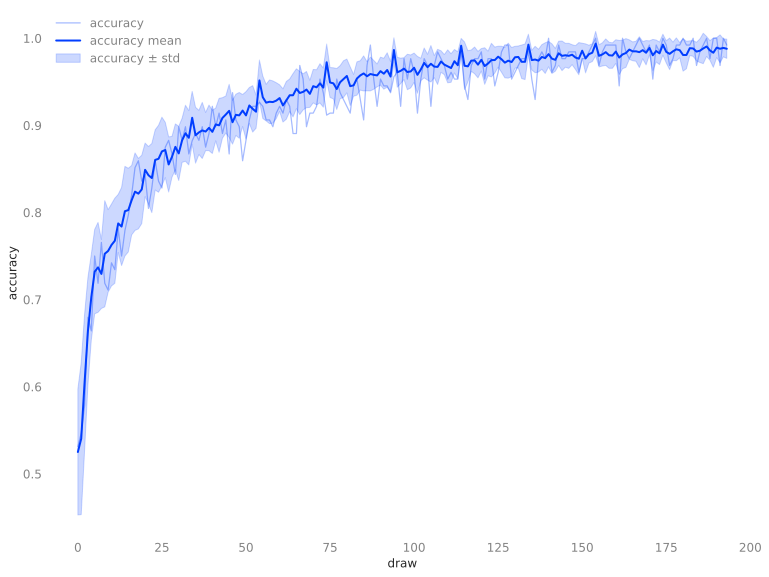
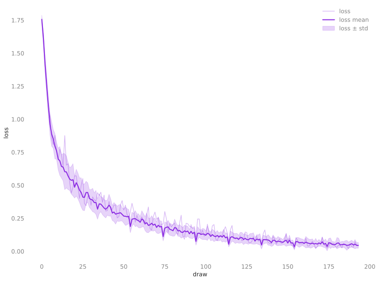
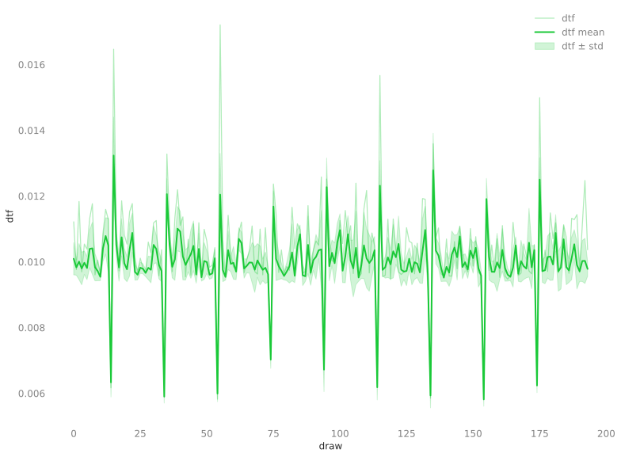
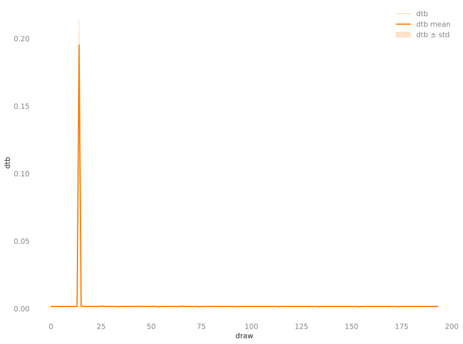

# 🍋 ezpz

> _Write once, run anywhere_.

`ezpz` makes distributed PyTorch code portable across any supported hardware
{NVIDIA, AMD, Intel, MPS, CPU} with **zero code changes**.

This lets us write Python applications that can be run _anywhere_, _at any
scale_; with native job scheduler (PBS, Slurm)[^lcfs] integration and graceful
fallbacks for running locally[^dev] on Mac, Linux machines.

[^lcfs]: With first class support for all of the major HPC Supercomputing
    centers (e.g. ALCF, OLCF, NERSC)

[^dev]: This is particularly useful if you'd like to run development /
    debugging experiments locally

## Why `ezpz`?

Distributed PyTorch requires boilerplate that varies by hardware, backend, and
job scheduler. `ezpz` replaces all of it.

=== "With ezpz"

    ```python title="train.py"
    import ezpz
    import torch

    rank = ezpz.setup_torch()           # auto-detects device + backend
    device = ezpz.get_torch_device()
    model = torch.nn.Linear(128, 10).to(device)
    model = ezpz.wrap_model(model)       # DDP by default
    ```

    ```bash
    # Same command everywhere -- Mac laptop, NVIDIA cluster, Intel Aurora:
    ezpz launch python3 train.py
    ```

=== "Without ezpz"

    ```python title="train.py"
    import os, torch, torch.distributed as dist
    from torch.nn.parallel import DistributedDataParallel as DDP

    backend = "nccl" if torch.cuda.is_available() else "gloo"
    rank = int(os.environ.get("RANK", 0))
    local_rank = int(os.environ.get("LOCAL_RANK", 0))
    world_size = int(os.environ.get("WORLD_SIZE", 1))
    dist.init_process_group(backend, rank=rank, world_size=world_size)
    if torch.cuda.is_available():
        torch.cuda.set_device(local_rank)
        device = torch.device(f"cuda:{local_rank}")
    else:
        device = torch.device("cpu")
    model = torch.nn.Linear(128, 10).to(device)
    model = DDP(model, device_ids=[local_rank] if backend == "nccl" else None)
    ```

    ```bash
    # Different launch per environment:
    torchrun --nproc_per_node=4 train.py           # NVIDIA
    mpiexec -np 24 --ppn 12 python3 train.py       # Intel Aurora (PBS)
    srun --ntasks=8 python3 train.py                # Slurm cluster
    ```

## 👀 Overview

`ezpz` is, at its core, a Python library that provides a variety of utilities
for both _writing_ and _launching_ distributed PyTorch applications.

These can be broken down (~roughly) into:

1. 🐍 [**Python library**](./python/Code-Reference/index.md): `import ezpz`  
   Python API for writing hardware-agnostic, distributed PyTorch code.
    - See [**Features**](#features) for a list of core features and functionality
      provided by `ezpz`.
    - See [`ezpz.distributed`](./python/Code-Reference/distributed.md) for details on
      the core logic related to device detection and distributed initialization.

1. 🧰 [**CLI**](./cli/index.md): `ezpz <command>`  
   Utilities for launching distributed PyTorch applications:
    - 🚀 [`ezpz launch`](./cli/launch/index.md): Launch commands with _automatic
      **job scheduler** detection_ (PBS, Slurm)
    - 💯 [`ezpz test`](./cli/test.md): Run simple distributed smoke test
    - 🩺 [`ezpz doctor`](./cli/doctor.md): Health check your environment

## 🐣 Getting Started

To use `ezpz`, we first need:

1. A suitable MPI implementation (MPICH, OpenMPI), and
2. A Python environment; preferably _virtual_, ideally with {`torch`, `mpi4py`}
   installed

If you already have both of these things: skip directly to
[Install](#install-ezpz); otherwise, see the
details below:

??? tip "[**Optional**]: Setup Python Environment"

    - We can use the provided
      [src/ezpz/bin/utils.sh](https://github.com/saforem2/ezpz/blob/main/src/ezpz/bin/utils.sh)[^bitly]
      to set up our environment:

        ```bash
        source <(curl -LsSf https://bit.ly/ezpz-utils) && ezpz_setup_env
        ```

        ??? abstract "[**Details**]"

            **Note**: This is _technically_ optional, but recommended.<br>
            Especially if you happen to be running behind a job scheduler (e.g.
            PBS/Slurm) at any of {ALCF, OLCF, NERSC}, this will automatically 
            load the appropriate modules and use these to bootstrap a virtual
            environment.  
            However, if you already have a Python environment with
            {`torch`, `mpi4py`} installed and would prefer to use that, skip
            directly to (2.) installing `ezpz` below

### 📦 Install `ezpz`

To install `ezpz`, we can use `uv`[^uvi] to install directly from GitHub:

```bash
uv pip install "git+https://github.com/saforem2/ezpz"
```

??? question "Need `torch` or `mpi4py`?"

    If you don't already have PyTorch or `mpi4py` installed,
    you can specify these as additional dependencies:

    ```bash
    uv pip install --no-cache --link-mode=copy "git+https://github.com/saforem2/ezpz[torch,mpi]"
    ```

??? tip "Try _without installing_ via `uv run`"

    If you already have a Python environment with
    {`torch`, `mpi4py`} installed, you can try `ezpz` without installing
    it:

    ```bash
    # pip install uv first, if needed
    uv run --with "git+https://github.com/saforem2/ezpz" ezpz doctor

    TMPDIR=$(pwd) uv run --with "git+https://github.com/saforem2/ezpz" \
        --python=$(which python3) \
        ezpz test

    TMPDIR=$(pwd) uv run --with "git+https://github.com/saforem2/ezpz" \
        --python=$(which python3) \
        ezpz launch \
            python3 -m ezpz.examples.fsdp_tp
    ```

??? example "`ezpz test`"

    After installing, we can run a simple smoke test to verify distributed
    functionality and device detection:

    - [`ezpz test`](./cli/test.md): Simple distributed smoke test; explicitly,
        this will train a simple MLP on MNIST dataset using PyTorch + DDP.

        ```bash
        ezpz test
        ```

        - See
            \[[W&B Report: `ezpz test`](https://api.wandb.ai/links/aurora_gpt/q56ai28l)\]
            for example output and demonstration of metric tracking with
            automatic `wandb` integration.

[^uvi]: If you don't have `uv` installed, you can install it via:

    ```bash
    pip install uv
    ```

    See the [uv documentation](https://uv.readthedocs.io/en/latest/) for more details.

[^bitly]: The <https://bit.ly/ezpz-utils> URL is just a short link for
    convenience that actually points to
    <https://raw.githubusercontent.com/saforem2/ezpz/main/src/ezpz/bin/utils.sh>

## ✨ Features

Core features:

1. **Job launching utilities** with _automatic scheduler detection_
  (PBS, Slurm), plus safe fallbacks when no scheduler is detected

    ```bash
    ezpz launch python3 -c 'import ezpz; print(ezpz.setup_torch())'
    ```

    ??? abstract "Output"

        ??? success "MacBook Pro"

            ```bash
            #[01/08/26 @ 14:56:50][~/v/s/ezpz][dev][$✘!?] [4s]
            ; ezpz launch python3 -c 'import ezpz; print(ezpz.setup_torch())'


            [2026-01-08 14:56:54,307030][I][ezpz/launch:515:run] No active scheduler detected; falling back to local mpirun: mpirun -np 2 python3 -c 'import ezpz; print(ezpz.setup_torch())'
            Using [2 / 2] available "mps" devices !!
            0
            1
            [2025-12-23-162222] Execution time: 4s sec
            ```

        ??? success "Aurora (2 Nodes)"

            ```bash
            #[aurora_frameworks-2025.2.0](torchtitan-aurora_frameworks-2025.2.0)[1m9s]
            #[01/08/26,14:56:42][x4418c6s1b0n0][/f/d/f/p/p/torchtitan][main][?]
            ; ezpz launch python3 -c 'import ezpz; print(ezpz.setup_torch())'


            [2026-01-08 14:58:01,994729][I][numexpr/utils:148:_init_num_threads] Note: detected 208 virtual cores but NumExpr set to maximum of 64, check "NUMEXPR_MAX_THREADS" environment variable.
            [2026-01-08 14:58:01,997067][I][numexpr/utils:151:_init_num_threads] Note: NumExpr detected 208 cores but "NUMEXPR_MAX_THREADS" not set, so enforcing safe limit of 16.
            [2026-01-08 14:58:01,997545][I][numexpr/utils:164:_init_num_threads] NumExpr defaulting to 16 threads.
            [2026-01-08 14:58:02,465850][I][ezpz/launch:396:launch] ----[🍋 ezpz.launch][started][2026-01-08-145802]----
            [2026-01-08 14:58:04,765720][I][ezpz/launch:416:launch] Job ID: 8247203
            [2026-01-08 14:58:04,766527][I][ezpz/launch:417:launch] nodelist: ['x4418c6s1b0n0', 'x4717c0s6b0n0']
            [2026-01-08 14:58:04,766930][I][ezpz/launch:418:launch] hostfile: /var/spool/pbs/aux/8247203.aurora-pbs-0001.hostmgmt.cm.aurora.alcf.anl.gov
            [2026-01-08 14:58:04,767616][I][ezpz/pbs:264:get_pbs_launch_cmd] ✅ Using [24/24] GPUs [2 hosts] x [12 GPU/host]
            [2026-01-08 14:58:04,768399][I][ezpz/launch:367:build_executable] Building command to execute by piecing together:
            [2026-01-08 14:58:04,768802][I][ezpz/launch:368:build_executable] (1.) launch_cmd: mpiexec --envall --np=24 --ppn=12 --hostfile=/var/spool/pbs/aux/8247203.aurora-pbs-0001.hostmgmt.cm.aurora.alcf.anl.gov --no-vni --cpu-bind=verbose,list:2-4:10-12:18-20:26-28:34-36:42-44:54-56:62-64:70-72:78-80:86-88:94-96
            [2026-01-08 14:58:04,769517][I][ezpz/launch:369:build_executable] (2.) cmd_to_launch: python3 -c 'import ezpz; print(ezpz.setup_torch())'
            [2026-01-08 14:58:04,770278][I][ezpz/launch:433:launch] Took: 3.01 seconds to build command.
            [2026-01-08 14:58:04,770660][I][ezpz/launch:436:launch] Executing:
            mpiexec
            --envall
            --np=24
            --ppn=12
            --hostfile=/var/spool/pbs/aux/8247203.aurora-pbs-0001.hostmgmt.cm.aurora.alcf.anl.gov
            --no-vni
            --cpu-bind=verbose,list:2-4:10-12:18-20:26-28:34-36:42-44:54-56:62-64:70-72:78-80:86-88:94-96
            python3
            -c
            import ezpz; print(ezpz.setup_torch())
            [2026-01-08 14:58:04,772125][I][ezpz/launch:220:get_aurora_filters] Filtering for Aurora-specific messages. To view list of filters, run with EZPZ_LOG_LEVEL=DEBUG
            [2026-01-08 14:58:04,772651][I][ezpz/launch:443:launch] Execution started @ 2026-01-08-145804...
            [2026-01-08 14:58:04,773070][I][ezpz/launch:138:run_command] Caught 24 filters
            [2026-01-08 14:58:04,773429][I][ezpz/launch:139:run_command] Running command:
            mpiexec --envall --np=24 --ppn=12 --hostfile=/var/spool/pbs/aux/8247203.aurora-pbs-0001.hostmgmt.cm.aurora.alcf.anl.gov --no-vni --cpu-bind=verbose,list:2-4:10-12:18-20:26-28:34-36:42-44:54-56:62-64:70-72:78-80:86-88:94-96 python3 -c 'import ezpz; print(ezpz.setup_torch())'
            cpubind:list x4717c0s6b0n0 pid 118589 rank 12 0: mask 0x1c
            cpubind:list x4717c0s6b0n0 pid 118590 rank 13 1: mask 0x1c00
            cpubind:list x4717c0s6b0n0 pid 118591 rank 14 2: mask 0x1c0000
            cpubind:list x4717c0s6b0n0 pid 118592 rank 15 3: mask 0x1c000000
            cpubind:list x4717c0s6b0n0 pid 118593 rank 16 4: mask 0x1c00000000
            cpubind:list x4717c0s6b0n0 pid 118594 rank 17 5: mask 0x1c0000000000
            cpubind:list x4717c0s6b0n0 pid 118595 rank 18 6: mask 0x1c0000000000000
            cpubind:list x4717c0s6b0n0 pid 118596 rank 19 7: mask 0x1c000000000000000
            cpubind:list x4717c0s6b0n0 pid 118597 rank 20 8: mask 0x1c00000000000000000
            cpubind:list x4717c0s6b0n0 pid 118598 rank 21 9: mask 0x1c0000000000000000000
            cpubind:list x4717c0s6b0n0 pid 118599 rank 22 10: mask 0x1c000000000000000000000
            cpubind:list x4717c0s6b0n0 pid 118600 rank 23 11: mask 0x1c00000000000000000000000
            cpubind:list x4418c6s1b0n0 pid 66450 rank 0 0: mask 0x1c
            cpubind:list x4418c6s1b0n0 pid 66451 rank 1 1: mask 0x1c00
            cpubind:list x4418c6s1b0n0 pid 66452 rank 2 2: mask 0x1c0000
            cpubind:list x4418c6s1b0n0 pid 66453 rank 3 3: mask 0x1c000000
            cpubind:list x4418c6s1b0n0 pid 66454 rank 4 4: mask 0x1c00000000
            cpubind:list x4418c6s1b0n0 pid 66455 rank 5 5: mask 0x1c0000000000
            cpubind:list x4418c6s1b0n0 pid 66456 rank 6 6: mask 0x1c0000000000000
            cpubind:list x4418c6s1b0n0 pid 66457 rank 7 7: mask 0x1c000000000000000
            cpubind:list x4418c6s1b0n0 pid 66458 rank 8 8: mask 0x1c00000000000000000
            cpubind:list x4418c6s1b0n0 pid 66459 rank 9 9: mask 0x1c0000000000000000000
            cpubind:list x4418c6s1b0n0 pid 66460 rank 10 10: mask 0x1c000000000000000000000
            cpubind:list x4418c6s1b0n0 pid 66461 rank 11 11: mask 0x1c00000000000000000000000
            Using [24 / 24] available "xpu" devices !!
            8
            10
            0
            4
            3
            5
            7
            11
            6
            1
            9
            2
            14
            15
            12
            13
            16
            17
            19
            22
            20
            23
            18
            21
            [2026-01-08 14:58:14,252433][I][ezpz/launch:447:launch] ----[🍋 ezpz.launch][stop][2026-01-08-145814]----
            [2026-01-08 14:58:14,253726][I][ezpz/launch:448:launch] Execution finished with 0.
            [2026-01-08 14:58:14,254184][I][ezpz/launch:449:launch] Executing finished in 9.48 seconds.
            [2026-01-08 14:58:14,254555][I][ezpz/launch:450:launch] Took 9.48 seconds to run. Exiting.
            took: 18s
            ```

1. **Automatic distributed initialization** using
   [`ezpz.setup_torch()`](https://ezpz.cool/python/Code-Reference/distributed/#ezpz.distributed.setup_torch)
   with automatic {device, backend} selection

     ```python
     import ezpz
     _ = ezpz.setup_torch()
 
     device = ezpz.get_torch_device()
     # cuda, xpu, mps, cpu, ...
     ```

1. **Metric tracking, aggregation, and recording** via
   [`ezpz.History()`](https://ezpz.cool/python/Code-Reference/#ezpz.History):
     - _Automatic Markdown Report Generation_!
         - See [**📄 Test Report**](./cli/test-report.md) for an example report
           generated by `ezpz test` command
     - Automatic distributed statistics (min, max, mean, stddev) across ranks[^distributed-history]
     - Weights & Biases integration
     - Persistent storage of metrics in `.h5` format
     - Plotting support:
         - ??? example "Graphical plots"
             
             
             
             
 
         - ??? example "Terminal-based ASCII plots via [`plotext`](https://github.com/piccolomo/plotext#guide)"
             <div class="ansi-block"><pre class="terminal"><code>     &#x250C;&#x2500;&#x2500;&#x2500;&#x2500;&#x2500;&#x2500;&#x2500;&#x2500;&#x2500;&#x2500;&#x2500;&#x2500;&#x2500;&#x2500;&#x2500;&#x2500;&#x2500;&#x2500;&#x2500;&#x2500;&#x2500;&#x2500;&#x2500;&#x2500;&#x2500;&#x2500;&#x2500;&#x2500;&#x2500;&#x2500;&#x2500;&#x2500;&#x2500;&#x2500;&#x2500;&#x2500;&#x2500;&#x2500;&#x2500;&#x2500;&#x2500;&#x2500;&#x2500;&#x2500;&#x2500;&#x2500;&#x2500;&#x2500;&#x2500;&#x2500;&#x2500;&#x2500;&#x2500;&#x2500;&#x2500;&#x2500;&#x2500;&#x2500;&#x2500;&#x2500;&#x2500;&#x2500;&#x2500;&#x2500;&#x2500;&#x2500;&#x2500;&#x2500;&#x2500;&#x2500;&#x2500;&#x2500;&#x2500;&#x2500;&#x2500;&#x2500;&#x2500;&#x2500;&#x2500;&#x2500;&#x2500;&#x2500;&#x2500;&#x2500;&#x2500;&#x2500;&#x2500;&#x2500;&#x2500;&#x2500;&#x2500;&#x2500;&#x2500;&#x2500;&#x2500;&#x2500;&#x2500;&#x2500;&#x2500;&#x2500;&#x2500;&#x2500;&#x2500;&#x2500;&#x2500;&#x2500;&#x2500;&#x2500;&#x2500;&#x2500;&#x2500;&#x2500;&#x2500;&#x2510;<br/>0.992&#x2524; <span style="color:#A00">++</span> accuracy/max                                                                      &#x259F;               &#x2597;          &#x2502;<br/>     &#x2502; <span style="color:#0AA">--</span> accuracy/min                                                      &#x2596; &#x2597;            <span style="color:#A00">+</span>&#x2588;      <span style="color:#A00">+</span>&#x2596;       &#x2588;   <span style="color:#A00">++</span>&#x2596;<span style="color:#A00">+</span>   &#x2502;<br/>     &#x2502; <span style="color:#0A0">&#xB7;&#xB7;</span> accuracy/mean                     <span style="color:#A00">+</span>                           &#x2597;&#x258C; &#x2590;&#x258C;<span style="color:#0A0">&#xB7;</span>&#x2588;        &#x2597;&#x258C;  &#x2597;&#x259C;   <span style="color:#0A0">&#xB7;</span><span style="color:#A00">+</span> &#x2590;&#x258C;  <span style="color:#A00">+</span>    &#x2588;   <span style="color:#0A0">&#xB7;</span>&#x2590;&#x258C;&#x259F;   &#x2502;<br/>     &#x2502; &#x259E;&#x259E; accuracy                         <span style="color:#A00">++</span>                <span style="color:#A00">+</span>         &#x259F;&#x2590;&#x258C; &#x259E;&#x2599;&#x2599;&#x259C;   &#x2597;&#x258C;   &#x2590;&#x259A;  &#x2590;&#x2590;  <span style="color:#0A0">&#xB7;</span>&#x259F;<span style="color:#A00">+</span>&#x259F;&#x2590;&#x2599;&#x258C;&#x2597;&#x258C;&#x2597;  &#x2597;&#x258C;&#x258C;&#x2597;&#x2597;&#x259C;&#x2590;&#x258C;&#x2588; <span style="color:#A00">+</span>&#x259E;&#x2502;<br/>     &#x2502;                                <span style="color:#A00">+</span>  <span style="color:#A00">+++</span><span style="color:#0A0">&#xB7;</span>   &#x2597;          &#x2597;<span style="color:#A00">+</span><span style="color:#0A0">&#xB7;</span>       <span style="color:#A00">+</span>&#x2597;&#x259C;&#x2590;&#x258C;<span style="color:#A00">+</span>&#x258C;&#x2588;&#x259C;&#x2590;   &#x2590;&#x258C;<span style="color:#A00">+</span>  &#x2590;&#x2590;&#x2597; &#x2590;&#x2590;<span style="color:#A00">+</span>&#x2596;&#x2590;&#x2590;<span style="color:#A00">+</span>&#x259B;&#x259F;&#x2588;&#x258C;&#x258C;&#x258C;&#x259B;&#x2584;<span style="color:#A00">+</span>&#x2588;&#x258C;&#x258C;&#x2588;&#x2590; &#x259C;&#x258C;&#x2588;<span style="color:#A00">+</span>&#x2597;&#x258C;&#x2502;<br/>     &#x2502;                              &#x2597;&#x258C;<span style="color:#A00">+</span> &#x2597;&#x258C;<span style="color:#A00">+</span><span style="color:#0A0">&#xB7;&#xB7;</span>   &#x258C;&#x258C;    &#x259F;  &#x2597;&#x258C;&#x2588;&#x2597;&#x258C;  &#x259F;  &#x2597;&#x258C;<span style="color:#0A0">&#xB7;</span>&#x259E;&#x2590;&#x258C;&#x2599;&#x259A;&#x258C;&#x2588;<span style="color:#0A0">&#xB7;</span>&#x2590;<span style="color:#0A0">&#xB7;</span><span style="color:#A00">+</span> &#x259E;&#x258C;<span style="color:#0A0">&#xB7;</span><span style="color:#A00">+</span> &#x259E;<span style="color:#0A0">&#xB7;</span>&#x259C;&#x259F;&#x258C;&#x2590;&#x2590;&#x2590;&#x259E;&#x2590;&#x259F;&#x258C;&#x2588;&#x2588;&#x2588;<span style="color:#0A0">&#xB7;</span>&#x258C;&#x258C;&#x259D;&#x2596;&#x258C;&#x2598;&#x258C;&#x2588;&#x2590; <span style="color:#0A0">&#xB7;</span>&#x258C;&#x2588;<span style="color:#0A0">&#xB7;</span>&#x2588;&#x258C;&#x2502;<br/>0.928&#x2524;                       &#x2597;&#x258C;     &#x2590;&#x258C;<span style="color:#A00">+</span> &#x2590;&#x258C;<span style="color:#0A0">&#xB7;&#xB7;</span>&#x2584;&#x258C; <span style="color:#A00">+</span>&#x258C;&#x258C;<span style="color:#A00">+</span>   &#x2588; &#x2597;&#x2590;&#x258C;&#x2588;&#x2590;&#x258C;&#x259F;&#x2590;&#x2590;<span style="color:#A00">+</span>&#x2597;&#x258C;&#x2599;&#x259A;&#x258C;&#x2590;&#x258C;&#x259C;<span style="color:#0A0">&#xB7;</span>&#x2598;&#x259D;<span style="color:#0A0">&#xB7;</span>&#x2590;&#x259E;&#x2584;&#x258C;&#x258C;&#x258C;&#x259F;<span style="color:#0A0">&#xB7;</span>&#x2597;&#x2598;<span style="color:#0AA">-</span>&#x2590;&#x2588;&#x258C;&#x259D;&#x259E;&#x259D;&#x258C;&#x2590;&#x258C;&#x2598;&#x259D;&#x2588;&#x2588;<span style="color:#0A0">&#xB7;</span>&#x259D;&#x258C; &#x2590;&#x258C;<span style="color:#0AA">-</span>&#x2590;&#x2588;&#x259E;  &#x259A;&#x259C;&#x2597;&#x2580;&#x258C;&#x2502;<br/>     &#x2502;                     &#x259F; &#x2590;&#x258C;&#x2597;&#x258C; &#x2597;&#x258C;&#x259E;&#x258C;<span style="color:#0A0">&#xB7;</span> &#x259E;&#x2590;<span style="color:#0A0">&#xB7;</span>&#x2590;&#x259D;&#x258C;<span style="color:#A00">++</span>&#x258C;&#x258C;<span style="color:#A00">+</span>&#x259E;&#x259C;&#x2597;&#x259C;<span style="color:#0A0">&#xB7;</span>&#x259B;&#x259F;&#x258C;&#x2588;&#x259E;&#x258C;&#x2588;&#x258C;&#x2590;<span style="color:#0A0">&#xB7;</span>&#x258C;<span style="color:#0A0">&#xB7;</span>&#x2588;  &#x2590;&#x258C;<span style="color:#0AA">-</span><span style="color:#0A0">&#xB7;</span> <span style="color:#0AA">--</span>&#x2590;&#x258C;<span style="color:#0A0">&#xB7;</span>&#x259A;&#x258C;&#x2599;&#x2598;&#x2599;&#x2588;<span style="color:#0A0">&#xB7;</span><span style="color:#0AA">-</span><span style="color:#0A0">&#xB7;</span>&#x259C;&#x258C;  <span style="color:#0AA">-</span>  &#x2598; <span style="color:#0AA">-</span>&#x2588;&#x2588;<span style="color:#0AA">---</span> &#x2590;&#x258C; &#x2590;&#x2588;&#x258C;   &#x2590;&#x2590;<span style="color:#0A0">&#xB7;</span> &#x2502;<br/>     &#x2502;                  &#x2597;&#x258C; &#x2588; &#x259E;&#x258C;&#x2590;&#x259A;&#x2597;&#x2588;&#x259C;<span style="color:#0A0">&#xB7;</span>&#x258C;<span style="color:#0A0">&#xB7;</span>&#x2597;&#x2598;&#x259D;&#x2596;&#x2590;<span style="color:#0A0">&#xB7;</span>&#x258C;<span style="color:#A00">+</span><span style="color:#0A0">&#xB7;</span>&#x258C;&#x258C;&#x2597;&#x2598;<span style="color:#0A0">&#xB7;</span>&#x2598; &#x2599;&#x2598;&#x259C;&#x259A;&#x2588;&#x258C;&#x2599;&#x2580;&#x258C;&#x259D;&#x259E;&#x2598;<span style="color:#0AA">-</span>&#x2588;   &#x2598; <span style="color:#0AA">-</span> <span style="color:#0AA">--</span>&#x259D;&#x258C; &#x259D;&#x258C;&#x259D; &#x259D;&#x2588;<span style="color:#0AA">---</span><span style="color:#0A0">&#xB7;</span>&#x2598;       <span style="color:#0AA">-</span>&#x259D;&#x2588;  <span style="color:#0AA">-</span> &#x2590;&#x258C; &#x259D;&#x258C;&#x2598;   &#x2590;&#x259E;  &#x2502;<br/>     &#x2502;      <span style="color:#A00">+</span>        &#x2597;<span style="color:#A00">+</span> &#x258C;&#x258C;<span style="color:#A00">+</span>&#x2588;<span style="color:#A00">+</span>&#x258C;&#x258C;&#x259F;&#x2590;&#x2590;&#x2588;<span style="color:#0AA">-</span><span style="color:#0A0">&#xB7;</span>&#x259A;<span style="color:#0A0">&#xB7;</span>&#x2590;<span style="color:#0A0">&#xB7;&#xB7;</span>&#x259A;&#x2590;<span style="color:#0A0">&#xB7;</span>&#x258C;<span style="color:#0A0">&#xB7;</span>&#x259F;<span style="color:#0A0">&#xB7;</span>&#x258C;&#x258C;<span style="color:#0AA">-</span><span style="color:#0A0">&#xB7;</span><span style="color:#0AA">-</span> &#x259C;<span style="color:#0AA">-</span><span style="color:#0A0">&#xB7;</span><span style="color:#0AA">-</span>&#x259D;&#x258C;&#x259C; <span style="color:#0AA">-----</span>&#x2588;        <span style="color:#0AA">-</span> <span style="color:#0AA">-</span> <span style="color:#0AA">-</span>    &#x259C;<span style="color:#0AA">-</span>  <span style="color:#0AA">--</span>         &#x2588;    &#x2590;&#x258C; <span style="color:#0AA">-</span>     &#x2590;&#x258C;  &#x2502;<br/>     &#x2502;      <span style="color:#A00">+</span>   &#x2597;&#x258C;   &#x2588;<span style="color:#0A0">&#xB7;</span> &#x258C;&#x2590;&#x2590;&#x2590;&#x2590;<span style="color:#0A0">&#xB7;</span>&#x2588;&#x2588;<span style="color:#0A0">&#xB7;</span>&#x2588;&#x259D; <span style="color:#0AA">-</span>&#x2590;&#x259F;&#x258C;<span style="color:#0AA">-</span><span style="color:#0A0">&#xB7;</span>&#x2590;&#x2590;<span style="color:#0AA">-</span>&#x258C;&#x259E;&#x259D;<span style="color:#0A0">&#xB7;</span>&#x2588;<span style="color:#0AA">---</span>               &#x2588;                                &#x2588;    <span style="color:#0AA">-</span>&#x2598;        &#x2598;  &#x2502;<br/>     &#x2502;      <span style="color:#A00">+</span>   &#x2590;&#x258C; &#x2597; &#x259B;&#x2596;<span style="color:#0A0">&#xB7;</span>&#x258C;&#x259D;&#x259F;&#x2590;&#x2590;<span style="color:#0A0">&#xB7;</span>&#x2588;&#x259C;<span style="color:#0A0">&#xB7;</span>&#x259D;<span style="color:#0AA">-</span>  &#x2590;&#x258C;&#x2598;<span style="color:#0AA">--</span>&#x2590;&#x2590; &#x259D;&#x2598;<span style="color:#0AA">-</span><span style="color:#0A0">&#xB7;</span>&#x259D;<span style="color:#0AA">-</span> <span style="color:#0AA">-</span>               &#x2588;                                &#x2588;                 &#x2502;<br/>0.865&#x2524;      <span style="color:#A00">+</span>   &#x2590;&#x258C; &#x2588; &#x258C;&#x258C;&#x2584;&#x258C;<span style="color:#0A0">&#xB7;</span>&#x2588;&#x2590;&#x258C;<span style="color:#0A0">&#xB7;</span>&#x2588;<span style="color:#0AA">---</span>   &#x259D;&#x258C;  <span style="color:#0AA">-</span> &#x2588;   <span style="color:#0AA">--</span>                   &#x259C;                                &#x259C;                 &#x2502;<br/>     &#x2502;      <span style="color:#A00">+</span>   &#x2590;&#x258C;<span style="color:#A00">+</span>&#x2588; &#x258C;&#x259D;<span style="color:#0AA">-</span><span style="color:#0A0">&#xB7;</span><span style="color:#0AA">-</span>&#x259D; &#x2598;<span style="color:#0A0">&#xB7;</span>&#x2588;<span style="color:#0AA">---</span>       <span style="color:#0AA">-</span> &#x2588;    <span style="color:#0AA">-</span>                                                                      &#x2502;<br/>     &#x2502;     &#x2596;<span style="color:#A00">+</span>&#x2596;  &#x259F;&#x258C;<span style="color:#A00">+</span>&#x259B;&#x2596;&#x258C;<span style="color:#0AA">-</span> <span style="color:#0AA">--</span>  <span style="color:#0A0">&#xB7;&#xB7;</span>&#x259D;<span style="color:#0AA">-</span>         <span style="color:#0AA">-</span> &#x259C;                                                                           &#x2502;<br/>     &#x2502;    &#x2590;&#x258C;&#x2590;&#x258C; &#x2590;&#x259D;&#x258C;&#x2597;&#x2598;&#x2599;&#x2598;   <span style="color:#0AA">-</span>  <span style="color:#0AA">-</span><span style="color:#0A0">&#xB7;</span><span style="color:#0AA">-</span>                                                                                        &#x2502;<br/>     &#x2502;   <span style="color:#A00">+</span>&#x2590;&#x258C;&#x2590;&#x2599;&#x258C;&#x2590;<span style="color:#0A0">&#xB7;</span>&#x2599;&#x2598;<span style="color:#0AA">-</span>&#x2588;<span style="color:#0A0">&#xB7;</span>   <span style="color:#0AA">-</span>  <span style="color:#0AA">--</span>                                                                                         &#x2502;<br/>0.801&#x2524;  <span style="color:#A00">++</span>&#x2590;&#x258C;&#x2590;&#x2588;&#x259A;&#x2590;<span style="color:#0A0">&#xB7;</span>&#x2588;<span style="color:#0A0">&#xB7;</span> &#x2588;<span style="color:#0A0">&#xB7;</span>      <span style="color:#0AA">--</span>                                                                                         &#x2502;<br/>     &#x2502;  <span style="color:#A00">++</span>&#x2590;&#x258C;&#x2590;&#x2588;<span style="color:#0A0">&#xB7;</span>&#x2580;<span style="color:#0A0">&#xB7;</span>&#x2588;<span style="color:#0A0">&#xB7;</span> &#x2588;<span style="color:#0A0">&#xB7;</span>      <span style="color:#0AA">--</span>                                                                                         &#x2502;<br/>     &#x2502;&#x258C; <span style="color:#A00">++</span>&#x2590;&#x259A;&#x2590;&#x2588;<span style="color:#0A0">&#xB7;</span> <span style="color:#0AA">-</span>&#x2588;<span style="color:#0A0">&#xB7;</span> &#x259C;<span style="color:#0AA">-</span>       <span style="color:#0AA">-</span>                                                                                         &#x2502;<br/>     &#x2502;&#x258C; <span style="color:#A00">++</span>&#x2590;&#x2590;&#x2590;&#x2588;<span style="color:#0A0">&#xB7;</span> <span style="color:#0AA">-</span>&#x2588;<span style="color:#0A0">&#xB7;</span>                                                                                                    &#x2502;<br/>     &#x2502;&#x258C; <span style="color:#A00">+</span><span style="color:#0A0">&#xB7;</span>&#x2590;&#x2590;&#x2590;&#x2588;<span style="color:#0AA">-</span> <span style="color:#0AA">-</span>&#x2588;<span style="color:#0A0">&#xB7;</span>                                                                                                    &#x2502;<br/>     &#x2502;&#x258C; <span style="color:#0A0">&#xB7;&#xB7;</span>&#x2590;&#x2590;&#x258C;&#x259C;<span style="color:#0AA">-</span> <span style="color:#0AA">-</span>&#x2588;<span style="color:#0AA">-</span>                                                                                                    &#x2502;<br/>0.737&#x2524;&#x258C;&#x259F;<span style="color:#0A0">&#xB7;&#xB7;</span>&#x2590;&#x2590;&#x258C;   <span style="color:#0AA">-</span>&#x2588;<span style="color:#0AA">-</span>                                                                                                    &#x2502;<br/>     &#x2502;&#x258C;&#x2588;<span style="color:#0A0">&#xB7;</span>&#x259E;&#x259F;&#x259D;&#x258C;   <span style="color:#0AA">-</span>&#x259C;<span style="color:#0AA">-</span>                                                                                                    &#x2502;<br/>     &#x2502;&#x258C;&#x259B;&#x2596;&#x258C;&#x2588;<span style="color:#0AA">-</span>    <span style="color:#0AA">--</span>                                                                                                     &#x2502;<br/>     &#x2502;&#x258C;&#x258C;&#x258C;&#x258C;&#x2588;<span style="color:#0AA">-</span>    <span style="color:#0AA">--</span>                                                                                                     &#x2502;<br/>     &#x2502;&#x258C;&#x258C;&#x259A;&#x2598;&#x2588;<span style="color:#0AA">-</span>     <span style="color:#0AA">-</span>                                                                                                     &#x2502;<br/>     &#x2502;&#x258C;&#x258C;<span style="color:#0AA">--</span>&#x259C;<span style="color:#0AA">-</span>                                                                                                           &#x2502;<br/>0.673&#x2524;&#x2599;&#x2598;<span style="color:#0AA">--</span>                                                                                                             &#x2502;<br/>     &#x2502;&#x2588;<span style="color:#0A0">&#xB7;</span> <span style="color:#0AA">-</span>                                                                                                             &#x2502;<br/>     &#x2502;&#x2588;<span style="color:#0A0">&#xB7;</span>                                                                                                               &#x2502;<br/>     &#x2502;&#x259D;                                                                                                                &#x2502;<br/>     &#x2502;<span style="color:#0AA">-</span>                                                                                                                &#x2502;<br/>     &#x2502;<span style="color:#0AA">-</span>                                                                                                                &#x2502;<br/>0.609&#x2524;<span style="color:#0AA">-</span>                                                                                                                &#x2502;<br/>     &#x2514;&#x252C;&#x2500;&#x2500;&#x2500;&#x2500;&#x2500;&#x2500;&#x2500;&#x2500;&#x2500;&#x2500;&#x2500;&#x2500;&#x2500;&#x2500;&#x2500;&#x2500;&#x2500;&#x2500;&#x2500;&#x2500;&#x2500;&#x2500;&#x2500;&#x2500;&#x2500;&#x2500;&#x2500;&#x252C;&#x2500;&#x2500;&#x2500;&#x2500;&#x2500;&#x2500;&#x2500;&#x2500;&#x2500;&#x2500;&#x2500;&#x2500;&#x2500;&#x2500;&#x2500;&#x2500;&#x2500;&#x2500;&#x2500;&#x2500;&#x2500;&#x2500;&#x2500;&#x2500;&#x2500;&#x2500;&#x2500;&#x252C;&#x2500;&#x2500;&#x2500;&#x2500;&#x2500;&#x2500;&#x2500;&#x2500;&#x2500;&#x2500;&#x2500;&#x2500;&#x2500;&#x2500;&#x2500;&#x2500;&#x2500;&#x2500;&#x2500;&#x2500;&#x2500;&#x2500;&#x2500;&#x2500;&#x2500;&#x2500;&#x2500;&#x252C;&#x2500;&#x2500;&#x2500;&#x2500;&#x2500;&#x2500;&#x2500;&#x2500;&#x2500;&#x2500;&#x2500;&#x2500;&#x2500;&#x2500;&#x2500;&#x2500;&#x2500;&#x2500;&#x2500;&#x2500;&#x2500;&#x2500;&#x2500;&#x2500;&#x2500;&#x2500;&#x2500;&#x252C;&#x2518;<br/>     1.0                        49.2                        97.5                        145.8                     194.0 <br/></code></pre></div>
             <div class="ansi-block"><pre class="terminal"><code>                            accuracy                                                  accuracy/min                      <br/>     &#x250C;&#x2500;&#x2500;&#x2500;&#x2500;&#x2500;&#x2500;&#x2500;&#x2500;&#x2500;&#x2500;&#x2500;&#x2500;&#x2500;&#x2500;&#x2500;&#x2500;&#x2500;&#x2500;&#x2500;&#x2500;&#x2500;&#x2500;&#x2500;&#x2500;&#x2500;&#x2500;&#x2500;&#x2500;&#x2500;&#x2500;&#x2500;&#x2500;&#x2500;&#x2500;&#x2500;&#x2500;&#x2500;&#x2500;&#x2500;&#x2500;&#x2500;&#x2500;&#x2500;&#x2500;&#x2500;&#x2500;&#x2500;&#x2500;&#x2500;&#x2500;&#x2500;&#x2500;&#x2500;&#x2510;     &#x250C;&#x2500;&#x2500;&#x2500;&#x2500;&#x2500;&#x2500;&#x2500;&#x2500;&#x2500;&#x2500;&#x2500;&#x2500;&#x2500;&#x2500;&#x2500;&#x2500;&#x2500;&#x2500;&#x2500;&#x2500;&#x2500;&#x2500;&#x2500;&#x2500;&#x2500;&#x2500;&#x2500;&#x2500;&#x2500;&#x2500;&#x2500;&#x2500;&#x2500;&#x2500;&#x2500;&#x2500;&#x2500;&#x2500;&#x2500;&#x2500;&#x2500;&#x2500;&#x2500;&#x2500;&#x2500;&#x2500;&#x2500;&#x2500;&#x2500;&#x2500;&#x2500;&#x2500;&#x2500;&#x2510;<br/>0.992&#x2524;                                &#x2597;&#x2597;      &#x259F;   &#x2596;   &#x2596; &#x2597;  &#x2502;0.977&#x2524;                                <span style="color:#0AA">--</span>        <span style="color:#0AA">-</span>      <span style="color:#0AA">-</span> <span style="color:#0AA">-</span> &#x2502;<br/>     &#x2502;                              &#x259F;&#x259F;&#x259F;&#x2588; &#x2597;&#x258C; &#x259F; &#x2588; &#x258C;&#x259F;&#x2588;&#x258C;&#x2596;&#x2590;&#x2599;&#x259E;&#x2588;&#x258C;&#x259E;&#x2502;0.915&#x2524;           <span style="color:#0AA">-</span> <span style="color:#0AA">--</span> <span style="color:#0AA">---</span> <span style="color:#0AA">---------------------------------</span>&#x2502;<br/>0.935&#x2524;           &#x2596;  &#x259F; &#x259F; &#x2596;&#x2597;&#x258C; &#x2590; &#x258C;&#x2588;&#x2597;&#x258C;&#x2597;&#x2599;&#x2588;&#x259C;&#x259B;&#x2588;&#x2597;&#x259F;&#x2599; &#x259B;&#x2588;&#x259C;&#x2588;&#x2588;&#x2588;&#x2588;&#x259C;&#x2580;&#x259B;&#x2588;&#x258C;&#x259C;&#x2599;&#x258C;&#x2502;0.854&#x2524;       <span style="color:#0AA">---------------</span> <span style="color:#0AA">-</span> <span style="color:#0AA">--</span> <span style="color:#0AA">--</span>   <span style="color:#0AA">-</span>   <span style="color:#0AA">-</span> <span style="color:#0AA">-</span>    <span style="color:#0AA">-</span>  <span style="color:#0AA">-</span>   <span style="color:#0AA">-</span> &#x2502;<br/>     &#x2502;        &#x2597;&#x2596;&#x258C;&#x258C;&#x258C;&#x259F;&#x2588; &#x259B;&#x259F;&#x258C;&#x2590;&#x2599;&#x259B;&#x259B;&#x259F;&#x2599;&#x2588;&#x2588;&#x259A;&#x259E;&#x259B;&#x259C;&#x259D; &#x259D;&#x259B;&#x259C;&#x259B;&#x259F; &#x259C;&#x259D;&#x259D;&#x259D; &#x2588;&#x259D; &#x258C;&#x259C;&#x258C;&#x259D;&#x2588;&#x2598;&#x2502;0.793&#x2524;  <span style="color:#0AA">-----------</span>   <span style="color:#0AA">--</span>                                   &#x2502;<br/>0.878&#x2524;     &#x2596; &#x259F;&#x2590;&#x2599;&#x2588;&#x2588;&#x2599;&#x2588;&#x2590;&#x259F; &#x2588;&#x259A;&#x2588;&#x259C;  &#x2598; &#x259D;&#x2598;  &#x258C;       &#x259D;      &#x2590;  &#x258C;   &#x259C; &#x2502;     &#x2502;  <span style="color:#0AA">----</span> <span style="color:#0AA">-</span>   <span style="color:#0AA">-</span>                                         &#x2502;<br/>     &#x2502;     &#x258C;&#x259F;&#x2588;&#x2580;&#x259C;&#x259C;&#x2588;&#x2598;  &#x2598; &#x2588;           &#x2598;              &#x259D;        &#x2502;0.732&#x2524; <span style="color:#0AA">---</span> <span style="color:#0AA">-</span>                                               &#x2502;<br/>0.820&#x2524;  &#x259F;&#x259F;&#x259F;&#x2599;&#x2588;&#x258C;   &#x259D;     &#x259D;                                   &#x2502;0.671&#x2524;<span style="color:#0AA">---</span>                                                  &#x2502;<br/>     &#x2502;  &#x2588;&#x2588;&#x2588;&#x2588;&#x2590;&#x258C;                                             &#x2502;0.609&#x2524;<span style="color:#0AA">-</span>                                                    &#x2502;<br/>     &#x2502;&#x258C; &#x2588;&#x2588; &#x2588;&#x259D;&#x258C;                                             &#x2502;     &#x2514;&#x252C;&#x2500;&#x2500;&#x2500;&#x2500;&#x2500;&#x2500;&#x2500;&#x2500;&#x2500;&#x2500;&#x2500;&#x2500;&#x252C;&#x2500;&#x2500;&#x2500;&#x2500;&#x2500;&#x2500;&#x2500;&#x2500;&#x2500;&#x2500;&#x2500;&#x2500;&#x252C;&#x2500;&#x2500;&#x2500;&#x2500;&#x2500;&#x2500;&#x2500;&#x2500;&#x2500;&#x2500;&#x2500;&#x2500;&#x252C;&#x2500;&#x2500;&#x2500;&#x2500;&#x2500;&#x2500;&#x2500;&#x2500;&#x2500;&#x2500;&#x2500;&#x2500;&#x252C;&#x2518;<br/>0.763&#x2524;&#x258C; &#x2588;&#x259C; &#x2588;                                               &#x2502;     1.0         49.2         97.5         145.8      194.0 <br/>     &#x2502;&#x2599;&#x2588;&#x2588;  &#x259C;                                               &#x2502;accuracy/min                  iter                          <br/>0.706&#x2524;&#x2588;&#x2588;&#x258C;                                                  &#x2502;                          accuracy/std                      <br/>     &#x2502;&#x2588; &#x2598;                                                  &#x2502;     &#x250C;&#x2500;&#x2500;&#x2500;&#x2500;&#x2500;&#x2500;&#x2500;&#x2500;&#x2500;&#x2500;&#x2500;&#x2500;&#x2500;&#x2500;&#x2500;&#x2500;&#x2500;&#x2500;&#x2500;&#x2500;&#x2500;&#x2500;&#x2500;&#x2500;&#x2500;&#x2500;&#x2500;&#x2500;&#x2500;&#x2500;&#x2500;&#x2500;&#x2500;&#x2500;&#x2500;&#x2500;&#x2500;&#x2500;&#x2500;&#x2500;&#x2500;&#x2500;&#x2500;&#x2500;&#x2500;&#x2500;&#x2500;&#x2500;&#x2500;&#x2500;&#x2500;&#x2500;&#x2500;&#x2510;<br/>0.648&#x2524;&#x259C;                                                    &#x2502;0.094&#x2524;<span style="color:#A0A">\*</span>    <span style="color:#A0A">\*</span>                                               &#x2502;<br/>     &#x2514;&#x252C;&#x2500;&#x2500;&#x2500;&#x2500;&#x2500;&#x2500;&#x2500;&#x2500;&#x2500;&#x2500;&#x2500;&#x2500;&#x252C;&#x2500;&#x2500;&#x2500;&#x2500;&#x2500;&#x2500;&#x2500;&#x2500;&#x2500;&#x2500;&#x2500;&#x2500;&#x252C;&#x2500;&#x2500;&#x2500;&#x2500;&#x2500;&#x2500;&#x2500;&#x2500;&#x2500;&#x2500;&#x2500;&#x2500;&#x252C;&#x2500;&#x2500;&#x2500;&#x2500;&#x2500;&#x2500;&#x2500;&#x2500;&#x2500;&#x2500;&#x2500;&#x2500;&#x252C;&#x2518;0.078&#x2524;<span style="color:#A0A">\*</span>    <span style="color:#A0A">\*</span>                                               &#x2502;<br/>     1.0         49.2         97.5         145.8      194.0 0.062&#x2524;<span style="color:#A0A">\*</span>  <span style="color:#A0A">\*</span> <span style="color:#A0A">\*</span>                                               &#x2502;<br/>accuracy                      iter                          0.047&#x2524;<span style="color:#A0A">\*\*</span> <span style="color:#A0A">\*</span> <span style="color:#A0A">\*</span>     <span style="color:#A0A">\*</span>                                         &#x2502;<br/>                          accuracy/mean                          &#x2502;<span style="color:#A0A">\*\*\*\*</span> <span style="color:#A0A">\*</span>   <span style="color:#A0A">\*</span> <span style="color:#A0A">\*</span>    <span style="color:#A0A">\*</span>                <span style="color:#A0A">\*</span>         <span style="color:#A0A">\*</span>         &#x2502;<br/>     &#x250C;&#x2500;&#x2500;&#x2500;&#x2500;&#x2500;&#x2500;&#x2500;&#x2500;&#x2500;&#x2500;&#x2500;&#x2500;&#x2500;&#x2500;&#x2500;&#x2500;&#x2500;&#x2500;&#x2500;&#x2500;&#x2500;&#x2500;&#x2500;&#x2500;&#x2500;&#x2500;&#x2500;&#x2500;&#x2500;&#x2500;&#x2500;&#x2500;&#x2500;&#x2500;&#x2500;&#x2500;&#x2500;&#x2500;&#x2500;&#x2500;&#x2500;&#x2500;&#x2500;&#x2500;&#x2500;&#x2500;&#x2500;&#x2500;&#x2500;&#x2500;&#x2500;&#x2500;&#x2500;&#x2510;0.031&#x2524;<span style="color:#A0A">\*\*\*\*</span> <span style="color:#A0A">\*\*</span>  <span style="color:#A0A">\*\*\*\*</span>  <span style="color:#A0A">\*\*\*\*\*\*\*</span>       <span style="color:#A0A">\*</span> <span style="color:#A0A">\*</span> <span style="color:#A0A">\*</span>  <span style="color:#A0A">\*</span> <span style="color:#A0A">\*</span> <span style="color:#A0A">\*</span> <span style="color:#A0A">\*\*</span> <span style="color:#A0A">\*\*\*\*</span> <span style="color:#A0A">\*</span>  &#x2502;<br/>0.977&#x2524;                                <span style="color:#0A0">&#xB7;&#xB7;</span>      <span style="color:#0A0">&#xB7;</span>        <span style="color:#0A0">&#xB7;</span> <span style="color:#0A0">&#xB7;</span> &#x2502;0.016&#x2524;<span style="color:#A0A">\*\*\*\*\*\*\*\*\*\*\*\*\*\*\*\*\*\*\*\*\*\*\*\*\*\*\*\*\*\*\*\*\*\*\*\*\*\*\*\*\*\*\*\*\*\*\*\*\*\*\*\*\*</span>&#x2502;<br/>     &#x2502;                  <span style="color:#0A0">&#xB7;</span>      <span style="color:#0A0">&#xB7;</span>     <span style="color:#0A0">&#xB7;&#xB7;&#xB7;</span>  <span style="color:#0A0">&#xB7;</span>   <span style="color:#0A0">&#xB7;&#xB7;&#xB7;</span> <span style="color:#0A0">&#xB7;&#xB7;</span> <span style="color:#0A0">&#xB7;&#xB7;&#xB7;&#xB7;&#xB7;&#xB7;</span>&#x2502;0.000&#x2524;<span style="color:#A0A">\*</span>   <span style="color:#A0A">\*</span> <span style="color:#A0A">\*\*\*\*\*\*\*\*\*\*\*</span>  <span style="color:#A0A">\*\*\*\*\*\*\*\*</span> <span style="color:#A0A">\*\*\*</span> <span style="color:#A0A">\*\*\*\*</span> <span style="color:#A0A">\*\*\*\*\*\*</span> <span style="color:#A0A">\*\*\*\*</span> <span style="color:#A0A">\*\*\*\*</span>&#x2502;<br/>0.923&#x2524;              <span style="color:#0A0">&#xB7;</span> <span style="color:#0A0">&#xB7;&#xB7;&#xB7;</span> <span style="color:#0A0">&#xB7;</span> <span style="color:#0A0">&#xB7;</span> <span style="color:#0A0">&#xB7;&#xB7;&#xB7;</span>  <span style="color:#0A0">&#xB7;&#xB7;&#xB7;&#xB7;&#xB7;&#xB7;&#xB7;&#xB7;&#xB7;&#xB7;&#xB7;&#xB7;&#xB7;&#xB7;&#xB7;&#xB7;&#xB7;&#xB7;&#xB7;&#xB7;&#xB7;&#xB7;&#xB7;&#xB7;</span>&#x2502;     &#x2514;&#x252C;&#x2500;&#x2500;&#x2500;&#x2500;&#x2500;&#x2500;&#x2500;&#x2500;&#x2500;&#x2500;&#x2500;&#x2500;&#x252C;&#x2500;&#x2500;&#x2500;&#x2500;&#x2500;&#x2500;&#x2500;&#x2500;&#x2500;&#x2500;&#x2500;&#x2500;&#x252C;&#x2500;&#x2500;&#x2500;&#x2500;&#x2500;&#x2500;&#x2500;&#x2500;&#x2500;&#x2500;&#x2500;&#x2500;&#x252C;&#x2500;&#x2500;&#x2500;&#x2500;&#x2500;&#x2500;&#x2500;&#x2500;&#x2500;&#x2500;&#x2500;&#x2500;&#x252C;&#x2518;<br/>     &#x2502;          <span style="color:#0A0">&#xB7;&#xB7;</span> <span style="color:#0A0">&#xB7;&#xB7;&#xB7;&#xB7;&#xB7;&#xB7;&#xB7;&#xB7;&#xB7;&#xB7;&#xB7;&#xB7;&#xB7;&#xB7;&#xB7;&#xB7;&#xB7;</span>  <span style="color:#0A0">&#xB7;</span> <span style="color:#0A0">&#xB7;&#xB7;</span> <span style="color:#0A0">&#xB7;&#xB7;&#xB7;</span>    <span style="color:#0A0">&#xB7;</span>  <span style="color:#0A0">&#xB7;&#xB7;&#xB7;</span> <span style="color:#0A0">&#xB7;&#xB7;</span>&#x2502;     1.0         49.2         97.5         145.8      194.0 <br/>     &#x2502;       <span style="color:#0A0">&#xB7;</span> <span style="color:#0A0">&#xB7;&#xB7;&#xB7;&#xB7;&#xB7;&#xB7;&#xB7;&#xB7;&#xB7;&#xB7;&#xB7;</span> <span style="color:#0A0">&#xB7;</span>   <span style="color:#0A0">&#xB7;</span>   <span style="color:#0A0">&#xB7;</span>              <span style="color:#0A0">&#xB7;</span>      <span style="color:#0A0">&#xB7;</span> &#x2502;accuracy/std                  iter                          <br/>0.868&#x2524;       <span style="color:#0A0">&#xB7;&#xB7;&#xB7;&#xB7;&#xB7;&#xB7;&#xB7;</span> <span style="color:#0A0">&#xB7;</span> <span style="color:#0A0">&#xB7;</span>                                   &#x2502;                          accuracy/max                      <br/>     &#x2502;  <span style="color:#0A0">&#xB7;&#xB7;</span>  <span style="color:#0A0">&#xB7;&#xB7;&#xB7;</span>  <span style="color:#0A0">&#xB7;</span>                                         &#x2502;     &#x250C;&#x2500;&#x2500;&#x2500;&#x2500;&#x2500;&#x2500;&#x2500;&#x2500;&#x2500;&#x2500;&#x2500;&#x2500;&#x2500;&#x2500;&#x2500;&#x2500;&#x2500;&#x2500;&#x2500;&#x2500;&#x2500;&#x2500;&#x2500;&#x2500;&#x2500;&#x2500;&#x2500;&#x2500;&#x2500;&#x2500;&#x2500;&#x2500;&#x2500;&#x2500;&#x2500;&#x2500;&#x2500;&#x2500;&#x2500;&#x2500;&#x2500;&#x2500;&#x2500;&#x2500;&#x2500;&#x2500;&#x2500;&#x2500;&#x2500;&#x2500;&#x2500;&#x2500;&#x2500;&#x2510;<br/>0.814&#x2524;  <span style="color:#0A0">&#xB7;&#xB7;&#xB7;&#xB7;&#xB7;&#xB7;</span>                                             &#x2502;0.992&#x2524;                  <span style="color:#A00">+</span>            <span style="color:#A00">+++</span>    <span style="color:#A00">+</span> <span style="color:#A00">+</span> <span style="color:#A00">++</span> <span style="color:#A00">+</span> <span style="color:#A00">+</span> <span style="color:#A00">+++</span> &#x2502;<br/>     &#x2502;  <span style="color:#0A0">&#xB7;&#xB7;&#xB7;&#xB7;</span> <span style="color:#0A0">&#xB7;</span>                                             &#x2502;0.936&#x2524;           <span style="color:#A00">+</span>  <span style="color:#A00">+++++++</span> <span style="color:#A00">+++++++++++++++++++++++++++++++</span>&#x2502;<br/>0.760&#x2524; <span style="color:#0A0">&#xB7;&#xB7;&#xB7;&#xB7;&#xB7;</span>                                               &#x2502;0.880&#x2524;   <span style="color:#A00">+</span> <span style="color:#A00">+</span> <span style="color:#A00">++++++++++++++++++++</span> <span style="color:#A00">+</span>      <span style="color:#A00">+</span> <span style="color:#A00">+</span> <span style="color:#A00">+</span>    <span style="color:#A00">+</span>      <span style="color:#A00">+</span> &#x2502;<br/>     &#x2502; <span style="color:#0A0">&#xB7;&#xB7;</span>                                                  &#x2502;0.824&#x2524;  <span style="color:#A00">++</span> <span style="color:#A00">++++</span>  <span style="color:#A00">+</span>   <span style="color:#A00">+</span>                                     &#x2502;<br/>     &#x2502; <span style="color:#0A0">&#xB7;&#xB7;</span>                                                  &#x2502;     &#x2502;<span style="color:#A00">++++++</span> <span style="color:#A00">+</span>                                             &#x2502;<br/>0.706&#x2524;<span style="color:#0A0">&#xB7;&#xB7;&#xB7;</span>                                                  &#x2502;0.768&#x2524;<span style="color:#A00">+++</span>                                                  &#x2502;<br/>     &#x2502;<span style="color:#0A0">&#xB7;&#xB7;</span>                                                   &#x2502;0.712&#x2524;<span style="color:#A00">++</span>                                                   &#x2502;<br/>0.652&#x2524;<span style="color:#0A0">&#xB7;</span>                                                    &#x2502;0.656&#x2524;<span style="color:#A00">++</span>                                                   &#x2502;<br/>     &#x2514;&#x252C;&#x2500;&#x2500;&#x2500;&#x2500;&#x2500;&#x2500;&#x2500;&#x2500;&#x2500;&#x2500;&#x2500;&#x2500;&#x252C;&#x2500;&#x2500;&#x2500;&#x2500;&#x2500;&#x2500;&#x2500;&#x2500;&#x2500;&#x2500;&#x2500;&#x2500;&#x252C;&#x2500;&#x2500;&#x2500;&#x2500;&#x2500;&#x2500;&#x2500;&#x2500;&#x2500;&#x2500;&#x2500;&#x2500;&#x252C;&#x2500;&#x2500;&#x2500;&#x2500;&#x2500;&#x2500;&#x2500;&#x2500;&#x2500;&#x2500;&#x2500;&#x2500;&#x252C;&#x2518;     &#x2514;&#x252C;&#x2500;&#x2500;&#x2500;&#x2500;&#x2500;&#x2500;&#x2500;&#x2500;&#x2500;&#x2500;&#x2500;&#x2500;&#x252C;&#x2500;&#x2500;&#x2500;&#x2500;&#x2500;&#x2500;&#x2500;&#x2500;&#x2500;&#x2500;&#x2500;&#x2500;&#x252C;&#x2500;&#x2500;&#x2500;&#x2500;&#x2500;&#x2500;&#x2500;&#x2500;&#x2500;&#x2500;&#x2500;&#x2500;&#x252C;&#x2500;&#x2500;&#x2500;&#x2500;&#x2500;&#x2500;&#x2500;&#x2500;&#x2500;&#x2500;&#x2500;&#x2500;&#x252C;&#x2518;<br/>     1.0         49.2         97.5         145.8      194.0      1.0         49.2         97.5         145.8      194.0 <br/>accuracy/mean                 iter                          accuracy/max                  iter                          <br/></code></pre></div>
             <div class="ansi-block"><pre class="terminal"><code>    &#x250C;&#x2500;&#x2500;&#x2500;&#x2500;&#x2500;&#x2500;&#x2500;&#x2500;&#x2500;&#x2500;&#x2500;&#x2500;&#x2500;&#x2500;&#x2500;&#x2500;&#x2500;&#x2500;&#x2500;&#x2500;&#x2500;&#x2500;&#x2500;&#x2500;&#x2500;&#x2500;&#x2500;&#x2500;&#x2500;&#x2500;&#x2500;&#x2500;&#x2500;&#x2500;&#x2500;&#x2500;&#x2500;&#x2500;&#x2500;&#x2500;&#x2500;&#x2500;&#x2500;&#x2500;&#x2500;&#x2500;&#x2500;&#x2500;&#x2500;&#x2500;&#x2500;&#x2500;&#x2500;&#x2500;&#x2500;&#x2500;&#x2500;&#x2500;&#x2500;&#x2500;&#x2500;&#x2500;&#x2500;&#x2500;&#x2500;&#x2500;&#x2500;&#x2500;&#x2500;&#x2500;&#x2500;&#x2500;&#x2500;&#x2500;&#x2500;&#x2500;&#x2500;&#x2500;&#x2500;&#x2500;&#x2500;&#x2500;&#x2500;&#x2500;&#x2500;&#x2500;&#x2500;&#x2500;&#x2500;&#x2500;&#x2500;&#x2500;&#x2500;&#x2500;&#x2500;&#x2500;&#x2500;&#x2500;&#x2500;&#x2500;&#x2500;&#x2500;&#x2500;&#x2500;&#x2500;&#x2500;&#x2500;&#x2500;&#x2500;&#x2500;&#x2500;&#x2500;&#x2500;&#x2500;&#x2510;<br/>1.78&#x2524; <span style="color:#A00">++</span> loss/max                                                                                                      &#x2502;<br/>    &#x2502; <span style="color:#0AA">--</span> loss/min                                                                                                      &#x2502;<br/>    &#x2502; <span style="color:#0A0">&#xB7;&#xB7;</span> loss/mean                                                                                                     &#x2502;<br/>    &#x2502; &#x259E;&#x259E; loss                                                                                                          &#x2502;<br/>    &#x2502;&#x258C;<span style="color:#A00">+</span>                                                                                                                &#x2502;<br/>    &#x2502;&#x259A;<span style="color:#0A0">&#xB7;</span>                                                                                                                &#x2502;<br/>1.50&#x2524;&#x2590;<span style="color:#0A0">&#xB7;</span>                                                                                                                &#x2502;<br/>    &#x2502;&#x2590;<span style="color:#0A0">&#xB7;</span>                                                                                                                &#x2502;<br/>    &#x2502;&#x2590;<span style="color:#0A0">&#xB7;</span>                                                                                                                &#x2502;<br/>    &#x2502; &#x258C;                                                                                                                &#x2502;<br/>    &#x2502; &#x258C;                                                                                                                &#x2502;<br/>    &#x2502; &#x258C;                                                                                                                &#x2502;<br/>1.21&#x2524; &#x259A;                                                                                                                &#x2502;<br/>    &#x2502; &#x2590;<span style="color:#A00">+</span>                                                                                                               &#x2502;<br/>    &#x2502; &#x2590;&#x259F;                                                                                                               &#x2502;<br/>    &#x2502; &#x259D;&#x2588;                                                                                                               &#x2502;<br/>    &#x2502;  &#x2590;                                                                                                               &#x2502;<br/>0.93&#x2524;  &#x259D;&#x2596;<span style="color:#A00">+</span>                                                                                                             &#x2502;<br/>    &#x2502;  <span style="color:#0AA">-</span>&#x2599;&#x258C;                                                                                                             &#x2502;<br/>    &#x2502;  <span style="color:#0AA">-</span>&#x259D;&#x259A;<span style="color:#A00">+</span>                                                                                                            &#x2502;<br/>    &#x2502;   <span style="color:#0AA">-</span>&#x2590;<span style="color:#A00">+</span>&#x2596;    &#x2597;&#x258C;                                                                                                     &#x2502;<br/>    &#x2502;    &#x2590;&#x2590;&#x259A;    &#x2590;&#x258C;                                                                                                     &#x2502;<br/>    &#x2502;    &#x2590;&#x2590;&#x2590;    &#x2590;&#x258C;                                                                                                     &#x2502;<br/>0.65&#x2524;     &#x2588;&#x2590; &#x2584;&#x2596;<span style="color:#A00">+</span>&#x2590;&#x258C;<span style="color:#A00">+</span>                                                                                                    &#x2502;<br/>    &#x2502;     &#x2588;&#x2590;&#x259E;<span style="color:#0A0">&#xB7;</span>&#x2590;<span style="color:#0A0">&#xB7;</span>&#x2590;&#x2590;<span style="color:#A00">+</span>         <span style="color:#A00">+</span>             <span style="color:#A00">+</span>                                                                            &#x2502;<br/>    &#x2502;     &#x2588;&#x2590;&#x258C; <span style="color:#0A0">&#xB7;</span>&#x258C;&#x258C;&#x259D;&#x2596;&#x259E;&#x2584;      <span style="color:#A00">+</span><span style="color:#0A0">&#xB7;</span> <span style="color:#A00">+</span>           &#x259F;                                                                            &#x2502;<br/>    &#x2502;     &#x259D;&#x259D;&#x258C;  &#x259A;&#x258C;<span style="color:#0AA">-</span>&#x2588;<span style="color:#0A0">&#xB7;</span>&#x2590; <span style="color:#A00">+</span>&#x2596;   <span style="color:#0A0">&#xB7;&#xB7;</span> <span style="color:#A00">++</span>          &#x2588;                                                                            &#x2502;<br/>    &#x2502;      <span style="color:#0AA">-</span>   &#x2590;&#x258C;<span style="color:#0AA">-</span>&#x2588; &#x2590;&#x2597;&#x2590;&#x258C;<span style="color:#A00">+</span>&#x259F; &#x2597;&#x258C;<span style="color:#A00">+</span><span style="color:#0A0">&#xB7;</span><span style="color:#A00">+</span>          &#x2588;         &#x2597;             <span style="color:#A00">+</span>                                                    &#x2502;<br/>    &#x2502;      <span style="color:#0AA">-</span>   &#x2590;&#x258C; &#x259C;<span style="color:#0AA">-</span>&#x2590;&#x258C;&#x2588;&#x2590;<span style="color:#A00">+</span>&#x2588; &#x2590;&#x258C;<span style="color:#0A0">&#xB7;&#xB7;</span>&#x2597;&#x258C;<span style="color:#A00">+</span>   &#x2596;&#x2596;  <span style="color:#A00">+</span>&#x2588;   <span style="color:#A00">+</span>&#x2596;    &#x2588;  &#x2596;         <span style="color:#A00">++</span>                                                &#x2597;&#x258C;  &#x2502;<br/>0.37&#x2524;           &#x2598;   <span style="color:#0AA">-</span>&#x2598;&#x259D;&#x259D;&#x2596;&#x2588;<span style="color:#A00">+</span>&#x2590;&#x258C;&#x259E;&#x2596;&#x2590;&#x259A;<span style="color:#0A0">&#xB7;</span> <span style="color:#0A0">&#xB7;</span>&#x2590;&#x259C;&#x2590;<span style="color:#0A0">&#xB7;</span><span style="color:#A00">+</span><span style="color:#0A0">&#xB7;</span>&#x2588; <span style="color:#A00">+</span>&#x2597;&#x2580;&#x258C; &#x2584;  &#x2588; &#x2590;&#x258C; <span style="color:#A00">+</span>&#x2597;&#x2597; &#x2597;&#x258C;  <span style="color:#A00">++</span>&#x2597;&#x258C;            &#x259F;       &#x2597;                &#x2597;        &#x2590;&#x258C;  &#x2502;<br/>    &#x2502;                <span style="color:#0AA">-</span>  &#x2599;&#x259C;<span style="color:#0A0">&#xB7;</span>&#x259E;&#x259A;&#x258C;&#x259D;&#x2588;&#x259D;&#x2584;&#x2599;&#x258C;&#x2590;<span style="color:#0AA">-</span>&#x259D;&#x2584;<span style="color:#0A0">&#xB7;</span>&#x2597;&#x259C; &#x2597;&#x2588;<span style="color:#0A0">&#xB7;</span>&#x258C;&#x2590;&#x259D;&#x2596;<span style="color:#0A0">&#xB7;</span>&#x2588; &#x259E;&#x259A;<span style="color:#A00">+</span><span style="color:#0A0">&#xB7;</span>&#x2588;&#x2588; &#x2590;&#x258C; &#x2597;&#x2596;<span style="color:#0A0">&#xB7;</span>&#x2590;&#x258C;&#x259F;    <span style="color:#A00">+</span>   &#x2597;&#x258C; &#x2588;     &#x259F; &#x2588;<span style="color:#0A0">&#xB7;</span> <span style="color:#A00">+</span> <span style="color:#A00">+</span>    <span style="color:#A00">+</span> &#x2597;    &#x2588;   &#x2597;&#x258C;   &#x2590;&#x258C;  &#x2502;<br/>    &#x2502;                   &#x259D; &#x2580;  &#x2598; &#x259D;  &#x259C;&#x258C;&#x258C;<span style="color:#0AA">--</span>&#x259D;&#x2584;&#x2598;&#x2590;<span style="color:#A00">+</span>&#x2590;&#x259C;<span style="color:#0AA">-</span>&#x2590;&#x2590; &#x259A;&#x2584;&#x259B;&#x2596;&#x258C;<span style="color:#0A0">&#xB7;</span>&#x2580;&#x2588;&#x2590;&#x259B;&#x2596;&#x259E;&#x258C;<span style="color:#A00">+</span>&#x258C;&#x258C;&#x259F;&#x2590;&#x258C;&#x2588; <span style="color:#A00">++</span> <span style="color:#0A0">&#xB7;</span><span style="color:#A00">+</span><span style="color:#0A0">&#xB7;</span> &#x259E;&#x258C; &#x2588; <span style="color:#A00">++</span>&#x2597;&#x2597;&#x259C; &#x258C;&#x258C;&#x2596;&#x259F;<span style="color:#A00">+</span><span style="color:#0A0">&#xB7;</span><span style="color:#A00">++</span>&#x2597;&#x258C;<span style="color:#A00">+</span>&#x2597;&#x2588;  <span style="color:#A00">+</span> &#x2588;  &#x259F;&#x2590;&#x258C;   &#x2590;&#x258C;  &#x2502;<br/>    &#x2502;                              &#x259A;&#x258C;   &#x259C;<span style="color:#0AA">--</span>&#x259A;&#x2590;   &#x2588;   &#x2598;&#x259D;&#x2598;<span style="color:#0AA">-</span> &#x259D;&#x2590;&#x258C;&#x2588;<span style="color:#0AA">-</span>&#x259D;&#x2596;&#x258C;&#x259D;&#x2580;&#x259F;&#x259D;&#x2598;&#x258C;&#x259F;<span style="color:#0A0">&#xB7;</span> <span style="color:#0A0">&#xB7;&#xB7;&#xB7;&#xB7;</span>&#x258C;&#x258C;&#x2597;&#x2588;&#x2597;&#x259A;&#x259E;&#x2580;&#x259E;&#x2590;<span style="color:#0A0">&#xB7;</span>&#x258C;&#x259C;&#x258C;&#x258C;&#x259A;&#x2597;<span style="color:#0A0">&#xB7;</span>&#x259F;&#x2590;&#x2599;&#x258C;&#x2588;&#x2588;<span style="color:#A00">+</span>&#x2597;&#x258C;<span style="color:#0A0">&#xB7;</span>&#x258C;&#x258C; &#x259B;&#x259F;&#x2590; <span style="color:#A00">+</span>&#x2597;&#x259F;&#x258C;<span style="color:#0A0">&#xB7;</span>&#x2596;&#x2502;<br/>    &#x2502;                                      <span style="color:#0AA">-</span>&#x2598;   &#x259C;         &#x2590;&#x258C;&#x259D;  &#x259D;&#x2598;  &#x2588; <span style="color:#0AA">-</span>&#x259A;&#x2598;&#x2599;&#x2580;&#x2580;&#x2599;&#x258C;&#x259F;&#x258C;&#x259D;&#x2598;&#x2598;&#x259C;<span style="color:#0A0">&#xB7;</span>&#x2598;<span style="color:#0AA">--</span>&#x259D;&#x259E;&#x258C; &#x259A;&#x258C;<span style="color:#0AA">-</span>&#x2580;&#x2584;&#x258C;&#x259C;&#x2588;&#x2588; &#x259C;&#x2597;&#x2598;&#x258C;&#x259F;&#x258C;&#x258C;&#x2596;&#x258C;&#x2588;&#x2590;<span style="color:#A00">+</span><span style="color:#0A0">&#xB7;</span>&#x258C;&#x2588;&#x258C;&#x2590;&#x258C;&#x2502;<br/>    &#x2502;                                                      &#x2598;       &#x259D;    &#x259D;<span style="color:#0AA">--</span>&#x259D;&#x259D;&#x259D;&#x258C;    <span style="color:#0AA">-</span>       &#x2590;&#x258C;  &#x259D;&#x258C; &#x259D;&#x259D;  &#x259C;<span style="color:#0AA">-</span>&#x259A;&#x2598;&#x2598;&#x259D;&#x2588;<span style="color:#0A0">&#xB7;</span>&#x259D;&#x259D;&#x2584;&#x2596;&#x258C;&#x2588;&#x259D;&#x2598;&#x259D;&#x2502;<br/>0.08&#x2524;                                                                                      &#x259D;&#x258C;               &#x259C;    &#x259D;&#x258C;&#x259D;   &#x2502;<br/>    &#x2514;&#x252C;&#x2500;&#x2500;&#x2500;&#x2500;&#x2500;&#x2500;&#x2500;&#x2500;&#x2500;&#x2500;&#x2500;&#x2500;&#x2500;&#x2500;&#x2500;&#x2500;&#x2500;&#x2500;&#x2500;&#x2500;&#x2500;&#x2500;&#x2500;&#x2500;&#x2500;&#x2500;&#x2500;&#x252C;&#x2500;&#x2500;&#x2500;&#x2500;&#x2500;&#x2500;&#x2500;&#x2500;&#x2500;&#x2500;&#x2500;&#x2500;&#x2500;&#x2500;&#x2500;&#x2500;&#x2500;&#x2500;&#x2500;&#x2500;&#x2500;&#x2500;&#x2500;&#x2500;&#x2500;&#x2500;&#x2500;&#x2500;&#x252C;&#x2500;&#x2500;&#x2500;&#x2500;&#x2500;&#x2500;&#x2500;&#x2500;&#x2500;&#x2500;&#x2500;&#x2500;&#x2500;&#x2500;&#x2500;&#x2500;&#x2500;&#x2500;&#x2500;&#x2500;&#x2500;&#x2500;&#x2500;&#x2500;&#x2500;&#x2500;&#x2500;&#x252C;&#x2500;&#x2500;&#x2500;&#x2500;&#x2500;&#x2500;&#x2500;&#x2500;&#x2500;&#x2500;&#x2500;&#x2500;&#x2500;&#x2500;&#x2500;&#x2500;&#x2500;&#x2500;&#x2500;&#x2500;&#x2500;&#x2500;&#x2500;&#x2500;&#x2500;&#x2500;&#x2500;&#x252C;&#x2518;<br/>    1.0                        49.2                         97.5                        145.8                     194.0 <br/></code></pre></div>
             <div class="ansi-block"><pre class="terminal"><code>                              loss                                                      loss/min                        <br>    ┌──────────────────────────────────────────────────────┐    ┌──────────────────────────────────────────────────────┐<br>1.66┤▌                                                     │1.66┤<span style="color:#0AA">-</span>                                                     │<br>    │▐                                                     │1.39┤<span style="color:#0AA">--</span>                                                    │<br>1.39┤▐                                                     │1.13┤ <span style="color:#0AA">-</span>                                                    │<br>    │▐                                                     │0.87┤ <span style="color:#0AA">-</span>                                                    │<br>1.13┤▐▖                                                    │    │ <span style="color:#0AA">--</span> <span style="color:#0AA">-</span>                                                 │<br>    │▝▌                                                    │0.61┤  <span style="color:#0AA">--------</span> <span style="color:#0AA">-</span>                                          │<br>0.87┤ ▐▖                                                   │0.35┤   <span style="color:#0AA">-</span> <span style="color:#0AA">-</span> <span style="color:#0AA">------------------------------------</span> <span style="color:#0AA">-------</span> <span style="color:#0AA">--</span>│<br>    │ ▝▌▖ ▐                                                │0.08┤                  <span style="color:#0AA">-</span> <span style="color:#0AA">-</span>    <span style="color:#0AA">---</span> <span style="color:#0AA">--</span> <span style="color:#0AA">----------------------</span>│<br>    │  █▌▖▐                                                │    └┬────────────┬─────────────┬────────────┬────────────┬┘<br>0.61┤  ▜█▝▟▙▖         ▐                                    │    1.0         49.2          97.5         145.8      194.0 <br>    │   ▝ █▜▙█▐▗▌ ▖ ▄ ▐ ▗  ▗▗                            ▗ │loss/min                      iter                          <br>0.35┤     ▝ ▝▝▛▟█▟▚█▘▙▟▗▛▄▌█▞▄▙▙▌▄▟▗   ▗▖▌  ▄▌▗  ▖▗ ▗▌▗▌ █ │                            loss/std                        <br>    │              ▜ ▐ ▜▘▜▝▀▘▝█▛▜▝█▀▟▄▄▟▙▙▛▀██▛▙███▐▐▙█▌▐█▖│     ┌─────────────────────────────────────────────────────┐<br>0.08┤                         ▝   ▝  ▘▝▀    ▝▝▌ ▀▀▝▘▀▀▛▝▜▛▝│0.216┤     <span style="color:#A0A"><em></em></span><em>                                                │<br>    └┬────────────┬─────────────┬────────────┬────────────┬┘0.180┤     <span style="color:#A0A"></span></em>                                                │<br>    1.0         49.2          97.5         145.8      194.0 0.144┤   <span style="color:#A0A"><em></em></span><em> <span style="color:#A0A"></span></em>                                                 │<br>loss                          iter                          0.108┤   <span style="color:#A0A"><em></em></span><em> <span style="color:#A0A"></span></em>                                                 │<br>                            loss/mean                            │  <span style="color:#A0A"><strong></strong></span><strong> <span style="color:#A0A">\*</span></strong> <span style="color:#A0A"><em></em></span><em> <span style="color:#A0A">\*\*</span>    <span style="color:#A0A"></span></em>    <span style="color:#A0A"><strong></strong></span><strong> <span style="color:#A0A"></span></strong> <span style="color:#A0A"><em></em></span><em>     <span style="color:#A0A"></span></em>           <span style="color:#A0A"><em></em></span><em> <span style="color:#A0A"></span></em>                  │<br>    ┌──────────────────────────────────────────────────────┐0.072┤<span style="color:#A0A">\*\*\*\*</span> <span style="color:#A0A"><strong><em></em></strong></span><strong><em> <span style="color:#A0A"><em></em></span><em> <span style="color:#A0A">\*</span></em>  <span style="color:#A0A">\*\*</span></em></strong>  <span style="color:#A0A">\*\*\*\*\*\*\*</span> <span style="color:#A0A">\*\*\*\*\*\*\*\*\*\*</span>  <span style="color:#A0A"><strong></strong></span><strong> <span style="color:#A0A">\*\*</span></strong> <span style="color:#A0A"><em></em></span><em>               │<br>1.72┤<span style="color:#0A0">·</span>                                                     │0.036┤<span style="color:#A0A">\*\*\*\*\*</span> <span style="color:#A0A">\*\*\*\*\*\*\*\*\*\*\*\*\*\*\*\*\*\*\*\*\*\*\*\*\*\*\*\*\*\*\*\*\*\*\*\*\*\*\*\*\*\*\*\*\*\*</span> │<br>    │<span style="color:#0A0">·</span>                                                     │0.000┤    <span style="color:#A0A"></span></em>   <span style="color:#A0A"><em></em></span><em> <span style="color:#A0A"></span></em> <span style="color:#A0A"><strong></strong></span><strong> <span style="color:#A0A">\*</span></strong>  <span style="color:#A0A"><strong></strong></span><strong> <span style="color:#A0A"><em></em></span><em> <span style="color:#A0A"></span></em> <span style="color:#A0A">\*</span> <span style="color:#A0A"></span></strong> <span style="color:#A0A">\*\*\*\*\*\*\*</span> <span style="color:#A0A"><strong></strong></span><strong>  <span style="color:#A0A">\*\*\*\*</span></strong> <span style="color:#A0A">\*\*</span>                 │<br>1.45┤<span style="color:#0A0">·</span>                                                     │     └┬────────────┬────────────┬────────────┬────────────┬┘<br>    │ <span style="color:#0A0">·</span>                                                    │     1.0         49.2         97.5         145.8      194.0 <br>    │ <span style="color:#0A0">·</span>                                                    │loss/std                      iter                          <br>1.18┤ <span style="color:#0A0">·</span>                                                    │                            loss/max                        <br>    │ <span style="color:#0A0">·</span>                                                    │    ┌──────────────────────────────────────────────────────┐<br>0.92┤ <span style="color:#0A0">··</span>                                                   │1.78┤<span style="color:#A00">+</span>                                                     │<br>    │  <span style="color:#0A0">·</span>                                                   │1.50┤<span style="color:#A00">+</span>                                                     │<br>0.65┤  <span style="color:#0A0">····</span>                                                │1.23┤ <span style="color:#A00">+</span>                                                    │<br>    │  <span style="color:#0A0">·····</span>    <span style="color:#0A0">·</span>                                          │0.95┤ <span style="color:#A00">++</span>                                                   │<br>    │       <span style="color:#0A0">·······</span>    <span style="color:#0A0">·</span>                                   │    │ <span style="color:#A00">+++</span> <span style="color:#A00">+</span>                                                │<br>0.39┤       <span style="color:#0A0">·</span> <span style="color:#0A0">················</span> <span style="color:#0A0">····</span>    <span style="color:#0A0">·</span> <span style="color:#0A0">·</span>   <span style="color:#0A0">·</span>    <span style="color:#0A0">·</span>  <span style="color:#0A0">·</span>   <span style="color:#0A0">·</span> │0.67┤  <span style="color:#A00">+++++++++++</span>     <span style="color:#A00">+</span>                                   │<br>    │              <span style="color:#0A0">·····</span> <span style="color:#0A0">··································</span>│0.40┤       <span style="color:#A00">+++++++++++++++++++++++++++++++++++++++++++++++</span>│<br>0.12┤                                <span style="color:#0A0">···</span>     <span style="color:#0A0">····</span> <span style="color:#0A0">·</span> <span style="color:#0A0">·······</span>│0.12┤                <span style="color:#A00">+</span>        <span style="color:#A00">++</span>  <span style="color:#A00">+</span> <span style="color:#A00">+++++++++++++</span> <span style="color:#A00">+++++++++</span>│<br>    └┬────────────┬─────────────┬────────────┬────────────┬┘    └┬────────────┬─────────────┬────────────┬────────────┬┘<br>    1.0         49.2          97.5         145.8      194.0     1.0         49.2          97.5         145.8      194.0 <br>loss/mean                     iter                          loss/max                      iter                          <br></code></pre></div>

1. **Automatic single-process logging** with rank-aware filtering for
   distributed runs:

     ```python
     logger = ezpz.get_logger(__name__)
     ```

## 📝 Examples

--8<-- "../includes/example-table.md"

[^distributed-history]: The `ezpz.History` class automatically computes
    distributed statistics (min, max, mean, std) across ranks for all
    recorded metrics.
    **NOTE**: This is automatically disabled when
    `ezpz.get_world_size() >= 384` (e.g. >= {32, 96} {Aurora, Polaris} nodes)
    due to the additional overhead introduced (but can be manually enabled, if
    desired).

## ℹ️ More Information

- **[Configuration](./configuration.md)**: Environment variables for
  customizing device selection, logging, plots, and more.
- **[Architecture Overview](./notes/diagrams.md)**: High-level diagrams of
  how ezpz components fit together.
- **[Python API Reference](./python/Code-Reference/index.md)**: Full API docs.
- **[FAQ](./notes/faq.md)**: Common issues and solutions.
- Stuck? Run `ezpz doctor` for actionable hints.
- See my talk on:
  [**_LLMs on Aurora_: Hands On with `ezpz`**](https://ezpz.cool/slides-2025-05-07/)
    - [YouTube](https://www.youtube.com/watch?v=15ZK9REQiBo)
    - [Slides](https://samforeman.me/talks/incite-hackathon-2025/ezpz/slides)
- [Reach out](https://samforeman.me)!
