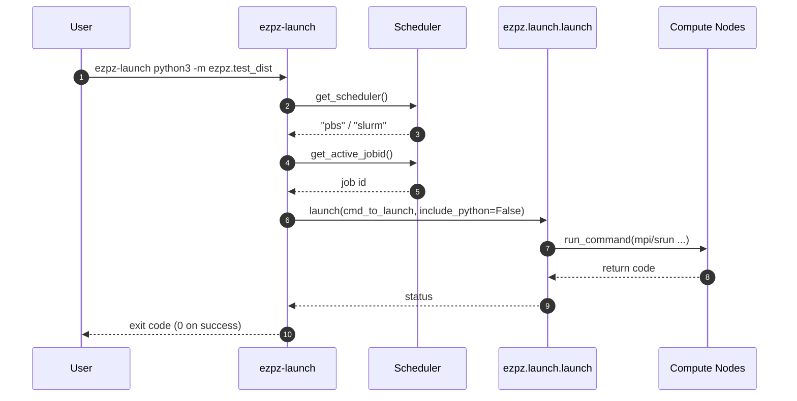
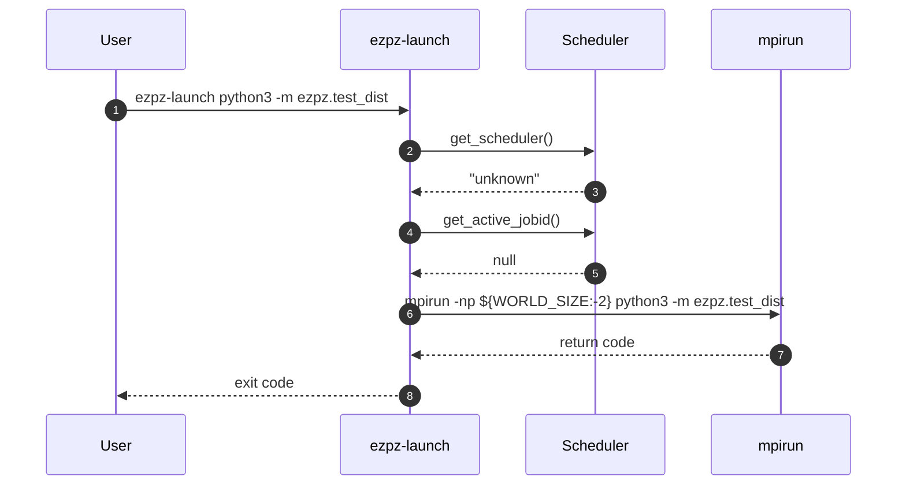
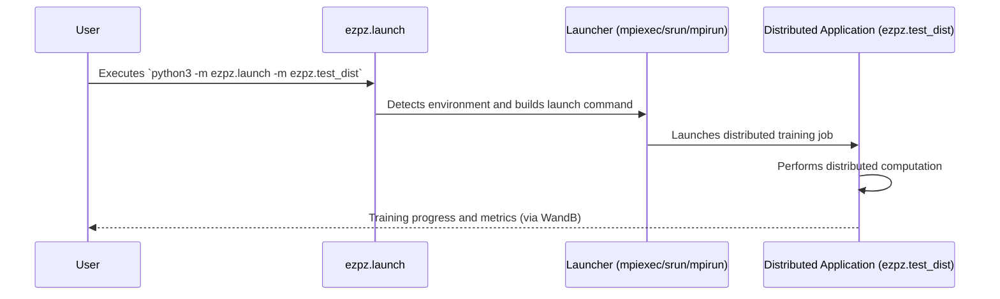

# 🚀 Launch

> Launch python _from_ python.

## 📝 Example

We provide below multiple (equivalent) commands that can be used to launch
[`test_dist.py`](https://github.com/saforem2/ezpz/blob/main/src/ezpz/test_dist.py)
across _all_ available GPUs.

1. Directly:

   ```bash
   ezpz-test
   ```

2. Using `ezpz-launch`:

   ```bash
   ezpz-launch python3 -m ezpz.test_dist
   ```

3. As a module using `python3 -m`:

   ```bash
   python3 -m ezpz.launch python3 -m ezpz.test_dist
   ```

   ```bash
   # or, equivalently:
   python3 -m ezpz.launch -m ezpz.test_dist
   ```

   (will automatically insert `python3` before the second `-m`, if needed)

## ⚙️ Execution Flow

Two primary control paths drive `ezpz-launch`: a scheduler-aware path used when
running inside PBS/SLURM allocations, and a local fallback that shells out to
`mpirun` when no scheduler metadata is available.

### Scheduler Detected



### Local `mpirun` Fallback



## 💀 Deprecated

### 📝 Example

```bash {#launch-example}
source <(curl -L https://bit.ly/ezpz-utils) && ezpz_setup_env
python3 -m pip install "git+https://github.com/saforem2/ezpz"
ezpz-launch -m ezpz.test_dist
```

This will _launch_
[`ezpz/test_dist.py`](https://github.com/saforem2/ezpz/blob/main/src/ezpz/test_dist.py)
across all available resources in your {PBS, Slurm} job.



- <details closed><summary>🪄 <b>Magic</b>:</summary>

    Explicitly, this will use the default "launcher" depending on availability:

    - ALCF (PBS Pro): `mpiexec`
    - Slurm: `srun`
    - Unknown: `mpirun`

    and automatically pull in the specifics about the currently active job when
    building the appropriate `{srun, mpi{exec,run}}` command.

    - For example, on any of the ALCF systems, it will automatically:
    - Identify `"${PBS_NODEFILE}"` (by looking at `hostname` of currently active node)
    - Use this to calculate: - `NHOSTS` - `NGPUS_PER_HOST` - `WORLD_SIZE` `= NGPUS = NHOSTS * NGPUS_PER_HOST`
    - With this information, we can construct the full `mpiexec ...`
        command needed to launch our distributed application, e.g.:

    ```bash
    python3 -c 'import ezpz.pbs; print(ezpz.pbs.build_launch_cmd())'
    # on 2 nodes of Aurora @ ALCF:
    # mpiexec --verbose --envall -n 24 -ppn 12 --hostfile /var/spool/pbs/aux/3878985.aurora-pbs-0001.hostmgmt.cm.aurora.alcf.anl.gov --cpu-bind depth -d 16
    ```

  </details>

#### 🌌 Aurora

- Command:

  ```bash
  python3 -m ezpz.launch -m ezpz.test_dist
  ```

  - <details closed><summary>Output:</summary>

    ```python
    #[🐍 aurora_nre_models_frameworks-2024.2.1_u1](👻 aurora_nre_models_frameworks-2024.2.1_u1)
    #[08:54:56 AM][x4317c7s7b0n0][/flare/datascience/foremans/projects/saforem2/tmp/2025-04-01-084856]
    $ python3 -m ezpz.launch -m ezpz.test_dist --tp 4 --pp 3
    [2025-04-01 08:55:21,413] [INFO] [real_accelerator.py:222:get_accelerator] Setting ds_accelerator to xpu (auto detect)
    [2025-04-01 08:55:29,530] [INFO] [real_accelerator.py:222:get_accelerator] Setting ds_accelerator to xpu (auto detect)
    [2025-04-01 08:56:06][I][ezpz/launch:56:__main__] Job ID: 3842171
    [2025-04-01 08:56:08][I][ezpz/launch:62:__main__] Node file: /var/spool/pbs/aux/3842171.aurora-pbs-0001.hostmgmt.cm.aurora.alcf.anl.gov
    [2025-04-01 08:56:08][I][ezpz/launch:72:__main__] Building command to execute from: '{launch_cmd}' + '{python}' + '{cmd_to_launch}'

    launch_cmd=mpiexec --verbose --envall -n 24 -ppn 12 --hostfile /var/spool/pbs/aux/3842171.aurora-pbs-0001.hostmgmt.cm.aurora.alcf.anl.gov --cpu-bind depth -d 16
    python=/lus/flare/projects/datascience/foremans/projects/saforem2/tmp/2025-04-01-084856/venvs/aurora_nre_models_frameworks-2024.2.1_u1/bin/python3
    cmd_to_launch=-m ezpz.test_dist --tp 4 --pp 3

    [2025-04-01 08:56:08][I][ezpz/launch:90:__main__] Evaluating:
    mpiexec --verbose --envall -n 24 -ppn 12 --hostfile /var/spool/pbs/aux/3842171.aurora-pbs-0001.hostmgmt.cm.aurora.alcf.anl.gov --cpu-bind depth -d 16 /lus/flare/projects/datascience/foremans/projects/saforem2/tmp/2025-04-01-084856/venvs/aurora_nre_models_frameworks-2024.2.1_u1/bin/python3 -m ezpz.test_dist --tp 4 --pp 3
    Disabling local launch: multi-node application
    Connected to tcp://x4317c7s6b0n0.hostmgmt2317.cm.aurora.alcf.anl.gov:7919
    Launching application 7ceb32d4-e849-4fc3-ad6d-abcb7bad3494
    [2025-04-01 08:56:13,276] [INFO] [real_accelerator.py:222:get_accelerator] Setting ds_accelerator to xpu (auto detect)
    [2025-04-01 08:58:40][I][ezpz/dist:557] Using get_torch_device_type()='xpu' with backend='ccl'
    [2025-04-01 08:58:45][I][tp/__init__:148:ezpz.tp] TP: 4, PP: 3, CP: 1, DP: 2
    [2025-04-01 08:58:45][I][ezpz/dist:873] Using device='xpu' with backend='ddp' + 'ccl' for distributed training.
    2025:04:01-08:58:45:(123380) |CCL_WARN| value of CCL_PROCESS_LAUNCHER changed to be pmix (default:hydra)
    [2025-04-01 08:58:45][I][ezpz/dist:923] ['x4317c7s6b0n0'][ 8/23] [pp:2/2][tp:0/3][dp:0/1]
    [2025-04-01 08:58:45][I][ezpz/dist:923] ['x4317c7s6b0n0'][ 7/23] [pp:1/2][tp:3/3][dp:0/1]
    [2025-04-01 08:58:45][I][ezpz/dist:923] ['x4317c7s6b0n0'][ 4/23] [pp:1/2][tp:0/3][dp:0/1]
    [2025-04-01 08:58:45][I][ezpz/dist:923] ['x4317c7s6b0n0'][ 5/23] [pp:1/2][tp:1/3][dp:0/1]
    [2025-04-01 08:58:45][I][ezpz/dist:923] ['x4317c7s6b0n0'][ 6/23] [pp:1/2][tp:2/3][dp:0/1]
    [2025-04-01 08:58:45][I][ezpz/dist:923] ['x4317c7s6b0n0'][10/23] [pp:2/2][tp:2/3][dp:0/1]
    [2025-04-01 08:58:45][I][ezpz/dist:923] ['x4317c7s6b0n0'][ 9/23] [pp:2/2][tp:1/3][dp:0/1]
    [2025-04-01 08:58:45][I][ezpz/dist:923] ['x4317c7s6b0n0'][11/23] [pp:2/2][tp:3/3][dp:0/1]
    [2025-04-01 08:58:45][I][ezpz/dist:923] ['x4317c7s7b0n0'][20/23] [pp:2/2][tp:0/3][dp:1/1]
    [2025-04-01 08:58:45][I][ezpz/dist:923] ['x4317c7s7b0n0'][16/23] [pp:1/2][tp:0/3][dp:1/1]
    [2025-04-01 08:58:45][I][ezpz/dist:923] ['x4317c7s7b0n0'][17/23] [pp:1/2][tp:1/3][dp:1/1]
    [2025-04-01 08:58:45][I][ezpz/dist:923] ['x4317c7s7b0n0'][18/23] [pp:1/2][tp:2/3][dp:1/1]
    [2025-04-01 08:58:45][I][ezpz/dist:923] ['x4317c7s7b0n0'][19/23] [pp:1/2][tp:3/3][dp:1/1]
    [2025-04-01 08:58:45][I][ezpz/dist:923] ['x4317c7s7b0n0'][22/23] [pp:2/2][tp:2/3][dp:1/1]
    [2025-04-01 08:58:45][I][ezpz/dist:923] ['x4317c7s7b0n0'][23/23] [pp:2/2][tp:3/3][dp:1/1]
    [2025-04-01 08:58:45][I][ezpz/dist:923] ['x4317c7s7b0n0'][21/23] [pp:2/2][tp:1/3][dp:1/1]
    [2025-04-01 08:58:45][I][ezpz/dist:923] ['x4317c7s6b0n0'][ 0/23] [pp:0/2][tp:0/3][dp:0/1]
    [2025-04-01 08:58:45][I][ezpz/dist:923] ['x4317c7s6b0n0'][ 2/23] [pp:0/2][tp:2/3][dp:0/1]
    [2025-04-01 08:58:45][I][ezpz/dist:923] ['x4317c7s6b0n0'][ 1/23] [pp:0/2][tp:1/3][dp:0/1]
    [2025-04-01 08:58:45][I][ezpz/dist:923] ['x4317c7s6b0n0'][ 3/23] [pp:0/2][tp:3/3][dp:0/1]
    [2025-04-01 08:58:45][I][ezpz/dist:923] ['x4317c7s7b0n0'][12/23] [pp:0/2][tp:0/3][dp:1/1]
    [2025-04-01 08:58:45][I][ezpz/dist:923] ['x4317c7s7b0n0'][14/23] [pp:0/2][tp:2/3][dp:1/1]
    [2025-04-01 08:58:45][I][ezpz/dist:923] ['x4317c7s7b0n0'][13/23] [pp:0/2][tp:1/3][dp:1/1]
    [2025-04-01 08:58:45][I][ezpz/dist:923] ['x4317c7s7b0n0'][15/23] [pp:0/2][tp:3/3][dp:1/1]
    [2025-04-01 08:58:46][I][ezpz/test_dist:395:__main__] model=
    Network(
      (layers): Sequential(
        (0): Linear(in_features=128, out_features=1024, bias=True)
        (1): Linear(in_features=1024, out_features=512, bias=True)
        (2): Linear(in_features=512, out_features=256, bias=True)
        (3): Linear(in_features=256, out_features=128, bias=True)
        (4): Linear(in_features=128, out_features=128, bias=True)
      )
    )
    [2025-04-01 08:58:58][I][ezpz/dist:1100] Setting up wandb from rank=0
    [2025-04-01 08:58:58][I][ezpz/dist:1101] Using=WB PROJECT=ezpz.test_dist
    wandb: Using wandb-core as the SDK backend.  Please refer to https://wandb.me/wandb-core for more information.
    wandb: Currently logged in as: foremans (aurora_gpt) to https://api.wandb.ai. Use `wandb login --relogin` to force relogin
    wandb: Tracking run with wandb version 0.19.8
    wandb: Run data is saved locally in /lus/flare/projects/datascience/foremans/projects/saforem2/tmp/2025-04-01-084856/wandb/run-20250401_085858-q1ob71v0
    wandb: Run `wandb offline` to turn off syncing.
    wandb: Syncing run young-brook-1229
    wandb: ⭐️ View project at https://wandb.ai/aurora_gpt/ezpz.test_dist
    wandb: 🚀 View run at https://wandb.ai/aurora_gpt/ezpz.test_dist/runs/q1ob71v0
    [2025-04-01 08:58:59][I][ezpz/dist:1129] W&B RUN=[young-brook-1229](https://wandb.ai/aurora_gpt/ezpz.test_dist/runs/q1ob71v0)
    [2025-04-01 08:58:59][I][ezpz/dist:299] Updating wandb.run: young-brook-1229 config with "DIST_INFO"
    [2025-04-01 08:58:59][I][ezpz/dist:1168] Running on machine='Aurora'
    [2025-04-01 08:58:59][I][ezpz/test_dist:219:__main__] config:
    {
      "backend": "DDP",
      "batch_size": 64,
      "cp": 1,
      "dtype": "bfloat16",
      "input_size": 128,
      "layer_sizes": [
        1024,
        512,
        256,
        128
      ],
      "log_freq": 1,
      "output_size": 128,
      "pp": 3,
      "print_freq": 10,
      "pyinstrument_profiler": false,
      "tp": 4,
      "train_iters": 100,
      "warmup": 2
    }
    [rank23]:[W reducer.cpp:69] Warning: measureDifference between two events is not supported on XPU backend! (function operator())
    [2025-04-01 08:59:03][I][ezpz/test_dist:192:__main__] Warmup complete at step 2
    [2025-04-01 08:59:03][I][ezpz/test_dist:170:__main__] iter=10 loss=752.000000 dtf=0.000528 dtb=0.001079
    [2025-04-01 08:59:03][I][ezpz/test_dist:170:__main__] iter=20 loss=652.000000 dtf=0.000482 dtb=0.001007
    [2025-04-01 08:59:03][I][ezpz/test_dist:170:__main__] iter=30 loss=596.000000 dtf=0.000475 dtb=0.001008
    [2025-04-01 08:59:03][I][ezpz/test_dist:170:__main__] iter=40 loss=564.000000 dtf=0.000486 dtb=0.000990
    [2025-04-01 08:59:03][I][ezpz/test_dist:170:__main__] iter=50 loss=520.000000 dtf=0.000492 dtb=0.000989
    [2025-04-01 08:59:03][I][ezpz/test_dist:170:__main__] iter=60 loss=494.000000 dtf=0.000476 dtb=0.001019
    [2025-04-01 08:59:03][I][ezpz/test_dist:170:__main__] iter=70 loss=456.000000 dtf=0.000495 dtb=0.000969
    [2025-04-01 08:59:03][I][ezpz/test_dist:170:__main__] iter=80 loss=426.000000 dtf=0.000488 dtb=0.000988
    [2025-04-01 08:59:03][I][ezpz/test_dist:170:__main__] iter=90 loss=396.000000 dtf=0.000496 dtb=0.000966
    [2025-04-01 08:59:03][I][ezpz/history:704] Saving iter plot to: /lus/flare/projects/datascience/foremans/projects/saforem2/tmp/2025-04-01-084856/outputs/ezpz.test_dist/ezpz.test_dist/plots/mplot
    [2025-04-01 08:59:04][I][ezpz/history:704] Saving loss plot to: /lus/flare/projects/datascience/foremans/projects/saforem2/tmp/2025-04-01-084856/outputs/ezpz.test_dist/ezpz.test_dist/plots/mplot
    [2025-04-01 08:59:04][I][ezpz/history:704] Saving dtf plot to: /lus/flare/projects/datascience/foremans/projects/saforem2/tmp/2025-04-01-084856/outputs/ezpz.test_dist/ezpz.test_dist/plots/mplot
    [2025-04-01 08:59:04][I][ezpz/history:704] Saving dtb plot to: /lus/flare/projects/datascience/foremans/projects/saforem2/tmp/2025-04-01-084856/outputs/ezpz.test_dist/ezpz.test_dist/plots/mplot
    [2025-04-01 08:59:04][I][ezpz/history:602] Saving tplots to /lus/flare/projects/datascience/foremans/projects/saforem2/tmp/2025-04-01-084856/outputs/ezpz.test_dist/ezpz.test_dist/plots/tplot
                        loss [2025-04-01-085904]
          ┌────────────────────────────────────────────────────┐
    1592.0┤▌                                                   │
          │▌                                                   │
    1389.3┤▌                                                   │
          │▌                                                   │
          │▚                                                   │
    1186.7┤▐                                                   │
          │▝▖                                                  │
     984.0┤ ▌                                                  │
          │ ▚                                                  │
     781.3┤  ▌                                                 │
          │  ▝▀▚▄▄                                             │
          │       ▀▚▚▞▄▄▖▖                                     │
     578.7┤             ▝▝▀▀▀▄▚▄▄▄▄▖ ▖                         │
          │                        ▝▀▝▀▀▀▀▀▚▄▄▄▄▄▄             │
     376.0┤                                       ▀▀▀▀▀▀▀▚▄▄▄▄▄│
          └─┬─┬───┬──┬──┬────┬──┬──┬──┬──┬────┬───┬───┬──┬──┬──┘
          0 2 6  14 20 25   34 40 47 51 57   67  75  81 87 93
    loss                           iter
    text saved in /lus/flare/projects/datascience/foremans/projects/saforem2/tmp/2025-04-01-084856/outputs/ezpz.test_dist/ezpz.test_dist/plots/tplot/loss.txt
                          dtf [2025-04-01-085905]
            ┌──────────────────────────────────────────────────┐
    0.000671┤▌                                                 │
            │▌                                 ▖               │
    0.000637┤▌   ▖                            ▐▌               │
            │▌  ▐▌                            ▐▌     ▖         │
            │▌  ▐▌    ▗    ▗    ▟    ▗▌    ▖  ▐▌▖   ▐▌    ▟    │
    0.000604┤▌▖▖▐▌    █    █    █    ▐▌   ▐▌  ▐█▌   ▐▌    █    │
            │██▌▐▌    █    █    █    ▐▌   ▐▌  ▐█▌   ▐▌    █    │
    0.000570┤▝▜▐▐▌    █    █    █    ▐▌   ▐▌  ▐█▌   ▐▌    █    │
            │   █▌▞▟  █    █    █    ▐▌   ▐▌▗▌▐█▌   ▐▌    █    │
    0.000537┤   █▌▌▐  ▌▌▗▖ ▛▖   ▛▄  ▖▌▌   ▐▚▌▌▐█▌   ▐▚    █    │
            │   ▜▚▌▐▗▄▌▙▘▌▖▌▙▌▗ ▌▐ ▐▌▌▐▗▜ ▐▝▌▌▟█▙▌▟▗▐▝▖▄▌ ▌▌▖▞▌│
            │    ▝▌▝▌▐▌█ ▜▌▌▜▚▛▖▌▝▞█▌▌ ▜▐▟▐  █ █▝▚▜█▐ ▜ ▚▖▌▜▝▌▚│
    0.000503┤        ▐▌▝  ▚▌   ▌▌  ▝▌▌  ▝█▐  ▝ ▜   ▜▐    ▚▌    │
            │        ▝▌   ▐▌   ▌▌   ▙▘   ▝▟        ▐▞          │
    0.000470┤              ▘   ▝    ▜     ▝         ▘          │
            └─┬─┬───┬────┬────┬──┬──┬──┬──┬────┬───┬──┬──┬──┬──┘
            0 2 6  14   25   34 40 47 51 57   67  75 81 87 93
    dtf                             iter
    text saved in /lus/flare/projects/datascience/foremans/projects/saforem2/tmp/2025-04-01-084856/outputs/ezpz.test_dist/ezpz.test_dist/plots/tplot/dtf.txt
                        dtf [2025-04-01-085905]
        ┌──────────────────────────────────────────────────────┐
    37.0┤           █████                                      │
        │           █████                                      │
    30.8┤           █████                                      │
        │           █████                                      │
        │           █████                                      │
    24.7┤           █████                                      │
        │           █████                                      │
    18.5┤           █████                                      │
        │     ███████████                                      │
    12.3┤     █████████████████                                │
        │     █████████████████                                │
        │███████████████████████████                           │
     6.2┤███████████████████████████     ███████████           │
        │███████████████████████████████████████████      █████│
     0.0┤██████████████████████████████████████████████████████│
        └┬────────────┬─────────────┬────────────┬────────────┬┘
      0.000461    0.000516      0.000570     0.000625  0.000679
    freq                           dtf
    text saved in /lus/flare/projects/datascience/foremans/projects/saforem2/tmp/2025-04-01-084856/outputs/ezpz.test_dist/ezpz.test_dist/plots/tplot/dtf-hist.txt
                          dtb [2025-04-01-085905]
            ┌──────────────────────────────────────────────────┐
    0.001541┤▌                             ▖                   │
            │▌                            ▐▌                   │
    0.001445┤▌                            ▐▌                   │
            │▌                            ▐▌                   │
            │▌                            ▐▌                   │
    0.001349┤▌                            ▐▌                   │
            │▌                            ▐▌                   │
    0.001253┤▐                            ▐▌                  ▖│
            │▐                            ▐▌                 ▐▌│
    0.001157┤▝▖    ▗▌   ▖  ▗▌  ▗          ▐▌                 ▐▌│
            │ ▝▌  ▗█▌  ▐▌  ▐▌  █        ▖▟▐▌▖                ▐▌│
            │  ▚▗▗▘▜▚ ▗▟▌  ▞▚▗ █▗     ▞▟▌█▐▝▝▖               ▐▌│
    0.001062┤   ▘▀   ▚▌▝▝▀▖▌ ▘▜█▌▀▄▄▟▐ ▝▝▜▐  ▚▖▗▚▞▄  ▄ ▄▚▖▞▄▞▞▚│
            │        ▝▌   ▚▌   ▜▌   ▐▌    ▀   ▐▐   ▜▐ ▀▝ ▌▌    │
    0.000966┤                   ▘    ▘         ▜    ▀    ▝▌    │
            └─┬─┬───┬────┬────┬──┬──┬──┬──┬────┬───┬──┬──┬──┬──┘
            0 2 6  14   25   34 40 47 51 57   67  75 81 87 93
    dtb                             iter
    text saved in /lus/flare/projects/datascience/foremans/projects/saforem2/tmp/2025-04-01-084856/outputs/ezpz.test_dist/ezpz.test_dist/plots/tplot/dtb.txt
                        dtb [2025-04-01-085905]
        ┌──────────────────────────────────────────────────────┐
    55.0┤     ██████                                           │
        │     ██████                                           │
    45.8┤     ██████                                           │
        │     ██████                                           │
        │     ██████                                           │
    36.7┤     ██████                                           │
        │     ██████                                           │
    27.5┤     ██████                                           │
        │     ██████                                           │
    18.3┤     ██████                                           │
        │████████████████                                      │
        │████████████████                                      │
     9.2┤██████████████████████                                │
        │██████████████████████                           █████│
     0.0┤████████████████████████████████                 █████│
        └┬────────────┬─────────────┬────────────┬────────────┬┘
      0.00094      0.00110       0.00125      0.00141   0.00157
    freq                           dtb
    text saved in /lus/flare/projects/datascience/foremans/projects/saforem2/tmp/2025-04-01-084856/outputs/ezpz.test_dist/ezpz.test_dist/plots/tplot/dtb-hist.txt
    [2025-04-01 08:59:05][I][ezpz/utils:192] Saving dataset to: /lus/flare/projects/datascience/foremans/projects/saforem2/tmp/2025-04-01-084856/outputs/ezpz.test_dist/ezpz.test_dist/train_dataset.h5
    [2025-04-01 08:59:05][I][ezpz/test_dist:186:__main__] dataset=<xarray.Dataset> Size: 3kB
    Dimensions:  (draw: 97)
    Coordinates:
      * draw     (draw) int64 776B 0 1 2 3 4 5 6 7 8 ... 88 89 90 91 92 93 94 95 96
    Data variables:
        iter     (draw) int64 776B 3 4 5 6 7 8 9 10 11 ... 92 93 94 95 96 97 98 99
        loss     (draw) float32 388B 1.592e+03 1.232e+03 1.048e+03 ... 388.0 378.0
        dtf      (draw) float64 776B 0.0006705 0.0005739 ... 0.0005295 0.0005092
        dtb      (draw) float64 776B 0.001541 0.001264 0.00117 ... 0.001247 0.001055
    [2025-04-01 08:59:05][I][ezpz/test_dist:459:__main__] Took: 24.42 seconds
    wandb:
    wandb: 🚀 View run young-brook-1229 at: https://wandb.ai/aurora_gpt/ezpz.test_dist/runs/q1ob71v0
    wandb: Find logs at: ../../../../../../../lus/flare/projects/datascience/foremans/projects/saforem2/tmp/2025-04-01-084856/wandb/run-20250401_085858-q1ob71v0/logs
    Application 7ceb32d4 resources: utime=853s stime=315s maxrss=2431600KB inblock=19633858 oublock=1032 minflt=6598818 majflt=132990 nvcsw=1389710 nivcsw=5263346
    [2025-04-01 08:59:07][I][ezpz/launch:93:__main__] Command took 179.43 seconds to run.
    took: 0h:04m:01s
    ```

   </details>

#### 🌠 Polaris

- Command:

  ```bash
  python3 -m ezpz.launch -m ezpz.test_dist
  ```

  - <details closed><summary>Output:</summary>

    ```python
    # (👻 2024-04-29)
    #[09:22:22 AM][x3006c0s19b0n0][/e/d/f/p/s/t/ezpz][🌱 feat/python-launcher][📦✓] [⏱️ 58s]
    $ python3 -m ezpz.launch -m ezpz.test_dist --tp 2 --pp 2
    [2025-04-01 09:22:32,869] [INFO] [real_accelerator.py:203:get_accelerator] Setting ds_accelerator to cuda (auto detect)
    [WARNING]  Please specify the CUTLASS repo directory as environment variable $CUTLASS_PATH
    [WARNING]  sparse_attn requires a torch version >= 1.5 and < 2.0 but detected 2.3
    [WARNING]  using untested triton version (2.3.0), only 1.0.0 is known to be compatible
    [2025-04-01 09:22:37][I][ezpz/launch:56:__main__] Job ID: 4094162
    [2025-04-01 09:22:38][I][ezpz/launch:62:__main__] Node file: /var/spool/pbs/aux/4094162.polaris-pbs-01.hsn.cm.polaris.alcf.anl.gov
    [2025-04-01 09:22:38][I][ezpz/launch:72:__main__] Building command to execute from: '{launch_cmd}' + '{python}' + '{cmd_to_launch}'

    launch_cmd=mpiexec --verbose --envall -n 8 -ppn 4 --hostfile /var/spool/pbs/aux/4094162.polaris-pbs-01.hsn.cm.polaris.alcf.anl.gov --cpu-bind depth -d 16
    python=/lus/eagle/projects/datascience/foremans/projects/saforem2/tmp/venvs/2024-04-29/bin/python3
    cmd_to_launch=-m ezpz.test_dist --tp 2 --pp 2

    [2025-04-01 09:22:38][I][ezpz/launch:90:__main__] Evaluating:
    mpiexec --verbose --envall -n 8 -ppn 4 --hostfile /var/spool/pbs/aux/4094162.polaris-pbs-01.hsn.cm.polaris.alcf.anl.gov --cpu-bind depth -d 16 /lus/eagle/projects/datascience/foremans/projects/saforem2/tmp/venvs/2024-04-29/bin/python3 -m ezpz.test_dist --tp 2 --pp 2
    Connected to tcp://x3006c0s19b0n0.hsn.cm.polaris.alcf.anl.gov:7919
    Launching application 269d722b-ce74-4fef-92a4-76644aadeccc
    Using PMI port 57027,57028
    [2025-04-01 09:22:44,418] [INFO] [real_accelerator.py:203:get_accelerator] Setting ds_accelerator to cuda (auto detect)
    [2025-04-01 09:22:44,418] [INFO] [real_accelerator.py:203:get_accelerator] Setting ds_accelerator to cuda (auto detect)
    [2025-04-01 09:22:44,418] [INFO] [real_accelerator.py:203:get_accelerator] Setting ds_accelerator to cuda (auto detect)
    [2025-04-01 09:22:44,419] [INFO] [real_accelerator.py:203:get_accelerator] Setting ds_accelerator to cuda (auto detect)
    [2025-04-01 09:22:45,292] [INFO] [real_accelerator.py:203:get_accelerator] Setting ds_accelerator to cuda (auto detect)
    [2025-04-01 09:22:45,292] [INFO] [real_accelerator.py:203:get_accelerator] Setting ds_accelerator to cuda (auto detect)
    [2025-04-01 09:22:45,292] [INFO] [real_accelerator.py:203:get_accelerator] Setting ds_accelerator to cuda (auto detect)
    [2025-04-01 09:22:45,292] [INFO] [real_accelerator.py:203:get_accelerator] Setting ds_accelerator to cuda (auto detect)
    [WARNING]  Please specify the CUTLASS repo directory as environment variable $CUTLASS_PATH
    [WARNING]  sparse_attn requires a torch version >= 1.5 and < 2.0 but detected 2.3
    [WARNING]  using untested triton version (2.3.0), only 1.0.0 is known to be compatible
    [2025-04-01 09:22:49][I][tp/__init__:148:ezpz.tp] TP: 2, PP: 2, CP: 1, DP: 2
    [2025-04-01 09:22:49][I][ezpz/dist:873] Using device='cuda' with backend='ddp' + 'nccl' for distributed training.
    [2025-04-01 09:22:51][I][ezpz/dist:923] ['x3006c0s19b0n0'][3/7] [pp:1/1][tp:1/1][dp:0/1]
    [2025-04-01 09:22:51][I][ezpz/dist:923] ['x3006c0s19b0n0'][2/7] [pp:1/1][tp:0/1][dp:0/1]
    [2025-04-01 09:22:51][I][ezpz/dist:923] ['x3006c0s1b0n0'][6/7] [pp:1/1][tp:0/1][dp:1/1]
    [2025-04-01 09:22:51][I][ezpz/dist:923] ['x3006c0s1b0n0'][7/7] [pp:1/1][tp:1/1][dp:1/1]
    [2025-04-01 09:22:51][I][ezpz/dist:923] ['x3006c0s19b0n0'][1/7] [pp:0/1][tp:1/1][dp:0/1]
    [2025-04-01 09:22:52][I][ezpz/dist:923] ['x3006c0s1b0n0'][5/7] [pp:0/1][tp:1/1][dp:1/1]
    [2025-04-01 09:22:52][I][ezpz/dist:923] ['x3006c0s19b0n0'][0/7] [pp:0/1][tp:0/1][dp:0/1]
    [2025-04-01 09:22:52][I][ezpz/dist:923] ['x3006c0s1b0n0'][4/7] [pp:0/1][tp:0/1][dp:1/1]
    [2025-04-01 09:22:52][I][ezpz/test_dist:395:__main__] model=
    Network(
      (layers): Sequential(
        (0): Linear(in_features=128, out_features=1024, bias=True)
        (1): Linear(in_features=1024, out_features=512, bias=True)
        (2): Linear(in_features=512, out_features=256, bias=True)
        (3): Linear(in_features=256, out_features=128, bias=True)
        (4): Linear(in_features=128, out_features=128, bias=True)
      )
    )
    [2025-04-01 09:22:53][I][ezpz/dist:1100] Setting up wandb from rank=0
    [2025-04-01 09:22:53][I][ezpz/dist:1101] Using=WB PROJECT=ezpz.test_dist
    wandb: Currently logged in as: foremans (aurora_gpt). Use `wandb login --relogin` to force relogin
    wandb: wandb version 0.19.8 is available!  To upgrade, please run:
    wandb:  $ pip install wandb --upgrade
    wandb: Tracking run with wandb version 0.16.6
    wandb: Run data is saved locally in /lus/eagle/projects/datascience/foremans/projects/saforem2/tmp/ezpz/wandb/run-20250401_092255-7vcfnxnn
    wandb: Run `wandb offline` to turn off syncing.
    wandb: Syncing run deep-frog-1232
    wandb: ⭐️ View project at https://wandb.ai/aurora_gpt/ezpz.test_dist
    wandb: 🚀 View run at https://wandb.ai/aurora_gpt/ezpz.test_dist/runs/7vcfnxnn
    [2025-04-01 09:22:55][I][ezpz/dist:1129] W&B RUN=[deep-frog-1232](https://wandb.ai/aurora_gpt/ezpz.test_dist/runs/7vcfnxnn)
    [2025-04-01 09:22:55][I][ezpz/dist:299] Updating wandb.run: deep-frog-1232 config with "DIST_INFO"
    [2025-04-01 09:22:56][I][ezpz/dist:1168] Running on machine='Polaris'
    [2025-04-01 09:22:56][I][ezpz/test_dist:219:__main__] config:
    {
      "backend": "DDP",
      "batch_size": 64,
      "cp": 1,
      "dtype": "bfloat16",
      "input_size": 128,
      "layer_sizes": [
        1024,
        512,
        256,
        128
      ],
      "log_freq": 1,
      "output_size": 128,
      "pp": 2,
      "print_freq": 10,
      "pyinstrument_profiler": false,
      "tp": 2,
      "train_iters": 100,
      "warmup": 2
    }
    [2025-04-01 09:22:56][I][ezpz/test_dist:192:__main__] Warmup complete at step 2
    [2025-04-01 09:22:56][I][ezpz/test_dist:170:__main__] iter=10 loss=724.000000 dtf=0.000386 dtb=0.000711
    [2025-04-01 09:22:56][I][ezpz/test_dist:170:__main__] iter=20 loss=652.000000 dtf=0.000325 dtb=0.000742
    [2025-04-01 09:22:56][I][ezpz/test_dist:170:__main__] iter=30 loss=600.000000 dtf=0.000327 dtb=0.000713
    [2025-04-01 09:22:56][I][ezpz/test_dist:170:__main__] iter=40 loss=568.000000 dtf=0.000334 dtb=0.000705
    [2025-04-01 09:22:56][I][ezpz/test_dist:170:__main__] iter=50 loss=544.000000 dtf=0.000340 dtb=0.000660
    [2025-04-01 09:22:56][I][ezpz/test_dist:170:__main__] iter=60 loss=506.000000 dtf=0.000325 dtb=0.000650
    [2025-04-01 09:22:56][I][ezpz/test_dist:170:__main__] iter=70 loss=468.000000 dtf=0.000320 dtb=0.000665
    [2025-04-01 09:22:56][I][ezpz/test_dist:170:__main__] iter=80 loss=434.000000 dtf=0.000316 dtb=0.000709
    [2025-04-01 09:22:56][I][ezpz/test_dist:170:__main__] iter=90 loss=420.000000 dtf=0.000317 dtb=0.000694
    [2025-04-01 09:22:56][I][ezpz/history:704] Saving iter plot to: /lus/eagle/projects/datascience/foremans/projects/saforem2/tmp/ezpz/outputs/ezpz.test_dist/ezpz.test_dist/plots/mplot
    [2025-04-01 09:22:56][I][ezpz/history:704] Saving loss plot to: /lus/eagle/projects/datascience/foremans/projects/saforem2/tmp/ezpz/outputs/ezpz.test_dist/ezpz.test_dist/plots/mplot
    [2025-04-01 09:22:57][I][ezpz/history:704] Saving dtf plot to: /lus/eagle/projects/datascience/foremans/projects/saforem2/tmp/ezpz/outputs/ezpz.test_dist/ezpz.test_dist/plots/mplot
    [2025-04-01 09:22:57][I][ezpz/history:704] Saving dtb plot to: /lus/eagle/projects/datascience/foremans/projects/saforem2/tmp/ezpz/outputs/ezpz.test_dist/ezpz.test_dist/plots/mplot
    [2025-04-01 09:22:57][I][ezpz/history:602] Saving tplots to /lus/eagle/projects/datascience/foremans/projects/saforem2/tmp/ezpz/outputs/ezpz.test_dist/ezpz.test_dist/plots/tplot
                        loss [2025-04-01-092257]
          ┌────────────────────────────────────────────────────┐
    1504.0┤▌                                                   │
          │▌                                                   │
    1317.3┤▌                                                   │
          │▌                                                   │
          │▚                                                   │
    1130.7┤▐                                                   │
          │▐                                                   │
     944.0┤ ▌                                                  │
          │ ▐                                                  │
     757.3┤  ▚                                                 │
          │   ▀▀▚▄▖                                            │
          │       ▝▀▀▀▄▚▄▄▖                                    │
     570.7┤               ▝▀▀▀▀▀▀▚▄▄▄▄▄▖                       │
          │                            ▝▀▀▀▀▀▚▄▄▄▄▄ ▖▖         │
     384.0┤                                        ▀▝▝▀▀▀▀▚▄▀▄▄│
          └──┬───┬──┬──┬────┬──┬──┬──┬──┬──┬───┬──┬──┬───┬──┬──┘
          0  4  12 17 23   33 38 44 50 55 61  68 75 80  88 94
    loss                           iter
    text saved in /lus/eagle/projects/datascience/foremans/projects/saforem2/tmp/ezpz/outputs/ezpz.test_dist/ezpz.test_dist/plots/tplot/loss.txt
                          dtf [2025-04-01-092257]
            ┌──────────────────────────────────────────────────┐
    0.000508┤▗▌                                                │
            │▐▌                                                │
    0.000475┤▐▌                                                │
            │▐▌                                                │
            │█▌                                                │
    0.000443┤█▌               ▖                                │
            │▝▌              ▐▌                                │
    0.000411┤ ▌              ▐▌                                │
            │ ▌              ▐▌                                │
    0.000379┤ ▌▟▟            ▐▌                                │
            │ ▝▛█            ▐▌                                │
            │   ▝▖           ▐▌                                │
    0.000347┤    ▌ ▗▌    ▖   ▟▌ ▗    ▖               ▖    ▗▌  ▗│
            │    ▝▀▟▚▞▄▄▐▚ ▟▐▜▚▗▀▄▟▗▐▝▖ ▗ ▗▌ ▖▗ ▄   ▐▚ ▗ ▗▐▐ ▗▌│
    0.000314┤           ▘ ▀ ▘  ▀  ▘▘▀ ▝▞▘▚▘▝▟▝▌▀ ▚▞▀▜ ▀▘▀▀▌ ▚▌▘│
            └──┬───┬────┬────┬──┬──┬──┬──┬──┬──┬──┬──┬───┬──┬──┘
            0  4  12   23   33 38 44 50 55 61 68 73 80  88 94
    dtf                             iter
    text saved in /lus/eagle/projects/datascience/foremans/projects/saforem2/tmp/ezpz/outputs/ezpz.test_dist/ezpz.test_dist/plots/tplot/dtf.txt
                        dtf [2025-04-01-092257]
        ┌──────────────────────────────────────────────────────┐
    75.0┤█████                                                 │
        │█████                                                 │
    62.5┤█████                                                 │
        │█████                                                 │
        │█████                                                 │
    50.0┤█████                                                 │
        │█████                                                 │
    37.5┤█████                                                 │
        │█████                                                 │
    25.0┤█████                                                 │
        │█████                                                 │
        │█████                                                 │
    12.5┤███████████                                           │
        │████████████████                                      │
     0.0┤██████████████████████     ████████████████      █████│
        └┬────────────┬─────────────┬────────────┬────────────┬┘
      0.000306    0.000358      0.000411     0.000464  0.000516
    freq                           dtf
    text saved in /lus/eagle/projects/datascience/foremans/projects/saforem2/tmp/ezpz/outputs/ezpz.test_dist/ezpz.test_dist/plots/tplot/dtf-hist.txt
                          dtb [2025-04-01-092257]
            ┌──────────────────────────────────────────────────┐
    0.000966┤                ▟                                 │
            │                █                                 │
    0.000913┤▗▌              █                                 │
            │▐▌              █                                 │
            │▐▌              █                                 │
    0.000861┤▌▌              █                                 │
            │▘▌              █                                 │
    0.000808┤ ▐              █                                 │
            │  ▙▌            █                                 │
    0.000755┤  ▝▌            █  ▗                              │
            │   ▌ ▟   ▖▟     █  █                    ▟  ▗▟ ▗▖  │
            │   ▚▚▀▖▗▟▝▜   ▟ █ ▖█                  ▖ ▌▌ ██▗▘▌ ▗│
    0.000703┤      ▝▘   ▚▀▞ ▀▘█▝▜ ▖               ▐▌▞▌▐▗▜▛▞ ▝▙▘│
            │                 ▜ ▝▟▌ ▖ ▄ ▖  ▖▖▗▌▖▞▖▞▜  ▝▞ ▘   ▝ │
    0.000650┤                    ▝▝▀▝▀ ▀▝▀▜▝▝▘▝▝▘▝             │
            └──┬───┬────┬────┬──┬──┬──┬──┬──┬──┬──┬──┬───┬──┬──┘
            0  4  12   23   33 38 44 50 55 61 68 73 80  88 94
    dtb                             iter
    text saved in /lus/eagle/projects/datascience/foremans/projects/saforem2/tmp/ezpz/outputs/ezpz.test_dist/ezpz.test_dist/plots/tplot/dtb.txt
                        dtb [2025-04-01-092257]
        ┌──────────────────────────────────────────────────────┐
    38.0┤█████                                                 │
        │█████                                                 │
    31.7┤█████                                                 │
        │███████████                                           │
        │███████████                                           │
    25.3┤███████████                                           │
        │███████████                                           │
    19.0┤███████████                                           │
        │████████████████                                      │
    12.7┤████████████████                                      │
        │████████████████                                      │
        │████████████████                                      │
     6.3┤████████████████                                      │
        │████████████████████████████████                      │
     0.0┤██████████████████████████████████████     ███████████│
        └┬────────────┬─────────────┬────────────┬────────────┬┘
      0.00064      0.00072       0.00081      0.00089   0.00098
    freq                           dtb
    text saved in /lus/eagle/projects/datascience/foremans/projects/saforem2/tmp/ezpz/outputs/ezpz.test_dist/ezpz.test_dist/plots/tplot/dtb-hist.txt
    [2025-04-01 09:22:57][I][ezpz/utils:192] Saving dataset to: /lus/eagle/projects/datascience/foremans/projects/saforem2/tmp/ezpz/outputs/ezpz.test_dist/ezpz.test_dist/train_dataset.h5
    [2025-04-01 09:22:57][I][ezpz/test_dist:186:__main__] dataset=<xarray.Dataset> Size: 3kB
    Dimensions:  (draw: 97)
    Coordinates:
      * draw     (draw) int64 776B 0 1 2 3 4 5 6 7 8 ... 88 89 90 91 92 93 94 95 96
    Data variables:
        iter     (draw) int64 776B 3 4 5 6 7 8 9 10 11 ... 92 93 94 95 96 97 98 99
        loss     (draw) float32 388B 1.504e+03 1.144e+03 976.0 ... 396.0 388.0 384.0
        dtf      (draw) float64 776B 0.0004546 0.0004246 ... 0.0003218 0.0003382
        dtb      (draw) float64 776B 0.0008328 0.0008702 ... 0.0006997 0.0007125
    [2025-04-01 09:22:57][I][ezpz/test_dist:459:__main__] Took: 9.68 seconds
    wandb: \ 0.089 MB of 0.089 MB uploaded
    wandb: Run history:
    wandb:  dtb █▁▁▁▁▁▁▁▁▁▁▁▁▁▁▁▁▁▁▁▁▁▁▁▁▁▁▁▁▁▁▁▁▁▁▁▁▁▁▁
    wandb:  dtf █▁▁▁▁▁▁▁▁▁▁▁▁▁▁▁▁▁▁▁▁▁▁▁▁▁▁▁▁▁▁▁▁▁▁▁▁▁▁▁
    wandb: iter ▁▁▁▁▂▂▂▂▂▃▃▃▃▃▃▄▄▄▄▄▅▅▅▅▅▅▆▆▆▆▆▇▇▇▇▇▇███
    wandb: loss █▄▂▂▂▂▂▂▂▂▂▂▂▂▂▂▂▂▁▁▁▁▁▁▁▁▁▁▁▁▁▁▁▁▁▁▁▁▁▁
    wandb:
    wandb: Run summary:
    wandb:  dtb 0.00071
    wandb:  dtf 0.00034
    wandb: iter 99
    wandb: loss 384.0
    wandb:
    wandb: 🚀 View run deep-frog-1232 at: https://wandb.ai/aurora_gpt/ezpz.test_dist/runs/7vcfnxnn
    wandb: ⭐️ View project at: https://wandb.ai/aurora_gpt/ezpz.test_dist
    wandb: Synced 5 W&B file(s), 0 media file(s), 0 artifact file(s) and 0 other file(s)
    wandb: Find logs at: ./wandb/run-20250401_092255-7vcfnxnn/logs
    Application 269d722b resources: utime=90s stime=97s maxrss=2275848KB inblock=8344 oublock=2248 minflt=2426300 majflt=827 nvcsw=640812 nivcsw=350270
    [2025-04-01 09:23:07][I][ezpz/launch:93:__main__] Command took 29.55 seconds to run.

    real   42.30s
    user   11.50s
    sys    8.41s
    ```

</details>
