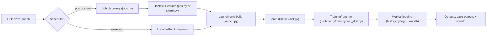
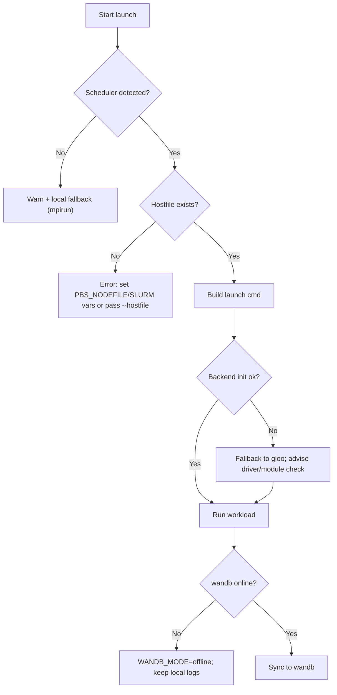

# Architecture (WIP)

> How the pieces of `ezpz` fit together.

## Goals

- One consistent entrypoint (`ezpz launch`) that adapts to local or scheduler-backed runs.
- Reusable primitives for device discovery, job metadata, and launch command construction.
- Simple hooks for logging/metrics, profiling, and reproducible env setup.

## High-Level Flow

- **CLI → Launcher:** User calls `ezpz launch`).
  CLI parses args/env, detects scheduler, and prepares a launch command.
- **Scheduler Detection:** `jobs.py` + `pbs.py` / `slurm.py` inspect hostfiles,
  env vars, and queue state to derive `NHOSTS`, `NGPU_PER_HOST`, `WORLD_SIZE`,
  and hostfile paths.
- **Command Assembly:** `launch.py` builds the final `{mpiexec|srun|mpirun}`
  invocation, injects Python executable when needed, and applies log filters
  for system-specific noise.
- **Distributed Setup:** `dist.py` initializes torch distributed (DDP/TP/PP),
  handles backend selection (NCCL/XCCL/Gloo fallback), and wires rank/world-size
  environment.
- **Runtime/Training:** `runtime.py`, `train.py`, and `test_dist.py`
  demonstrate model construction, optimizer setup, and training loops; `tp/`
  houses tensor-parallel helpers.
- **Logging & History:** `history.py`, `log/`, and wandb integration capture
  metrics, plots, and artifacts; outputs land in `outputs/ezpz.*`.
- **Utils & Env:** `utils/` contains shell helpers (`bin/utils.sh`), env
  packaging (`yeet_env.py`, `tar_env.py`), lazy imports, and job env save/load.
- **Integrations:** `hf_trainer.py`, `integrations.py`, and `cria.py` provide
  bridges to HF and other runtimes.

## Key Components (outline)

- `launch.py` — CLI + command builder; scheduler-aware vs. local fallback
  paths.
- `jobs.py` — shared job metadata helpers; scheduler-neutral layer.
- `pbs.py` / `slurm.py` — scheduler-specific discovery 
  (hostfiles, env vars, GPU counts).
- `dist.py` — torch distributed bootstrap; device/backend selection; rank/env
  plumbing.
- `tp/` — tensor-parallel utilities and policies.
- `history.py` — metric logging, plotting, offline/online wandb support.
- `train.py` / `runtime.py` — training orchestration; configurable entrypoints.
- `test_dist.py` — reference distributed workload and smoke-test.
- `utils/` — shell helpers, env management (`yeet`/`tar`), lazy imports, job
  env save/load.
- `integrations.py` / `hf_trainer.py` / `cria.py` — ecosystem hooks (HF, custom
  runners).

## Data & Control Flow (to expand)

- Diagram: CLI → scheduler detection → launch cmd → distributed init → training → logging/output.

- Config propagation (to expand):
  - CLI args → parsed in `launch.py` / workload modules.
  - Hydra/OmegaConf configs (if used) → merged into runtime/train params.
  - Environment-derived settings (`WORLD_SIZE`, `MASTER_ADDR`, `MASTER_PORT`) injected before torch init.
  - Workload kwargs flow into model/optimizer/trainer builders.

- Error/exit paths (to expand):
  - Scheduler detection fails → fallback to local; warn and suggest `--hostfile/--np/--ppn`.
  - Missing hostfile → raise with hint to set `PBS_NODEFILE` or pass `--hostfile`.
  - Backend init fails → retry/fallback to `gloo` (debug), surface driver/module guidance.
  - wandb network issues → default to offline or warn; keep outputs local.

## Extensibility Notes (to expand)

- How to add a new scheduler plugin.
- How to plug in a new backend or launcher flag.
- How to customize logging/filters and output locations.
