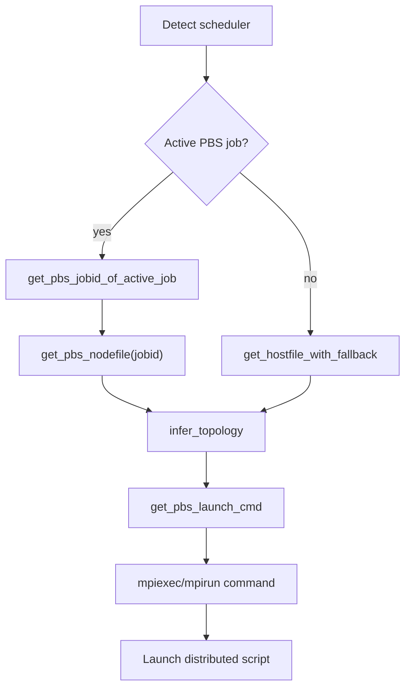

# 🍋 `ezpz` PBS Guide

> Hardware-agnostic distributed PyTorch on PBS with automatic topology inference and CPU binding.

## 🚀 Quick Start

To build a PBS-aware launch command (using the current job’s hostfile when available):

- Discover active PBS job ID:

    ```python
    >>> import ezpz
    >>> import ezpz.pbs
    >>> # Discover active job and hostfile (falls back to default hostfile if none)
    >>> jobid = ezpz.pbs.get_pbs_jobid_of_active_job()
    >>> print(jobid)
    12459205
    ```

- Get PBS Hostfile:

    ```python
    >>> hostfile = ezpz.pbs.get_pbs_nodefile(jobid=jobid)
    >>> print(hostfile)
    /var/spool/pbs/aux/12459205.sunspot-pbs-0001.head.cm.sunspot.alcf.anl.gov
    ```

- Build the launch command with inferred topology:

    ```python
    >>> launch_cmd = ezpz.pbs.get_pbs_launch_cmd(hostfile=hostfile)
    [2026-01-16 08:58:58,119421][I][ezpz/pbs:267:get_pbs_launch_cmd] ✅ Using [24/24] GPUs [2 hosts] x [12 GPU/host]

    >>> # Build the mpiexec/mpirun command with inferred topology + CPU binding
    >>> print(launch_cmd)
    mpiexec --envall --np=24 --ppn=12 --hostfile=/var/spool/pbs/aux/12459205.sunspot-pbs-0001.head.cm.sunspot.alcf.anl.gov --no-vni --cpu-bind=verbose,list:2-4:10-12:18-20:26-28:34-36:42-44:54-56:62-64:70-72:78-80:86-88:94-96
    ```

- Launch directly from python using `subprocess`:

    ```python
    >>> import subprocess
    >>> subprocess.run(f"{launch_cmd} --line-buffer python3 -c 'import ezpz; print(ezpz.setup_torch())'", shell=True, check=True)
    ```

    ??? success "Expected Output"

        ````python
        0
        Using [24 / 24] available "xpu" devices !!
        1
        2
        12
        13
        3
        14
        15
        16
        17
        4
        18
        19
        20
        21
        22
        23
        5
        6
        7
        8
        9
        10
        11
        CompletedProcess(args="mpiexec --envall --np=24 --ppn=12 --hostfile=/var/spool/pbs/aux/12459205.sunspot-pbs-0001.head.cm.sunspot.alcf.anl.gov --no-vni --cpu-bind=verbose,list:2-4:10-12:18-20:26-28:34-36:42-44:54-56:62-64:70-72:78-80:86-88:94-96 --line-buffer python3 -c 'import ezpz; print(ezpz.setup_torch())'", returncode=0)
        ```

## 🧭 What the PBS helpers do

- Detect your active PBS job (if any) and locate its nodefile.
- Infer topology (`ngpus`, `nhosts`, `ngpu_per_host`) from the hostfile and machine limits unless you override them.
- Build the correct launcher (`mpiexec`/`mpirun`) with sensible CPU binding:
  - Intel GPU machines (`aurora`, `sunspot`) get `--no-vni` and vendor binding lists.
  - If `CPU_BIND` is set, its value is forwarded verbatim.
  - Otherwise, a generic `--cpu-bind=depth --depth=8` is applied.
- Optionally inject PBS environment metadata (`PBS_NODEFILE`, host list, launch command) via `get_pbs_env`.



## 🔍 Discovering jobs and hostfiles

- `pbs.get_pbs_running_jobs_for_user() -> dict[str, list[str]]`: all running jobs for the current user with their node lists.
- `pbs.get_pbs_jobid_of_active_job() -> str | None`: job that includes the current host (or `None` if not on a PBS job).
- `pbs.get_pbs_nodefile(jobid=None) -> str | None`: path to the nodefile for a job (active job by default).

    ```python
    # Example: locate the nodefile for the active job
    >>> hostfile = ezpz.pbs.get_pbs_nodefile()
    >>> hostfile
    '/var/spool/pbs/aux/12459205.sunspot-pbs-0001.head.cm.sunspot.alcf.anl.gov'
    ```

## 🧮 Topology inference

`get_pbs_launch_cmd` will infer topology when you omit values:

- If you set `nhosts`: it uses all GPUs per host for that many hosts.
- If you set `ngpu_per_host`: `ngpus = nhosts * ngpu_per_host`.
- If you set `ngpus` only: `ngpu_per_host = ngpus / nhosts` (must divide evenly).
- If nothing is specified:  
  Infer topology automatically and use **all GPUs** on _all hosts_ in the
  hostfile

    ```python
    >>> launch_cmd = ezpz.pbs.get_pbs_launch_cmd()
    [2026-01-16 09:17:26,226619][I][ezpz/pbs:267:get_pbs_launch_cmd] ✅ Using [24/24] GPUs [2 hosts] x [12 GPU/host]
    >>> print(launch_cmd)
    mpiexec --envall --np=24 --ppn=12 --hostfile=/var/spool/pbs/aux/12459205.sunspot-pbs-0001.head.cm.sunspot.alcf.anl.gov --no-vni --cpu-bind=verbose,list:2-4:10-12:18-20:26-28:34-36:42-44:54-56:62-64:70-72:78-80:86-88:94-96
    ```

- Any inconsistent combination raises `ValueError`

## 🪄 Building launch commands

- `pbs.get_pbs_launch_cmd(...) -> str`: build the launcher string (mpiexec/mpirun) with CPU binding.
- `pbs.build_launch_cmd(...) -> str`: scheduler-aware wrapper; currently dispatches to PBS or Slurm.
- Override explicitly when needed:

    ```python
    >>> # from 2 nodes of Aurora
    >>> launch_cmd = ezpz.pbs.get_pbs_launch_cmd(ngpus=8, nhosts=1)
    [2026-01-16 09:14:53,127734][I][ezpz/pbs:267:get_pbs_launch_cmd] ⚠️ Using [8/24] GPUs [1 hosts] x [8 GPU/host]
    [2026-01-16 09:14:53,128623][W][ezpz/pbs:273:get_pbs_launch_cmd] [🚧 WARNING] Using only [8/24] available GPUs!!

    >>> print(launch_cmd)
    mpiexec --envall --np=8 --ppn=8 --hostfile=/var/spool/pbs/aux/12459205.sunspot-pbs-0001.head.cm.sunspot.alcf.anl.gov --no-vni --cpu-bind=verbose,list:2-4:10-12:18-20:26-28:34-36:42-44:54-56:62-64:70-72:78-80:86-88:94-96
    ```

## 🌳 Environment injection

- `pbs.get_pbs_env(hostfile=None, jobid=None, verbose=False) -> dict[str, str]`:
  - Adds PBS-derived metadata (host list, counts, `LAUNCH_CMD`) into `os.environ`.
  - Useful for passing context into downstream tools or logging.

    ```python
    >>> env = pbs.get_pbs_env(verbose=True)
    [2026-01-16 09:19:21,899146][I][ezpz/pbs:267:get_pbs_launch_cmd] ✅ Using [24/24] GPUs [2 hosts] x [12 GPU/host]

    [pbsenv]:
    • PBS_O_WORKDIR=/lus/tegu/projects/datascience/foremans/projects/saforem2/ezpz
    • PBS_JOBID=12459205.sunspot-pbs-0001.head.cm.sunspot.alcf.anl.gov
    • PBS_NODEFILE=/var/spool/pbs/aux/12459205.sunspot-pbs-0001.head.cm.sunspot.alcf.anl.gov
    • HOSTFILE=/var/spool/pbs/aux/12459205.sunspot-pbs-0001.head.cm.sunspot.alcf.anl.gov
    • HOSTS=[x1921c1s2b0n0-hsn0, x1921c1s5b0n0-hsn0]
    • NHOSTS=2
    • NGPU_PER_HOST=12
    • NGPUS=24
    • NGPUS_AVAILABLE=24
    • MACHINE=SunSpot
    • DEVICE=xpu
    • BACKEND=xccl
    • LAUNCH_CMD=mpiexec --envall --np=24 --ppn=12 --hostfile=/var/spool/pbs/aux/12459205.sunspot-pbs-0001.head.cm.sunspot.alcf.anl.gov --no-vni --cpu-bind=verbose,list:2-4:10-12:18-20:26-28:34-36:42-44:54-56:62-64:70-72:78-80:86-88:94-96
    • WORLD_SIZE_TOTAL=24
    ```

## 🧪 Minimal end-to-end launch

```python
import subprocess
from ezpz import pbs

hostfile = pbs.get_pbs_nodefile()  # falls back if not on PBS
cmd = pbs.get_pbs_launch_cmd(hostfile=hostfile, ngpus=4)

# Run a distributed smoke test
subprocess.run(f"{cmd} python -m ezpz.test_dist", shell=True, check=True)
```

## 📌 Notes

- If no PBS job is active, `get_pbs_launch_cmd` still works using the fallback hostfile and machine introspection.
- CPU binding precedence: `CPU_BIND` env > machine-specific defaults > generic depth binding.
- Combine with `ezpz.launch` if you want scheduler-agnostic CLI parsing and fallbacks.
