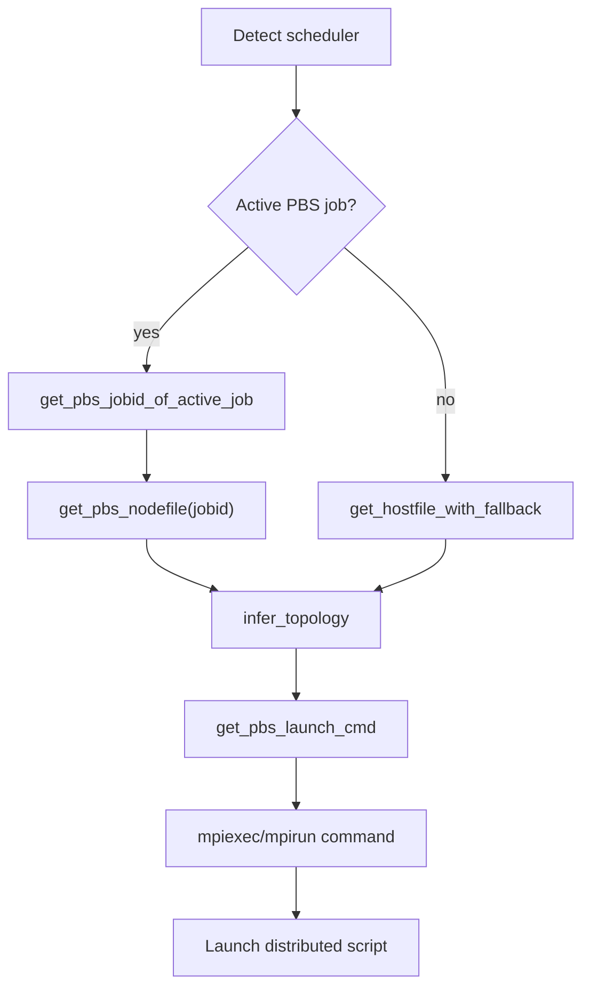

# 🍋 `ezpz` PBS Guide

> Hardware-agnostic distributed PyTorch on PBS with automatic topology inference and CPU binding.

## 🚀 Quick Start

To build a PBS-aware launch command (using the current job’s hostfile when available):

```python
import ezpz
from ezpz import pbs

# Discover active job and hostfile (falls back to default hostfile if none)
jobid = pbs.get_pbs_jobid_of_active_job()
hostfile = pbs.get_pbs_nodefile(jobid=jobid)

# Build the mpiexec/mpirun command with inferred topology + CPU binding
launch_cmd = pbs.get_pbs_launch_cmd(hostfile=hostfile)
print(launch_cmd)

# Use the launcher to run your distributed script
import subprocess
subprocess.run(f"{launch_cmd} python -m ezpz.test_dist", shell=True, check=True)
```

## 🧭 What the PBS helpers do

- Detect your active PBS job (if any) and locate its nodefile.
- Infer topology (`ngpus`, `nhosts`, `ngpu_per_host`) from the hostfile and machine limits unless you override them.
- Build the correct launcher (`mpiexec`/`mpirun`) with sensible CPU binding:
    - Intel GPU machines (`aurora`, `sunspot`) get `--no-vni` and vendor binding lists.
    - If `CPU_BIND` is set, its value is forwarded verbatim.
    - Otherwise, a generic `--cpu-bind=depth --depth=8` is applied.
- Optionally inject PBS environment metadata (`PBS_NODEFILE`, host list, launch command) via `get_pbs_env`.



## 🔍 Discovering jobs and hostfiles

- `pbs.get_pbs_running_jobs_for_user() -> dict[str, list[str]]`: all running jobs for the current user with their node lists.
- `pbs.get_pbs_jobid_of_active_job() -> str | None`: job that includes the current host (or `None` if not on a PBS job).
- `pbs.get_pbs_nodefile(jobid=None) -> str | None`: path to the nodefile for a job (active job by default).

```python
# Example: locate the nodefile for the active job
hostfile = pbs.get_pbs_nodefile()
print(hostfile)  # e.g., /var/spool/pbs/aux/12345.hosts
```

## 🧮 Topology inference

`get_pbs_launch_cmd` will infer topology when you omit values:

- If nothing is specified: use all GPUs on all hosts in the hostfile.
- If you set `nhosts`: it uses all GPUs per host for that many hosts.
- If you set `ngpu_per_host`: `ngpus = nhosts * ngpu_per_host`.
- If you set `ngpus` only: `ngpu_per_host = ngpus / nhosts` (must divide evenly).
- Any inconsistent combination raises `ValueError`.

Override explicitly when needed:

```python
# Use 8 GPUs total across 2 hosts (4 per host)
launch_cmd = pbs.get_pbs_launch_cmd(ngpus=8, nhosts=2)
```

## 🪄 Building launch commands

- `pbs.get_pbs_launch_cmd(...) -> str`: build the launcher string (mpiexec/mpirun) with CPU binding.
- `pbs.build_launch_cmd(...) -> str`: scheduler-aware wrapper; currently dispatches to PBS or Slurm.

```python
# Force a specific hostfile and gpu topology
launch_cmd = pbs.get_pbs_launch_cmd(
    hostfile="/path/to/hostfile",
    ngpus=16,
    ngpu_per_host=8,
)
print(launch_cmd)
```

## 🌳 Environment injection

- `pbs.get_pbs_env(hostfile=None, jobid=None, verbose=False) -> dict[str, str]`:
    - Adds PBS-derived metadata (host list, counts, `LAUNCH_CMD`) into `os.environ`.
    - Useful for passing context into downstream tools or logging.

```python
env = pbs.get_pbs_env(verbose=True)
# os.environ now contains LAUNCH_CMD, HOSTS, NHOSTS, NGPUS, etc.
```

## 🧪 Minimal end-to-end launch

```python
import subprocess
from ezpz import pbs

hostfile = pbs.get_pbs_nodefile()  # falls back if not on PBS
cmd = pbs.get_pbs_launch_cmd(hostfile=hostfile, ngpus=4)

# Run a distributed smoke test
subprocess.run(f"{cmd} python -m ezpz.test_dist", shell=True, check=True)
```

## 📌 Notes

- If no PBS job is active, `get_pbs_launch_cmd` still works using the fallback hostfile and machine introspection.
- CPU binding precedence: `CPU_BIND` env > machine-specific defaults > generic depth binding.
- Combine with `ezpz.launch` if you want scheduler-agnostic CLI parsing and fallbacks.
