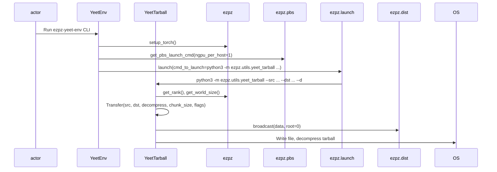
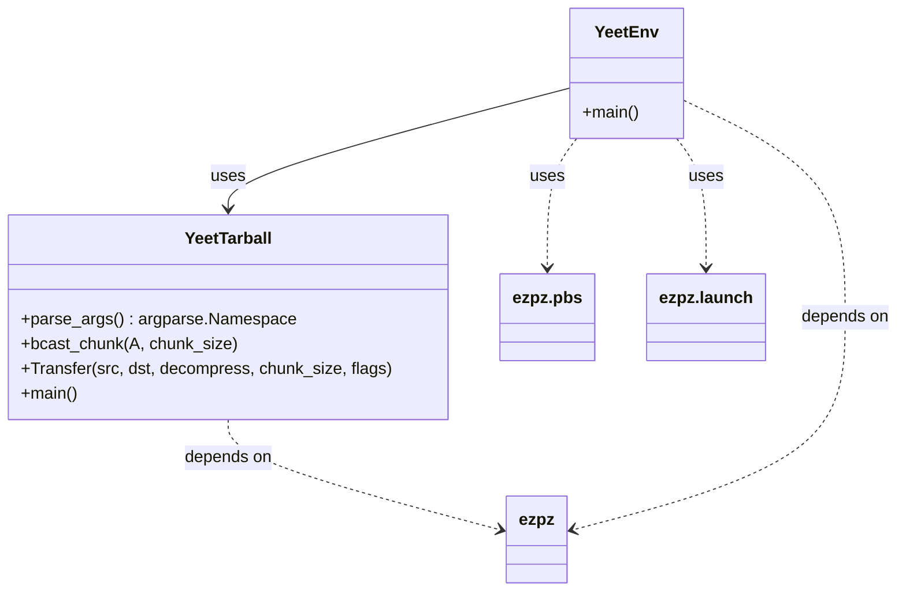
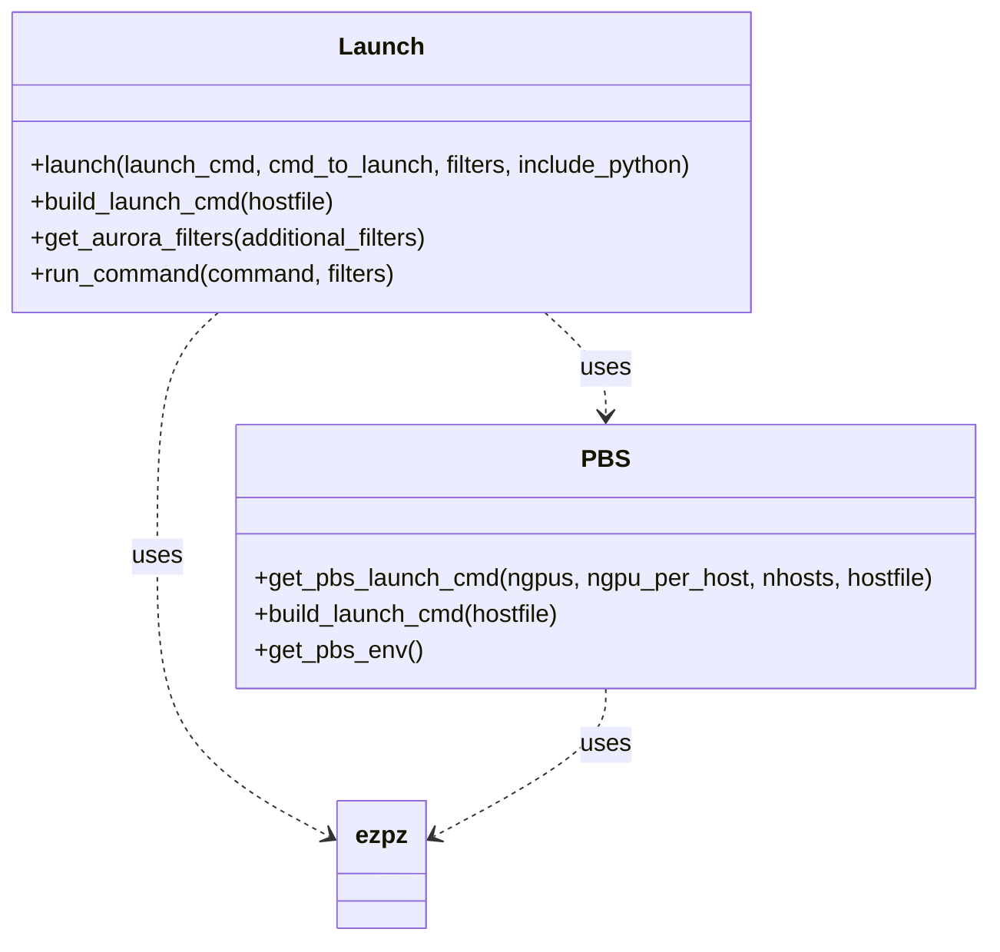
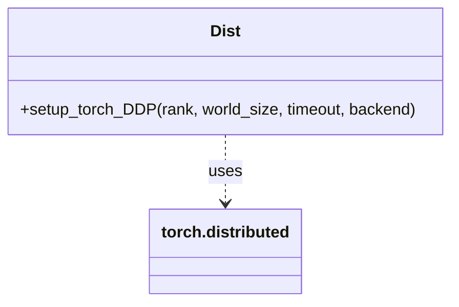

# 📦 Shareable, Scalable Python Environments

<!--
- We can use the
  [ezpz/utils/`yeet_env.py`](https://github.com/saforem2/ezpz/blob/main/src/ezpz/utils/yeet_env.py)
  utility to distribute our tarball (containing the python environment) to
  `/tmp/` on all of our worker nodes.

  ```bash
  TARBALL=/flare/datascience/foremans/micromamba/envs/2025-07-pt28.tar.gz
  ezpz-yeet-env --src "${TARBALL}" --dst "/tmp/$(basename ${TARBALL})" --d
  conda deactivate
  conda activate "/tmp/$(basename ${TARBALL})"
  ```
-->
<details closed><summary>Sourcery Review</summary>

<!-- Generated by sourcery-ai[bot]: start review_guide -->

## Reviewer's Guide

This PR reorganizes the utils package, adds robust distributed tarball transfer scripts and CLI, and refactors the core launch/PBS routines for more flexible command construction, parameter validation, and enhanced logging/filtering.

#### Sequence diagram for distributed tarball transfer and extraction



#### Class diagram for new distributed tarball transfer utilities



#### Class diagram for refactored launch and PBS routines



#### Class diagram for improved torch distributed setup



### File-Level Changes

| Change | Details | Files |
| ------ | ------- | ----- |
| Add distributed tarball transfer utilities and CLI entry | <ul><li>Introduce yeet_tarball.py with chunked broadcast and extraction logic</li><li>Add yeet_env.py as a CLI entrypoint for launching distributed transfers</li><li>Register ezpz-yeet-env in pyproject.toml</li><li>Restructure utils package by renaming utils.py to utils/__init__.py</li></ul> | `src/ezpz/utils/yeet_tarball.py`<br/>`src/ezpz/utils/yeet_env.py`<br/>`pyproject.toml`<br/>`src/ezpz/utils/__init__.py` |
| Refactor PBS launch command computation with robust parameters and logging | <ul><li>Compute ngpus, nhosts, and ngpu_per_host with validation assertions and fallbacks</li><li>Unify hostfile fallback resolution</li><li>Add info/warning logs about GPU usage and mismatches</li><li>Update build_launch_cmd to accept a hostfile argument and delegate to get_pbs_launch_cmd</li></ul> | `src/ezpz/pbs.py` |
| Enhance launch command construction, filtering, and logging | <ul><li>Introduce EZPZ_LOG_LEVEL and adapt filtering logic in get_aurora_filters</li><li>Log number of filters in run_command</li><li>Extend filtering to include Sunspot and conditional debug behavior</li><li>Update launch() signature to accept launch_cmd and include_python flag</li><li>Dynamically prepend Python executable only when necessary</li></ul> | `src/ezpz/launch.py` |
| Protect torch Distributed initialization | <ul><li>Import torch.distributed and guard init_process_group with is_initialized() check</li></ul> | `src/ezpz/dist.py` |
| Update test script to new launch signature | <ul><li>Modify test.py to call launch(cmd_to_launch=...) instead of positional args</li></ul> | `src/ezpz/test.py` |

---

<details>
<summary>Tips and commands</summary>

#### Interacting with Sourcery

- **Trigger a new review:** Comment `@sourcery-ai review` on the pull request.
- **Continue discussions:** Reply directly to Sourcery's review comments.
- **Generate a GitHub issue from a review comment:** Ask Sourcery to create an
  issue from a review comment by replying to it. You can also reply to a
  review comment with `@sourcery-ai issue` to create an issue from it.
- **Generate a pull request title:** Write `@sourcery-ai` anywhere in the pull
  request title to generate a title at any time. You can also comment
  `@sourcery-ai title` on the pull request to (re-)generate the title at any time.
- **Generate a pull request summary:** Write `@sourcery-ai summary` anywhere in
  the pull request body to generate a PR summary at any time exactly where you
  want it. You can also comment `@sourcery-ai summary` on the pull request to
  (re-)generate the summary at any time.
- **Generate reviewer's guide:** Comment `@sourcery-ai guide` on the pull
  request to (re-)generate the reviewer's guide at any time.
- **Resolve all Sourcery comments:** Comment `@sourcery-ai resolve` on the
  pull request to resolve all Sourcery comments. Useful if you've already
  addressed all the comments and don't want to see them anymore.
- **Dismiss all Sourcery reviews:** Comment `@sourcery-ai dismiss` on the pull
  request to dismiss all existing Sourcery reviews. Especially useful if you
  want to start fresh with a new review - don't forget to comment
  `@sourcery-ai review` to trigger a new review!

#### Customizing Your Experience

Access your [dashboard](https://app.sourcery.ai) to:
- Enable or disable review features such as the Sourcery-generated pull request
  summary, the reviewer's guide, and others.
- Change the review language.
- Add, remove or edit custom review instructions.
- Adjust other review settings.

#### Getting Help

- [Contact our support team](mailto:support@sourcery.ai) for questions or feedback.
- Visit our [documentation](https://docs.sourcery.ai) for detailed guides and information.
- Keep in touch with the Sourcery team by following us on [X/Twitter](https://x.com/SourceryAI), [LinkedIn](https://www.linkedin.com/company/sourcery-ai/) or [GitHub](https://github.com/sourcery-ai).

</details>

<!-- Generated by sourcery-ai[bot]: end review_guide -->


</details>


## 👀 Overview

We provide mechanisms for:

1. `ezpz-tar-env`: Creating tarball from {conda, virtual} environment
2. `ezpz-yeet-env`: Copying an environment tarball to `/tmp/` on _all worker nodes_

## 🔍 Details

1. `ezpz-tar-env`: Creating tarball from {conda, virtual} environment

   By default, this will try and create a tarball from the environment which it
   was invoked and place it in the working directory.

   ```bash
   source <(curl -L https://bit.ly/ezpz-utils)
   ezpz_load_new_pt_modules_aurora
   conda activate /flare/datascience/foremans/micromamba/envs/2025-08-pt29
   uv pip install --link-mode=copy --no-cache "git+https://github.com/saforem2/ezpz"
   ezpz-tar-env
   ```

2. `ezpz-yeet-env`: Copying an environment tarball to `/tmp/` on _all worker nodes_

   Following from (1.):

   <details closed><summary>Example:</summary>

   ```bash
   #[🐍 aurora_nre_models_frameworks-2025.0.0](👻 Megatron-DeepSpeed-aurora_nre_models_frameworks-2025.0.0)
   #[/f/A/A/E/A/l/t/Megatron-DeepSpeed][🌱 saforem2/fix-formatting][📝✓] [⏱️ 39s]
   #[08/27/25 @ 07:05:40][x4310c3s2b0n0]
   ; ezpz-yeet-env --src /flare/datascience/foremans/micromamba/envs/2025-07-pt28.tar.gz
   [W827 07:06:16.417068005 OperatorEntry.cpp:155] Warning: Warning only once for all operators,  other operators may also be overridden.
     Overriding a previously registered kernel for the same operator and the same dispatch key
     operator: aten::_cummax_helper(Tensor self, Tensor(a!) values, Tensor(b!) indices, int dim) -> ()
       registered at /build/pytorch/build/aten/src/ATen/RegisterSchema.cpp:6
     dispatch key: XPU
     previous kernel: registered at /build/pytorch/build/aten/src/ATen/RegisterCPU.cpp:30476
          new kernel: registered at /build/intel-pytorch-extension/build/Release/csrc/gpu/csrc/aten/generated/ATen/RegisterXPU.cpp:2971 (function operator())
   AttributeError: 'MessageFactory' object has no attribute 'GetPrototype'
   AttributeError: 'MessageFactory' object has no attribute 'GetPrototype'
   AttributeError: 'MessageFactory' object has no attribute 'GetPrototype'
   AttributeError: 'MessageFactory' object has no attribute 'GetPrototype'
   AttributeError: 'MessageFactory' object has no attribute 'GetPrototype'
   [2025-08-27 07:06:31,305112][I][ezpz/__init__:266:<module>] Setting logging level to 'INFO' on 'RANK == 0'
   [2025-08-27 07:06:31,307431][I][ezpz/__init__:267:<module>] Setting logging level to 'CRITICAL' on all others 'RANK != 0'
   [2025-08-27 07:06:31,370862][I][ezpz/pbs:228:get_pbs_launch_cmd] ⚠️ Using [2/24] GPUs [2 hosts] x [1 GPU/host]
   [2025-08-27 07:06:31,371583][W][utils/_logger:68:warning] [🚧 WARNING] Using only [2/24] available GPUs!!


   [2025-08-27 07:06:31,372710][I][ezpz/launch:356:launch] ----[🍋 ezpz.launch][started][2025-08-27-070631]----
   [2025-08-27 07:06:35,996997][I][ezpz/launch:361:launch] Job ID: 7423085
   [2025-08-27 07:06:35,997889][I][ezpz/launch:362:launch] nodelist: ['x4310c3s2b0n0', 'x4310c3s3b0n0']
   [2025-08-27 07:06:35,998288][I][ezpz/launch:363:launch] hostfile: /var/spool/pbs/aux/7423085.aurora-pbs-0001.hostmgmt.cm.aurora.alcf.anl.gov
   [2025-08-27 07:06:35,998882][I][ezpz/launch:332:build_executable] Building command to execute by piecing together:
   [2025-08-27 07:06:35,999235][I][ezpz/launch:333:build_executable] (1.) launch_cmd: mpiexec --verbose --envall --np=2 --ppn=1 --hostfile=/var/spool/pbs/aux/7423085.aurora-pbs-0001.hostmgmt.cm.aurora.alcf.anl.gov --no-vni --cpu-bind=verbose,list:2-4:10-12:18-20:26-28:34-36:42-44:54-56:62-64:70-72:78-80:86-88:94-96
   [2025-08-27 07:06:35,999996][I][ezpz/launch:334:build_executable] (2.) cmd_to_launch: /lus/flare/projects/AuroraGPT/AuroraGPT-v1/Experiments/AuroraGPT-2B/large-batch-training/tok50M-n512/Megatron-DeepSpeed/venvs/aurora/Megatron-DeepSpeed-aurora_nre_models_frameworks-2025.0.0/bin/python3 -m ezpz.utils.yeet_tarball --src /flare/datascience/foremans/micromamba/envs/2025-07-pt28.tar.gz
   [2025-08-27 07:06:36,000942][I][ezpz/launch:441:launch] Took: 4.63 seconds to build command.
   [2025-08-27 07:06:36,001306][I][ezpz/launch:444:launch] Executing:
   mpiexec
     --verbose
     --envall
     --np=2
     --ppn=1
     --hostfile=/var/spool/pbs/aux/7423085.aurora-pbs-0001.hostmgmt.cm.aurora.alcf.anl.gov
     --no-vni
     --cpu-bind=verbose,list:2-4:10-12:18-20:26-28:34-36:42-44:54-56:62-64:70-72:78-80:86-88:94-96
     /lus/flare/projects/AuroraGPT/AuroraGPT-v1/Experiments/AuroraGPT-2B/large-batch-training/tok50M-n512/Megatron-DeepSpeed/venvs/aurora/Megatron-DeepSpeed-aurora_nre_models_frameworks-2025.0.0/bin/python3
     -m
     ezpz.utils.yeet_tarball
     --src
     /flare/datascience/foremans/micromamba/envs/2025-07-pt28.tar.gz
   [2025-08-27 07:06:36,002863][I][ezpz/launch:176:get_aurora_filters] Filtering for Aurora-specific messages. To view list of filters, run with EZPZ_LOG_LEVEL=DEBUG
   [2025-08-27 07:06:36,003361][I][ezpz/launch:460:launch] Execution started @ 2025-08-27-070636...
   [2025-08-27 07:06:36,003769][I][ezpz/launch:463:launch] ----[🍋 ezpz.launch][stop][2025-08-27-070636]----
   [2025-08-27 07:06:36,004212][I][ezpz/launch:99:run_command] Caught 20 filters
   [2025-08-27 07:06:36,004568][I][ezpz/launch:100:run_command] Running command:
    mpiexec --verbose --envall --np=2 --ppn=1 --hostfile=/var/spool/pbs/aux/7423085.aurora-pbs-0001.hostmgmt.cm.aurora.alcf.anl.gov --no-vni --cpu-bind=verbose,list:2-4:10-12:18-20:26-28:34-36:42-44:54-56:62-64:70-72:78-80:86-88:94-96 /lus/flare/projects/AuroraGPT/AuroraGPT-v1/Experiments/AuroraGPT-2B/large-batch-training/tok50M-n512/Megatron-DeepSpeed/venvs/aurora/Megatron-DeepSpeed-aurora_nre_models_frameworks-2025.0.0/bin/python3 -m ezpz.utils.yeet_tarball --src /flare/datascience/foremans/micromamba/envs/2025-07-pt28.tar.gz
   Disabling local launch: multi-node application
   Connected to tcp://x4310c3s2b0n0.hsn.cm.aurora.alcf.anl.gov:7919
   Launching application 698d8ba4-c450-462a-9ca4-a8417c34c397
   cpubind:list x4310c3s2b0n0 pid 59558 rank 0 0: mask 0x1c
   cpubind:list x4310c3s3b0n0 pid 155510 rank 1 0: mask 0x1c
   [2025-08-27 07:06:57,894515][I][ezpz/__init__:266:<module>] Setting logging level to 'INFO' on 'RANK == 0'
   [2025-08-27 07:06:57,897149][I][ezpz/__init__:267:<module>] Setting logging level to 'CRITICAL' on all others 'RANK != 0'
   [2025-08-27 07:06:57,947956][I][ezpz/dist:1171:setup_torch_distributed] Using fw='ddp' with torch_{device,backend}= {xpu, ccl}
   [2025-08-27 07:06:57,949111][I][ezpz/dist:1035:setup_torch_DDP] Caught MASTER_PORT=49717 from environment!
   [2025-08-27 07:06:57,949810][I][ezpz/dist:1051:setup_torch_DDP] Using torch.distributed.init_process_group with
   - master_addr='x4310c3s2b0n0.hsn.cm.aurora.alcf.anl.gov'
   - master_port='49717'
   - world_size=2
   - rank=0
   - local_rank=0
   - timeout=datetime.timedelta(seconds=3600)
   - backend='ccl'
   [2025-08-27 07:06:57,950782][I][ezpz/dist:768:init_process_group] Calling torch.distributed.init_process_group_with: rank=0 world_size=2 backend=ccl
   [2025-08-27 07:08:29,612139][I][ezpz/pbs:228:get_pbs_launch_cmd] ✅ Using [24/24] GPUs [2 hosts] x [12 GPU/host]
   2025:08:27-07:08:29:(59558) |CCL_WARN| value of CCL_LOG_LEVEL changed to be error (default:warn)
   [2025-08-27 07:08:29,844993][I][ezpz/dist:1389:setup_torch] Using device='xpu' with backend='ccl' + 'ccl' for distributed training.
   [2025-08-27 07:08:29,845655][I][ezpz/dist:1434:setup_torch] ['x4310c3s2b0n0'][0/1]
   [2025-08-27 07:08:29,844938][I][ezpz/dist:1434:setup_torch] ['x4310c3s3b0n0'][1/1]
   [2025-08-27 07:08:29,850193][I][utils/yeet_tarball:180:main] Copying /lus/flare/projects/datascience/foremans/micromamba/envs/2025-07-pt28.tar.gz to /tmp/2025-07-pt28.tar.gz
   [2025-08-27 07:08:29,850810][I][utils/yeet_tarball:87:transfer] Transfer started at 2025-08-27-070829
   [2025-08-27 07:08:33,558579][I][utils/yeet_tarball:94:transfer]

   [2025-08-27 07:08:33,559439][I][utils/yeet_tarball:95:transfer] ==================
   [2025-08-27 07:08:33,559851][I][utils/yeet_tarball:96:transfer] Rank-0 loading library /lus/flare/projects/datascience/foremans/micromamba/envs/2025-07-pt28.tar.gz took 3.7073152649682015 seconds
   [2025-08-27 07:08:33,560291][I][utils/yeet_tarball:58:bcast_chunk] size of data 4373880261
     0%|          | 0/33 [00:00<?, ?it/s]
     3%|3         | 1/33 [00:00<00:07,  4.07it/s]
     6%|6         | 2/33 [00:00<00:07,  4.08it/s]
     9%|9         | 3/33 [00:00<00:07,  4.11it/s]
    12%|#2        | 4/33 [00:00<00:07,  4.13it/s]
    15%|#5        | 5/33 [00:01<00:06,  4.16it/s]
    18%|#8        | 6/33 [00:01<00:06,  4.17it/s]
    21%|##1       | 7/33 [00:01<00:06,  4.19it/s]
    24%|##4       | 8/33 [00:01<00:05,  4.19it/s]
    27%|##7       | 9/33 [00:02<00:05,  4.21it/s]
    30%|###       | 10/33 [00:02<00:05,  4.22it/s]
    33%|###3      | 11/33 [00:02<00:05,  4.23it/s]
    36%|###6      | 12/33 [00:02<00:04,  4.23it/s]
    39%|###9      | 13/33 [00:03<00:04,  4.24it/s]
    42%|####2     | 14/33 [00:03<00:04,  4.26it/s]
    45%|####5     | 15/33 [00:03<00:04,  4.28it/s]
    48%|####8     | 16/33 [00:03<00:03,  4.29it/s]
    52%|#####1    | 17/33 [00:04<00:03,  4.31it/s]
    55%|#####4    | 18/33 [00:04<00:03,  4.32it/s]
    58%|#####7    | 19/33 [00:04<00:03,  4.33it/s]
    61%|######    | 20/33 [00:04<00:03,  4.33it/s]
    64%|######3   | 21/33 [00:04<00:02,  4.34it/s]
    67%|######6   | 22/33 [00:05<00:02,  4.34it/s]
    70%|######9   | 23/33 [00:05<00:02,  4.34it/s]
    73%|#######2  | 24/33 [00:05<00:02,  4.30it/s]
    76%|#######5  | 25/33 [00:05<00:01,  4.28it/s]
    79%|#######8  | 26/33 [00:06<00:01,  4.28it/s]
    82%|########1 | 27/33 [00:06<00:01,  4.29it/s]
    85%|########4 | 28/33 [00:06<00:01,  4.29it/s]
    88%|########7 | 29/33 [00:06<00:00,  4.30it/s]
    91%|######### | 30/33 [00:07<00:00,  4.30it/s]
    94%|#########3| 31/33 [00:07<00:00,  4.31it/s]
    97%|#########6| 32/33 [00:07<00:00,  4.32it/s]
   100%|##########| 33/33 [00:07<00:00,  4.95it/s]
   100%|##########| 33/33 [00:07<00:00,  4.32it/s]

   [2025-08-27 07:08:44,307307][I][utils/yeet_tarball:105:transfer] Broadcast took 8.710064542014152 seconds
   [2025-08-27 07:08:44,307939][I][utils/yeet_tarball:106:transfer] Writing to the disk /tmp/2025-07-pt28.tar.gz took 2.037590510910377
   [2025-08-27 07:09:53,840779][I][utils/yeet_tarball:115:transfer] untar took 69.53 seconds
   [2025-08-27 07:09:53,841559][I][utils/yeet_tarball:116:transfer] Total time: 83.99032527511008 seconds
   [2025-08-27 07:09:53,841947][I][utils/yeet_tarball:117:transfer] ==================

   Application 698d8ba4 resources: utime=163s stime=48s maxrss=11959864KB inblock=8917718 oublock=16 minflt=622483 majflt=4481 nvcsw=966457 nivcsw=773
   [2025-08-27 07:09:59,205952][I][ezpz/launch:467:launch] Execution finished with 0.
   [2025-08-27 07:09:59,206883][I][ezpz/launch:468:launch] Executing finished in 203.20 seconds.
   [2025-08-27 07:09:59,207470][I][ezpz/launch:469:launch] Took 203.21 seconds to run. Exiting.
   took: 0h:03m:48s
   ```

   </details>
