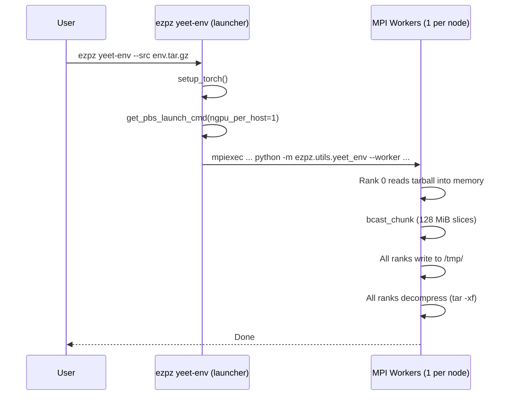

# Shareable, Scalable Python Environments

On large HPC clusters, installing Python packages on every node from a shared
filesystem can be slow and creates I/O contention.  ezpz provides two CLI
utilities to solve this:

1. **`ezpz tar-env`** — Archive the current Python environment into a `.tar.gz`
2. **`ezpz yeet-env`** — Broadcast that tarball to `/tmp/` on every worker node
   via MPI, then decompress it locally

After this, each node has a fast, local copy of the environment on node-local
storage.

## Quick Start

```bash
# Step 1: Create a tarball of the active environment
ezpz tar-env

# Step 2: Broadcast it to all nodes and decompress
ezpz yeet-env --src /path/to/myenv.tar.gz
```

Or, if the `MAKE_TARBALL` environment variable is set, `yeet-env` will
auto-create the tarball before broadcasting.

After transfer, activate the local copy:

```bash
conda deactivate
conda activate /tmp/myenv
```

## `ezpz tar-env`

Creates a `.tar.gz` archive from the currently active Python environment.

**Source:** [`src/ezpz/utils/tar_env.py`](https://github.com/saforem2/ezpz/blob/main/src/ezpz/utils/tar_env.py)

### How It Works

1. Derives the environment prefix from `sys.executable`
   (e.g. `/path/to/envs/myenv/bin/python` -> `/path/to/envs/myenv`)
2. Checks for an existing `<env_name>.tar.gz` in `/tmp` or the current directory
3. If not found, creates one with `tar -cvf`
4. Returns the path to the tarball

### Usage

```bash
# Archive the active conda/venv
ezpz tar-env
```

No arguments needed — it auto-detects the running environment.

## `ezpz yeet-env`

Broadcasts a tarball from rank 0 to all worker nodes using MPI, then
optionally decompresses it in-place.

**Source:** [`src/ezpz/utils/yeet_env.py`](https://github.com/saforem2/ezpz/blob/main/src/ezpz/utils/yeet_env.py)

### CLI Arguments

| Flag               | Type  | Default                 | Description                              |
|--------------------|-------|-------------------------|------------------------------------------|
| `--src`            | `str` | _(required)_            | Path to the tarball (or directory to tar) |
| `--dst`            | `str` | `/tmp/<name>.tar.gz`    | Destination path on each worker          |
| `--decompress`     | flag  | `True`                  | Untar after transfer                     |
| `--no-decompress`  | flag  | —                       | Skip decompression                       |
| `--flags`          | `str` | `"xf"`                  | Flags passed to `tar -p -<flags>`        |
| `--chunk-size`     | `int` | `134217728` (128 MiB)   | Chunk size for MPI broadcast             |
| `--overwrite`      | flag  | `False`                 | Overwrite existing tarball at `--dst`    |

### How It Works

```
ezpz yeet-env --src /path/to/env.tar.gz
       |
       v
  (launcher process)
       |
       +-- Spawns MPI workers via ezpz.launch
       |   (one per node, using PBS/SLURM job resources)
       |
       v
  (each worker process)
       |
       +-- Rank 0: reads tarball into memory
       |
       +-- bcast_chunk(): broadcasts in 128 MiB slices
       |   using MPI broadcast (torch.distributed)
       |
       +-- All ranks: write received bytes to --dst
       |
       +-- If --decompress: run tar -p -xf <dst> -C <dirname>
```

The chunked broadcast is necessary because MPI collective operations have
practical size limits, and a typical conda environment tarball can be
several gigabytes.

### Performance

From a real Aurora run (2 nodes, 4.1 GB tarball):

| Phase                | Time      |
|----------------------|-----------|
| Load tarball (rank 0)| 3.7s      |
| MPI broadcast        | 8.7s      |
| Write to disk        | 2.0s      |
| Untar                | 69.5s     |
| **Total**            | **84.0s** |

The broadcast itself is fast; decompression dominates. For very large
environments, consider pre-decompressing on the shared filesystem and
using `--no-decompress` with a directory copy instead.

## Architecture


```mermaid
sequenceDiagram
    participant User
    participant YeetEnv as ezpz yeet-env (launcher)
    participant MPI as MPI Workers (1 per node)

    User->>YeetEnv: ezpz yeet-env --src env.tar.gz
    YeetEnv->>YeetEnv: setup_torch()
    YeetEnv->>YeetEnv: get_pbs_launch_cmd(ngpu_per_host=1)
    YeetEnv->>MPI: mpiexec ... python -m ezpz.utils.yeet_env --worker ...
    MPI->>MPI: Rank 0 reads tarball into memory
    MPI->>MPI: bcast_chunk (128 MiB slices)
    MPI->>MPI: All ranks write to /tmp/
    MPI->>MPI: All ranks decompress (tar -xf)
    MPI-->>User: Done
```

## API Reference

- [`ezpz.utils.tar_env`](../python/Code-Reference/utils/tar_env.md) — tarball creation
- [`ezpz.utils.yeet_env`](../python/Code-Reference/utils/yeet_env.md) — distributed transfer

??? example "Full Aurora example output"

    ```bash
    $ ezpz-yeet-env --src /flare/datascience/foremans/micromamba/envs/2025-07-pt28.tar.gz
    [2025-08-27 07:06:31,305112][I][ezpz/__init__:266:<module>] Setting logging level to 'INFO' on 'RANK == 0'
    [2025-08-27 07:06:31,307431][I][ezpz/__init__:267:<module>] Setting logging level to 'CRITICAL' on all others 'RANK != 0'
    [2025-08-27 07:06:31,370862][I][ezpz/pbs:228:get_pbs_launch_cmd] Using [2/24] GPUs [2 hosts] x [1 GPU/host]
    [2025-08-27 07:06:35,996997][I][ezpz/launch:361:launch] Job ID: 7423085
    [2025-08-27 07:06:35,997889][I][ezpz/launch:362:launch] nodelist: ['x4310c3s2b0n0', 'x4310c3s3b0n0']
    [2025-08-27 07:06:36,001306][I][ezpz/launch:444:launch] Executing:
    mpiexec
      --verbose
      --envall
      --np=2
      --ppn=1
      --hostfile=/var/spool/pbs/aux/7423085.aurora-pbs-0001.hostmgmt.cm.aurora.alcf.anl.gov
      --no-vni
      --cpu-bind=verbose,list:2-4:10-12:18-20:26-28:34-36:42-44:54-56:62-64:70-72:78-80:86-88:94-96
      python3 -m ezpz.utils.yeet_tarball --src /flare/.../2025-07-pt28.tar.gz
    [2025-08-27 07:08:29,850193][I][utils/yeet_tarball:180:main] Copying .../2025-07-pt28.tar.gz to /tmp/2025-07-pt28.tar.gz
    [2025-08-27 07:08:33,559439][I][utils/yeet_tarball:95:transfer] ==================
    [2025-08-27 07:08:33,559851][I][utils/yeet_tarball:96:transfer] Rank-0 loading library took 3.71 seconds
    [2025-08-27 07:08:33,560291][I][utils/yeet_tarball:58:bcast_chunk] size of data 4373880261
    100%|##########| 33/33 [00:07<00:00,  4.32it/s]
    [2025-08-27 07:08:44,307307][I][utils/yeet_tarball:105:transfer] Broadcast took 8.71 seconds
    [2025-08-27 07:08:44,307939][I][utils/yeet_tarball:106:transfer] Writing to disk took 2.04 seconds
    [2025-08-27 07:09:53,840779][I][utils/yeet_tarball:115:transfer] Untar took 69.53 seconds
    [2025-08-27 07:09:53,841559][I][utils/yeet_tarball:116:transfer] Total time: 83.99 seconds
    [2025-08-27 07:09:53,841947][I][utils/yeet_tarball:117:transfer] ==================
    [2025-08-27 07:09:59,207470][I][ezpz/launch:469:launch] Took 203.21 seconds to run. Exiting.
    ```
