# Repository Overview

> **"Write once, run anywhere"** — Portable distributed PyTorch across any
> supported hardware (NVIDIA, AMD, Intel, MPS, CPU) with **zero code changes**.

`ezpz` is a library that abstracts away the complexity of distributed training
in PyTorch. It auto-detects hardware, selects the right communication backend,
discovers node topology via MPI, and wraps models for data/tensor parallelism —
all behind a single function call.

## High-Level Architecture

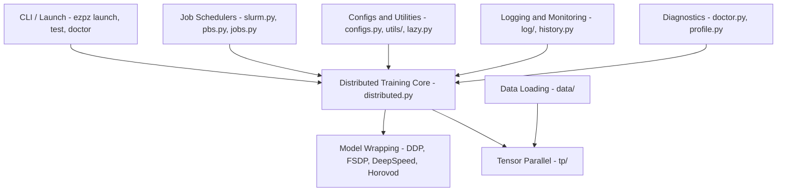

## Core Initialization Flow

The central entry point is `setup_torch()` — a single function call that
bootstraps distributed training regardless of hardware, scheduler, or
framework:

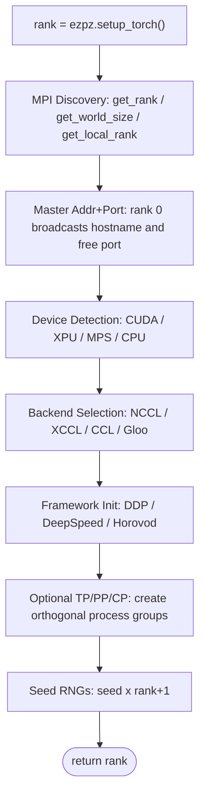

## Lazy Loading Architecture

`import ezpz` is near-instant. Heavy dependencies (`torch`, `mpi4py`) are
deferred until first use via `__getattr__` on the package:

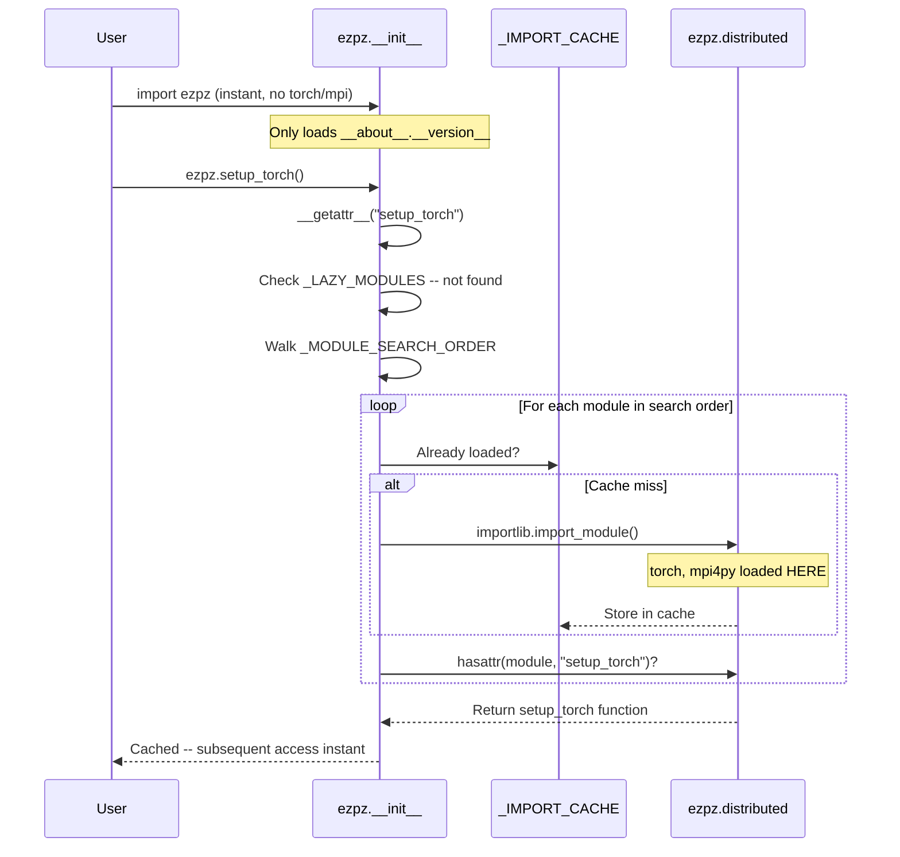

## Module Dependency Graph

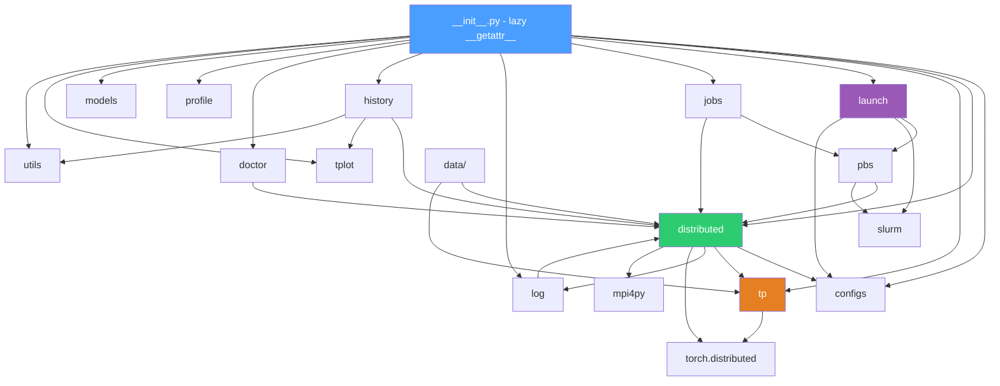

## Hardware & Backend Support Matrix

| | NVIDIA (CUDA) | AMD (ROCm) | Intel (XPU) | Apple (MPS) | CPU |
|---|:---:|:---:|:---:|:---:|:---:|
| **NCCL** | ✅ | — | — | — | — |
| **XCCL** | — | — | ✅ | — | — |
| **CCL** | — | — | ✅* | — | — |
| **Gloo** | ✅ | ✅ | ✅ | ✅ | ✅ |

\* CCL is the fallback when XCCL is unavailable on Intel XPU.

## Device & Backend Detection

The `get_torch_device_type()` and `get_torch_backend()` functions probe
available hardware in priority order:

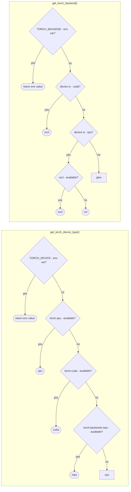

## Model Wrapping Decision Tree

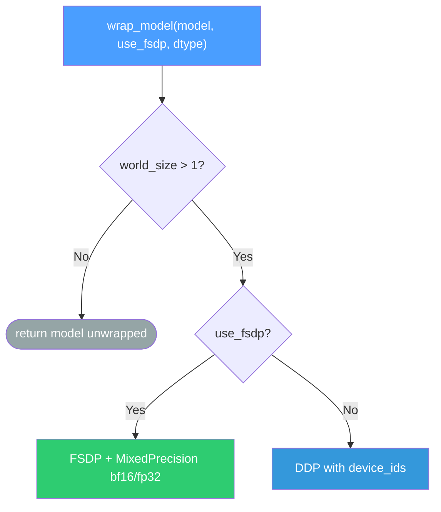

## Multi-Dimensional Parallelism

`ezpz` supports composing tensor, data, pipeline, and context parallelism
simultaneously via `initialize_tensor_parallel()`:

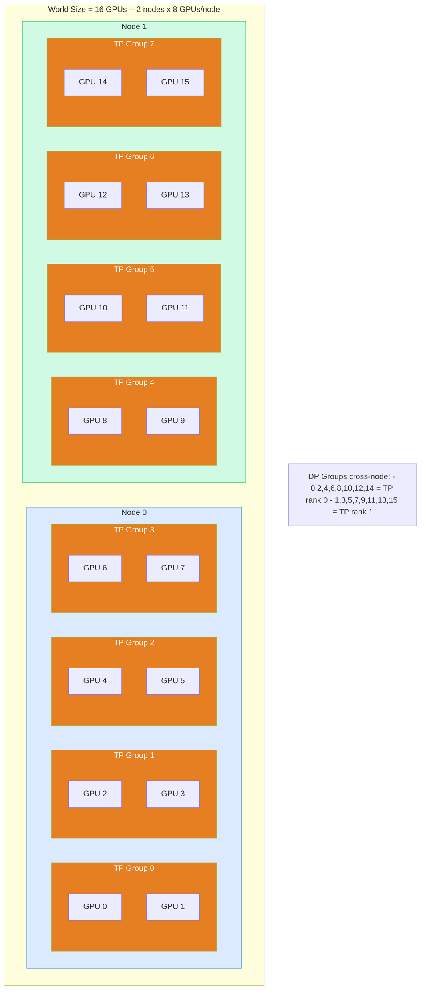

### Process Group Creation

`initialize_tensor_parallel(tp_size, pp_size, cp_size)` creates a 4D rank
tensor and slices it into orthogonal process groups:

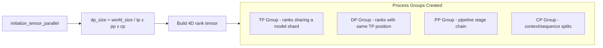

## Tensor Parallel Layers

The `tp/` module provides drop-in replacements for standard PyTorch layers that
automatically split computation across TP ranks:

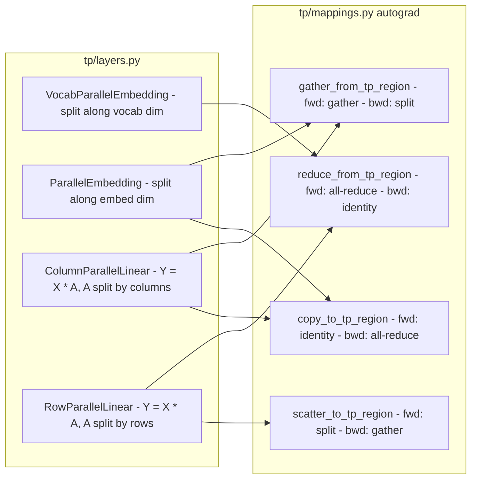

## Job Scheduler Integration

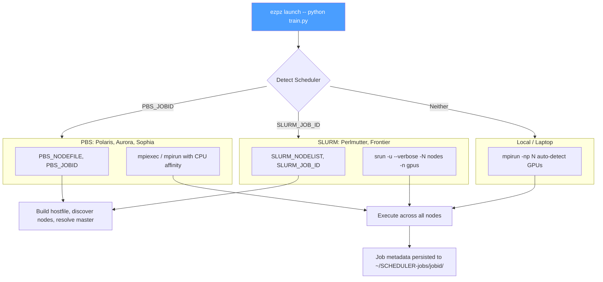

### Machine-Specific Launch Commands

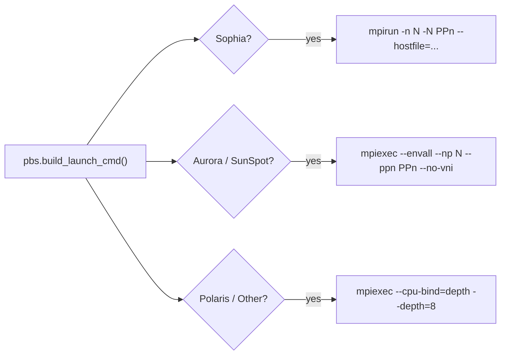

## Supported HPC Systems

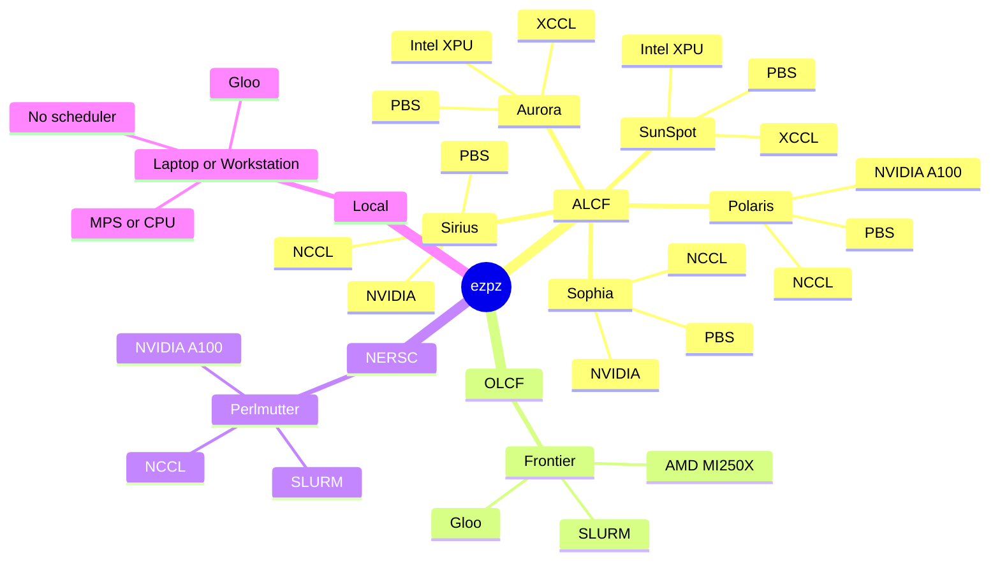

## Logging Architecture

`ezpz` provides rank-aware logging that suppresses non-rank-0 output by
default:

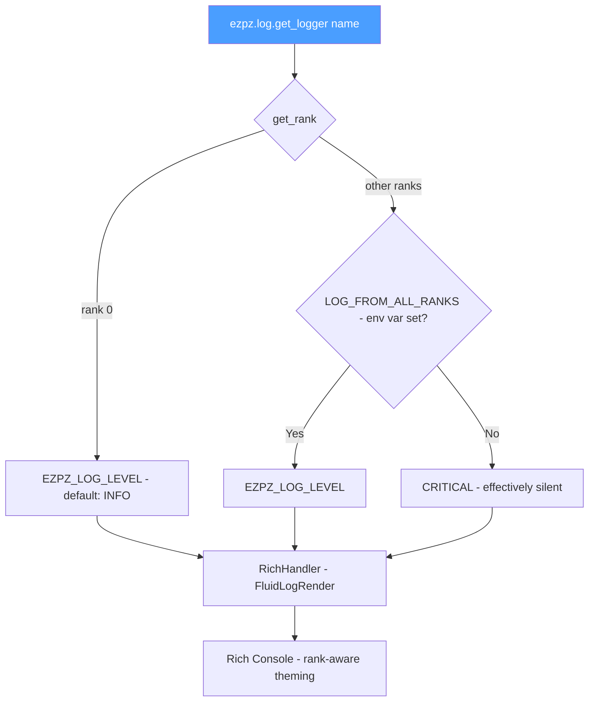

## Metrics Tracking with History

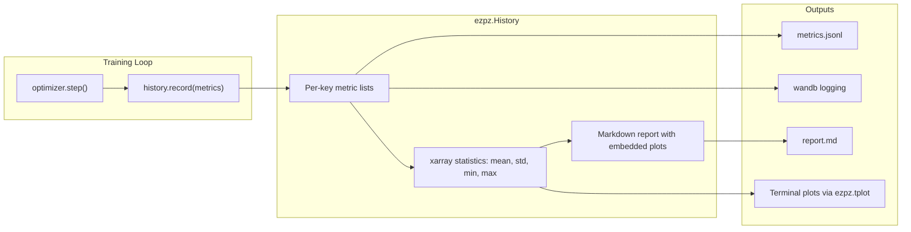

## Diagnostics (`ezpz doctor`)

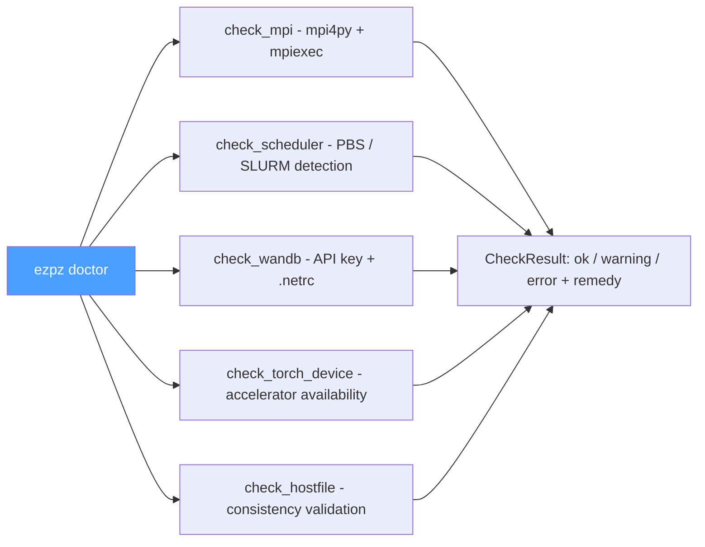

## Public API Surface

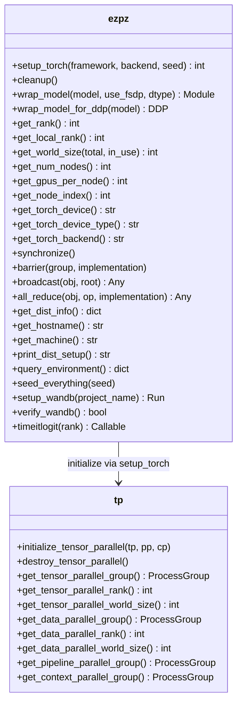

## Typical Usage Pattern

```python
# 1. Setup — single line bootstraps everything
import ezpz
rank = ezpz.setup_torch(seed=42)

# 2. Build model & wrap for distributed training
model = MyModel().to(ezpz.get_torch_device())
model = ezpz.wrap_model(model, use_fsdp=True, dtype="bf16")

# 3. Standard PyTorch training loop
for batch in dataloader:
    loss = model(batch)
    loss.backward()
    optimizer.step()

# 4. Cleanup
ezpz.cleanup()
```


Launch with:

```bash
ezpz launch -- python train.py
```

## Project Structure

```
ezpz/
  src/ezpz/
    __init__.py           Lazy-loading package entry
    distributed.py        Core distributed API (clean rewrite)
    dist.py               Legacy distributed module
    configs.py            Configuration & constants
    jobs.py               Job scheduler metadata
    launch.py             Cross-node launcher
    slurm.py / pbs.py     Scheduler-specific utilities
    model.py / train.py   Model setup & training smoke tests
    history.py            Metrics tracking & aggregation
    profile.py            Performance profiling
    doctor.py             Runtime diagnostics
    lazy.py               Lazy import utilities
    integrations.py       WandB & HuggingFace integrations
    tp/                   Tensor parallelism (groups, layers, mappings)
    log/                  Rich-based rank-aware logging
    data/                 Distributed data loading (TP-aware)
    models/               LLaMA, ViT, minimal test models
    utils/                DeepSpeed configs, memory profiling
    cli/                  Click-based CLI (launch, test, doctor)
    examples/             FSDP, FSDP+TP, HF Trainer, ViT, diffusion
  tests/                  Test suite
  docs/                   MkDocs + Material documentation site
```
