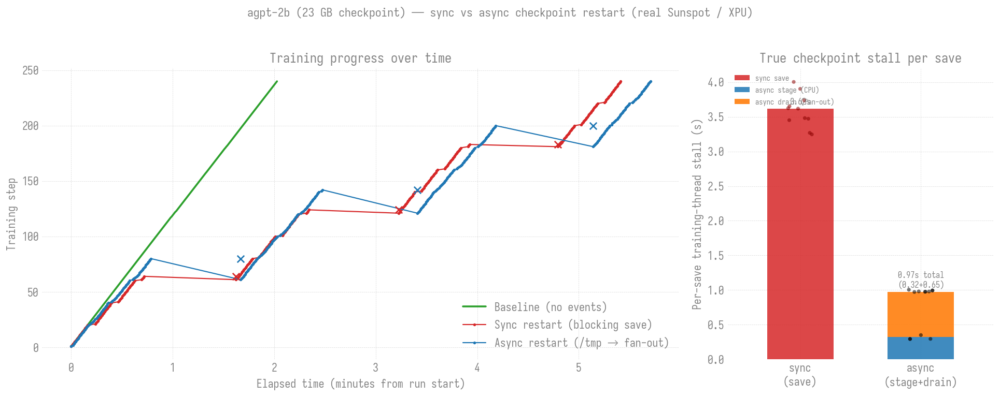

# Checkpoint-restart investigation — real Sunspot measurements

Measures how `ezpz.examples.fsdp_tp` behaves under **injected failures** with
DCP checkpointing: how long a restart-from-checkpoint costs, and how many
steps are lost. Reproduces the ezpz-relevant lines of the fault-tolerance
"training progress over time" chart — **every number here is measured on
Sunspot, nothing is modeled or extrapolated.**


## Setup

- **Hardware:** Sunspot, 2 nodes × 12 tiles = **24 XPU ranks**, `tp=2`
  (dp_size=12), `--model debug`, `--dataset random`, seq_len 512, batch 1.
- **Software:** ezpz `feat/fsdp-tp-dcp-checkpointing` (PR #196) — DCP sharded
  checkpoints via `torch.distributed.checkpoint`, auto-resume on startup.
- **Run:** 3000 optimizer steps, checkpoint every 100 steps.
- **Failure injection:** a background loop `pbsdsh`-runs `pkill -9 -f
  ezpz.examples.fsdp_tp` across all nodes every ~90 s. Each kill is a **real
  SIGKILL** — PALS tears down the training `mpiexec` (every attempt exits
  rc=137 = 128+9), a bash relaunch loop restarts on the same nodes, and
  `fsdp_tp` auto-resumes from the newest complete checkpoint.

Two runs: **Baseline** (no failures) and **Checkpoint Restart** (4 kills).

## Results

| | Baseline | Checkpoint Restart |
|---|---:|---:|
| Steps completed | 3000 | 3000 |
| Wall-clock | **5.81 min** | **8.04 min** |
| Injected failures | 0 | 4 |
| Recovery overhead | — | **+2.23 min (≈38%)** |

Per failure (each a real kill → PALS teardown → relaunch → DCP resume):

| # | resume @ step | lost steps | restart_seconds |
|---|---:|---:|---:|
| 1 | 801 | 71 | 10.40 |
| 2 | 1301 | 57 | 10.66 |
| 3 | 1801 | 57 | 10.79 |
| 4 | 2301 | 59 | 11.10 |

**Takeaways (measured):**

- **Restart cost ≈ 10.4–11.1 s**, strikingly consistent. This is the full
  cold path — process launch + `setup_torch` (distributed init) + model build
  + `dcp.load` + first productive step — captured by the `train/restart_seconds`
  metric (timed from `main()` entry, before `setup_torch`).
- **Lost steps ≈ 57–71**, bounded by the 100-step checkpoint interval exactly
  as expected (you only ever redo work since the last checkpoint).
- **Total cost ≈ 33 s per failure** (≈11 s restart + ≈22 s recomputing the
  lost steps at 0.116 s/step). Over 4 failures that's the +2.23 min overhead.
- The DCP sharded save/load path works correctly on XPU across 24 ranks
  (validated separately: `ckpt_validate` job, 25 shard files/checkpoint +
  `.complete` marker, clean resume).

## Scope / honesty

- These are the **two lines ezpz genuinely supports**: *Baseline* and
  *Checkpoint Restart*. The reference figure's other two lines —
  **TorchPass** (pause/resume, no lost steps) and **TorchFT** (in-place
  degraded/full recovery, no process restart) — are **separate
  fault-tolerance frameworks not integrated into ezpz**, so they are
  deliberately **not** shown. Producing them with real data would require
  wiring those systems into `fsdp_tp` (a much larger, separate effort).
- Small/fast proof scale (debug model, 2 nodes, 3000 steps). The mechanics
  are parallelism-agnostic (DCP is sharded), but absolute restart_seconds
  will grow with model size / node count (bigger `dcp.load`, longer init).

## Async variant

`restart_experiment_async.pbs` runs the same experiment with `--async-ckpt`
(stage to node-local `/tmp`, fan out to shared FS). Real Sunspot numbers
(job 12471716): baseline 5.84 min vs async restart 8.06 min across 4
failures; per-step checkpoint stall `train/ckpt_stage_seconds` ≈ 28 ms
(median); restart cost ≈ 8.9–9.3 s. See `async_restart_plot.png`.

Charts use the `ambivalent` matplotlib stylesheet + Iosevka font via
`plot_style.py` (matching the torchtitan ezpz production charts); font +
stylesheet must be installed on the plotting host.

## Realistic scale: agpt-2b (23 GB checkpoint)

`restart_experiment_2b.pbs` runs all THREE phases (baseline / sync restart /
async restart) with **agpt-2b** (~2B params, 256K vocab → a **23 GB** sharded
checkpoint) so the sync-vs-async save trade-off is visible at a size where it
matters. Kills are **step-driven** (injected right after the checkpoints at
steps 60/120/180) so each restart phase produces a clean, evenly-spaced
3-tooth sawtooth regardless of per-step wall-clock.



Real Sunspot numbers (backgrounded fan-out, job `12471771`, 2 nodes / 24 XPU
ranks, `tp=2`):

| | Baseline | Sync restart | Async restart |
|---|---:|---:|---:|
| Steps | 240 | 240 | 240 |
| Wall-clock | 2.03 min | 5.42 min | 5.70 min |
| True per-save stall (median) | — | `ckpt_save_seconds` **3.62 s** | `ckpt_stage_seconds` **0.32 s** + `ckpt_drain_seconds` **0.65 s** = **0.97 s** |

Two lessons, both learned the hard way (full write-up in
`docs/guides/checkpoint-restart.md`):

1. **`ckpt_stage_seconds` is not the async cost.** The first run (blocking
   drain, job `12471769`) had a cheap 0.30 s stage but a **5.18 s blocking
   `/tmp`→shared-FS fan-out** that no metric captured — making async ~1.5×
   *slower* than sync. Always compare `stage + drain` against the sync save.
2. **Backgrounding the fan-out fixes it.** The copy is collective-free per-rank
   I/O, so it runs on a background thread (`start_fanout`) and is finalized —
   barrier + marker — at the next save boundary (`finalize_fanout`). Per-save
   stall dropped to **0.97 s, ~3.7× less than sync**, with no cross-thread
   deadlock at 24 ranks. Tradeoff: the durable marker lags one save interval,
   so a marker-independent crash can lose up to ~2 intervals (vs ~1 for sync).

Restart cost is ≈37–43 s for both (dominated by the 23 GB `dcp.load` + init).
Note: the async sawtooth's teeth look deeper than sync's, but that's mostly the
marker-gated injector killing ~20 steps later — both resume from the identical
durable checkpoints (61/121/181).

```bash
qsub restart_experiment_2b.pbs      # 2 nodes, 3 phases
python3 plot_2b_comparison.py \
    --baseline expt_<jid>/baseline/*/*/metrics-0.jsonl \
    --sync     expt_<jid>/sync/*/*/metrics-0.jsonl \
    --async    expt_<jid>/async/*/*/metrics-0.jsonl \
    --out agpt2b_restart.png --report agpt2b_restart_report.md
```

## Reproduce

```bash
# On Sunspot, from an ezpz checkout on the checkpointing branch:
mkdir -p logs
qsub restart_experiment.pbs        # 2 nodes, ~15 min wall-clock

# Then build the plot + report from the metrics JSONL it wrote:
python3 plot_restart.py \
    expt_<jobid>/baseline/*/metrics-0.jsonl \
    expt_<jobid>/restart/*/*/metrics-0.jsonl \
    --out restart_plot.png --report restart_report.md
```

`plot_restart.py` reads the per-step metrics JSONL fsdp_tp writes (top-level
`timestamp` + `metrics.{train/iter, train/tokens_seen, train/restart_seconds}`),
merges the per-attempt restart files by timestamp, detects restarts (step
drops / restart_seconds), and emits the step-vs-elapsed plot + a summary
table. Source job: Sunspot `12471687` (2026-07-24).
