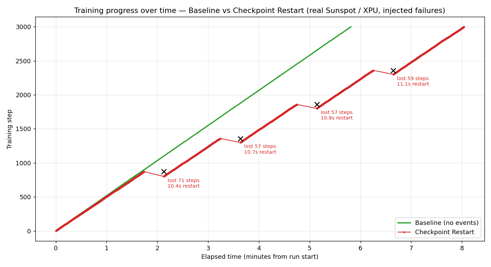

# Checkpoint-restart investigation — real Sunspot measurements

Measures how `ezpz.examples.fsdp_tp` behaves under **injected failures** with
DCP checkpointing: how long a restart-from-checkpoint costs, and how many
steps are lost. Reproduces the ezpz-relevant lines of the fault-tolerance
"training progress over time" chart — **every number here is measured on
Sunspot, nothing is modeled or extrapolated.**



## Setup

- **Hardware:** Sunspot, 2 nodes × 12 tiles = **24 XPU ranks**, `tp=2`
  (dp_size=12), `--model debug`, `--dataset random`, seq_len 512, batch 1.
- **Software:** ezpz `feat/fsdp-tp-dcp-checkpointing` (PR #196) — DCP sharded
  checkpoints via `torch.distributed.checkpoint`, auto-resume on startup.
- **Run:** 3000 optimizer steps, checkpoint every 100 steps.
- **Failure injection:** a background loop `pbsdsh`-runs `pkill -9 -f
  ezpz.examples.fsdp_tp` across all nodes every ~90 s. Each kill is a **real
  SIGKILL** — PALS tears down the training `mpiexec` (every attempt exits
  rc=137 = 128+9), a bash relaunch loop restarts on the same nodes, and
  `fsdp_tp` auto-resumes from the newest complete checkpoint.

Two runs: **Baseline** (no failures) and **Checkpoint Restart** (4 kills).

## Results

| | Baseline | Checkpoint Restart |
|---|---:|---:|
| Steps completed | 3000 | 3000 |
| Wall-clock | **5.81 min** | **8.04 min** |
| Injected failures | 0 | 4 |
| Recovery overhead | — | **+2.23 min (≈38%)** |

Per failure (each a real kill → PALS teardown → relaunch → DCP resume):

| # | resume @ step | lost steps | restart_seconds |
|---|---:|---:|---:|
| 1 | 801 | 71 | 10.40 |
| 2 | 1301 | 57 | 10.66 |
| 3 | 1801 | 57 | 10.79 |
| 4 | 2301 | 59 | 11.10 |

**Takeaways (measured):**

- **Restart cost ≈ 10.4–11.1 s**, strikingly consistent. This is the full
  cold path — process launch + `setup_torch` (distributed init) + model build
  + `dcp.load` + first productive step — captured by the `train/restart_seconds`
  metric (timed from `main()` entry, before `setup_torch`).
- **Lost steps ≈ 57–71**, bounded by the 100-step checkpoint interval exactly
  as expected (you only ever redo work since the last checkpoint).
- **Total cost ≈ 33 s per failure** (≈11 s restart + ≈22 s recomputing the
  lost steps at 0.116 s/step). Over 4 failures that's the +2.23 min overhead.
- The DCP sharded save/load path works correctly on XPU across 24 ranks
  (validated separately: `ckpt_validate` job, 25 shard files/checkpoint +
  `.complete` marker, clean resume).

## Scope / honesty

- These are the **two lines ezpz genuinely supports**: *Baseline* and
  *Checkpoint Restart*. The reference figure's other two lines —
  **TorchPass** (pause/resume, no lost steps) and **TorchFT** (in-place
  degraded/full recovery, no process restart) — are **separate
  fault-tolerance frameworks not integrated into ezpz**, so they are
  deliberately **not** shown. Producing them with real data would require
  wiring those systems into `fsdp_tp` (a much larger, separate effort).
- Small/fast proof scale (debug model, 2 nodes, 3000 steps). The mechanics
  are parallelism-agnostic (DCP is sharded), but absolute restart_seconds
  will grow with model size / node count (bigger `dcp.load`, longer init).

## Reproduce

```bash
# On Sunspot, from an ezpz checkout on the checkpointing branch:
mkdir -p logs
qsub restart_experiment.pbs        # 2 nodes, ~15 min wall-clock

# Then build the plot + report from the metrics JSONL it wrote:
python3 plot_restart.py \
    expt_<jobid>/baseline/*/metrics-0.jsonl \
    expt_<jobid>/restart/*/*/metrics-0.jsonl \
    --out restart_plot.png --report restart_report.md
```

`plot_restart.py` reads the per-step metrics JSONL fsdp_tp writes (top-level
`timestamp` + `metrics.{train/iter, train/tokens_seen, train/restart_seconds}`),
merges the per-attempt restart files by timestamp, detects restarts (step
drops / restart_seconds), and emits the step-vs-elapsed plot + a summary
table. Source job: Sunspot `12471687` (2026-07-24).
